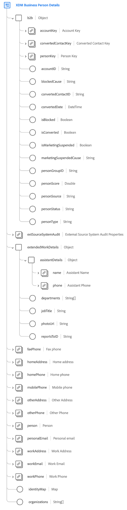

# [!UICONTROL XDM ビジネス担当者] 詳細スキーマフィールドグループ（ベータ版）

>[!IMPORTANT]
>
>このフィールドグループは、現在ベータ版のリアルタイム顧客データプラットフォーム B2B エディションの一部です。 ドキュメントと機能は変更される場合があります。

[!UICONTROL XDM ビジネス担当者詳] 細は、B2B(B2B) 企業のコンテキストにおける個人の情報を取得する、クラスの標準スキーマフィールドグループで [[!DNL XDM Individual Profile] ](../../classes/individual-profile.md) す。

| プロパティ | データタイプ | 説明 |
| --- | --- | --- |
| `b2b` | オブジェクト | B2B 固有の個人に関する詳細情報を取り込むオブジェクト。 |
| `b2b.accountKey` | [[!UICONTROL B2B ソース]](../../data-types/b2b-source.md) | 個人に関連するビジネスアカウントの複合識別子。 |
| `b2b.convertedContactKey` | [[!UICONTROL B2B ソース]](../../data-types/b2b-source.md) | リードが変換された場合の、関連する連絡先の複合識別子。 |
| `b2b.personKey` | [[!UICONTROL B2B ソース]](../../data-types/b2b-source.md) | 個人またはプロファイルフラグメントの複合識別子。 |
| `b2b.accountID` | 文字列 | この個人が関連付けられているビジネスアカウントの一意の ID。 |
| `b2b.blockedCause` | 文字列 | ユーザーがブロックされた場合、このプロパティが理由を示します。 |
| `b2b.convertedContactID` | 文字列 | リードが正常に変換された場合の連絡先 ID。 |
| `b2b.convertedDate` | DateTime | リードが正常に変換された場合の換算日。 |
| `b2b.isBlocked` | Boolean | ユーザーがブロックされているかどうかを示します。 |
| `b2b.isConverted` | Boolean | リードが変換されるかどうかを示します。 |
| `b2b.isMarketingSuspended` | Boolean | その人物に対してマーケティングが休止されているかどうかを示します。 |
| `b2b.marketingSuspendedCause` | 文字列 | 個人のマーケティングが休止されている場合、このプロパティが理由を示します。 |
| `b2b.personGroupID` | 文字列 | 個人のグループ ID。 |
| `b2b.personScore` | Double | CRM システムで個人に生成されたスコア。 |
| `b2b.personSource` | 文字列 | 個人の情報を受け取ったソース。 |
| `b2b.personStatus` | 文字列 | 個人の現在のマーケティングまたは販売のステータス。 |
| `b2b.personType` | 文字列 | B2B 個人のタイプ。 |
| `extSourceSystemAudit` | [外部ソース・システム監査属性](../../data-types/external-source-system-audit-attributes.md) | ビジネス・パーソン・リレーションが外部ソース・システムから取得された場合、このオブジェクトはそのシステムの監査属性を取り込みます。 |
| `extendedWorkDetails` | オブジェクト | その人物に関する作業関連の追加の詳細を取り込みます。 |
| `extendedWorkDetails.assistantDetails` | オブジェクト | 個人のアシスタントに関連する次の属性を取り込みます。 <ul><li>`name`:([人名](../../data-types/person-name.md)) アシスタントの姓名。</li><li>`phone`:([電話番号](../../data-types/phone-number.md)) アシスタントの電話番号。</li></ul> |
| `extendedWorkDetails.departments` | 文字列の配列 | 個人が勤務する部署名のリスト。 |
| `extendedWorkDetails.jobTitle` | 文字列 | 人の肩書。 |
| `extendedWorkDetails.photoUrl` | 文字列 | 個人の写真への URL。 |
| `extendedWorkDetails.reportsToID` | 文字列 | 個人のレポートマネージャーの識別子。 |
| `faxPhone` | [電話番号](../../data-types/phone-number.md) | その人の FAX の電話番号。 |
| `homeAddress` | [住所](../../data-types/postal-address.md) | 自宅住所。 |
| `homePhone` | [電話番号](../../data-types/phone-number.md) | 自宅の電話番号。 |
| `mobilePhone` | [電話番号](../../data-types/phone-number.md) | その人の携帯電話番号。 |
| `otherAddress` | [住所](../../data-types/postal-address.md) | 個人の代替住所。 |
| `otherPhone` | [電話番号](../../data-types/phone-number.md) | 個人の代替電話番号。 |
| `person` | [ユーザー](../../data-types/person.md) | 個々のアクター、連絡先、または所有者。 |
| `personalEmail` | [電子メールアドレス](../../data-types/email-address.md) | 個人の電子メールアドレス。 |
| `workAddress` | [住所](../../data-types/postal-address.md) | 勤務先の住所。 |
| `workEmail` | [電子メールアドレス](../../data-types/email-address.md) | 勤務先の電子メールアドレス。 |
| `workPhone` | [電話番号](../../data-types/phone-number.md) | その人の勤務先の電話番号。 |
| `identityMap` | マップ | 個人の名前空間付き ID のセットを含む map フィールド。 このフィールドは、ID データが取り込まれると、システムによって自動的に更新されます。 このフィールドを [ リアルタイム顧客プロファイル ](../../../profile/home.md) に適切に利用するには、データ操作でフィールドの内容を手動で更新しないでください。  使用例について詳しくは、「スキーマ合成の基 [本」の「 ID マッ](../../schema/composition.md#identityMap) プ」の節を参照してください。 |
| `organizations` | 文字列の配列 | 個人の勤務先の組織名のリスト。 |

{style=&quot;table-layout:auto&quot;}

フィールドグループについて詳しくは、パブリック XDM リポジトリを参照してください。

* [入力例](https://github.com/adobe/xdm/blob/master/components/fieldgroups/profile/b2b-person-details.example.1.json)
* [フルスキーマ](https://github.com/adobe/xdm/blob/master/components/fieldgroups/profile/b2b-person-details.schema.json)
