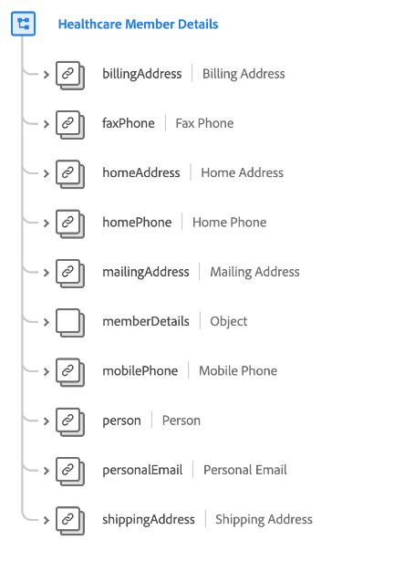
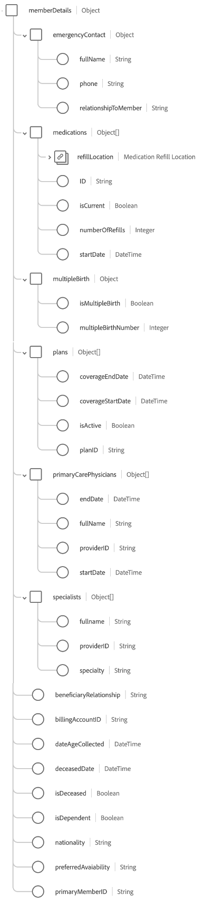

# [!UICONTROL Healthcare Member Details] スキーマフィールドグループ

[!UICONTROL Healthcare Member Details]は、[[!DNL XDM Individual Profile]  クラス ](../../classes/individual-profile.md)の標準スキーマフィールドグループで、連絡先情報、かかりつけ医、計画情報など、医療サービスまたはケアを受ける人の詳細をキャプチャします。

| プロパティ | データタイプ | 説明 |
| --- | --- | --- |
| `billingAddress` | [[!UICONTROL Postal address]](../../data-types/postal-address.md) | 個人の請求先住所。 |
| `faxPhone` | [[!UICONTROL Phone number]](../../data-types/phone-number.md) | 人物のFAX電話番号。 |
| `homeAddress` | [[!UICONTROL Postal address]](../../data-types/postal-address.md) | その人の自宅の住所。 |
| `homePhone` | [[!UICONTROL Phone number]](../../data-types/phone-number.md) | 個人の自宅の電話番号。 |
| `mailingAddress` | [[!UICONTROL Postal address]](../../data-types/postal-address.md) | 人物の郵送先住所。 |
| `memberDetails` | オブジェクト | 患者のヘルスケア関連の属性と関係に関する詳細情報を含むオブジェクト。 オブジェクトの構造について詳しくは、以下の[ サブセクション ](#memberDetails)を参照してください。 |
| `mobilePhone` | [[!UICONTROL Phone number]](../../data-types/phone-number.md) | 人物の携帯電話番号。 |
| `person` | [[!UICONTROL Person]](../../data-types/person.md) | 個人のヘルスケアメンバーシップに関連する個々のアクター、連絡先、または所有者。 |
| `personalEmail` | [[!UICONTROL Email address]](../../data-types/email-address.md) | 個人のメールアドレス： |
| `shippingAddress` | [[!UICONTROL Postal address]](../../data-types/postal-address.md) | 個人の輸送先住所。 |

{style="table-layout:auto"}

## `memberDetails` {#memberDetails}

`memberDetails`は、個人のヘルスケア関連の属性と関係に関する詳細情報を含むオブジェクトです。 `memberDetails`の構造は次のとおりです。

| プロパティ | データタイプ | 説明 |
| --- | --- | --- |
| `emergencyContact` | オブジェクト | ユーザーの次の緊急連絡先情報をキャプチャします。 <ul><li>`fullName`: （文字列）緊急連絡先のフルネーム。</li><li>`phone`: （文字列）緊急連絡先の電話番号。</li><li>`relationshipToMember`: （文字列）緊急連絡先と個人の関係。</li></ul> |
| `medications` | オブジェクトの配列 | その人に関連する現在および過去の薬の詳細を一覧表示します。 各配列項目は、次の詳細をキャプチャするオブジェクトです。 <ul><li>`refillLocation`: （[[!UICONTROL Postal address]](../../data-types/postal-address.md)）薬の補充場所。</li><li>`ID`: （文字列）薬ID。</li><li>`isCurrent`: （ブール値）薬が現在か過去かを示します。</li><li>`numberOfRefills`: （整数）この薬のプロバイダーが指定したリフィルの数。</li><li>`startDate`: （DateTime）その人が薬を服用し始めた日付。</li></ul> |
| `multipleBirth` | オブジェクト | 複数の出生に関連する詳細をキャプチャします。 <ul><li>`isMultipleBirth`: （ブール値）その人が複数回の出産を行ったかどうかを示します。</li><li>`multipleBirthNumber`: （整数） `isMultipleBirth`がtrueの場合に生まれた赤ちゃんの数。</li></ul> |
| `plans` | オブジェクトの配列 | 個人に関連する現在および過去の医療計画の詳細を一覧表示します。 各配列項目は、次の詳細をキャプチャするオブジェクトです。 <ul><li>`coverageEndDate`: （DateTime） プランのカバレッジが終了する日付。</li><li>`coverageStartDate`: （DateTime） プランのカバレッジが開始される日付。</li><li>`isActive`: （ブール値）プランがアクティブかどうかを示します。</li><li>`planId`: （文字列）プラン ID。</li></ul> |
| `primaryCarePhysicians` | オブジェクトの配列 | その人に関連するプライマリケア医師の詳細を一覧表示します。 各配列項目は、次の詳細をキャプチャするオブジェクトです。 <ul><li>`endDate`: （DateTime）主治医が患者のケアを終了した日付。</li><li>`fullname`: （文字列）医師のフルネーム。</li><li>`providerId`: （文字列）医師の一意のID。</li><li>`startDate`: （DateTime）主治医が患者のケアを開始した日付。</li></ul> |
| `specialists` | オブジェクトの配列 | その人物に関連するヘルスケアスペシャリストの詳細を一覧表示します。 各配列項目は、次の詳細をキャプチャするオブジェクトです。 <ul><li>`fullname`: （文字列）スペシャリストのフルネーム。</li><li>`providerId`: （文字列）スペシャリストの一意のID。</li><li>`specialty`: （文字列）医療提供者の専門分野（麻酔科、泌尿器科、放射線科、皮膚科など）。</li></ul> |
| `beneficiaryRelationship` | 文字列 | 被扶養者が被扶養者である場合の当該医療関係者との受給者関係（自己、配偶者、子どもなど）。 |
| `billingAccountID` | 文字列 | 個人の請求先アカウントの一意のID。 |
| `dateAgeCollected` | 日時 | その人の年齢が収集された日付。 |
| `deceasedDate` | 日時 | 死者が死亡した場合の日付。 |
| `isDeceased` | ブール | その人が死亡したかどうかを示します。 |
| `isDependent` | ブール | その人が扶養家族かどうかを示します。 |
| `nationality` | 文字列 | 個人と州の間の法的関係。ISO 3166-1 Alpha-2 コードを使用して表されます。 |
| `preferredAvailability` | 文字列 | 予約のための希望の日と時間の空き状況。 |
| `primaryMemberID` | 文字列 | ユーザーが扶養家族である場合のプライマリ購読者の一意のID。 |

{style="table-layout:auto"}

フィールドグループについて詳しくは、パブリック XDM リポジトリを参照してください。

* [入力済み例](https://github.com/adobe/xdm/blob/master/components/fieldgroups/profile/profile-healthcare-member.example.1.json)
* [完全なスキーマ ](https://github.com/adobe/xdm/blob/master/components/fieldgroups/profile/profile-healthcare-member.schema.json)

このフィールドグループを一般的な[医療業界のユースケース ](../../schema/industries/healthcare.md)に使用する方法について詳しくは、業界スキーマのドキュメントを参照してください。
