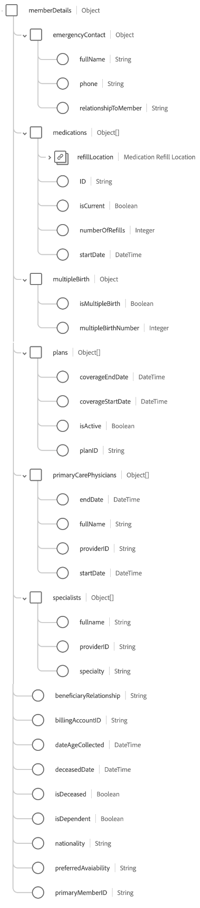

# [!UICONTROL  ヘルスケアメンバーの詳細 ] スキーマフィールドグループ

[!UICONTROL  ヘルスケア会員詳細 ] は、[[!DNL XDM Individual Profile]  クラス ](../../classes/individual-profile.md) の標準スキーマフィールドグループで、連絡先情報、主治医、医療保険情報など、医療サービスまたはケアを受ける人の詳細を収集します。

| プロパティ | データタイプ | 説明 |
| --- | --- | --- |
| `billingAddress` | [[!UICONTROL  郵送先住所 ]](../../data-types/postal-address.md) | 人物の請求先住所。 |
| `faxPhone` | [[!UICONTROL  電話番号 ]](../../data-types/phone-number.md) | 人物の FAX 電話番号。 |
| `homeAddress` | [[!UICONTROL  郵送先住所 ]](../../data-types/postal-address.md) | 人物の自宅の住所。 |
| `homePhone` | [[!UICONTROL  電話番号 ]](../../data-types/phone-number.md) | 人物の自宅電話番号。 |
| `mailingAddress` | [[!UICONTROL  郵送先住所 ]](../../data-types/postal-address.md) | 人物の住所。 |
| `memberDetails` | オブジェクト | その人物のヘルスケア関連の属性および関係に関する詳細な情報を含むオブジェクト。 オブジェクトの構造について詳しくは、次の [ サブセクション ](#memberDetails) を参照してください。 |
| `mobilePhone` | [[!UICONTROL  電話番号 ]](../../data-types/phone-number.md) | 人物の携帯電話番号。 |
| `person` | [[!UICONTROL  人物 ]](../../data-types/person.md) | 個人のヘルスケアメンバーシップに関連する個々のアクター、連絡先または所有者。 |
| `personalEmail` | [[!UICONTROL  メールアドレス ]](../../data-types/email-address.md) | 人物の個人メールアドレス。 |
| `shippingAddress` | [[!UICONTROL  郵送先住所 ]](../../data-types/postal-address.md) | 人物の配送先住所。 |

{style="table-layout:auto"}

## `memberDetails` {#memberDetails}

`memberDetails` は、その人物の医療関連の属性と関係に関する詳細な情報を含むオブジェクトです。 `memberDetails` の構造は次のとおりです。

| プロパティ | データタイプ | 説明 |
| --- | --- | --- |
| `emergencyContact` | オブジェクト | 人物の次の緊急連絡先の詳細をキャプチャします。 <ul><li>`fullName`: （String）緊急連絡先のフルネーム。</li><li>`phone`: （文字列）緊急連絡先の電話番号。</li><li>`relationshipToMember`: （文字列）緊急連絡先と人物の関係。</li></ul> |
| `medications` | オブジェクトの配列 | その人物に関連する現在および過去の薬の詳細をリストします。 各配列項目は、次の詳細を取得するオブジェクトです。 <ul><li>`refillLocation`: （[[!UICONTROL  郵送先住所 ]](../../data-types/postal-address.md)）薬の詰め替え場所。</li><li>`ID`: （文字列）薬 ID。</li><li>`isCurrent`: （ブール値）薬が現在のものか過去のものかを示します。</li><li>`numberOfRefills`: （整数）この薬のプロバイダーによって規定されたリフィルの数。</li><li>`startDate`: （日時）薬を服用し始めた日付。</li></ul> |
| `multipleBirth` | オブジェクト | 複数出産に関する詳細をキャプチャします。 <ul><li>`isMultipleBirth`: （ブール値）人物が複数回の出産を行ったかどうかを示します。</li><li>`multipleBirthNumber`: （整数） `isMultipleBirth` が true の場合に生まれた子の数。</li></ul> |
| `plans` | オブジェクトの配列 | 人物に関連付けられている現在および過去の医療プランの詳細をリストします。 各配列項目は、次の詳細を取得するオブジェクトです。 <ul><li>`coverageEndDate`: （日時）計画補償範囲が終了する日付。</li><li>`coverageStartDate`: （日時）プランの補償範囲が開始する日付。</li><li>`isActive`: （ブール値）プランがアクティブかどうかを示します。</li><li>`planId`: （文字列）計画 ID。</li></ul> |
| `primaryCarePhysicians` | オブジェクトの配列 | その人物に関連するかかりつけ医の詳細をリストする。 各配列項目は、次の詳細を取得するオブジェクトです。 <ul><li>`endDate`: （日時）かかりつけ医が患者のケアを終了した日付。</li><li>`fullname`: （String）医師の氏名。</li><li>`providerId`: （String）医師の一意の ID。</li><li>`startDate`: （日時）かかりつけ医が患者のケアを開始した日付。</li></ul> |
| `specialists` | オブジェクトの配列 | その人物に関連付けられている医療専門家の詳細を一覧表示します。 各配列項目は、次の詳細を取得するオブジェクトです。 <ul><li>`fullname`: （文字列）スペシャリストの氏名。</li><li>`providerId`: （文字列）スペシャリストの一意の ID。</li><li>`specialty`: （文字列）提供者の専門分野（麻酔科、泌尿器科、放射線科、皮膚科など）。</li></ul> |
| `beneficiaryRelationship` | 文字列 | 扶養家族である場合の医療関係者との受取人関係（例：自分自身、配偶者、子など）。 |
| `billingAccountID` | 文字列 | 人物の請求アカウントの一意の ID。 |
| `dateAgeCollected` | 日時 | 人物の年齢が収集された日付。 |
| `deceasedDate` | 日時 | 死亡時の死亡日。 |
| `isDeceased` | ブール値 | 人物が死亡したかどうかを示します。 |
| `isDependent` | ブール値 | 人物が扶養家族かどうかを示します。 |
| `nationality` | 文字列 | 個人とその州との間の法的関係。ISO 3166-1 Alpha-2 コードを使用して表されます。 |
| `preferredAvailability` | 文字列 | 希望する予約可能な日時。 |
| `primaryMemberID` | 文字列 | ユーザーが依存する場合のプライマリ サブスクライバーの一意の ID。 |

{style="table-layout:auto"}

フィールドグループについて詳しくは、公開 XDM リポジトリを参照してください。

* [ 入力された例 ](https://github.com/adobe/xdm/blob/master/components/fieldgroups/profile/profile-healthcare-member.example.1.json)
* [ 完全なスキーマ ](https://github.com/adobe/xdm/blob/master/components/fieldgroups/profile/profile-healthcare-member.schema.json)

このフィールドグループを一般的な [ ヘルスケア業界のユースケース ](../../schema/industries/healthcare.md) のサービスに使用する方法について詳しくは、業界スキーマのドキュメントを参照してください。
