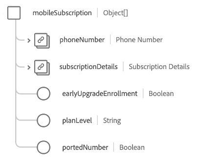

# [!UICONTROL Telecom Subscriptionschema フ] ィールドグループ

>[!NOTE]
>
>複数のスキーマフィールドグループの名前が変更されました。 詳しくは、[ フィールドグループ名の更新 ](../name-updates.md) のドキュメントを参照してください。

[!UICONTROL 通信購] 読は、顧客の通信購読プラン ( 価格、パッケー [[!DNL XDM Individual Profile] ](../../classes/individual-profile.md) ジ、個々の製品購読を含む ) を説明する、クラスの標準スキーマフィールドグループです。

フィールドグループには、以下で説明するプロパティを持つ 1 つのオブジェクトタイプフィールド `telecomSubscription` が用意されています。

| プロパティ | データタイプ | 説明 |
| --- | --- | --- |
| `internetSubscription` | オブジェクトの配列 | データ上限、接続タイプ、速度の詳細など、インターネット購読プランの詳細について説明します。 詳しくは、](#internetSubscription) の下の [ の節を参照してください。 |
| `landlineSubscription` | オブジェクトの配列 | 選択した機能、分、ダイヤルプランなど、固定電話のサブスクリプションプランの詳細を説明します。 詳しくは、](#landlineSubscription) の下の [ の節を参照してください。 |
| `mediaSubscription` | オブジェクトの配列 | チャネル数や含まれるストリーミングサービスなど、メディアサブスクリプションプランの詳細について説明します。 詳しくは、](#mediaSubscription) の下の [ の節を参照してください。 |
| `mobileSubscription` | オブジェクトの配列 | 行数、データレート、コストなど、モバイル購読プランの詳細について説明します。 詳しくは、](#mobileSubscription) の下の [ の節を参照してください。 |
| `primarySubscriber` | [[!UICONTROL ユーザー]](../../data-types/person.md) | 購読の所有者を示します。 |
| `bundleName` | 文字列 | 顧客が登録されている購読バンドルの任意のタイプの名前（例：`Internet + Media`）を取り込みます。 |
| `primaryPartyID` | 文字列 | 購読を担当する主要人物の識別子。通常は、デバイスの電話番号です。 |

{style=&quot;table-layout:auto&quot;}

フィールドグループについて詳しくは、パブリック XDM リポジトリを参照してください。

* [入力例](https://github.com/adobe/xdm/blob/master/components/fieldgroups/profile/profile-personal-details.example.1.json)
* [フルスキーマ](https://github.com/adobe/xdm/blob/master/components/fieldgroups/profile/profile-personal-details.schema.json)

## `internetSubscription` {#internetSubscription}

`internetSubscription` はオブジェクトの配列を提供します。各オブジェクトの構造を以下に示します。

| プロパティ | データタイプ | 説明 |
| --- | --- | --- |
| `subscriptionDetails` | [[!UICONTROL 通信購読]](../../data-types/telecom-subscription.md) | サブスクリプションの長さ、料金、ステータスなど、サブスクリプションに関する一般的な詳細について説明します。 サブスクリプションの長さ、料金、ステータスなど、サブスクリプションに関する一般的な詳細について説明します。 |
| `connectionType` | 文字列 | 購読の接続タイプ。 |
| `dataCap` | 整数 | アカウントのデータ上限 (MB)。 |
| `downloadSpeed` | 整数 | サブスクリプションに使用できる最大ダウンロード速度 (MB)。 |
| `selfSetup` | Boolean | 顧客が技術者の訪問なしでインターネット設定を受ける資格があるかどうかを示します。 |
| `uploadSpeed` | 整数 | サブスクリプションで使用できる最大アップロード速度 (MB)。 |

{style=&quot;table-layout:auto&quot;}

## `landlineSubscription` {#landlineSubscription}

`landlineSubscription` はオブジェクトの配列を提供します。各オブジェクトの構造を以下に示します。

| プロパティ | データタイプ | 説明 |
| --- | --- | --- |
| `phoneNumber` | [[!UICONTROL 電話番号]](../../data-types/telecom-subscription.md) | このサブスクリプションに割り当てられている電話番号。 |
| `subscriptionDetails` | [[!UICONTROL 通信購読]](../../data-types/telecom-subscription.md) | サブスクリプションの長さ、料金、ステータスなど、サブスクリプションに関する一般的な詳細について説明します。 |
| `callBlocking` | Boolean | 固定回線のサブスクリプション機能に呼び出しブロックが含まれているかどうかを示します。 |
| `callForwarding` | Boolean | 固定回線のサブスクリプション機能にコール転送が含まれているかどうかを示します。 |
| `callWaiting` | Boolean | 固定回線のサブスクリプション機能に通話待ちが含まれているかどうかを示します。 |
| `callerID` | Boolean | 固定回線のサブスクリプション機能に呼び出し元 ID が含まれているかどうかを示します。 |
| `internationalCalling` | Boolean | 固定電話のサブスクリプション機能に国際通話が含まれているかどうかを示します。 |
| `minutes` | 整数 | サブスクリプション内で使用可能な月単位の分数。 |
| `threeWayCalling` | Boolean | 固定電話のサブスクリプション機能に 3 方向呼び出しが含まれているかどうかを示します。 |
| `unlimitedDomesticLongDistance` | Boolean | 固定回線のサブスクリプション機能に、無制限の国内長距離通話が含まれているかどうかを示します。 |
| `unlimitedLocalCalling` | Boolean | 固定回線のサブスクリプション機能に無制限のローカル呼び出しが含まれているかどうかを示します。 |
| `voicemail` | Boolean | 固定電話のサブスクリプション機能にボイスメールが含まれているかどうかを示します。 |

{style=&quot;table-layout:auto&quot;}

## `mediaSubscription` {#mediaSubscription}

`mediaSubscription` はオブジェクトの配列を提供します。各オブジェクトの構造を以下に示します。

| プロパティ | データタイプ | 説明 |
| --- | --- | --- |
| `streamingServices` | オブジェクトの配列 | サブスクリプションに含まれるすべてのストリーミングサービスのリスト。 各配列項目には、次のプロパティが含まれます。 <ul><li>`promotionLength`:ストリーミングサービスがプロモーションの一部として追加された場合のプロモーションの長さ（月単位）。</li><li>`promotionalAddition`:ストリーミングサービスがプロモーションの一部として追加されたかどうかを示します。</li><li>`serviceName`:ストリーミングサービスの名前。</li></ul> |
| `subscriptionDetails` | [[!UICONTROL 通信購読]](../../data-types/telecom-subscription.md) | サブスクリプションの長さ、料金、ステータスなど、サブスクリプションに関する一般的な詳細について説明します。 |
| `channels` | 整数 | メディアサブスクリプションに含まれているチャネルの数。 |

{style=&quot;table-layout:auto&quot;}

## `mobileSubscription` {#mobileSubscription}

`mobileSubscription` はオブジェクトの配列を提供します。各オブジェクトの構造を以下に示します。

| プロパティ | データタイプ | 説明 |
| --- | --- | --- |
| `phoneNumber` | [[!UICONTROL 電話番号]](../../data-types/telecom-subscription.md) | このサブスクリプションに割り当てられている電話番号。 |
| `subscriptionDetails` | [[!UICONTROL 通信購読]](../../data-types/telecom-subscription.md) | サブスクリプションの長さ、料金、ステータスなど、サブスクリプションに関する一般的な詳細について説明します。 |
| `earlyUpgradeEnrollment` | Boolean | お客様が早期のアップグレードをオプトインするかどうかを示します。 |
| `planLevel` | 文字列 | このサブスクリプションに割り当てられたモバイルプランの名前。 |
| `portedNumber` | Boolean | お客様が別の通信事業者から番号をポートするかどうかを示します。 |

{style=&quot;table-layout:auto&quot;}
