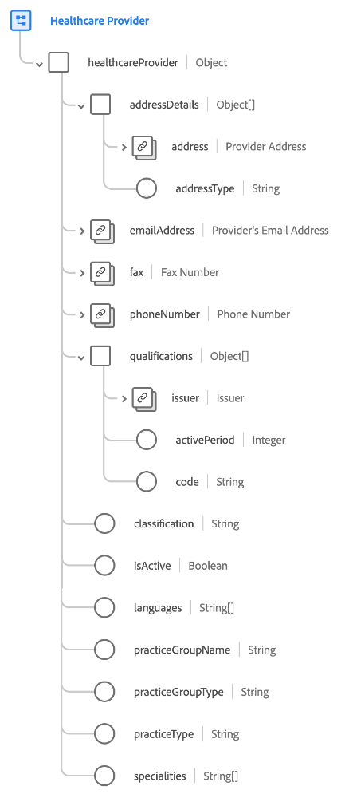

# [!UICONTROL 医療機関] スキーマフィールドグループ

[!UICONTROL 医療機関] は、 [[!UICONTROL プロバイダー] クラス](../../classes/provider.md). 単一のオブジェクトタイプフィールドを提供します。 `healthcareProvider` これは、個々の医療専門家または医療機関に関する財産をキャプチャし、医療診断および治療サービスを提供することを許可されます。

| プロパティ | データタイプ | 説明 |
| --- | --- | --- |
| `addressDetails` | オブジェクトの配列 | プロバイダーのアドレスの詳細を表示します。 各オブジェクトには、次のプロパティが含まれます。 <ul><li>`address`:([[!UICONTROL 郵送先住所]](../../data-types/postal-address.md)):プロバイダーの住所。</li><li>`addressType`:(String) プロバイダーがサービスを提供する場所を示すアドレスのタイプ。</li></ul> |
| `emailAddress` | [[!UICONTROL メールアドレス]](../../data-types/email-address.md) | プロバイダーの電子メールアドレス。 |
| `fax` | [[!UICONTROL 電話番号]](../../data-types/phone-number.md) | プロバイダーの FAX 番号。 |
| `phoneNumber` | [[!UICONTROL 電話番号]](../../data-types/phone-number.md) | プロバイダーの電話番号。 |
| `qualifications` | オブジェクトの配列 | ケアの提供に関する証明書、ライセンス、またはトレーニングをリストします。 各オブジェクトには、次のプロパティが含まれます。 <ul><li>`issuer`:([[!UICONTROL アカウントの詳細]](../../data-types/account-details.md)):資格を調整および発行する組織。</li><li>`activePeriod`:（整数）認定が有効になるまでの年。</li><li>`code`:(String) 認定のコード化された表現。</li></ul> |
| `classification` | 文字列 | クラスまたはカテゴリ（患者ケア、非患者ケアなど）に基づくサービスプロバイダーの分類。 |
| `isActive` | ブール値 | プロバイダーがアクティブかどうかを示します。 |
| `languages` | 文字列の配列 | プロバイダーが操作を実行する言語のリスト。 |
| `practiceGroupName` | 文字列 | サービスプロバイダーのプラクティスグループ名。 |
| `practiceGroupType` | 文字列 | サービスプロバイダーのプラクティスグループタイプ。 |
| `practiceType` | 文字列 | サービスプロバイダーのプラクティスのタイプ。 |
| `specialties` | 文字列の配列 | このプロバイダーが提供する特産品のリスト。 |

{style=&quot;table-layout:auto&quot;}

フィールドグループについて詳しくは、 [パブリック XDM リポジトリ](https://github.com/adobe/xdm/blob/master/components/fieldgroups/provider/healthcare-provider-details.schema.json).
