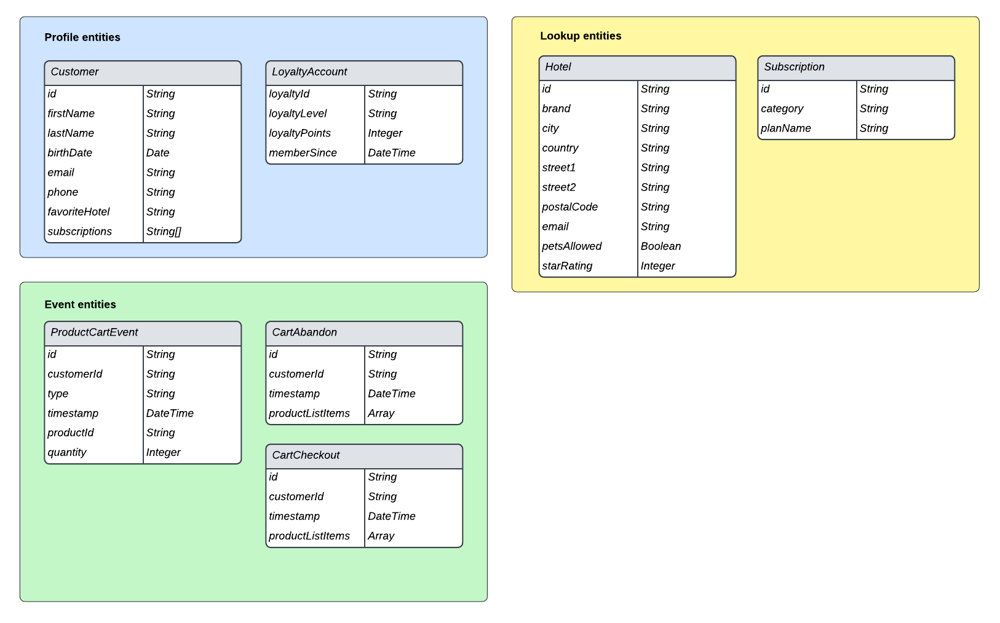

# データモデリングのベストプラクティス

[!DNL Experience Data Model]（XDM）は、ダウンストリーム Adobe Experience Platform サービスで使用する共通の構造と定義を提供することで、顧客体験データを標準化するコアフレームワークです。XDM 標準に準拠することで、すべての顧客体験データを共通の表現に組み込むことができます。これにより、顧客のアクションから有益なインサイトを得たり、顧客オーディエンスを定義したり、パーソナライゼーションのために顧客属性を表現したりできます。

XDM は非常に汎用性が高く、デザインによってカスタマイズ可能なので、スキーマを設計する際には、データモデリングのベストプラクティスに従うことが重要です。 このドキュメントでは、顧客体験データを XDM にマッピングする際に行う必要がある主な決定と考慮事項について説明します。

## はじめに

このガイドを参照する前に、[XDM システムの概要](../home.md)で XDM の概要と Experience Platform 内での役割を確認してください。

さらに、このガイドでは、スキーマデザインに関する主な考慮事項のみに焦点を当てています。したがって、このガイド全体で説明している個々のスキーマ要素の説明について詳しくは、[スキーマ構成の基本](./composition.md)を参照することを強くお勧めします。

## ベストプラクティスのまとめ

Experience Platform で使用するデータモデルを設計するための推奨されるアプローチは、次のように要約できます。

1. データのビジネスユースケースを理解します。
1. これらのユースケースに対処するために [!DNL Platform] に取り込む必要があるプライマリデータソースを特定します。
1. 興味の対象となる可能性のあるセカンダリデータソースを特定します。 例えば、現在組織内の 1 つのビジネスユニットのみがデータを [!DNL Platform] に移植することに興味を持っている場合、同様のビジネスユニットが将来、同様のデータを移植することに興味を持つ可能性があります。これらのセカンダリソースを考慮すると、組織全体でデータモデルを標準化するのに役立ちます。
1. 識別されたデータソースの高レベルのエンティティ関係図（ERD）を作成します。
1. 高レベルの ERD を [!DNL Platform] 中心の ERD（プロファイル、エクスペリエンスイベント、ルックアップエンティティなど）に変換します。

ビジネスユースケースを実行するために必要な、該当するデータソースの特定に関連する手順は、組織によって異なります。このドキュメント全体の残りの節では、データソースを特定した後の ERD の編成と構築の後半の手順に焦点を当てていますが、図の様々なコンポーネントの説明は、どのデータソースを [!DNL Platform] に移行する必要があるかについての決定に役立つ場合があります。

## 高レベル ERD の作成

[!DNL Platform] に取り込むデータソースを決定したら、高レベルの ERD を作成して、データを XDM スキーマにマッピングするプロセスをガイドします。

次の例は、データを [!DNL Platform] に取り込む会社の単純化された ERD を表しています。この図は、顧客アカウント、ホテル、住所、いくつかの一般的な eコマースイベントなど、XDM クラスに分類する必要がある重要なエンティティをハイライト表示しています。

## プロファイル、ルックアップ、イベントのカテゴリへのエンティティの並べ替え

[!DNL Platform] に取り込む必要のあるエンティティを特定する ERD を作成したら、これらのエンティティをプロファイル、ルックアップ、イベントのカテゴリに並べ替える必要があります。

| カテゴリ | 説明 |
| --- | --- |
| プロファイルエンティティ | プロファイルエンティティは、個人（通常は顧客）に関する属性を表します。このカテゴリに該当するエンティティは、**[!DNL XDM Individual Profile]クラス**&#x200B;に基づくスキーマで表す必要があります。 |
| ルックアップエンティティ | ルックアップエンティティは、個々のユーザーに関連付けることができる概念を表しますが、個人を識別するために直接使用することはできません。このカテゴリに該当するエンティティは、**カスタムクラス**&#x200B;に基づくスキーマで表す必要があり、[スキーマ関係](../tutorials/relationship-ui.md)を通じてプロファイルとイベントにリンクされます。 |
| イベントエンティティ | イベントエンティティは、顧客が実行できるアクションに関連する概念、システムイベントまたは時間の経過に伴う変化を追跡する必要があるその他の概念を表します。このカテゴリに該当するエンティティは、**[!DNL XDM ExperienceEvent]クラス**&#x200B;に基づくスキーマで表す必要があります。 |

{style="table-layout:auto"}

### エンティティの並べ替えに関する考慮事項

以下の節では、上記のカテゴリにエンティティを並べ替える方法について詳しく説明します。

#### 可変データと不変データ

エンティティカテゴリ間で並べ替える主な方法は、キャプチャされるデータが可変かどうかです。

プロファイルまたはルックアップエンティティに属する属性は、通常、可変です。例えば、顧客の好みは時間の経過に伴い変化する可能性があり、サブスクリプションプランのパラメーターは市場のトレンドに応じて更新される可能性があります。

これに対し、イベントデータは通常不変です。 イベントは特定のタイムスタンプに添付されるので、イベントが提供する「システムスナップショット」は変更されません。例えば、イベントは、買い物かごのチェックアウト時に顧客の好みを把握でき、顧客の好みが後で変化しても変更されません。 イベントデータは、記録した後に変更することはできません。

要約すると、プロファイルとルックアップエンティティは可変属性を含んでおり、取得したサブジェクトに関する最新の情報を表しています。一方、イベントは特定の時点でのシステムの不変レコードです。

#### 顧客属性

エンティティに個々の顧客に関連する属性が含まれている場合、それはプロファイルエンティティである可能性が最も高くなります。顧客属性の例を次に示します。

* 個人の詳細（氏名、生年月日、性別、アカウント ID など）。
* 位置情報（住所や GPS 情報など）。
* 連絡先情報（電話番号やメールアドレスなど）。

#### 時系列データの追跡

エンティティ内の特定の属性が時間的にどのように変化するかを分析する場合、エンティティはイベントエンティティである可能性が高いでしょう。例えば、買い物かごへの製品項目の追加を、[!DNL Platform] で addToCart イベントとして追跡できます。

| 顧客 ID | タイプ | 製品 ID | 数量 | タイムスタンプ |
| --- | --- | --- | --- | --- |
| 1234567 | 追加 | 275098 | 2 | 10月1日午前 10:32 |
| 1234567 | 削除 | 275098 | 1 | 10月1日午前 10:33 |
| 1234567 | 追加 | 486502 | 1 | 10月1日午前 10:41 |
| 1234567 | 追加 | 910482 | 5 | 10月3日午後 2:15 |

{style="table-layout:auto"}

#### セグメント化のユースケース

エンティティを分類する場合は、特定のビジネスユースケースに対処するために、作成対象のオーディエンスについて検討することが重要です。

例えば、昨年 6 回以上購入したロイヤルティプログラムの「ゴールド」メンバーまたは「プラチナ」メンバー全員を企業が把握したいとします。このセグメントのロジックに基づいて、関連するエンティティの表現方法に関して、次の結論を下すことができます。

* 「ゴールド」と「プラチナ」は、個々の顧客に適用されるロイヤルティステータスを表します。セグメントのロジックは顧客の現在のロイヤルティステータスにのみ関係するので、このデータをプロファイルスキーマの一部としてモデル化できます。ロイヤルティステータスの時間的変化を追跡する場合は、ロイヤルティステータスの変化に関する追加のイベントスキーマを作成することもできます。
* 購入は特定の時刻に発生するイベントで、セグメント化ロジックは指定した時間枠内の購入イベントに関係します。したがって、このデータはイベントスキーマとしてモデル化する必要があります。

#### アクティブ化のユースケース

セグメント化のユースケースに関する考慮事項に加えて、追加の関連属性を特定するために、これらのオーディエンスのアクティベーションのユースケースも検討する必要があります。

例えば、`country = US` というルールに基づいて、企業がオーディエンスを作成したとします。次に、そのオーディエンスを特定のダウンストリームターゲットに対してアクティベートする際に、企業は、書き出されたすべてのプロファイルを居住地に基づいてフィルタリングしようとします。したがって、該当するプロファイルエンティティに `state` 属性も取り込む必要があります。

#### 集計値

データのユースケースと精度に基づいて、プロファイルまたはイベントエンティティに含める前に、特定の値を事前に集計する必要があるかどうかを判断してください。

例えば、企業が買い物かごの商品購入数に基づいてオーディエンスを作成するとします。タイムスタンプ付きの各購入イベントを独自のエンティティとして含めることで、最も低い精度でこのデータを取り込むことができます。ただし、これにより、記録されるイベントの数が急激に増える可能性があります。 取り込まれるイベント数を減らすために、1 週間または 1 か月の期間にわたる集計値 `numberOfPurchases` を作成することもできます。このような状況には、MIN や MAX などの他の集計関数も適用できます。

>[!CAUTION]
>
>Experience Platform は現在のところ、値の自動集計を実行しませんが、今後のリリースでサポートされる予定です。集計値を使用する場合は、外部で計算を実行してから、データを [!DNL Platform] に送信する必要があります。

#### 基数

ERD で確立された基数は、エンティティの分類方法に関するヒントも提供してくれます。 2 つのエンティティ間に 1 対多の関係がある場合、「多」を表すエンティティはイベントエンティティである可能性が高くなります。ただし、「多」側が、プロファイルエンティティ内の配列として提供される一連のルックアップエンティティである場合もあります。

>[!NOTE]
>
>すべてのユースケースに適合する汎用のアプローチはないので、基数に基づいてエンティティを分類する際には、それぞれの状況のメリットとデメリットを考慮することが重要です。 詳しくは、[次の節](#pros-and-cons)を参照してください。

エンティティの一般的な関係と、それらから導き出せるカテゴリの概要を次の表に示します。

| 関係 | 基数 | エンティティのカテゴリ |
| --- | --- | --- |
| 顧客と買い物かごのチェックアウト | 1 対多 | 1 人の顧客に買い物かごのチェックアウトが多数発生する可能性があります。これは、時間の経過と共に追跡できるイベントです。 したがって、顧客はプロファイルエンティティになり、一方、買い物かごのチェックアウトはイベントエンティティになります。 |
| 顧客とロイヤルティアカウント | 1 対 1 | 1 人の顧客が持てるロイヤルティアカウントは 1 つだけで、その逆も同様です。 この関係は 1 対 1 なので、顧客とロイヤルティアカウントの両方がプロファイルエンティティを表します。 |
| 顧客とサブスクリプション | 1 対多 | 1 人の顧客が多数のサブスクリプションを持っている可能性があります。企業は顧客の現在のサブスクリプションにのみ関係しているので、顧客はプロファイルエンティティであり、一方、サブスクリプションはルックアップエンティティです。 |

{style="table-layout:auto"}

### 様々なエンティティクラスの長所と短所 {#pros-and-cons}

前の節では、エンティティを分類する方法を決定するための一般的なガイドラインをいくつか示しましたが、一方のエンティティカテゴリより他方を選ぶ場合はメリットとデメリットがあることが多いということを理解しておくことが重要です。ここでは、以下のユーザー事例を取り上げ、このような状況でオプションをどのように検討するかを説明します。

ある企業が、1 人の顧客が多数のサブスクリプションを持てる状況で、顧客向けのアクティブなサブスクリプションを追跡しているとします。また、同社は、サブスクリプションを実際に利用しているすべてのユーザーを検索するなど、セグメント化のユースケースにサブスクリプションを含めることも望んでいます。

このシナリオでは、同社には、顧客のサブスクリプションをデータモデルで表すために取り得る選択肢が 2 つあります。

1. [プロファイル属性の使用](#profile-approach)
1. [イベントエンティティの使用](#event-approach)

#### アプローチ 1：プロファイル属性の使用 {#profile-approach}

1 番目のアプローチは、顧客のプロファイルエンティティ内の属性としてサブスクリプションの配列を含めることです。この配列内のオブジェクトには、`category`、`status`、`planName`、`startDate` および `endDate` のフィールドが含まれます。

 

**長所**

* セグメント化が、意図したユースケースに適しています。
* スキーマが、顧客の最新のサブスクリプションレコードのみを保持します。

**短所**

* 配列内のフィールドが変更されるたびに、配列全体を再記述する必要があります。
* 様々なデータソースやビジネスユニットが配列にデータをフィードしている場合は、更新された最新の配列をすべてのチャネルにわたって同期し続けることが困難になります。

#### アプローチ 2：イベントエンティティの使用 {#event-approach}

2 番目のアプローチは、イベントスキーマを使用してサブスクリプションを表すことです。これには、サブスクリプション ID、顧客 ID、サブスクリプションイベントが発生したときのタイムスタンプを追加して、1 番目のアプローチと同じサブスクリプションフィールドを取り込む必要があります。

 

**長所**

* セグメント化ルールは、より柔軟に設定できます（過去 30 日間にサブスクリプションを変更したすべての顧客を検索するなど）。
* 顧客のサブスクリプションステータスが変更された場合、顧客のプロファイル属性内の長くて複雑になる可能性のある配列を更新する必要がなくなりました。これは、複数のソースから顧客のサブスクリプションリストが同時に変更されている場合に特に便利です。

**短所**

* 最初に意図したユースケース（顧客の最新のサブスクリプションのステータスを識別する）では、セグメント化がより複雑になります。顧客のステータスを確認するために、オーディエンスで、顧客の最後のサブスクリプションイベントにフラグを立てるための追加のロジックが必要になりました。
* イベントは、自動的に有効期限切れになり、プロファイルストアから消去されるリスクが高くなります。詳しくは、[エクスペリエンスイベントの有効期限](../../profile/event-expirations.md)に関するガイドを参照してください。

## 分類されたエンティティに基づいてスキーマを作成する

エンティティをプロファイル、ルックアップ、イベントのカテゴリに並べ替えたら、データモデルを XDM スキーマへの変換を開始できます。次の図では、デモンストレーションの目的で、前に示したデータモデルの例を適切なカテゴリに並べ替えています。

 

エンティティが並べ替えられたカテゴリによって、そのスキーマのベースとなる XDM クラスが決定されます。繰り返し実行する手順は、次のとおりです。

* プロファイルエンティティには、[!DNL XDM Individual Profile] クラスを使用する必要があります。
* イベントエンティティには、[!DNL XDM ExperienceEvent] クラスを使用する必要があります。
* ルックアップエンティティには、組織で定義したカスタム XDM クラスを使用する必要があります。その後、プロファイルおよびイベントのエンティティでは、スキーマ関係を通じて、これらのルックアップエンティティを参照できます。

>[!NOTE]
>
>ほとんどの場合、イベントエンティティは個別のスキーマで表されますが、プロファイルまたはルックアップのカテゴリ内のエンティティは、その基数に応じて 1 つの XDM スキーマに結合される可能性があります。
>
>例えば、顧客エンティティはロイヤルティアカウントエンティティと 1 対 1 の関係にあるので、顧客エンティティのスキーマには `LoyaltyAccount` オブジェクトを含めて、各顧客の適切なロイヤルティフィールドを含めることもできます。ただし、関係が 1 対多の場合、「多」の側のエンティティは、その複雑さに応じて、別のスキーマまたはプロファイル属性の配列で表すことができます。

以下の節では、ERD に基づいてスキーマを構築するための一般的なガイダンスを示します。

### 反復モデリングアプローチの採用

[スキーマ進化のルール](./composition.md#evolution)では、スキーマが実装された後は、非破壊的な変更のみをスキーマに加えることができると規定されています。つまり、スキーマにフィールドを追加し、そのフィールドに対してデータが取り込まれると、そのフィールドは削除できなくなります。したがって、最初にスキーマを作成するときは、単純化された実装から始めて、時間の経過と共に徐々に複雑になる、反復モデリングアプローチを採用することが不可欠です。

特定のフィールドをスキーマに含める必要があるかどうかわからない場合は、除外することをお勧めします。後でフィールドが必要であると判断した場合は、スキーマの次の反復でいつでも追加できます。

### ID フィールド

Experience Platform では、ID としてマークされた XDM フィールドを使用して、複数のデータソースからの個々の顧客に関する情報を結合します。 スキーマには ID としてマークされた複数のフィールドを含めることができますが、スキーマを [!DNL Real-Time Customer Profile] で使用できるようにするには、単一のプライマリ ID を定義する必要があります。これらのフィールドのユースケースについて詳しくは、スキーマ構成の基本の [ID フィールド](./composition.md#identity)に関する節を参照してください。

スキーマを設計する際、リレーショナルデータベーステーブル内のすべてのプライマリキーがプライマリ ID の候補になる可能性があります。該当する ID フィールドの他の例としては、顧客の電子メールアドレス、電話番号、アカウント ID、[ECID](../../identity-service/ecid.md) などがあります。

### Adobeアプリケーションスキーマフィールドグループ

Experience Platform には、次のアドビアプリケーションに関連するデータを取得するための、すぐに使用できる XDM スキーマフィールドグループがいくつか用意されています。

* Adobe Analytics
* Adobe Audience Manager
* Adobe Campaign
* Adobe Target

例えば、[[!UICONTROL Adobe Analytics ExperienceEvent Template] フィールドグループ](https://github.com/adobe/xdm/blob/master/extensions/adobe/experience/analytics/experienceevent-all.schema.json)を使用すると、[!DNL Analytics] 固有のフィールドを XDM スキーマにマッピングできます。 使用しているアドビアプリケーションに応じて、これらのアドビが提供するフィールドグループをスキーマで使用する必要があります。

 

アドビアプリケーションフィールドグループは、`identityMap` フィールドを使用してデフォルトのプライマリ ID を自動的に割り当てます。このフィールドは、個々の顧客の標準 ID 値をマッピングする、システム生成の読み取り専用オブジェクトです。

Adobe Analytics の場合、ECID はデフォルトのプライマリ ID です。ECID 値が顧客によって指定されない場合、プライマリ ID は代わりにデフォルトで AAID に設定されます。

>[!IMPORTANT]
>
>アドビアプリケーションフィールドグループを使用する場合、他のフィールドをプライマリ ID としてマークしないでください。ID としてマークする必要がある追加のプロパティがある場合、これらのフィールドは代わりにセカンダリ ID として割り当てる必要があります。

## データ検証フィールド {#data-validation-fields}

Platform に不正なデータが取り込まれるのを防ぐには、スキーマの作成時に、フィールドレベルの検証の条件を定義することをお勧めします。 特定のフィールドに制約を設定するには、スキーマエディターからフィールドを選択して、 [!UICONTROL フィールドのプロパティ] サイドバー。 次のドキュメントを参照してください： [タイプ固有のフィールドプロパティ](https://experienceleague.adobe.com/docs/experience-platform/xdm/ui/fields/overview.html#type-specific-properties) を参照してください。

![制約フィールドがハイライト表示されたスキーマエディター [!UICONTROL フィールドのプロパティ] サイドバー。](../images/best-practices/data-validation-fields.png)

>[!TIP]
>
>スキーマを作成する際のデータモデリングの推奨事項を次に示します。 <ul><li>**プライマリ ID を考慮**:Web SDK、モバイル SDK、Adobe Analytics、Adobe Journey OptimizerなどのAdobe製品の場合、 `identityMap` フィールドは、多くの場合、プライマリ id として機能します。 追加のフィールドを、そのスキーマのプライマリ ID として指定しないでください。</li><li>**使用の避け `_id` id として**: `_id` id としてのエクスペリエンスイベントスキーマのフィールド。 これは、ID として使用するのではなく、レコードの一意性を目的としています。</li><li>**長さの制約を設定**:ID としてマークされるフィールドには、最小長と最大長を設定することをお勧めします。 これらの制限により、一貫性とデータ品質を維持できます。</li><li>**一貫した値にパターンを適用する**:ID 値が特定のパターンに従っている場合は、 [!UICONTROL パターン] を設定して、この制約を適用します。 この設定には、数字のみ、大文字と小文字の組み合わせ、特定の文字の組み合わせなどのルールを含めることができます。 正規表現を使用して、文字列のパターンを照合します。</li><li>**Analytics スキーマでの eVar の制限**：通常、Analytics スキーマには、1 つのeVarのみを ID として指定する必要があります。 複数のeVarを ID として使用する場合は、データ構造を最適化できるかどうかを再確認する必要があります。</li><li>**選択したフィールドの一意性の確保**：選択したフィールドは、スキーマ内のプライマリ ID と比較して一意である必要があります。 そうでない場合は、ID としてマークしないでください。 例えば、複数の顧客が同じ電子メールアドレスを提供できる場合、その名前空間は適切な ID ではありません。 この原則は、電話番号などの他の ID 名前空間にも当てはまります。</li></ul>

## 次の手順

このドキュメントでは、Experience Platform のデータモデルを設計する際の一般的なガイドラインとベストプラクティスを説明しました。以下に要約を示します。

* スキーマを作成する前に、データテーブルをプロファイル、参照、イベントカテゴリに並べ替えて、トップダウンアプローチを使用します。
* 異なる目的でスキーマをデザインする際には、多くの場合、複数のアプローチやオプションがあります。
* データモデルは、セグメント化やカスタマージャーニー分析など、自身のビジネスのユースケースをサポートする必要があります。
* スキーマはできるだけ簡単なものにし、本当に必要な場合にのみ新しいフィールドを追加します。

準備が整ったら、[UI でのスキーマの作成](../tutorials/create-schema-ui.md)に関するチュートリアルで、スキーマの作成、エンティティに適したクラスの割り当ておよびデータのマッピング先となるフィールドの追加に関する手順を確認してください。
