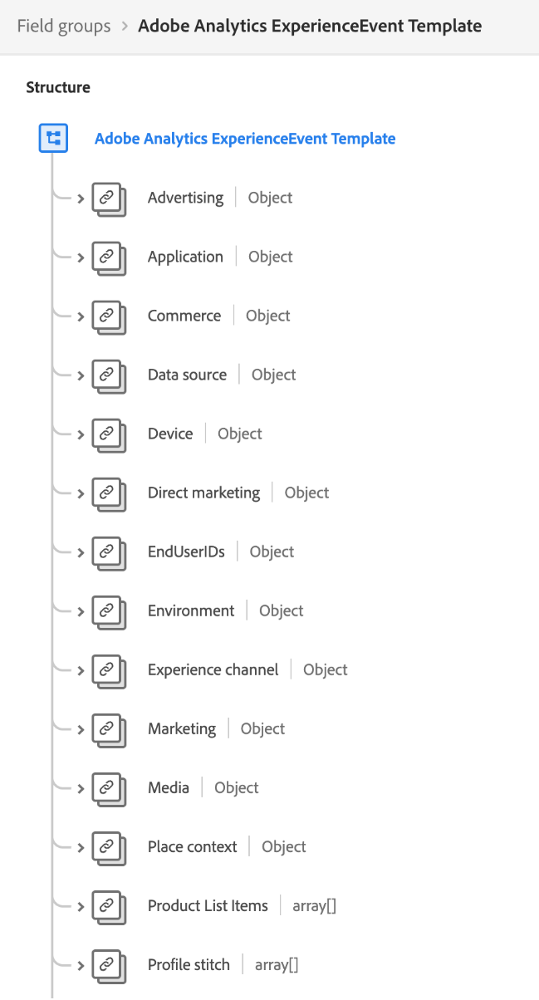

# データモデリングのベストプラクティス

[!DNL Experience Data Model] (XDM) は、ダウンストリームAdobe Experience Platformサービスで使用する共通の構造と定義を提供することで、顧客体験データを標準化するコアフレームワークです。 XDM 標準に準拠することで、すべての顧客体験データを共通の表現に組み込むことで、顧客の行動から有益なインサイトを得たり、セグメントを通じて顧客オーディエンスを定義したり、パーソナライズ目的で顧客属性を表したりできます。

XDM は非常に汎用性が高く、デザインによってカスタマイズ可能なので、スキーマを設計する際には、データモデリングのベストプラクティスに従うことが重要です。 このドキュメントでは、顧客体験データを XDM にマッピングする際におこなう必要がある主な決定と考慮事項について説明します。

## はじめに

このガイドを読む前に、 [XDM システムの概要](../home.md) XDM とその役割の概要を説明します。Experience Platform

さらに、このガイドでは、スキーマデザインに関する主な考慮事項にのみ焦点を当てています。 したがって、 [スキーマ構成の基本](./composition.md) このガイドで取り上げる個々のスキーマ要素の詳細については、を参照してください。

## ベストプラクティスのまとめ

Experience Platformで使用するデータモデルを設計するための推奨されるアプローチを、次のように要約できます。

1. データのビジネスユースケースを理解します。
1. に取り込む必要があるプライマリデータソースの特定 [!DNL Platform] を使用して、これらの使用例に対処します。
1. 関心を持つ可能性のあるセカンダリデータソースを特定します。 例えば、現在、組織内の 1 つのビジネスユニットのみが、データのへの移行に関心を持っている場合、 [!DNL Platform]同様のビジネスユニットは、今後、類似したデータの移植にも興味を持つ可能性があります。 これらのセカンダリソースを考慮すると、組織全体でデータモデルを標準化できます。
1. 識別されたデータソースの高レベルのエンティティ関係図 (ERD) を作成します。
1. ERD の概要を [!DNL Platform]中心 ERD（プロファイル、Experience Event、ルックアップエンティティを含む）

ビジネスユースケースの実施に必要な適切なデータソースの特定に関する手順は、組織によって異なります。 このドキュメントの残りの節では、データソースを特定した後に ERD を整理および構築する後の手順に焦点を当てますが、図の様々なコンポーネントに関する説明によって、データソースの移行先の決定が示されます [!DNL Platform].

## 高レベル ERD を作成する

に取り込むデータソースを決定したら、 [!DNL Platform]では、高レベルの ERD を作成して、データを XDM スキーマにマッピングするプロセスをガイドします。

次の例は、にデータを取り込む会社の簡易 ERD を示しています。 [!DNL Platform]. 次の図は、顧客アカウント、ホテル、住所、一般的な e コマースイベントなど、XDM クラスに分類する必要がある基本的なエンティティを示しています。

## エンティティをプロファイル、ルックアップ、イベントカテゴリに並べ替える

ERD を作成して、に取り込む必須エンティティを識別します。 [!DNL Platform]に値を指定する場合、これらのエンティティはプロファイル、参照、イベントの各カテゴリに分類される必要があります。

| カテゴリ | 説明 |
| --- | --- |
| プロファイルエンティティ | プロファイルエンティティは、個人（通常は顧客）に関する属性を表します。 このカテゴリに該当するエンティティは、 **[!DNL XDM Individual Profile]クラス**. |
| 参照エンティティ | ルックアップエンティティは、個々の人物に関連付けることができる概念を表しますが、個人を識別するために直接使用することはできません。 このカテゴリに該当するエンティティは、 **カスタムクラス**. |
| イベントエンティティ | イベントエンティティは、顧客が実行できるアクション、システムイベント、または時間の経過と共に変更を追跡する必要があるその他の概念に関する概念を表します。 このカテゴリに該当するエンティティは、 **[!DNL XDM ExperienceEvent]クラス**. |

{style=&quot;table-layout:auto&quot;}

### エンティティの並べ替えに関する考慮事項

以下の節では、上記のカテゴリにエンティティを分類する方法について詳しく説明します。

#### 可変データと不変データ

エンティティカテゴリ間での並べ替えの主な方法は、取り込まれるデータが可変かどうかです。

通常、プロファイルまたは参照エンティティに属する属性は可変です。 例えば、顧客の環境設定が時間の経過と共に変化し、サブスクリプションプランのパラメーターは市場のトレンドに応じて更新される場合があります。

これに対し、イベントデータは通常不変です。 イベントは特定のタイムスタンプに添付されるので、イベントが提供する「システムスナップショット」は変更されません。 例えば、イベントは、買い物かごのチェックアウト時に顧客の環境設定を取り込み、後で顧客の環境設定が変更されても変更しません。 イベントデータは、記録後は変更できません。

要約すると、プロファイルとルックアップエンティティには可変属性が含まれ、取得する主体に関する最新の情報を表します。一方、イベントは特定の時点でのシステムの不変レコードです。

#### カスタマー属性

エンティティに個々の顧客に関連する属性が含まれている場合、そのエンティティはおそらくプロファイルエンティティです。 顧客属性の例を次に示します。

* 個人の詳細（名前、生年月日、性別、アカウント ID など）。
* 位置情報（住所や GPS 情報など）。
* 連絡先情報（電話番号、電子メールアドレスなど）。

#### 経時的なデータの追跡

エンティティ内の特定の属性が時間の経過と共にどのように変化するかを分析する場合は、おそらくイベントエンティティです。 例えば、買い物かごへの製品項目の追加は、 [!DNL Platform]:

| 顧客 ID | タイプ | 製品 ID | 数量 | タイムスタンプ |
| --- | --- | --- | --- | --- |
| 1234567 | Add | 275098 | 2 | 10 月 1 日午前 10 時 32 分 |
| 1234567 | 削除 | 275098 | 1 | 10 月 1 日午前 10 時 33 分 |
| 1234567 | Add | 486502 | 1 | 10 月 1 日 10:41 AM |
| 1234567 | Add | 910482 | 5 | 10 月 3 日午後 2 時 15 分 |

{style=&quot;table-layout:auto&quot;}

#### セグメント化の使用例

エンティティを分類する場合は、特定のビジネスユースケースに対処するために構築したいオーディエンスセグメントについて検討することが重要です。

例えば、ある会社は、昨年 5 回以上購入したロイヤルティプログラムの「ゴールド」または「プラチナ」のメンバー全員を知りたがっています。 このセグメントロジックに基づいて、関連エンティティをどのように表すかに関して、次の結論を出すことができます。

* 「ゴールド」と「プラチナ」は、個々の顧客に適用できるロイヤルティステータスを表します。 セグメントロジックは顧客の現在のロイヤリティステータスにのみ関係するので、このデータはプロファイルスキーマの一部としてモデル化できます。 ロイヤリティステータスの変化を時間の経過と共に追跡する場合は、ロイヤリティステータスの変化に関する追加のイベントスキーマを作成することもできます。
* 購入とは、特定の時間に発生するイベントです。セグメントロジックは、指定した時間枠内の購入イベントに関係します。 したがって、このデータはイベントスキーマとしてモデル化する必要があります。

#### アクティベーションの使用例

セグメント化の使用例に関する考慮事項に加えて、関連する追加の属性を識別するために、これらのセグメントに対するアクティブ化の使用例も確認する必要があります。

例えば、会社が `country = US`. 次に、特定のダウンストリームターゲットに対してそのセグメントをアクティブ化する際に、書き出されたすべてのプロファイルを自宅の状態に基づいてフィルタリングしたいと考えます。 したがって、 `state` 属性は、該当するプロファイルエンティティでも取り込む必要があります。

#### 集計値

データの使用例と精度に基づいて、特定の値を事前に集計してからプロファイルまたはイベントエンティティに含める必要があるかどうかを判断する必要があります。

例えば、ある会社は、買い物かごの購入数に基づいてセグメントを作成したいと考えています。 各タイムスタンプ付き購入イベントを独自のエンティティとして含めることで、最も低い精度でこのデータを組み込むよう選択できます。 ただし、これにより、記録されたイベントの数が急激に増える場合があります。 取り込まれるイベントの数を減らすために、集計値を作成することもできます `numberOfPurchases` 1 週間か 1 ヶ月の間に MIN やMAXなどの他の集計関数も、このような状況に適用できます。

>[!CAUTION]
>
>Experience Platformは現在、自動値集計を実行していませんが、将来のリリースで予定されています。 集計値を使用する場合は、外部で計算を実行してから、にデータを送信する必要があります。 [!DNL Platform].

#### カーディナリティ

ERD で確立された基数は、エンティティの分類方法に関するヒントを提供することもできます。 2 つのエンティティ間に 1 対多の関係がある場合、「多数」を表すエンティティはイベントエンティティである可能性が高くなります。 ただし、「多数」とは、プロファイルエンティティ内の配列として提供されるルックアップエンティティのセットのことです。

>[!NOTE]
>
>すべての使用例に適合するユニバーサルアプローチがないので、基数に基づいてエンティティを分類する際には、各状況の長所と短所を考慮することが重要です。 詳しくは、 [次のセクション](#pros-and-cons) を参照してください。

次の表に、一般的なエンティティの関係と、それらから派生できるカテゴリを示します。

| 関係 | カーディナリティ | エンティティのカテゴリ |
| --- | --- | --- |
| 顧客と買い物かごのチェックアウト | 1 対多 | 1 人の顧客に多数の買い物かごのチェックアウトがある場合があります。これは、時間の経過と共に追跡できるイベントです。 したがって、顧客はプロファイルエンティティになり、買い物かごのチェックアウトはイベントエンティティになります。 |
| 顧客およびロイヤリティアカウント | 1 対 1 | 1 人の顧客が持つことのできるロイヤルティアカウントは 1 つだけで、その逆も同様です。 関係は 1 対 1 なので、顧客とロイヤルティアカウントの両方がプロファイルエンティティを表します。 |
| 顧客と購読 | 1 対多 | 1 人の顧客が多数のサブスクリプションを持っている場合があります。 この会社は顧客の現在の購読のみを扱うので、 Customers はプロファイルエンティティ、 Subscriptions はルックアップエンティティです。 |

{style=&quot;table-layout:auto&quot;}

### 異なるエンティティクラスの長所と短所 {#pros-and-cons}

前の節では、エンティティの分類方法を決定するための一般的なガイドラインをいくつか示しましたが、1 つのエンティティカテゴリを別のエンティティカテゴリよりも選択する場合に長所と短所が多いことがあることを理解することが重要です。 次のケーススタディでは、このような状況でオプションをどのように考慮するかを説明します。

ある会社は、顧客のアクティブな購読を追跡し、1 人の顧客が多数の購読を持つことができます。 また、アクティブな購読を持つすべてのユーザーを検索するなど、セグメント化の使用例の購読を含めたいと考えています。

このシナリオでは、データモデルで顧客のサブスクリプションを表す 2 つの選択肢が考えられます。

1. [プロファイル属性を使用](#profile-approach)
1. [イベントエンティティを使用](#event-approach)

#### アプローチ 1:プロファイル属性を使用 {#profile-approach}

第 1 のアプローチは、購読の配列を Customers のプロファイルエンティティ内に属性として含めることです。 この配列内のオブジェクトには、次のフィールドが含まれます： `category`, `status`, `planName`, `startDate`、および `endDate`.

 

**長所**

* セグメント化は、意図した使用例に対して可能です。
* スキーマは、顧客の最新のサブスクリプションレコードのみを保持します。

**短所**

* 配列内のフィールドに変更が生じるたびに、配列全体を再記述する必要があります。
* 異なるデータソースやビジネスユニットがアレイにデータを送信している場合、すべてのチャネルで最新の更新済みアレイを同期させておくのは困難になります。

#### アプローチ 2:イベントエンティティを使用 {#event-approach}

2 つ目のアプローチは、イベントスキーマを使用して購読を表すことです。 これには、最初の方法と同じ購読フィールドと、購読 ID、顧客 ID、購読イベントが発生した日時のタイムスタンプが追加されます。

 

**長所**

* セグメント化ルールは、より柔軟に設定できます（過去 30 日間に購読を変更したすべての顧客を検索するなど）。
* 顧客のサブスクリプションステータスが変更された場合、顧客のプロファイル属性内の長く複雑な配列を更新する必要がなくなりました。 これは、顧客のサブスクリプションリストに対する同時の変更が複数のソースから発生する場合に特に便利です。

**短所**

* セグメント化は、元の意図された使用例に対してより複雑になります（顧客の最新のサブスクリプションのステータスを識別する）。 セグメントのステータスを確認するために、顧客の最後のサブスクリプションイベントにフラグを設定する追加のロジックが必要になりました。
* イベントが自動的に期限切れになり、プロファイルストアからパージされるリスクが高くなります。 詳しくは、 [エクスペリエンスイベントの有効期限](../../profile/event-expirations.md) を参照してください。

## 分類されたエンティティに基づいてスキーマを作成する

エンティティをプロファイル、参照、イベントカテゴリに並べ替えたら、データモデルの XDM スキーマへの変換を開始できます。 デモ用に、前述の例のデータモデルは、次の図で適切なカテゴリに並べ替えられています。

 

エンティティの並べ替えの基になるカテゴリは、スキーマの基になる XDM クラスを決定する必要があります。 繰り返し実行する手順は、次のとおりです。

* プロファイルエンティティは、 [!DNL XDM Individual Profile] クラス。
* イベントエンティティでは、 [!DNL XDM ExperienceEvent] クラス。
* ルックアップエンティティは、組織で定義されたカスタム XDM クラスを使用する必要があります。

>[!NOTE]
>
>イベントエンティティはほとんどの場合、別々のスキーマで表されますが、プロファイルまたは参照カテゴリ内のエンティティは、その基数に応じて、1 つの XDM スキーマに組み合わせることができます。
>
>例えば、 Customers エンティティは LoyaltyAccounts エンティティと 1 対 1 の関係を持つので、 Customers エンティティのスキーマには `LoyaltyAccount` オブジェクトに含め、各顧客に適したロイヤルティフィールドを格納します。 ただし、関係が 1 対多の場合、「多く」を表すエンティティは、複雑さに応じて、別のスキーマまたはプロファイル属性の配列で表すことができます。

以下の節では、ERD に基づいてスキーマを構築する際の一般的なガイダンスを示します。

### 反復モデリングアプローチの採用

この [スキーマ進化のルール](./composition.md#evolution) 実装後は、スキーマに対して非破壊的な変更のみを加えることができます。 つまり、スキーマにフィールドを追加し、そのフィールドに対してデータを取り込むと、そのフィールドを削除できなくなります。 したがって、スキーマを最初に作成するときに、反復モデリングのアプローチを採用することが不可欠です。最初はシンプルな実装から始め、時間の経過と共に複雑さが徐々に増します。

特定のフィールドをスキーマに含める必要があるかどうかが不明な場合は、除外することをお勧めします。 後でフィールドが必要と判断された場合は、スキーマの次の反復でいつでも追加できます。

### ID フィールド

Experience Platformでは、ID としてマークされた XDM フィールドを使用して、複数のデータソースから取得した個々の顧客に関する情報を組み合わせます。 1 つのスキーマに複数のフィールドを ID としてマークすることはできますが、でスキーマを使用するためには、1 つのプライマリ ID を定義する必要があります [!DNL Real-Time Customer Profile]. 詳しくは、 [id フィールド](./composition.md#identity) 「スキーマ構成の基本」で、これらのフィールドの使用例に関する詳細を参照してください。

スキーマを設計する際、リレーショナルデータベーステーブル内のプライマリキーは、おそらくプライマリ ID の候補となります。 該当する ID フィールドの他の例としては、顧客の電子メールアドレス、電話番号、アカウント ID などがあります。 [ECID](../../identity-service/ecid.md).

### Adobeアプリケーションスキーマフィールドグループ

Experience Platformには、次のスキーマアプリケーションに関連するデータを取得するための、あらかじめ用意されているいくつかの XDMAdobeフィールドグループが用意されています。

* Adobe Analytics
* Adobe Audience Manager
* Adobe Campaign
* Adobe Target

例えば、 [[!UICONTROL Adobe Analytics ExperienceEvent テンプレート] フィールドグループ](https://github.com/adobe/xdm/blob/master/extensions/adobe/experience/analytics/experienceevent-all.schema.json) を使用して、 [!DNL Analytics]XDM スキーマに固有のフィールドです。 使用しているAdobeアプリケーションに応じて、スキーマでこれらのAdobeが提供するフィールドグループを使用する必要があります。

 

Adobeアプリケーションフィールドグループは、 `identityMap` フィールド：個々の顧客の標準 id 値をマッピングする、システム生成の読み取り専用オブジェクトです。

Adobe Analyticsの場合、ECID はデフォルトのプライマリ ID です。 ECID 値が顧客によって指定されない場合、プライマリ ID は代わりにデフォルトで AAID に設定されます。

>[!IMPORTANT]
>
>Adobeアプリケーションフィールドグループを使用する場合、他のフィールドをプライマリ ID としてマークする必要はありません。 ID としてマークする必要がある追加のプロパティがある場合、これらのフィールドをセカンダリ ID として代わりに割り当てる必要があります。

## 次の手順

このドキュメントでは、Experience Platformのためのデータモデルを設計する際の一般的なガイドラインとベストプラクティスを説明しました。 要約する手順は次のとおりです。

* スキーマを作成する前に、データテーブルをプロファイル、参照、イベントカテゴリに並べ替えて、トップダウンアプローチを使用します。
* 様々な目的でスキーマをデザインする際には、多くの場合、複数のアプローチやオプションがあります。
* データモデルは、セグメント化やカスタマージャーニー分析などのビジネスユースケースをサポートする必要があります。
* スキーマをできるだけ簡単にし、必要に応じて新しいフィールドのみを追加します。

準備が整ったら、 [UI でのスキーマの作成](../tutorials/create-schema-ui.md) スキーマの作成手順、エンティティに適切なクラスの割り当て、データのマッピング先のフィールドの追加手順を説明します。
