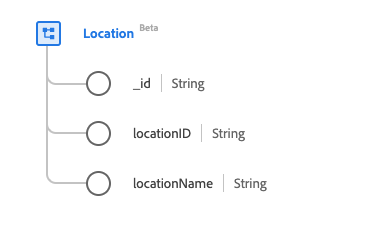

# [!UICONTROL Location] クラス

エクスペリエンスデータモデル（XDM）では、[!UICONTROL &#x200B; 場所 &#x200B;] クラスは、トラベルホールやスポーツアリーナなど、ライブイベントの場所情報をキャプチャします。

| 表示名 | プロパティ | データタイプ | 説明 |
| --- | --- | --- | --- |
| [!UICONTROL 識別子] | `_id` | [!UICONTROL 文字列] | レコードに対してシステムで生成された一意の文字列識別子。 このフィールドは、個々のレコードの一意性を追跡、データの重複を防ぎ、ダウンストリームのサービスでそのレコードを検索するために使用されます。   このフィールドはシステムで生成されるので、データ取り込み時に明示的な値を指定する必要はありません。 ただし、必要に応じて、独自の一意の ID 値を指定することもできます。 |
| [!UICONTROL &#x200B; 場所の識別子 &#x200B;] | `locationID` | [!UICONTROL 文字列] | 場所の一意の ID。 |
| [!UICONTROL &#x200B; 場所名 &#x200B;] | `locationName` | [!UICONTROL 文字列] | 場所の名前。 |

クラスを [[!UICONTROL Location] フィールドグループ ](../field-groups/location.md) で拡張して、場所に関する詳細を記述できます。
