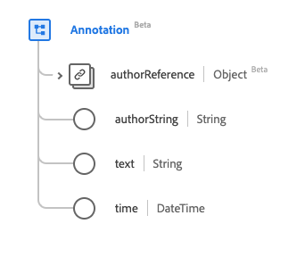

# [!UICONTROL &#x200B; 注釈 &#x200B;] データタイプ

[!UICONTROL &#x200B; 注釈 &#x200B;] は、オーサーに対するアトリビューションを持つテキストノードを含む、標準のエクスペリエンスデータモデル（XDM）データタイプです。 このデータタイプは、HL7 FHIR リリース 5 の仕様に従って作成されます。

| 表示名 | プロパティ | データタイプ | 説明 |
| --- | --- | --- | --- |
| [!UICONTROL &#x200B; オーサーリファレンス &#x200B;] | `authorReference` | [[!UICONTROL &#x200B; 参考 &#x200B;]](../data-types/reference.md) | 作成者への参照。 |
| [!UICONTROL &#x200B; 作成者 &#x200B;] | `authorString` | 文字列 | 注釈に責任を持つ個人。 |
| [!UICONTROL テキスト] | `text` | 文字列 | 注釈のコンテンツ。 |
| [!UICONTROL 時間] | `time` | 日時 | 注釈が作成された時点。 |

データタイプについて詳しくは、公開 XDM リポジトリを参照してください。

* [&#x200B; 入力された例 &#x200B;](https://github.com/adobe/xdm/blob/master/extensions/industry/healthcare/fhir/datatypes/annotation.example.1.json)
* [&#x200B; 完全なスキーマ &#x200B;](https://github.com/adobe/xdm/blob/master/extensions/industry/healthcare/fhir/datatypes/annotation.schema.json)
