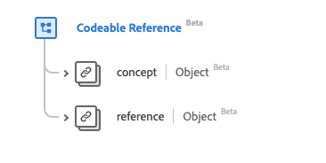

# [!UICONTROL &#x200B; コード化可能な参照 &#x200B;] データタイプ

[!UICONTROL &#x200B; コード化可能な参照 &#x200B;] は、リソースまたは概念への参照を記述する標準の Experience Data Model （XDM）データタイプです。 このデータタイプは、HL7 FHIR リリース 5 の仕様に従って作成されます。

| 表示名 | プロパティ | データタイプ | 説明 |
| --- | --- | --- | --- |
| [!UICONTROL &#x200B; 概念 &#x200B;] | `concept` | [[!UICONTROL &#x200B; コード化可能な概念 &#x200B;]](../data-types/codeable-concept.md) | 概念への参照（クラス）。 |
| [!UICONTROL &#x200B; 参考 &#x200B;] | `reference` | [[!UICONTROL &#x200B; 参考 &#x200B;]](../data-types/reference.md) | リソースへの参照。 |

データタイプについて詳しくは、公開 XDM リポジトリを参照してください。

* [&#x200B; 入力された例 &#x200B;](https://github.com/adobe/xdm/blob/master/extensions/industry/healthcare/fhir/datatypes/codeablereference.example.1.json)
* [&#x200B; 完全なスキーマ &#x200B;](https://github.com/adobe/xdm/blob/master/extensions/industry/healthcare/fhir/datatypes/codeablereference.schema.json)
