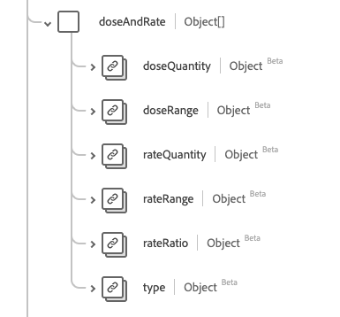

# [!UICONTROL &#x200B; 用量 &#x200B;] データタイプ

[!UICONTROL &#x200B; 投与量 &#x200B;] は、薬の服用方法や服用方法を説明する、標準的なエクスペリエンスデータモデル（XDM）データタイプです。 このデータタイプは、HL7 FHIR リリース 5 の仕様に従って作成されます。

| 表示名 | プロパティ | データタイプ | 説明 |
| --- | --- | --- | --- |
| [!UICONTROL &#x200B; 追加指示 &#x200B;] | `additionalInstruction` | [[!UICONTROL &#x200B; コード化可能な概念 &#x200B;]](../data-types/codeable-concept.md) の配列 | 患者に対する指示または警告の追加。 |
| [!UICONTROL &#x200B; 必要に応じて &#x200B;] | `asNeededFor` | [[!UICONTROL &#x200B; コード化可能な概念 &#x200B;]](../data-types/codeable-concept.md) の配列 | 必要に応じて薬を服用する必要がある問題を説明します。 |
| [!UICONTROL &#x200B; 用量および速度 &#x200B;] | `doseAndRate` | オブジェクトの配列 | 投薬量、投薬量又は標準的な投薬量。 詳しくは、以下の [&#x200B; 節 &#x200B;](#dose-and-rate) を参照してください |
| [!UICONTROL 1 回当たりの最大投与量 &#x200B;] | `maxDosePerAdministration` | [[!UICONTROL &#x200B; 単純量 &#x200B;]](../data-types/simple-quantity.md) | 1 回の投与あたりの薬の上限。 |
| [!UICONTROL 1 生涯あたりの最大線量 &#x200B;] | `maxDosePerLifetime` | [[!UICONTROL &#x200B; 単純量 &#x200B;]](../data-types/simple-quantity.md) | 患者の生涯あたりの投薬の上限。 |
| [!UICONTROL 1 期間あたりの最大投与量 &#x200B;] | `maxDosePerPeriod` | [[!UICONTROL Ratio]](../data-types/ratio.md) の配列 | 単位時間当たりの投薬の上限。 |
| [!UICONTROL 方法] | `method` | [[!UICONTROL &#x200B; コード化可能な概念 &#x200B;]](../data-types/codeable-concept.md) | 薬を投与するための技術。 |
| [!UICONTROL &#x200B; ルート &#x200B;] | `route` | [[!UICONTROL &#x200B; コード化可能な概念 &#x200B;]](../data-types/codeable-concept.md) | 薬が体に入る方法。 |
| [!UICONTROL &#x200B; 身体部位 &#x200B;] | `site` | [[!UICONTROL &#x200B; コード化可能な概念 &#x200B;]](../data-types/codeable-concept.md) | 薬物を投与するための身体部位。 |
| [!UICONTROL &#x200B; タイミング &#x200B;] | `timing` | [[!UICONTROL &#x200B; タイミング &#x200B;]](../data-types/timing.md) | 薬を投与する必要がある場合。 |
| [!UICONTROL &#x200B; 必要に応じて &#x200B;] | `asNeeded` | ブール値 | 薬が必要に応じて服用されるべきかどうかを示す指標。 |
| [!UICONTROL &#x200B; 患者の指示 &#x200B;] | `patientInstruction` | 文字列 | 患者または消費者が理解する条件での指示。 |
| [!UICONTROL &#x200B; シーケンス &#x200B;] | `Integer` | [[!UICONTROL &#x200B; コード化可能な概念 &#x200B;]](../data-types/codeable-concept.md) | 投薬指示の順序。 |
| [!UICONTROL テキスト] | `text` | 文字列 | テキストの投与量の指示を計画します。 |

データタイプについて詳しくは、公開 XDM リポジトリを参照してください。

* [&#x200B; 入力された例 &#x200B;](https://github.com/adobe/xdm/blob/master/extensions/industry/healthcare/fhir/datatypes/dosage.example.1.json)
* [&#x200B; 完全なスキーマ &#x200B;](https://github.com/adobe/xdm/blob/master/extensions/industry/healthcare/fhir/datatypes/dosage.schema.json)

## `doseAndRate` {#dose-and-rate}

`doseAndRate` はオブジェクトの配列として指定されます。 各オブジェクトの構造については、以下で説明します。

| 表示名 | プロパティ | データタイプ | 説明 |
| --- | --- | --- | --- |
| [!UICONTROL &#x200B; 線量量 &#x200B;] | `doseQuantity` | [[!UICONTROL &#x200B; 単純量 &#x200B;]](../data-types/simple-quantity.md) | 1 回の投薬量。 |
| [!UICONTROL &#x200B; 線量範囲 &#x200B;] | `doseRange` | [[!UICONTROL 範囲]](../data-types/range.md) | 1 回の投薬量。 |
| [!UICONTROL &#x200B; 料率の数量 &#x200B;] | `rateQuantity` | [[!UICONTROL &#x200B; 単純量 &#x200B;]](../data-types/simple-quantity.md) | 単位時間当たりの投薬量。 |
| [!UICONTROL &#x200B; レート範囲 &#x200B;] | `rateRange` | [[!UICONTROL 範囲]](../data-types/range.md) | 単位時間当たりの投薬量。 |
| [!UICONTROL &#x200B; レート比 &#x200B;] | `rateRatio` | [[!UICONTROL &#x200B; 比率 &#x200B;]](../data-types/ratio.md) | 単位時間当たりの投薬量。 |
| [!UICONTROL タイプ] | `type` | [[!UICONTROL &#x200B; コード化可能な概念 &#x200B;]](../data-types/codeable-concept.md) | 指定された投与量または速度。 |
