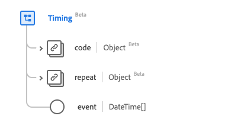

# [!UICONTROL &#x200B; タイミング &#x200B;] データタイプ

[!UICONTROL &#x200B; タイミング &#x200B;] は、定期的に発生する可能性のあるイベントに関する情報を提供するタイミングスケジュールを記述する、標準の Experience Data Model （XDM）データタイプです。 このデータタイプは、HL7 FHIR リリース 5 の仕様に従って作成されます。

| 表示名 | プロパティ | データタイプ | 説明 |
| --- | --- | --- | --- |
| [!UICONTROL &#x200B; イベント &#x200B;] | `event` | DateTime の配列 | イベントが発生するタイミング。 |
| [!UICONTROL &#x200B; 繰り返し &#x200B;] | `repeat` | [[!UICONTROL &#x200B; 繰り返し &#x200B;]](../data-types/repeat.md) | イベントが発生するタイミングに関する情報。 |
| [!UICONTROL コード] | `code` | [[!UICONTROL &#x200B; コード化可能な概念 &#x200B;]](../data-types/codeable-concept.md) | イベントに関連するコード。 |

データタイプについて詳しくは、公開 XDM リポジトリを参照してください。

* [&#x200B; 入力された例 &#x200B;](https://github.com/adobe/xdm/blob/master/extensions/industry/healthcare/fhir/datatypes/timing.example.1.json)
* [&#x200B; 完全なスキーマ &#x200B;](https://github.com/adobe/xdm/blob/master/extensions/industry/healthcare/fhir/datatypes/timing.schema.json)
