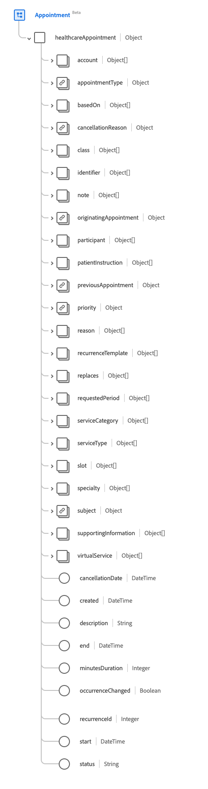

# [!UICONTROL  予定 ] スキーマフィールドグループ

[!UICONTROL Appointment] は、[[!DNL XDM Individual Profile] class](../../../classes/individual-profile.md) および [[!DNL Provider class]](../../../classes/provider.md) の標準スキーマフィールドグループです。 患者、医療従事者、関係者、および/または特定の日時のデバイス間でのヘルスケアイベントの予約に関する情報を含む、単一のオブジェクトタイプのフィールド `healthcareAppointment` ータを提供します。

| 表示名 | プロパティ | データタイプ | 説明 |
| --- | --- | --- | --- |
| [!UICONTROL アカウント] | `account` | [[!UICONTROL  参照 ]](../data-types/reference.md) の配列 | 請求に使用されると予想されるアカウントのセット。 |
| [!UICONTROL  予定の種類 ] | `appointmentType` | [[!UICONTROL  コード化可能な概念 ]](../data-types/codeable-concept.md) | スロットに予約されている予定または患者のスタイル （サービスタイプではない）。 |
| [!UICONTROL  基準 ] | `basedOn` | [[!UICONTROL  参照 ]](../data-types/reference.md) の配列 | 予約の依頼は、手続き依頼などの評価に割り当てられます。 |
| [!UICONTROL  取消しの理由 ] | `cancellationReason` | [[!UICONTROL  コード化可能な概念 ]](../data-types/codeable-concept.md) の配列 | 予定がキャンセルされるコード化された理由。 これは、追加のアクションが必要かどうか、または特定の料金が適用されるかどうかを判断するために、レポート、請求、または処理でよく使用されます。 |
| [!UICONTROL クラス] | `class` | [[!UICONTROL  コード化可能な概念 ]](../data-types/codeable-concept.md) の配列 | 外来患者、外来患者、入院患者、救急患者など、患者遭遇の分類を表す概念。 |
| [!UICONTROL 識別子] | `identifier` | [[!UICONTROL  識別子 ]](../data-types/identifier.md) の配列 | 予定にリンクされている一意の ID のリスト。 これらの識別子は、ビジネス ルールに基づいて割り当てられているか、予定への直接 URL リンクが適切でない場合に割り当てられます。 |
| [!UICONTROL  注 ] | `note` | [[!UICONTROL Annotation]](../data-types/annotation.md) の配列 | 予定に関する追加のメモまたはコメント。 |
| [!UICONTROL  元の予定 ] | `originatingAppointment` | [[!UICONTROL  参考 ]](../data-types/reference.md) | 関連する予定の定期的なセットの元の予定。 |
| [!UICONTROL  参加者 ] | `participant` | オブジェクトの配列 | 予定に関与した参加者のリスト。 詳しくは、[ 以下の節 ](#participant) を参照してください。 |
| [!UICONTROL  患者指導 ] | `patientInstruction` | [[!UICONTROL  コード化可能な参照 ]](../data-types/reference.md) の配列 | 予約に関連する診断。 |
| [!UICONTROL  前の予定 ] | `previousAppointment` | [[!UICONTROL  参考 ]](../data-types/reference.md) | 関連する一連の予定の前の予定。 |
| [!UICONTROL 優先度] | `priority` | [[!UICONTROL  コード化可能な概念 ]](../data-types/codeable-concept.md) | 予定の優先順位。予定の優先順位を変更する必要がある場合に、十分な情報に基づいた決定を行うために使用できます。 iCal 規格では、`0` は未定義、`1` は最高、`9` は最低の優先度として指定されます。 |
| [!UICONTROL 理由] | `reason` | [[!UICONTROL  コード化可能な概念 ]](../data-types/codeable-concept.md) の配列 | 予定がスケジュールされている理由（通常、条件または手順）。 |
| [!UICONTROL  繰り返しテンプレート ] | `recurrenceTemplate` | オブジェクトの配列 | 定期的な予定の作成に使用する定期的なパターンまたはテンプレートの詳細を含みます。  詳しくは、[ 以下の節 ](#recurrence) を参照してください。 |
| [!UICONTROL  置換 ] | `replaces` | [[!UICONTROL  参照 ]](../data-types/reference.md) の配列 | この予定に置き換えられる予定です。 キャンセルがある場合、キャンセルの詳細は、参照先のリソースの `cancellationReason` プロパティで確認できます。 |
| [!UICONTROL  申請期間 ] | `requestedPeriod` | [[!UICONTROL  期間 ]](../data-types/period.md) の配列 | 予定をスケジュールすることが望ましい一連の日付範囲（場合によっては時間を含む）。 |
| [!UICONTROL  サービス区分 ] | `serviceCategory` | [[!UICONTROL  コード化可能な概念 ]](../data-types/codeable-concept.md) の配列 | 任用中に実行されるサービスの幅広いカテゴリ。 |
| [!UICONTROL  サービスタイプ ] | `serviceType` | [[!UICONTROL  コード化可能な参照 ]](../data-types/codeable-reference.md) の配列 | 予定中に実行される特定のサービス。 |
| [!UICONTROL  スロット ] | `slot` | [[!UICONTROL  参照 ]](../data-types/reference.md) の配列 | 予定によって記入される参加者のスケジュールからのタイムスロット。 |
| [!UICONTROL  専門分野 ] | `speciality` | [[!UICONTROL  コード化可能な概念 ]](../data-types/codeable-concept.md) の配列 | この任命で要求されたサービスを実行するために必要な実務担当者の専門分野。 |
| [!UICONTROL 件名] | `subject` | [[!UICONTROL  参照 ]](../data-types/reference.md) の配列 | 予定に関連付けられた患者またはグループ。 |
| [!UICONTROL  支援情報 ] | `supportingInformation` | [[!UICONTROL  参照 ]](../data-types/reference.md) の配列 | サポートする予定を立てる際に提供される追加情報。 |
| [!UICONTROL  仮想サービス ] | `virtualService` | の配列 [[!UICONTROL  仮想サービスの詳細 ]](../data-types/virtual-service-detail.md) | 電話会議など、仮想サービスの接続の詳細。 |
| [!UICONTROL  解約の日 ] | `cancellationDate` | 日時 | 予定がキャンセルされた日時。 |
| [!UICONTROL 作成日] | `created` | 日時 | 予定が作成された日時。 |
| [!UICONTROL 説明] | `description` | 文字列 | 予定の簡単な説明。 詳細な情報または展開された情報は、`note` フィールドに入力する必要があります。 |
| [!UICONTROL 終了] | `end` | 日時 | 予定が終了する日時です。 |
| [!UICONTROL  分の期間 ] | `minutesDuration` | 整数 | 予定にかかる分数。 この値は、開始時刻と終了時刻の間の時間よりも短くすることができます。 許容される最小値は `0` です。 |
| [!UICONTROL  発生が変更されました ] | `occurenceChanged` | ブール値 | この予定が定期的な予定と異なるかどうかを示すフラグ。 |
| [!UICONTROL RecurrenceId] | `RecurrenceId` | 整数 | 定期的な予定の特定のパターンを識別するシーケンス番号です。 最小値は `0` です。 |
| [!UICONTROL 開始] | `start` | 日時 | 予定が行われる日時。 |
| [!UICONTROL ステータス] | `status` | 文字列 | 予定のステータス。 このプロパティの値は、次の既知の列挙値のいずれかに等しい必要があります： <li> `proposed` </li> <li> `pending` </li> <li> `booked` </li> <li> `arrived` </li> <li> `fulfilled` </li> <li> `cancelled` </li> <li> `noshow` </li> <li> `entered-in-error` </li> <li> `checked-in` </li> <li> `waitlist` </li> |

フィールドグループについて詳しくは、公開 XDM リポジトリを参照してください。

* [ 入力された例 ](https://github.com/adobe/xdm/blob/master/extensions/industry/healthcare/fhir/fieldgroups/appointment.example.1.json)
* [ 完全なスキーマ ](https://github.com/adobe/xdm/blob/master/extensions/industry/healthcare/fhir/fieldgroups/appointment.schema.json)

## `participant` {#participant}

`participant` はオブジェクトの配列として指定されます。 各オブジェクトの構造については、以下で説明します。

| 表示名 | プロパティ | データタイプ | 説明 |
| --- | --- | --- | --- |
| [!UICONTROL  アクター ] | `actor` | [[!UICONTROL  参考 ]](../data-types/reference.md) | 予定に参加する個人、デバイス、場所、またはサービス。 |
| [!UICONTROL  期間 ] | `period` | [[!UICONTROL  期間 ]](../data-types/period.md) | 参加者（アクター）が予定に関与する期間。 |
| [!UICONTROL タイプ] | `type` | [[!UICONTROL  コード化可能な概念 ]](../data-types/codeable-concept.md) の配列 | 予定における参加者（アクター）の役割。 |
| [!UICONTROL 必須] | `required` | ブール値 | この参加者が出席する必要があるかどうか。 |
| [!UICONTROL  ステータス ] | `status` | 文字列 | 参加者の受け入れステータス。 このプロパティの値は、次の既知の列挙値のいずれかに等しい必要があります： <li> `accepted` </li> <li> `declined` </li> <li> `tentative` </li> <li> `needs-action` </li> |

## `recurrenceTemplate` {#recurrence}

`recurrenceTemplate` はオブジェクトの配列として指定されます。 各オブジェクトの構造については、以下で説明します。

| 表示名 | プロパティ | データタイプ | 説明 |
| --- | --- | --- | --- |
| [!UICONTROL  月間テンプレート ] | `monthlyTemplate` | オブジェクトの配列 | 毎月の定期的な予定に関する情報です。 詳しくは、[ 以下の節 ](#monthly-template) を参照してください。 |
| [!UICONTROL  繰り返しタイプ ] | `recurrenceType` | [[!UICONTROL  コード化可能な概念 ]](../data-types/codeable-concept.md) | 定期的な予定を繰り返す頻度（毎週、毎月、毎年など）。 |
| [!UICONTROL タイムゾーン] | `timezone` | [[!UICONTROL  コード化可能な概念 ]](../data-types/codeable-concept.md) | 定期的な予定のタイムゾーンを指定します。 |
| [!UICONTROL  週別テンプレート ] | `weeklyTemplate` | オブジェクトの配列 | 毎週の定期的な予定に関する情報です。 詳しくは、以下の [ 節 ](#weekly-template) を参照してください。 |
| [!UICONTROL  年次テンプレート ] | `yearlyTemplate` | オブジェクト | 1 年の定期的な予定に関する情報です。 予定が繰り返される n 年目ごとに示す整数値を含む、`yearInterval` という 1 つのプロパティが含まれます。 |
| [!UICONTROL  日付を除く。] | `excludingDate` | 日付の配列 | 休日など、繰り返しから除外する必要のある日付。 |
| [!UICONTROL  繰り返し Id の除外 ] | `excludingRecurrenceId` | 整数の配列 | 繰り返しから除外する必要がある繰り返し ID。 これは、除外する予定の `reccurenceID` を指定する `excludingDate` の代わりに使用できます。 |
| [!UICONTROL  最終作成日 ] | `lastOccurenceDate` | 日付 | これ以上定期的な予定が予定されない日付です。 |
| [!UICONTROL  オカレンス数 ] | `occurenceCount` | 整数 | この繰り返しに予定されている予定の数。 最小値は `0` です。 |
| [!UICONTROL  発生日 ] | `occurenceDate` | 日付の配列 | 予定がスケジュールされる特定の日付のリスト。 |

## `weeklyTemplate` {#weekly-template}

`weeklyTemplate` はオブジェクトの配列として指定されます。 各オブジェクトの構造については、以下で説明します。

| 表示名 | プロパティ | データタイプ | 説明 |
| --- | --- | --- | --- |
| [!UICONTROL  金曜日 ] | `friday` | ブール値 | 定期的な予定が金曜日に発生するように指定します。 |
| [!UICONTROL  月曜日 ] | `monday` | ブール値 | 定期的な予定が月曜日に発生するように指定します。 |
| [!UICONTROL  土曜日 ] | `saturday` | ブール値 | 土曜日に定期的な予定が発生するように指定します。 |
| [!UICONTROL  日曜日 ] | `sunday` | ブール値 | 定期的な予定が日曜日に発生するように指定します。 |
| [!UICONTROL  木曜日 ] | `thursday` | ブール値 | 定期的な予定が木曜日に発生するように指定します。 |
| [!UICONTROL  火曜日 ] | `tuesday` | ブール値 | 定期的な予定が火曜日に発生するように指定します。 |
| [!UICONTROL  水曜日 ] | `wednesday` | ブール値 | 定期的な予定が水曜日に発生するように指定します。 |
| [!UICONTROL  週の間隔 ] | `weekInterval` | 整数 | 予定の繰り返し頻度を n 週単位で指定します。 デフォルトは毎週なので、一般的な値は 2 以上です。 |

## `monthlyTemplate` {#monthly-template}

`monthlyTemplate` はオブジェクトの配列として指定されます。 各オブジェクトの構造については、以下で説明します。

| 表示名 | プロパティ | データタイプ | 説明 |
| --- | --- | --- | --- |
| [!UICONTROL  曜日 ] | `dayOfWeek` | [[!UICONTROL  コーディング ]] | この特定の曜日に予定が実行されるように指定します。 |
| [!UICONTROL  月の n 週目 ] | `nthWeekOfMonth` | [[!UICONTROL  コーディング ]](../data-types/coding.md) | 予定を受け取る月の n 週目を示します。 |
| [!UICONTROL  日付 ] | `dayOfMonth` | 整数 | その月のこの特定の日に予定が発生するように指定します。 |
| [!UICONTROL  月の間隔 ] | `monthInterval` | 整数 | 定期的な予定が n か月ごとに発生するように指定します。 |

