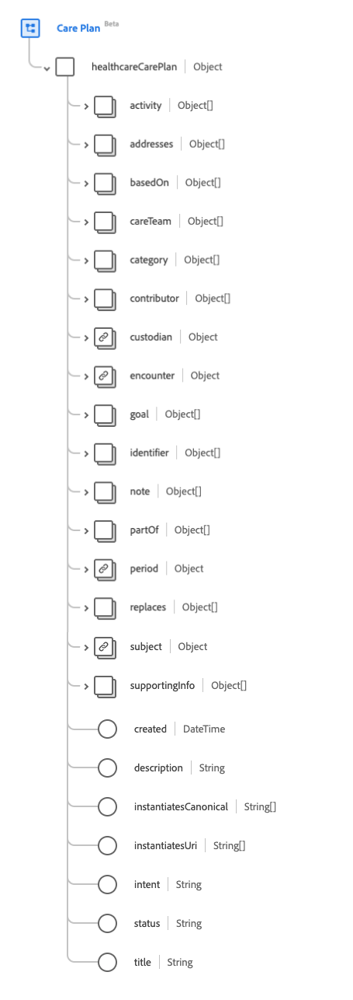

# [!UICONTROL &#x200B; ケア計画 &#x200B;] スキーマフィールドグループ

[!UICONTROL &#x200B; ケアプラン &#x200B;] は、[[!DNL XDM Individual Profile]  クラス &#x200B;](../../../classes/individual-profile.md) の標準スキーマフィールドグループです。 患者またはグループのヘルスケアプランをキャプチャする単一のオブジェクトタイプのフィールド `healthcareCarePlan` を提供します。

| 表示名 | プロパティ | データタイプ | 説明 |
| --- | --- | --- | --- |
| [!UICONTROL アクティビティ] | `activity` | オブジェクトの配列 | 計画の一部として発生した、または発生が予定されているアクションを識別します。 詳しくは、[&#x200B; 以下の節 &#x200B;](#activity) を参照してください。 |
| [!UICONTROL &#x200B; 住所 &#x200B;] | `addresses` | [[!UICONTROL &#x200B; コード化可能な参照 &#x200B;]](../data-types/codeable-reference.md) の配列 | は、ケアプランが処理する条件または関心を識別します。 |
| [!UICONTROL &#x200B; 基準 &#x200B;] | `basedOn` | [[!UICONTROL &#x200B; 参照 &#x200B;]](../data-types/reference.md) の配列 | このケアプランによって全体または一部が履行される、より高レベルのリクエストリソース。 |
| [!UICONTROL &#x200B; ケアチーム &#x200B;] | `careTeam` | [[!UICONTROL &#x200B; 参照 &#x200B;]](../data-types/reference.md) の配列 | この計画で想定されるケアに関与すると予想されるすべての人物および組織を特定します。 |
| [!UICONTROL カテゴリ] | `category` | [[!UICONTROL &#x200B; コード化可能な概念 &#x200B;]](../data-types/codeable-concept.md) の配列 | 複数の既存のプランの違いをサポートするために、どのようなプランがあるかを特定します。 |
| [!UICONTROL &#x200B; 投稿者 &#x200B;] | `contributor` | [[!UICONTROL &#x200B; 参照 &#x200B;]](../data-types/reference.md) の配列 | ケア計画のコンテンツを提供した個人、組織またはデバイスを識別します。 |
| [!UICONTROL &#x200B; 保護者 &#x200B;] | `custodian` | [[!UICONTROL &#x200B; 参考 &#x200B;]](../data-types/reference.md) | データが入力された場合、管理者はケア計画に責任を負い、そのケア計画に関連付けられます。 |
| [!UICONTROL &#x200B; 出会い &#x200B;] | `encounter` | [[!UICONTROL &#x200B; 参考 &#x200B;]](../data-types/reference.md) | ケアプランが作成された際の出会い。 |
| [!UICONTROL &#x200B; 目標 &#x200B;] | `goal` | [[!UICONTROL &#x200B; 参照 &#x200B;]](../data-types/reference.md) の配列 | 計画を実行する目的。 |
| [!UICONTROL 識別子] | `identifier` | [[!UICONTROL &#x200B; 識別子 &#x200B;]](../data-types/identifier.md) の配列 | リソースが更新されてサーバーからサーバーに伝播される際に一定の状態が維持される、実行者または他のシステムによって、このケア計画に割り当てられたビジネス識別子。 |
| [!UICONTROL &#x200B; 注 &#x200B;] | `note` | [[!UICONTROL Annotation]](../data-types/annotation.md) の配列 | 他の属性で扱われていないケアプランに関する一般的なメモ。 |
| [!UICONTROL &#x200B; 一部 &#x200B;] | `partOf` | [[!UICONTROL &#x200B; 参照 &#x200B;]](../data-types/reference.md) の配列 | この特定のケア計画が構成要素または段階である、より大きなケア計画。 |
| [!UICONTROL &#x200B; 期間 &#x200B;] | `period` | [[!UICONTROL &#x200B; 期間 &#x200B;]](../data-types/period.md) | プランが発効した（または発効が予定されている）日時と終了日を示します。 |
| [!UICONTROL &#x200B; 置換 &#x200B;] | `replaces` | [[!UICONTROL &#x200B; 参照 &#x200B;]](../data-types/reference.md) の配列 | 機能がこのケア計画に引き継がれる、完了または終了したケア計画。 |
| [!UICONTROL 件名] | `subject` | [[!UICONTROL &#x200B; 参考 &#x200B;]](../data-types/reference.md) | 計画で意図したケアが記述されている患者またはグループを識別します。 |
| [!UICONTROL &#x200B; サポート情報 &#x200B;] | `supportingInfo` | [[!UICONTROL &#x200B; 参照 &#x200B;]](../data-types/reference.md) の配列 | 計画の作成に影響を及ぼした患者の記録の一部を特定する。 これには、併存疾患、最近の処置、制限事項、最近の評価などが含まれます。 |
| [!UICONTROL 作成日] | `created` | 日時 | このケア プランがシステムで作成された日時を表します（多くの場合、システムで生成された日付）。 |
| [!UICONTROL 説明] | `description` | 文字列 | プランの範囲と特性の説明。 |
| [!UICONTROL Canonical をインスタンス化 &#x200B;] | `instantiatesCanonical` | 文字列の配列 | FHIR が定義したプロトコル、ガイドライン、アンケート、またはこの計画によって全体または一部が準拠しているその他の定義を指す URL。 |
| [!UICONTROL Uri をインスタンス化 &#x200B;] | `instantiatesUri` | 文字列の配列 | 外部で管理されるプロトコル、ガイドライン、アンケート、またはこの計画によって全体または一部に固定されているその他の定義を指す URL。URI で表されます。 |
| [!UICONTROL &#x200B; インテント &#x200B;] | `intent` | 文字列 | ケアプランの目的。 このプロパティの値は、次の既知の列挙値のいずれかに等しい必要があります。 <li> `proposal` </li> <li> `plan` </li> <li> `order` </li> <li> `option` </li> <li> `directive` </li> |
| [!UICONTROL ステータス] | `status` | 文字列 | ケア計画のステータス。 このプロパティの値は、次の既知の列挙値のいずれかに等しい必要があります。 <li> `draft` </li> <li> `active` </li> <li> `on-hold` </li> <li> `revoked` </li> <li> `completed` </li> <li> `entered-in-error` </li> <li> `unknown` </li> |
| [!UICONTROL タイトル] | `title` | 文字列 | ケアプランの名前。 |

フィールドグループについて詳しくは、公開 XDM リポジトリを参照してください。

* [&#x200B; 入力された例 &#x200B;](https://github.com/adobe/xdm/blob/master/extensions/industry/healthcare/fhir/fieldgroups/careplan.example.1.json)
* [&#x200B; 完全なスキーマ &#x200B;](https://github.com/adobe/xdm/blob/master/extensions/industry/healthcare/fhir/fieldgroups/careplan.schema.json)

## `activity` {#activity}

`activity` はオブジェクトの配列として指定されます。 各オブジェクトの構造については、以下で説明します。

| 表示名 | プロパティ | データタイプ | 説明 |
| --- | --- | --- | --- |
| [!UICONTROL &#x200B; 実行されたアクティビティ &#x200B;] | `performedActivity` | [[!UICONTROL &#x200B; コード化可能な参照 &#x200B;]](../data-types/codeable-reference.md) の配列 | 予定や手続きなど、アクティビティの結果。 |
| [!UICONTROL &#x200B; 計画アクティビティの参照 &#x200B;] | `plannedActivityReference` | [[!UICONTROL &#x200B; 参考 &#x200B;]](../data-types/reference.md) | 提案されたアクティビティの詳細。 |
| [!UICONTROL &#x200B; 進行状況 &#x200B;] | `progress` | [[!UICONTROL Annotation]](../data-types/annotation.md) の配列 | アクティビティの遵守、ステータスまたは進捗に関するメモ。 |
