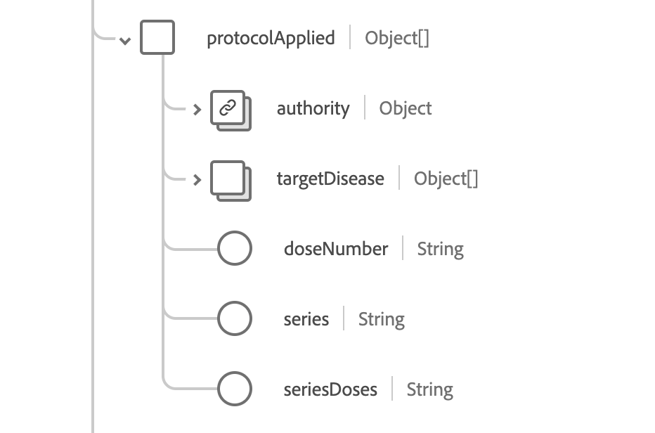

# [!UICONTROL  予防接種 ] スキーマフィールドグループ

[!UICONTROL  予防接種 ] は、[[!DNL XDM Experience Event]  クラス ](../../../classes/experienceevent.md) の標準スキーマフィールドグループです。 免疫イベント情報を取得する単一のオブジェクトタイプフィールド `healthcareImmunization` を提供します。

| 表示名 | プロパティ | データタイプ | 説明 |
| --- | --- | --- | --- |
| [!UICONTROL  使用製品 ] | `administeredProduct` | [[!UICONTROL  コード化可能な参照 ]](../data-types/codeable-reference.md) | 投与された製品。 |
| [!UICONTROL  基準 ] | `basedOn` | [[!UICONTROL  参照 ]](../data-types/reference.md) の配列 | 予防接種イベントの基になる権限。 |
| [!UICONTROL  線量量 ] | `doseQuantity` | [[!UICONTROL  単純量 ]](../data-types/simple-quantity.md) | 投与されるワクチンの量。 |
| [!UICONTROL  出会い ] | `encounter` | [[!UICONTROL  参考 ]](../data-types/reference.md) | 予防接種を受けた人との出会いは一部でした。 |
| [!UICONTROL  資金Source] | `fundingSource` | [[!UICONTROL  コード化可能な概念 ]](../data-types/codeable-concept.md) | ワクチンの資金源。 |
| [!UICONTROL 識別子] | `identifier` | [[!UICONTROL  識別子 ]](../data-types/identifier.md) の配列 | ビジネス識別子。 |
| [!UICONTROL  情報Source] | `informationSource` | [[!UICONTROL  コード化可能な参照 ]](../data-types/codeable-reference.md) | レポートされたレコードのソースを示します。 |
| [!UICONTROL 場所] | `location` | [[!UICONTROL  参考 ]](../data-types/reference.md) | 予防接種が行われた場所。 |
| [!UICONTROL  製造元 ] | `manufacturer` | [[!UICONTROL  コード化可能な参照 ]](../data-types/codeable-reference.md) | ワクチンの製造元。 |
| [!UICONTROL  注 ] | `note` | [[!UICONTROL Annotation]](../data-types/annotation.md) の配列 | 追加の予防接種記録。 |
| [!UICONTROL  患者 ] | `patient` | [[!UICONTROL  参考 ]](../data-types/reference.md) | 予防接種を受けた人。 |
| [!UICONTROL バッチ] | `performer` | オブジェクトの配列 | 予防接種イベントを行った人。 詳しくは、[ 以下の節 ](#performer) を参照してください。 |
| [!UICONTROL  プログラムの実施要件 ] | `programEligibility` | オブジェクトの配列 | 特定のワクチン接種プログラムに対する患者の実施要件。 詳しくは、[ 以下の節 ](#program-eligibility) を参照してください。 |
| [!UICONTROL  適用されるプロトコル ] | `protocolApplied` | オブジェクトの配列 | プロバイダーから提供されるプロトコル。 詳しくは、[ 以下の節 ](#protocol-applied) を参照してください。 |
| [!UICONTROL  反応 ] | `reaction` | オブジェクトの配列 | 予防接種後の反応の詳細。 詳しくは、[ 以下の節 ](#reaction) を参照してください。 |
| [!UICONTROL 理由] | `reason` | [[!UICONTROL  コード化可能な参照 ]](../data-types/codeable-reference.md) の配列 | 予防接種の理由。 |
| [!UICONTROL  ルート ] | `route` | [[!UICONTROL  コード化可能な概念 ]](../data-types/codeable-concept.md) | ワクチンが体に入った方法。 |
| [!UICONTROL  サイト ] | `site` | [[!UICONTROL  コード化可能な概念 ]](../data-types/codeable-concept.md) | ワクチンを接種した身体部位 |
| [!UICONTROL  ステータスの理由 ] | `statusReason` | [[!UICONTROL  コード化可能な概念 ]](../data-types/codeable-concept.md) | 現在のステータスの理由。 |
| [!UICONTROL  次性の理由 ] | `subpotentReason` | [[!UICONTROL  コード化可能な概念 ]](../data-types/codeable-concept.md) の配列 | ワクチンが弱い理由。 |
| [!UICONTROL  支援情報 ] | `supportingInformation` | [[!UICONTROL  参照 ]](../data-types/reference.md) の配列 | 予防接種を支援する追加情報。 |
| [!UICONTROL  ワクチンコード ] | `vaccineCode` | [[!UICONTROL  コード化可能な概念 ]](../data-types/codeable-concept.md) | 投与されるワクチンのコード。 |
| [!UICONTROL  有効期限 ] | `expirationDate` | 日付 | ワクチンの有効期限。 |
| [!UICONTROL  次性である ] | `isSubpotent` | ブール値 | ワクチンが次性かどうかを示す指標。 |
| [!UICONTROL  ロット番号 ] | `lotNumber` | 文字列 | ワクチンのロット番号。 |
| [!UICONTROL  発生日時 ] | `occurenceDateTime` | 日時 | ワクチンの接種日。 |
| [!UICONTROL Occureence 文字列 ] | `occurenceString` | 文字列 | ワクチンの接種日。 |
| [!UICONTROL プライマリSource] | `primarySource` | ブール値 | データがプライマリソースからキャプチャされたかどうかを示します。 |
| [!UICONTROL ステータス] | `status` | 文字列 | 予防接種の状態です。 このプロパティの値は、次の既知の列挙値のいずれかに等しい必要があります。 <li> `completed` </li> <li> `entered-in-error` </li> <li> `not-done` </li> |

フィールドグループについて詳しくは、公開 XDM リポジトリを参照してください。

* [ 入力された例 ](https://github.com/adobe/xdm/blob/master/extensions/industry/healthcare/fhir/fieldgroups/immunization.example.1.json)
* [ 完全なスキーマ ](https://github.com/adobe/xdm/blob/master/extensions/industry/healthcare/fhir/fieldgroups/immunization.schema.json)

## `performer` {#performer}

`performer` はオブジェクトの配列として指定されます。 各オブジェクトの構造については、以下で説明します。

| 表示名 | プロパティ | データタイプ | 説明 |
| --- | --- | --- | --- |
| [!UICONTROL  アクター ] | `actor` | [[!UICONTROL  参考 ]](../data-types/reference.md) | 実行していた個人または組織。 |
| [!UICONTROL 関数] | `function` | [[!UICONTROL  コード化可能な概念 ]](../data-types/codeable-concept.md) | 実行されたパフォーマンスのタイプ。 |

## `programEligibility` {#program-eligibility}

`programEligibility` はオブジェクトの配列として指定されます。 各オブジェクトの構造については、以下で説明します。

| 表示名 | プロパティ | データタイプ | 説明 |
| --- | --- | --- | --- |
| [!UICONTROL プログラム] | `program` | [[!UICONTROL  コード化可能な概念 ]](../data-types/codeable-concept.md) | 実施要件が宣言されるプログラム。 |
| [!UICONTROL  プログラムステータス ] | `programStatus` | [[!UICONTROL  コード化可能な概念 ]](../data-types/codeable-concept.md) | プログラムに対する患者の実施要件ステータス。 |

## `protocolApplied` {#protocol-applied}

`protocolApplied` はオブジェクトの配列として指定されます。 各オブジェクトの構造については、以下で説明します。

| 表示名 | プロパティ | データタイプ | 説明 |
| --- | --- | --- | --- |
| [!UICONTROL  権限 ] | `authority` | [[!UICONTROL  参考 ]](../data-types/reference.md) | レコメンデーションを公開する責任者。 |
| [!UICONTROL  標的疾患 ] | `targetDisease` | [[!UICONTROL  コード化可能な概念 ]](../data-types/codeable-concept.md) の配列 | ワクチンが標的とする予防可能な疾患。 |
| [!UICONTROL  線量数 ] | `doseNumber` | 文字列 | シリーズ内の線量数。 |
| [!UICONTROL  シリーズ ] | `series` | 文字列 | ワクチンシリーズの名前。 |
| [!UICONTROL  連続投与 ] | `seriesDoses` | 文字列 | イミュニティの推奨投与回数。 |

## `reaction` {#reaction}

`reaction` はオブジェクトの配列として指定されます。 各オブジェクトの構造については、以下で説明します。

| 表示名 | プロパティ | データタイプ | 説明 |
| --- | --- | --- | --- |
| [!UICONTROL  表示 ] | `manifestation` | [[!UICONTROL  コード化可能な参照 ]](../data-types/codeable-concept.md) | 反応に関する追加情報。 |
| [!UICONTROL 日付] | `date` | 日時 | 反応が始まったとき。 |
| [!UICONTROL  報告 ] | `reported` | 文字列 | 反応が自己報告されたかどうかを示します。 |
