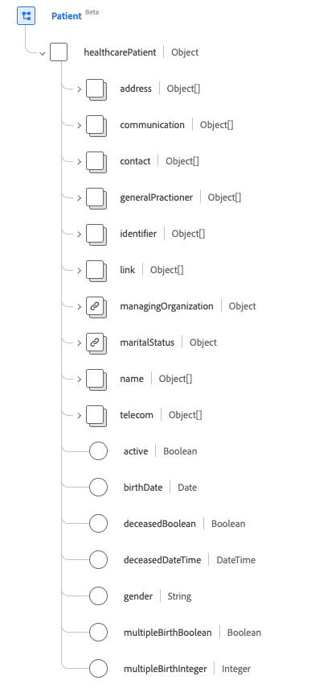

# [!UICONTROL &#x200B; 患者 &#x200B;] スキーマフィールドグループ

[!UICONTROL Patient] は、[[!DNL XDM Individual Profile] class](../../../classes/individual-profile.md) の標準スキーマフィールドグループです。 ケアやその他の健康関連サービスを受ける個人または動物の人口統計やその他の管理上の詳細をキャプチャする単一のオブジェクトタイプフィールド `healthcarePatient` を提供します。

| 表示名 | プロパティ | データタイプ | 説明 |
| --- | --- | --- | --- |
| [!UICONTROL アドレス] | `address` | [[!UICONTROL Address]](../data-types/address.md) の配列 | 患者の住所情報。 |
| [!UICONTROL &#x200B; 連絡 &#x200B;] | `communication` | オブジェクトの配列 | 患者の健康状態について患者とコミュニケーションをとるために使用される言語。 詳しくは、[ 以下の節 ](#communication) を参照してください。 |
| [!UICONTROL &#x200B; 患者との接触 &#x200B;] | `contact` | オブジェクトの配列 | 患者の連絡パーティ（後見人、パートナー、友人など）。 詳しくは、[ 以下の節 ](#contact) を参照してください。 |
| [!UICONTROL &#x200B; 一般開業医 &#x200B;] | `generalPractioner` | [[!UICONTROL &#x200B; 参照 &#x200B;]](../data-types/reference.md) の配列 | 患者の主治医。 |
| [!UICONTROL 識別子] | `identifier` | [[!UICONTROL &#x200B; 識別子 &#x200B;]](../data-types/identifier.md) の配列 | 患者の識別子。 |
| [!UICONTROL &#x200B; 患者リンクの詳細 &#x200B;] | `link` | オブジェクトの配列 | 同じ人物に関する患者または関係者のリソースへのリンク。 詳しくは、[ 以下の節 ](#link) を参照してください。 |
| [!UICONTROL &#x200B; 組織の管理 &#x200B;] | `managingOrganization` | [[!UICONTROL &#x200B; 参考 &#x200B;]](../data-types/reference.md) | 患者の記録の管理組織。 |
| [!UICONTROL &#x200B; 配偶者の有無 &#x200B;] | `maritalStatus` | [[!UICONTROL &#x200B; コード化可能な概念 &#x200B;]](../data-types/codeable-concept.md) | 患者の婚姻ステータス。 |
| [!UICONTROL 名前] | `name` | [[!UICONTROL &#x200B; 人名 &#x200B;]](../data-types/human-name.md) の配列 | 患者に関連付けられた名前。 |
| [!UICONTROL &#x200B; 連絡先詳細 &#x200B;] | `telecom` | [[!UICONTROL &#x200B; 連絡先 &#x200B;]](../data-types/contact-point.md) の配列 | 連絡先の詳細（電話番号やメールアドレスなど）。この情報を使用して患者に連絡を取ることができます。 |
| [!UICONTROL &#x200B; アクティブ &#x200B;] | `active` | ブール値 | 患者のレコードが有効に使用されているかどうかを示します。 |
| [!UICONTROL &#x200B; 生年月日 &#x200B;] | `birthDate` | 日付 | 患者の生年月日。 |
| [!UICONTROL &#x200B; 死亡インジケーター &#x200B;] | `deceasedBoolean` | ブール値 | 患者が死亡したかどうかを示します。 |
| [!UICONTROL &#x200B; 死亡日時 &#x200B;] | `deceasedDateTime` | 日時 | 患者の死亡日時。 |
| [!UICONTROL &#x200B; 性別 &#x200B;] | `gender` | 文字列 | 人物の性自認。 このプロパティの値は、次の既知の列挙値のいずれかに等しい必要があります。 <li> `female` </li> <li> `male` </li> <li> `other` </li> <li> `unknown`</li> |
| [!UICONTROL &#x200B; 多胎の一部である &#x200B;] | `multipleBirthBoolean` | ブール値 | 患者が多胎に含まれているかどうかを示します。 |
| [!UICONTROL &#x200B; 生年月日 &#x200B;] | `multipleBirthInteger` | 整数 | シーケンスの出生番号。 |

フィールドグループについて詳しくは、公開 XDM リポジトリを参照してください。

* [ 入力された例 ](https://github.com/adobe/xdm/blob/master/extensions/industry/healthcare/fhir/fieldgroups/patient.example.1.json)
* [ 完全なスキーマ ](https://github.com/adobe/xdm/blob/master/extensions/industry/healthcare/fhir/fieldgroups/patient.schema.json)

## `communication` {#communication}

`communication` はオブジェクトの配列として指定されます。 各オブジェクトの構造については、以下で説明します。

| 表示名 | プロパティ | データタイプ | 説明 |
| --- | --- | --- | --- |
| [!UICONTROL 言語] | `language` | [[!UICONTROL &#x200B; コード化可能な概念 &#x200B;]](../data-types/codeable-concept.md) | 健康状態について患者とコミュニケーションを取るために使用できる言語。 |
| [!UICONTROL &#x200B; 優先言語 &#x200B;] | `preferred` | ブール値 | 言語が優先言語かどうかを示します。 |

## `contact` {#contact}

`contact` はオブジェクトの配列として指定されます。 各オブジェクトの構造については、以下で説明します。

| 表示名 | プロパティ | データタイプ | 説明 |
| --- | --- | --- | --- |
| [!UICONTROL &#x200B; 連絡先 &#x200B;] | `address` | [[!UICONTROL アドレス]](../data-types/address.md) | 担当者の住所。 |
| [!UICONTROL &#x200B; 連絡先名 &#x200B;] | `name` | [[!UICONTROL &#x200B; 人間の名前 &#x200B;]](../data-types/human-name.md) | 連絡担当者の名前。 |
| [!UICONTROL &#x200B; 連絡先の組織 &#x200B;] | `organization` | [[!UICONTROL &#x200B; 参考 &#x200B;]](../data-types/reference.md) | 担当者に関連付けられている組織。 |
| [!UICONTROL &#x200B; 連絡期間 &#x200B;] | `period` | [[!UICONTROL &#x200B; 期間 &#x200B;]](../data-types/period.md) | 連絡先が使用中またはだった期間。 |
| [!UICONTROL &#x200B; 関係&#39;] | `relationship` | [[!UICONTROL &#x200B; コード化可能な概念 &#x200B;]](../data-types/codeable-concept.md) | 患者と連絡担当者の関係。 |
| [!UICONTROL &#x200B; 連絡先詳細 &#x200B;] | `telecom` | オブジェクトの配列 | 担当者の連絡先詳細。 詳しくは、[ 以下の節 ](#telecom) を参照してください。 |
| [!UICONTROL &#x200B; 性別 &#x200B;] | `gender` | 文字列 | 人物の性自認。 このプロパティの値は、次の既知の列挙値のいずれかに等しい必要があります。 <li> `female` </li> <li> `male` </li> <li> `other` </li> <li> `unknown`</li> |

### `telecom` {#telecom}

`telecom` はオブジェクトの配列として指定されます。 各オブジェクトの構造については、以下で説明します。

| 表示名 | プロパティ | データタイプ | 説明 |
| --- | --- | --- | --- |
| [!UICONTROL &#x200B; 連絡窓口 &#x200B;] | `contactPoint` | [[!UICONTROL &#x200B; 連絡窓口 &#x200B;]](../data-types/contact-point.md) | 人物の連絡先の詳細。 |

## `link` {#link}

`link` はオブジェクトの配列として指定されます。 各オブジェクトの構造については、以下で説明します。

| 表示名 | プロパティ | データタイプ | 説明 |
| --- | --- | --- | --- |
| [!UICONTROL その他] | `other` | [[!UICONTROL &#x200B; 参考 &#x200B;]](../data-types/reference.md) | 同じ人物に関する患者または関係者のリソースへのリンク。 |
| [!UICONTROL タイプ] | `type` | 文字列 | 2 つの患者リソース間のリンクのタイプ。 |
