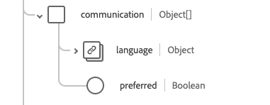

# [!UICONTROL &#x200B; 実務担当者 &#x200B;] スキーマフィールドグループ

[!UICONTROL Practioner] は、[[!DNL XDM Individual Profile] class](../../../classes/individual-profile.md) および [[!DNL Provider class]](../../../classes/provider.md) の標準スキーマフィールドグループです。 これは、ヘルスケアまたは関連サービスのプロビジョニングに直接または間接的に関与するユーザーに関する情報を含む、単一のオブジェクトタイプのフィールド `healthcarePractioner` ータを提供します。

| 表示名 | プロパティ | データタイプ | 説明 |
| --- | --- | --- | --- |
| [!UICONTROL アドレス] | `address` | [[!UICONTROL Address]](../data-types/address.md) の配列 | 勤務地を超える実務担当者の住所（自宅住所など）。 |
| [!UICONTROL &#x200B; 連絡 &#x200B;] | `communication` | オブジェクトの配列 | 実務担当者とのコミュニケーションに使用できる言語。 詳しくは、以下の [ 節 ](#communication) を参照してください |
| [!UICONTROL 識別子] | `identifier` | [[!UICONTROL &#x200B; 識別子 &#x200B;]](../data-types/identifier.md) の配列 | この役割のこの人物に適用される識別子。 |
| [!UICONTROL 名前] | `name` | [[!UICONTROL &#x200B; 人名 &#x200B;]](../data-types/human-name.md) の配列 | 実践者に関連付けられた名前。 |
| [!UICONTROL &#x200B; 資格 &#x200B;] | `qualification` | オブジェクトの配列 | 医療従事者によるケアの提供を承認または許可する公式の資格、認定、認定、トレーニング、ライセンス、またはそれに類似するもの。 詳しくは、[ 以下の節 ](#qualification) を参照してください。 |
| [!UICONTROL &#x200B; 連絡先詳細 &#x200B;] | `telecom` | [[!UICONTROL &#x200B; 連絡先 &#x200B;]](../data-types/contact-point.md) の配列 | 実務担当者の連絡先の詳細。 |
| [!UICONTROL &#x200B; アクティブ &#x200B;] | `active` | ブール値 | 実務担当者レコードが有効に使用されているかどうかを示します。 |
| [!UICONTROL &#x200B; 生年月日 &#x200B;] | `birthDate` | 日付 | 実務担当者の生年月日。 |
| [!UICONTROL &#x200B; 死亡インジケーター &#x200B;] | `deceasedBoolean` | ブール値 | 実務担当者が死亡したかどうかを示します。 |
| [!UICONTROL &#x200B; 死亡日時 &#x200B;] | `deceasedDateTime` | 日時 | 施術者が死亡した日時。 |
| [!UICONTROL &#x200B; 性別 &#x200B;] | `gender` | 文字列 | 人物の性自認。 このプロパティの値は、次の既知の列挙値のいずれかに等しい必要があります。 <li> `female` </li> <li> `male` </li> <li> `other` </li> <li> `unknown`</li> |

フィールドグループについて詳しくは、公開 XDM リポジトリを参照してください。

* [ 入力された例 ](https://github.com/adobe/xdm/blob/master/extensions/industry/healthcare/fhir/fieldgroups/practitioner.example.1.json)
* [ 完全なスキーマ ](https://github.com/adobe/xdm/blob/master/extensions/industry/healthcare/fhir/fieldgroups/practitioner.schema.json)

## `communication` {#communication}

`communication` はオブジェクトの配列として指定されます。 各オブジェクトの構造については、以下で説明します。

| 表示名 | プロパティ | データタイプ | 説明 |
| --- | --- | --- | --- |
| [!UICONTROL 言語] | `language` | [[!UICONTROL &#x200B; コード化可能な概念 &#x200B;]](../data-types/codeable-concept.md) | 健康状態について患者とコミュニケーションを取るために使用できる言語。 |
| [!UICONTROL &#x200B; 優先言語 &#x200B;] | `preferred` | ブール値 | 言語が優先言語かどうかを示します。 |

## `qualification` {#qualification}

`qualification` はオブジェクトの配列として指定されます。 各オブジェクトの構造については、以下で説明します。

| 表示名 | プロパティ | データタイプ | 説明 |
| --- | --- | --- | --- |
| [!UICONTROL コード] | `code` | [[!UICONTROL &#x200B; コード化可能な概念 &#x200B;]](../data-types/codeable-concept.md) | 選定のコード化表現。 |
| [!UICONTROL 識別子] | `identifier` | [[!UICONTROL &#x200B; 識別子 &#x200B;]](../data-types/identifier.md) の配列 | 選定の識別子。 |
| [!UICONTROL &#x200B; 発行者 &#x200B;] | `issuer` | [[!UICONTROL &#x200B; 参考 &#x200B;]](../data-types/reference.md) | 資格を規制および発行する組織。 |
| [!UICONTROL &#x200B; 期間 &#x200B;] | `period` | [[!UICONTROL &#x200B; 期間 &#x200B;]](../data-types/period.md) | 資格が有効な期間。 |
