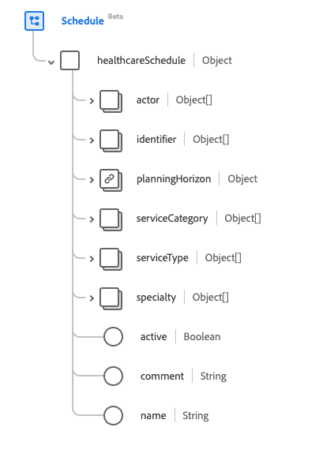

# [!UICONTROL &#x200B; スケジュール &#x200B;] スキーマフィールドグループ

[!UICONTROL &#x200B; スケジュール &#x200B;] は、[[!DNL XDM Individual Profile]  クラス &#x200B;](../../../classes/individual-profile.md) および [[!DNL Provider class]](../../../classes/provider.md) の標準スキーマフィールドグループです。 これは、予定を予約するのに利用できる時間枠のコンテナである、単一のオブジェクトタイプのフィールド `healthcareSchedule` を提供します。

| 表示名 | プロパティ | データタイプ | 説明 |
| --- | --- | --- | --- |
| [!UICONTROL &#x200B; アクター &#x200B;] | `actor` | [[!UICONTROL &#x200B; 参照 &#x200B;]](../data-types/reference.md) の配列 | このスケジュールを参照するスロットで、参照先のリソースの可用性の詳細が提供されます。 |
| [!UICONTROL 識別子] | `identifier` | [[!UICONTROL &#x200B; 識別子 &#x200B;]](../data-types/identifier.md) の配列 | スケジュールの外部識別子。 |
| [!UICONTROL &#x200B; 計画期間 &#x200B;] | `planningHorizon` | [[!UICONTROL &#x200B; 期間 &#x200B;]](../data-types/period.md) | このスケジュールを参照するスロットが存在しない場合でも、カバーする期間。 |
| [!UICONTROL &#x200B; サービス区分 &#x200B;] | `serviceCategory` | [[!UICONTROL &#x200B; コード化可能な概念 &#x200B;]](../data-types/codeable-concept.md) の配列 | 任用中に実行されるサービスの幅広いカテゴリ。 |
| [!UICONTROL &#x200B; サービスタイプ &#x200B;] | `serviceType` | [[!UICONTROL &#x200B; コード化可能な参照 &#x200B;]](../data-types/codeable-reference.md) の配列 | 予定中に実行される特定のサービス。 |
| [!UICONTROL &#x200B; 専門分野 &#x200B;] | `specialty` | [[!UICONTROL &#x200B; コード化可能な概念 &#x200B;]](../data-types/codeable-concept.md) の配列 | 予約で要求されたサービスを実行するために必要とされる実務担当者の専門分野。 |
| [!UICONTROL &#x200B; アクティブ &#x200B;] | `active` | ブール値 | スケジュール レコードが有効に使用されているかどうかを示します。 |
| [!UICONTROL &#x200B; コメント &#x200B;] | `comment` | 文字列 | スロットのカスタム制約など、拡張情報を記述する目的での可用性に関するコメント。 |
| [!UICONTROL 名前] | `name` | 文字列 | 検索中に消費者に表示されるスケジュールの説明。 |

フィールドグループについて詳しくは、公開 XDM リポジトリを参照してください。

* [&#x200B; 入力された例 &#x200B;](https://github.com/adobe/xdm/blob/master/extensions/industry/healthcare/fhir/fieldgroups/schedule.example.1.json)
* [&#x200B; 完全なスキーマ &#x200B;](https://github.com/adobe/xdm/blob/master/extensions/industry/healthcare/fhir/fieldgroups/schedule.schema.json)
