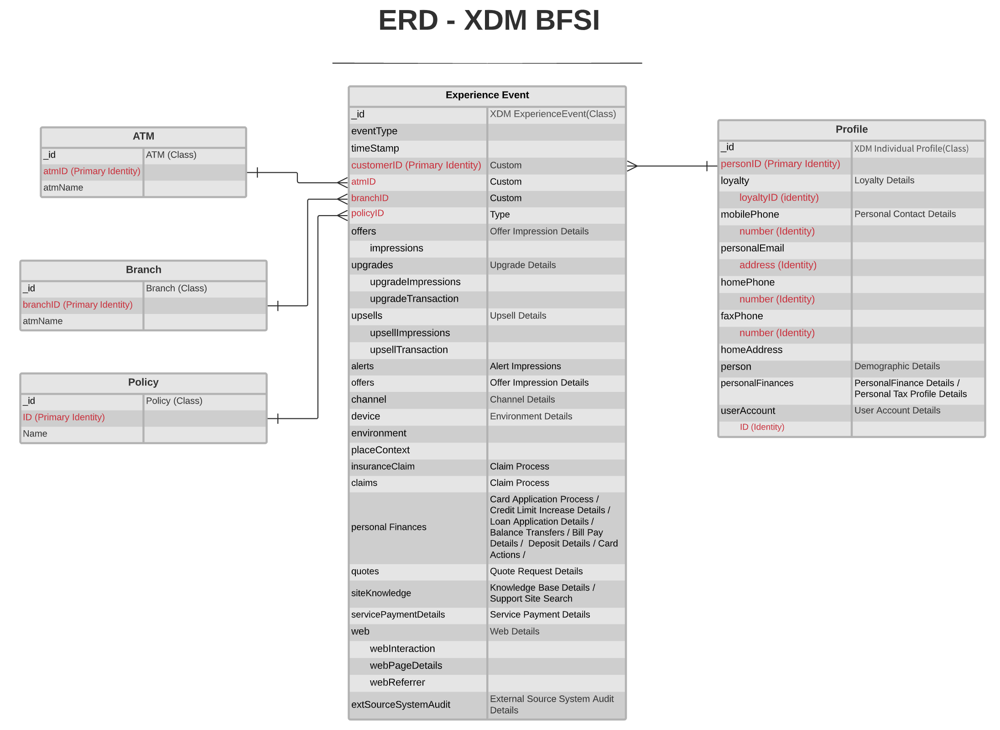

# [!UICONTROL 金融サ] ービス業界データモデル ERD

次の ERD（エンティティ関係図）は、銀行、金融サービス、保険 (BFSI) 業界の標準化されたデータモデルを表しています。 ERD は、データのAdobe Experience Platformへの格納方法を考慮して、意図的に非正規化方式で提示されています。

>[!NOTE]
>
>説明に従った ERD は、この業界の使用例でデータをモデル化する方法を推奨します。 Platform でこのデータモデルを使用するには、推奨されるスキーマとその関係を自分で作成する必要があります。 詳しくは、UI での [ スキーマ ](../../ui/resources/schemas.md) と [ 関係 ](../../tutorials/relationship-ui.md) の管理に関するガイドを参照してください。

次の凡例を使用して、この ERD を解釈します。

* に示す各エンティティは、基礎となる [ エクスペリエンスデータモデル (XDM) クラス ](../composition.md#class) に基づいています。
* 特定のエンティティの各行が **bold** でマークされている場合、フィールドグループまたはデータ型を表し、次のフィールドが太字で示されています。
* 特定のエンティティの最も重要なフィールドは、赤でハイライト表示されます。
* 個々の顧客の識別に使用できるすべてのプロパティは「ID」としてマークされ、これらのプロパティの 1 つが「プライマリ ID」としてマークされます。
* Cookie ベースのイベントは、多くの場合、トランザクションをおこなった個人や個人を特定できないので、エンティティの関係は非依存としてマークされます。

>[!NOTE]
>
>エクスペリエンスイベントエンティティには、XDM ExperienceEvent クラスが提供する一意の識別子 (`_id`) 属性を表す「_ID」フィールドが含まれます。 この値に何が予想されるかについて詳しくは、[XDM ExperienceEvent](../../classes/experienceevent.md) の参照ドキュメントを参照してください。