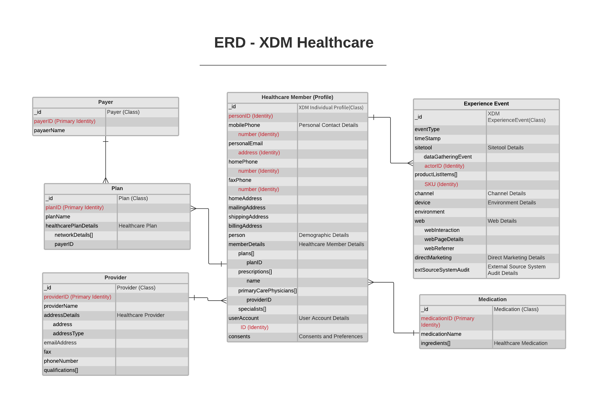

# [!UICONTROL Healthcare]業界データモデル ERD

次のエンティティ関係図（ERD）は、ヘルスケア業界向けの標準化されたデータモデルを表しています。 ERDは、Adobe Experience Platformでのデータの保存方法を考慮して、意図的に非正規化された方法で表示されます。

>[!NOTE]
>
>前述のERDは、この業界のユースケースのためにデータをモデル化する方法に関する推奨事項です。 Experience Platformでこのデータモデルを利用するには、推奨されるスキーマとその関係を自分で構築する必要があります。 詳しくは、UIの[ スキーマ ](../../ui/resources/schemas.md)および[関係](../../tutorials/relationship-ui.md)の管理に関するガイドを参照してください。

このERDを解釈するには、次の凡例を使用します。

* に表示される各エンティティは、基礎となる[Experience Data Model （XDM）クラス ](../composition.md#class)に基づいています。
* 親フィールドの下にインデントされたフィールドは、親のフィールドグループに属する子フィールドまたはサブフィールドを表します。
* 特定のエンティティの最も重要なフィールドが赤で強調表示されます。
* 個々の顧客を識別するために使用できるすべてのプロパティは「ID」としてマークされ、これらのプロパティの1つは「プライマリ ID」としてマークされます。
* Cookie ベースのイベントでは、多くの場合、トランザクションを実行した人物や個人を特定できないため、エンティティの関係は非依存としてマークされます。

>[!NOTE]
>
>各エンティティには、「_ID」フィールドが含まれます。このフィールドは、該当するレコードまたはイベントの一意の文字列識別子（`_id`）属性を表します。 このフィールドは、個々のレコードまたはイベントの一意性を追跡し、データの重複を防ぎ、そのデータをダウンストリームサービスで検索するために使用されます。 場合によっては、`_id` は、[ユニバーサル固有識別子（UUID）](https://tools.ietf.org/html/rfc4122) または [グローバル固有識別子（GUID）](https://docs.microsoft.com/ja-jp/dotnet/api/system.guid?view=net-5.0)とすることができます。  **このフィールドは、個人に関連する ID を表すものではなく**、データ記録そのものを表していることを見極めることが重要です。個人、イベント、またはビジネスエンティティに関連するID データは、代わりに、互換性のあるフィールドグループによって提供される[ID フィールド ](../composition.md#identity)にリレゲートする必要があります。

## [!UICONTROL Healthcare]件のユースケース

次の表に、ヘルスケアの一般的な使用例に推奨されるクラスとスキーマフィールドグループの概要を示します。

| ユースケース | 推奨されるクラスとフィールドグループ |
| --- | --- |
| 保険を求める消費者の間で、デジタル顧客獲得とデジタル体験を向上させる。 以下に例を示します。 <ul><li>一般的な情報（プラン、プラン名/階層、メディケイド、ウェルネスプログラムなど）が含まれるページにアクセスすると、プロモーションメールを送信したり、広告を含むサードパーティプラットフォームでターゲティングしたりするために、利用者の行動と求めているものを把握できます。</li><li>人々が心臓の健康やワクチン情報を検索した際に、心臓の健康に関するワクチン関連情報を送ってブランド認知度を高めたり、ワクチンのスケジュールを尋ねたりします。</li></ul> | <ul><li>**[[!UICONTROL XDM Individual Profile]](../../classes/individual-profile.md)**：<ul><li>[[!UICONTROL Healthcare Member Details]](../../field-groups/profile/healthcare-member-details.md)</li><li>`planID`属性と[!UICONTROL Plan] クラスを使用するスキーマの間に確立された関係フィールド。</li></ul></li><li>**[[!UICONTROL Payer]](../../classes/payer.md)**</li><li>**[[!UICONTROL Plan]](../../classes/plan.md)**：<ul><li>[[!UICONTROL Healthcare Plan Details]](../../field-groups/plan/healthcare-plan-details.md)</li></ul></li><li>**[[!UICONTROL XDM ExperienceEvent]](../../classes/experienceevent.md)**：<ul><li>[[!UICONTROL Application Details]](../../field-groups/event/application-details.md)</li><li>[[!UICONTROL Sitetool Details]](../../field-groups/event/sitetool-details.md)</li><li>[[!UICONTROL  Campaign Marketing Details]](../../field-groups/event/campaign-marketing-details.md)</li></ul></li></ul> |
| 過去のオンライン行動および医療データにもとづいてターゲットを絞った広告を通じて、患者のデジタル獲得を促進したい。 | <ul><li>**[[!UICONTROL XDM Individual Profile]](../../classes/individual-profile.md)**：<ul><li>[[!UICONTROL Healthcare Member Details]](../../field-groups/profile/healthcare-member-details.md)</li></ul></li><li>**[[!UICONTROL Provider]](../../classes/provider.md)**：<ul><li>[[!UICONTROL Healthcare Provider]](../../field-groups/provider/healthcare-provider.md)</li></ul></li><li>**[[!UICONTROL XDM ExperienceEvent]](../../classes/experienceevent.md)**：<ul><li>[[!UICONTROL Web Details]](../../field-groups/event/web-details.md)</li><li>[[!UICONTROL Advertising Details]](../../field-groups/event/advertising-details.md)</li></ul></li></ul> |
| 顧客が保険会社をどのように知ったかを把握するために、様々なチャネルを通じて保険のマーケティングを追跡することで、医療プランへの登録とアカウントの作成を改善します。 | <ul><li>**[[!UICONTROL XDM Individual Profile]](../../classes/individual-profile.md)**：<ul><li>[[!UICONTROL Healthcare Member Details]](../../field-groups/profile/healthcare-member-details.md)</li></ul></li><li>**[[!UICONTROL Payer]](../../classes/payer.md)**</li><li>**[[!UICONTROL Plan]](../../classes/plan.md)**：<ul><li>[[!UICONTROL Healthcare Plan Details]](../../field-groups/plan/healthcare-plan-details.md)</li></ul></li><li>**[[!UICONTROL XDM ExperienceEvent]](../../classes/experienceevent.md)**：<ul><li>[[!UICONTROL Web Details]](../../field-groups/event/web-details.md)</li><li>[[!UICONTROL Advertising Details]](../../field-groups/event/advertising-details.md)</li></ul></li></ul> |
| 医療保険の適用の逸脱を避ける。 | <ul><li>**[[!UICONTROL XDM Individual Profile]](../../classes/individual-profile.md)**：<ul><li>[[!UICONTROL Healthcare Member Details]](../../field-groups/profile/healthcare-member-details.md)</li></ul></li><li>**[[!UICONTROL Plan]](../../classes/plan.md)**：<ul><li>[[!UICONTROL Healthcare Plan Details]](../../field-groups/plan/healthcare-plan-details.md)</li></ul></li></ul> |
| DTC （Direct-to-Customer）広告を使用して、医療提供者に医薬品情報をプロモーションする。 | <ul><li>**[[!UICONTROL XDM Individual Profile]](../../classes/individual-profile.md)**：<ul><li>[[!UICONTROL Healthcare Member Details]](../../field-groups/profile/healthcare-member-details.md)</li></ul></li><li>**[[!UICONTROL Medication]](../../classes/medication.md)**：<ul><li>[[!UICONTROL Healthcare medication]](../../field-groups/medication/healthcare-medication.md)</li></ul></li><li>**[[!UICONTROL XDM ExperienceEvent]](../../classes/experienceevent.md)**：<ul><li>[[!UICONTROL Web Details]](../../field-groups/event/web-details.md)</li><li>[[!UICONTROL Advertising Details]](../../field-groups/event/advertising-details.md)</li></ul></li></ul> |

