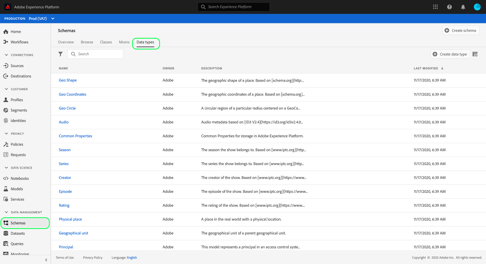
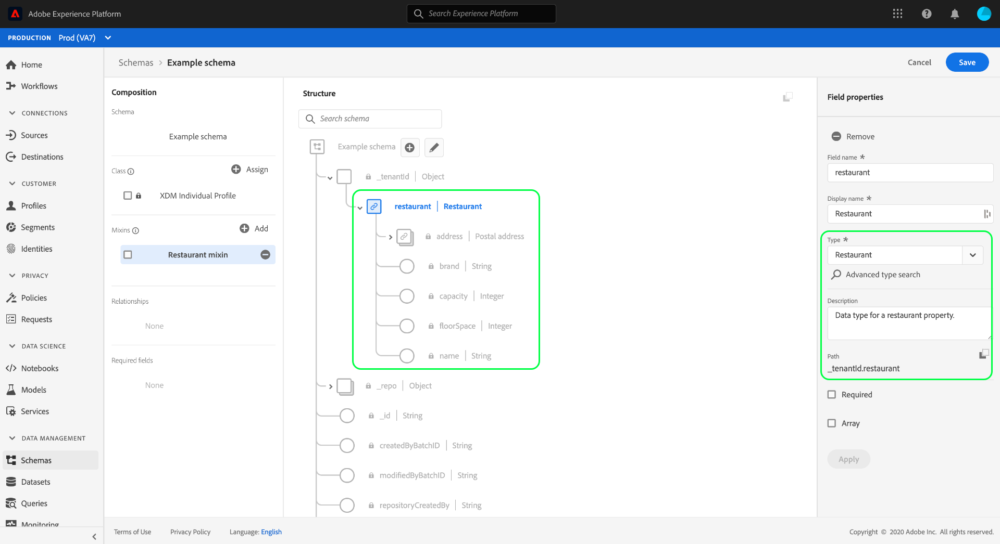

# Experience PlatformUIを使用したデータタイプの作成と編集

Experience Data Model(XDM)では、データ型は、基本的なリテラルフィールドと同様に、クラスまたはミックスインで参照型フィールドとして使用されます。重要な違いは、データ型で複数のサブフィールドを定義できる点です。 マルチフィールド構造の一貫した使用を可能にするというミックスインと同様ですが、ミックスインはルートレベルでのみ追加できるのに対し、スキーマ構造のどこにでも含めることができるので、データ型の柔軟性が向上します。

Adobe Experience Platformでは、様々な一般的なエクスペリエンス管理の使用例を扱うために使用できる多くの標準データ型が用意されています。 ただし、独自のビジネスニーズに対応するために、独自のカスタムデータタイプを定義することもできます。

このチュートリアルでは、プラットフォームユーザーインターフェイスでカスタムデータタイプを作成および編集する手順について説明します。

## 前提条件

このチュートリアルでは、XDMシステムに関する十分な理解が必要です。 Experience Platformエコシステム内でのXDMの役割については、 [XDMの概要](../home.md) 、およびXDMスキーマにデータタイプがどのように貢献するかについては、スキーマ構成の [基本を参照してください](../schema/composition.md) 。

このチュートリアルでは必須ではありませんが、の様々な機能に慣れるために、UIでのスキーマの [構成に関するチュートリアルに従うことをお勧め](./create-schema-ui.md)[!DNL Schema Editor]します。

## データ型 [!DNL Schema Editor] 用にを開く

Platform UIで、左側のナビゲーションで **[!UICONTROL スキーマ]** を選択して [!UICONTROL スキーマ] ・ワークスペースを開き、「 **[!UICONTROL Data types]** （データ・タイプ）」タブを選択します。 Adobeが定義するデータタイプや組織が作成するデータタイプなど、利用可能なデータタイプのリストが表示されます。

ここから、2つのオプションを選択できます。

* [新しいデータ型の作成](#create)
* [編集する既存のデータ型の選択](#edit)

### Create a new data type {#create}

「 **[!UICONTROL Data types]** 」タブで、「 **[!UICONTROL Create data type]**」を選択します。

キャンバスに新しいデータ型の現在の構造が [!DNL Schema Editor] 表示されます。 エディターの右側で、データタイプの表示名とオプションの説明を指定できます。 データタイプをスキーマに追加する際に識別されるのと同じように、データタイプに一意で簡潔な名前を指定してください。

このチュートリアルでは、レストランのプロパティを説明するデータ型を作成するので、データ型には「Restaran」という表示名が付けられます。

データ型へのフィールドの追加については、 [次の開始の節](#add-fields) に進みます。

### 既存のデータタイプの編集

編集できるのは、組織で定義されたカスタムデータタイプのみです。 表示されるリストを絞り込むには、フィルターアイコン()を選択して、 [!UICONTROL 所有者に基づくフィルタリングのコントロールを表示します]。 「 **[!UICONTROL 顧客]** 」を選択すると、組織が所有するカスタムデータタイプのみが表示されます。

リストから編集するデータタイプを選択し、右側のパネルを開き、データタイプの詳細を表示します。 右側のレールでデータタイプの名前を選択し、で構造を開き [!DNL Schema Editor]ます。

## データ型追加のフィールド {#add-fields}

データ型へのフィールドの追加を開始するには、キャンバスのルートレベルフィールドの横にある **プラス(+)** アイコンを選択します。 下に新しいフィールドが表示され、右側のパネルが更新されて、新しいフィールドのコントロールが表示されます。

右側のパネルのコントロールを使用して、 **[!UICONTROL フィールド名]**、 **[!UICONTROL 表示名]**、 **** 種類を入力します。 フィールドの型は、基本的なスカラー型（文字列、整数、ブール値など）の場合も、Adobeまたは組織で定義される別のマルチフィールドデータ型を表す場合もあります。

Restaurantデータ型では、レストランの名前を表す文字列フィールドが必要です。 したがって、 [!UICONTROL フィールド名] は「name」、 [!UICONTROL 種類] は「 [!UICONTROL String]」に設定されます。 「 **[!UICONTROL Apply]** 」を選択して、変更をフィールドに適用します。

フィールドを追加する場合と同じ手順に従い、まずルートレベルフィールドの横にある **プラス(+)** アイコンを選択し、右側のパネルに設定の詳細を入力します。

Restaurantのデータタイプに、ブランド、座席数、床面積のフィールドが追加されました。

基本フィールドに加えて、カスタムデータ型内に追加のデータ型をネストすることもできます。 例えば、Restaurantデータ型には、プロパティの住所を表すフィールドが必要です。 このシナリオでは、標準のデータタイプ「[!UICONTROL 住所]」が割り当てられた新しい「住所」フィールドを追加できます。

データを記述する際の柔軟性について次に示します。データ型では、データ型でもあるフィールドを使用できます。フィールド自体には、さらに別のデータ型を含めることができます。 これにより、XDMスキーマ全体で共通のデータパターンを抽象化して再利用でき、複雑なデータ構造をより簡単に表現できます。

データ型へのフィールドの追加が完了したら、「 **[!UICONTROL 保存]** 」を選択して変更を保存し、データ型をに追加し [!DNL Schema Library]ます。

## mixin追加へのデータ型

作成したデータ型は、スキーマで開始して使用できます。 XDMスキーマはクラスと0個以上のミックスインで構成されているので、データ型で提供されるフィールドをスキーマに直接追加することはできません。 代わりに、クラスまたはMixinに含める必要があります。

>[!NOTE]
>
>この節では、カスタムデータ型の最も一般的なパターンなので、mixinにデータ型を追加する方法について説明します。 ただし、同じ手順を適用して、代わりにクラスにデータ型を追加することもできます。

このデータ型を既存のmixinに追加するか、新しいmixin全体を作成することができます。 どちらの場合も、新しいデータ型の追加先のスキーマ [!DNL Schema Editor] のを開く必要があります。その場合は、「 **[!UICONTROL 参照]** 」タブから既存のスキーマを選択するか、完全に新しいスキーマを作成する必要があります。

でスキーマを開いたら、左側のレールでデータタイプを追加するミックスインを選択 [!DNL Schema Editor]します。 スキーマに適切なミックスインがない場合は、手順に従って新しいミックスインを [作成し](./create-schema-ui.md#define-mixin) 、代わりにスキーマに追加します。左側のレールでmixinが選択されていることを確認します。

スキーマ名の横にある **プラス(+)** アイコンを選択して、選択したミックスインに新しいフィールドを追加します。 フィールドの **[!UICONTROL Type]** プロパティを選択すると、前に作成したデータタイプの名前がドロップダウンリストで使用できるようになります。 データ型の名前を開始で入力すると、見つけやすくなります。

リストからデータタイプを選択し、「 **[!UICONTROL 適用]**」を選択します。 キャンバスのスキーマフィールドが更新され、データタイプによって提供される構造化されたサブフィールドが表示されます。 「 **[!UICONTROL 保存]**」を選択してスキーマを保存する場合は、Mixinも保存され、同じクラスに属する別のスキーマでMixinを再利用できます。

>[!NOTE]
>
>ミックスインは1つのクラスとのみ互換性があります。 異なるクラスに基づく追加のスキーマでデータ型を使用する場合は、上記の手順に従って、これらのクラスを拡張するための追加のミックスインにデータ型を追加する必要があります。

## 次の手順

このチュートリアルでは、データ型の作成および編集方法、およびを使用してミックスインにデータ型を追加する方法について説明し [!DNL Schema Editor]ました。 複数フィールドオブジェクトをデータ型に変換する方法など、UIでのデータ型の操作について詳しくは、 [スキーマ作成のチュートリアルを参照してください](./create-schema-ui.md#datatype)。

スキーマレジストリAPIを使用してデータ型を作成する方法については、『 [データ型エンドポイントガイド](../api/data-types.md#create)』を参照してください。