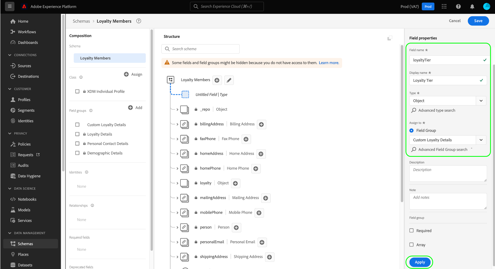

# [!DNL Schema Editor] を使用したスキーマの作成

Adobe Experience Platform ユーザーインターフェイスを使用すると、[!DNL Schema Editor] と呼ばれるインタラクティブなビジュアルキャンバスで [!DNL Experience Data Model]（XDM）スキーマを作成および管理できます。このチュートリアルでは、[!DNL Schema Editor] を使用してスキーマを作成する方法について説明します。

デモンストレーションを目的として、このチュートリアルの手順には、顧客ロイヤルティプログラムのメンバーを記述するサンプルスキーマの作成が含まれています。これらの手順を使用して、異なるスキーマを独自の用途で作成できますが、まずは、サンプルスキーマの作成方法を追って [!DNL Schema Editor] の機能を理解することをお勧めします。

>[!NOTE]
>
>CSV データを Platform に取り込む場合は、[そのデータを、AI 生成のレコメンデーションツール（現在はベータ版）で作成された XDM スキーマにマッピング](../../ingestion/tutorials/map-csv/recommendations.md)できます。その際、スキーマを手動で作成する必要はありません。
>
>[!DNL Schema Registry] API を使用してスキーマを作成する場合は、まず[[!DNL Schema Registry] 開発者ガイド](../api/getting-started.md)を参照してから、[API を使用したスキーマの作成](create-schema-api.md)に関するチュートリアルを試してください。

## はじめに

このチュートリアルを実行するには、スキーマの作成に関する Adobe Experience Platform の様々な側面を実践的に理解している必要があります。このチュートリアルを始める前に、次の概念に関するドキュメントを確認してください。

* [[!DNL Experience Data Model (XDM)]](../home.md)：[!DNL Platform] が、カスタマーエクスペリエンスデータを整理する際に使用する、標準化されたフレームワーク。
   * [スキーマ作成の基本](../schema/composition.md)：クラス、スキーマフィールドグループ、データタイプ、個々のフィールドなど、XDM スキーマとその構成要素の概要。
* [[!DNL Real-Time Customer Profile]](../../profile/home.md)：複数のソースから集計したデータに基づいて、統合されたリアルタイム顧客プロファイルを提供します。

## [!UICONTROL スキーマ]ワークスペースを開く {#browse}

[!DNL Platform] UI の[!UICONTROL スキーマ]ワークスペースでは、[!DNL Schema Library] のビジュアライゼーションが提供されるので、組織で使用可能なスキーマを表示および管理することができます。ワークスペースには [!DNL Schema Editor] も含まれています。これは、このチュートリアル全体を通してスキーマを作成できるキャンバスです。

[!DNL Experience Platform] にログインした後、左側のナビゲーションで「**[!UICONTROL スキーマ]**」を選択して、**[!UICONTROL スキーマ]**&#x200B;ワークスペースを開きます。「**[!UICONTROL 参照]**」タブには、表示およびカスタマイズできるスキーマのリスト（[!DNL Schema Library] の表現）が表示されます。このリストには、スキーマの基になる名前、タイプ、クラスおよび動作（レコードまたは時系列）のほか、スキーマが最後に変更された日時が含まれます。

詳しくは、[UI での既存の XDM リソースの調査](../ui/explore.md)に関するガイドを参照してください。

## スキーマの作成と命名 {#create}

スキーマの作成を開始するには、**[!UICONTROL スキーマ]**&#x200B;ワークスペースの右上隅にある「**[!UICONTROL スキーマを作成]**」を選択します。ドロップダウンメニューが表示され、コアクラスである [!UICONTROL XDM 個人プロファイル]と [!UICONTROL XDM ExperienceEvent] のいずれかを選択できます。これらのクラスが目的に合わない場合は、「**[!UICONTROL 参照]**」を選択して、使用可能な他のクラスから選択するか、[新しいクラスを作成](#create-new-class)することもできます。

このチュートリアルでは、「**[!UICONTROL XDM 個人プロファイル]**」を選択します。

[!DNL Schema Editor] が表示されます。これは、スキーマを作成するキャンバスです。エディターを開くと、そのクラスに基づくすべてのスキーマに含まれている標準フィールドと共に、名称未設定のスキーマがキャンバスの「**[!UICONTROL 構造]**」セクションに自動的に作成されます。スキーマに割り当てられたクラスは、「**[!UICONTROL 構成]**」セクションの「**[!UICONTROL クラス]**」にもリストされています。

>[!NOTE]
>
>スキーマが保存される前の初期構成プロセスにおける任意の時点で[スキーマのクラスを変更](#change-class)できますが、その場合は細心の注意を払って行ってください。フィールドグループは特定のクラスにのみ適合するので、クラスを変更すると、キャンバスと追加したフィールドがリセットされます。

「**[!UICONTROL スキーマのプロパティ]**」で、スキーマの表示名と説明（オプション）を入力します。名前を入力すると、キャンバスが更新されて、スキーマの新しい名前が反映されます。

スキーマの名前を決定する際に考慮すべき重要な点がいくつかあります。

* 後でスキーマを簡単に見つけられるように、スキーマ名は短くわかりやすい名前にしてください。
* スキーマ名は一意である必要があります。つまり、将来再利用されないように十分に具体的でなければなりません。例えば、組織が異なるブランドに対して別々のロイヤルティプログラムを持つ場合、後で定義する他のロイヤルティ関連スキーマと区別しやすいように、スキーマに「ブランド A ロイヤルティメンバー」という名前を付けると効果的です。
* また、スキーマの説明を使用して、スキーマに関する追加のコンテキスト情報を提供することもできます。

このチュートリアルでは、ロイヤルティプログラムのメンバーに関連するデータを取り込むスキーマを作成するので、スキーマの名前は「[!DNL Loyalty Members]」とします。

## フィールドグループの追加 {#field-group}

これで、フィールドグループを追加して、スキーマへのフィールドの追加を開始できます。フィールドグループは、特定の概念を記述するために一緒に使用されることが多い 1 つ以上のフィールドから成るグループです。このチュートリアルでは、フィールドグループを使用してロイヤルティプログラムのメンバーを記述し、氏名、生年月日、電話番号、住所などの重要な情報を取り込みます。

フィールドグループを追加するには、「**[!UICONTROL フィールドグループ]**」サブセクションで「**[!UICONTROL 追加]**」を選択します。

新しいダイアログが表示され、使用可能なフィールドグループのリストが表示されます。各フィールドグループは特定のクラスでのみ使用できるものなので、ダイアログには、選択したクラス（この場合は、[!DNL XDM Individual Profile] クラス）に適合するフィールドグループのみがリストされます。標準の XDM クラスを使用している場合、フィールドグループのリストは使用頻度に基づいてインテリジェントに並べ替えられます。

左側のパネルでフィルターの 1 つを選択して、標準フィールドグループのリストを特定の[業種](../schema/industries/overview.md)（小売、金融機関、ヘルスケアなど）に絞り込むことができます。

リストからフィールドグループを選択すると、右側のパネルに表示されます。必要に応じて複数のフィールドグループを選択し、各グループを右側のレールのリストに追加してから確認することができます。また、現在選択されているフィールドグループの右側にアイコンが表示され、提供されるフィールドの構造をプレビューできます。

フィールドグループをプレビューする際に、右側のパネルに、フィールドグループのスキーマに関する詳細な説明が表示されます。また、提供されたキャンバスでフィールドグループのフィールド間を移動することもできます。別のフィールドを選択すると、右側のパネルが更新され、該当するフィールドの詳細が表示されます。プレビューが完了したら「**[!UICONTROL 戻る]**」を選択して、フィールドグループ選択ダイアログに戻ります。

このチュートリアルでは、「**[!UICONTROL デモグラフィックの詳細]**」フィールドグループを選択し、次に「**[!UICONTROL フィールドグループを追加]**」をクリックします。

スキーマキャンバスが再び表示されます。「**[!UICONTROL フィールドグループ]**」セクションには[!UICONTROL デモグラフィックの詳細]がリストされ、「**[!UICONTROL 構造]**」セクションにはフィールドグループによって提供されたフィールドが含まれます。「**[!UICONTROL フィールドグループ]**」セクションでフィールドグループの名前を選択して、キャンバス内で提供される特定のフィールドをハイライト表示できます。

このフィールドグループでは、データタイプが「[!UICONTROL ユーザー]」の最上位の名前 `person` の下にいくつかのフィールドが提供されます。このフィールドグループは、名前、生年月日、性別など、個人に関する情報を説明します。

>[!NOTE]
>
>フィールドでは、スカラータイプ（文字列、整数、配列、日付など）のほかに、[!DNL Schema Registry] 内で定義されている任意のデータタイプ（一般的な概念を表すフィールドのグループ）も使用できることを覚えておいてください。

`name` フィールドのデータタイプは「[!UICONTROL フルネーム]」であることに注意してください。これは一般的な概念を表しており、名、姓、敬称、接尾辞など、名前に関連するサブフィールドを含みます。

キャンバス内の様々なフィールドをクリックすると、それらがスキーマ構造に寄与する追加のフィールドが表示されます。

## さらなるフィールドグループの追加 {#field-group-2}

これで、同じ手順を繰り返して、別のフィールドグループを追加できるようになりました。この段階で&#x200B;**[!UICONTROL フィールドグループを追加]**&#x200B;ダイアログを表示しても、「[!UICONTROL デモグラフィックの詳細]」フィールドグループがグレー表示されており、その横のチェックボックスを選択できないことに注意してください。これにより、現在のスキーマに既に含まれているフィールドグループが誤って複製されるのを防止できます。

このチュートリアルでは、標準フィールドグループである&#x200B;**[!UICONTROL 個人の連絡先の詳細]**&#x200B;と&#x200B;**[!UICONTROL ロイヤルティの詳細]**&#x200B;をリストから選択したあと、「**[!UICONTROL フィールドグループを追加]**」を選択してこれらのフィールドグループをスキーマに追加します。

キャンバスが再び表示され、追加したフィールドグループが「**[!UICONTROL 構成]**」セクションの「**[!UICONTROL フィールドグループ]**」にリストされます。また、スキーマ構造に追加されたそれらの複合フィールドも表示されます。

## カスタムフィールドグループの定義 {#define-field-group}

[!UICONTROL ロイヤルティメンバー]スキーマは、ロイヤルティプログラムのメンバーに関連するデータを取り込むためのもので、スキーマに追加した標準の[!UICONTROL ロイヤルティの詳細]フィールドグループは、プログラムタイプ、ポイント、加入日など、これらのほとんどを提供します。

ただし、場合によっては、ユースケースを達成するために、標準フィールドグループでカバーされない追加のカスタムフィールドを含める必要がある状況も考えられます。 カスタムロイヤルティフィールドを追加する場合は、次の 2 つの選択肢があります。

1. 新しいカスタムフィールドグループを作成して、これらのフィールドを取り込みます。 この方法については、このチュートリアルで説明します。
1. 標準の[!UICONTROL ロイヤルティの詳細]フィールドグループを拡張して、カスタムフィールドを追加します。 この場合、[!UICONTROL ロイヤルティの詳細]はカスタムフィールドグループに変換され、元の標準フィールドグループは使用できなくなります。 [標準フィールドグループの構造にカスタムフィールドを追加する](../ui/resources/schemas.md#custom-fields-for-standard-groups)方法について詳しくは、[!UICONTROL スキーマ] UI ガイドを参照してください。

新しいフィールドグループを作成するには、前と同様に「**[!UICONTROL フィールドグループ]**」サブセクションの「**[!UICONTROL 追加]**」を選択しますが、今回は、表示されるダイアログの上部付近の「**[!UICONTROL 新しいフィールドグループを作成]**」を選択します。次に、新しいフィールドグループの表示名と説明を入力するように求められます。 このチュートリアルでは、新しいフィールドグループに「[!DNL Custom Loyalty Details]」という名前を付けたうえで、「**[!UICONTROL フィールドグループを追加]**」を選択します。

>[!NOTE]
>
>クラス名の場合と同様に、フィールドグループ名は簡潔かつシンプルで、フィールドグループがスキーマにどのように寄与するかがよくわかるものにしてください。これらも一意なので、名前を再利用できません。名前が十分に具体的なものになるようにしてください。

これで、キャンバスの左側にある「**[!UICONTROL フィールドグループ]**」に「[!DNL Custom Loyalty Details]」が表示されますが、まだフィールドは関連付けられていないので、「**[!UICONTROL 構造]**」には新しいフィールドは表示されません。

## フィールドグループにフィールドを追加します。 {#field-group-fields}

これで「[!DNL Custom Loyalty Details]」フィールドグループを作成したので、このフィールドグループがスキーマに提供するフィールドをようやく定義できます。

まず、キャンバスでスキーマ名の横にある&#x200B;**プラス（＋）**&#x200B;アイコンを選択します。

「[!UICONTROL 名称未設定フィールド]」プレースホルダーがキャンバスに表示されます。また、右側のパネルが更新されて、このフィールドの設定オプションが表示されます。

このシナリオでは、スキーマには、人物の現在のロイヤルティ層の詳細を記述するオブジェクトタイプのフィールドが必要です。 右側のパネルのコントロールを使用して、関連フィールドを保持するのに使用される「[!UICONTROL オブジェクト]」タイプの `loyaltyTier` フィールドの作成を開始します。

「**[!UICONTROL 割り当て先]**」で、フィールドの割り当て先となるフィールドグループを選択する必要があります。 すべてのスキーマフィールドはクラスかフィールドグループのどちらかに属していますが、このスキーマは標準クラスを使用しているので、フィールドグループの選択のみ可能です。 「[!DNL Custom Loyalty Details]」という名前を入力し始めると、該当するフィールドグループがリストに表示されるので、それを選択します。

完了したら、「**[!UICONTROL 適用]**」を選択します。

変更内容が適用され、新しく作成された `loyaltyTier` オブジェクトが表示されます。これはカスタムフィールドなので、組織のテナント ID を名前空間とするオブジェクト内に自動的にネストされ、先頭にアンダースコアが付きます（この例では `_tenantId`）。

>[!NOTE]
>
>テナント ID オブジェクトの存在は、追加しようとしているフィールドが組織の名前空間に含まれていることを示しています。
>
>つまり、追加しようとしているフィールドは組織に固有のもので、組織のみがアクセスできる特定の領域にある [!DNL Schema Registry] に保存されることになります。他の標準クラス、フィールドグループ、データタイプおよびフィールドの名前との競合を防ぐために、定義するフィールドは、必ずテナント名前空間に追加する必要があります。

`loyaltyTier` オブジェクトの横にある&#x200B;**プラス（＋）**&#x200B;アイコンを選択して、サブフィールドの追加を開始します。新規フィールドプレースホルダーが表示され、「**[!UICONTROL フィールドプロパティ]**」セクションがキャンバスの右側に表示されます。

各フィールドには、次の情報が必要です。

* **[!UICONTROL フィールド名]：**&#x200B;フィールドの名前（なるべくキャメルケースで記述）。スペース文字は使用できません。 これは、コード内および他のダウンストリームアプリケーションでフィールドを参照するために使用される名前です。
   * 例：loyaltyLevel
* **[!UICONTROL 表示名]：**&#x200B;単語の先頭のみ大文字で書かれたフィールド名。これは、スキーマの表示または編集時にキャンバスに表示される名前です。
   * 例：Loyalty Level
* **[!UICONTROL 型]：**&#x200B;フィールドのデータタイプ。これには、基本的なスカラータイプと、[!DNL Schema Registry] に定義されている任意のデータタイプが含まれます。例：[!UICONTROL 文字列]、[!UICONTROL 整数]、[!UICONTROL ブーリアン]、[!UICONTROL 人物]、[!UICONTROL 住所]、[!UICONTROL 電話番号]など
* **[!UICONTROL 説明]：**&#x200B;フィールドの説明（オプション）は、200 文字以内で指定してください。

`loyaltyTier` オブジェクトの最初のフィールドは、`id` という文字列になります。これは、ロイヤルティメンバーの現在の階層の ID を表します。 この会社では、様々な要因に基づいて顧客ごとに異なるロイヤルティ層ポイントしきい値を設定しているので、階層 ID はロイヤルティメンバーごとに一意になります。 新しいフィールドのタイプを「[!UICONTROL 文字列]」に設定すると、デフォルト値、形式、最大長など、制約を適用するためのオプションが&#x200B;**[!UICONTROL フィールドプロパティ]**&#x200B;セクションに自動的に入力されます。

`id` はランダムに生成されるフリーフォーム文字列なので、それ以上の制約は必要ありません。「**[!UICONTROL 適用]**」を選択して変更を適用します。

## フィールドグループにさらにフィールドを追加します。 {#field-group-fields-2}

`id` フィールドを追加したら、次のようなロイヤルティ層の情報を取り込むためのその他のフィールドを追加できます。

* 現在のポイントしきい値（整数）：メンバーが現在の階層に留まるために維持する必要があるロイヤルティポイントの最小数。
* 次の階層ポイントのしきい値（整数）：メンバーが次の階層に進むために獲得しなければならないロイヤルティポイントの数。
* 発効日（日時）：ロイヤルティメンバーがこの階層に参加した日付。

各フィールドをスキーマに追加するには、`loyalty` オブジェクトの横にある&#x200B;**プラス（+）** アイコンを選択し、必要な情報を入力します。

完了すると、`loyaltyTier` オブジェクトには `id`、`currentThreshold`、`nextThreshold`、および `effectiveDate` のフィールドが含まれます。

## フィールドグループへの列挙フィールドの追加 {#enum}

[!DNL Schema Editor] でフィールドを定義する場合、フィールドに含めることができるデータにさらに制約を加えるために、基本的なフィールドタイプに適用できるいくつかの追加オプションがあります。これらの制約のユースケースを次の表で説明します。

| 制約 | 説明 |
| --- | --- |
| [!UICONTROL 必須] | データの取得にフィールドが必須であることを示します。このフィールドを含まないデータセットに基づいてスキーマセットにアップロードされたデータの取得は失敗します。 |
| [!UICONTROL 配列] | フィールドに値の配列が含まれ、各値は指定されたデータタイプを持つことを示します。例えば、データタイプが「[!UICONTROL 文字列]」のフィールドでこの制約を使用すると、フィールドに文字列の配列を含めることを指定します。 |
| [!UICONTROL 列挙と推奨値] | このフィールドに、可能な値の列挙リストの値の 1 つを含める必要があることを示します。または、このオプションを使用して、フィールドをそれらの値に制限することなく、文字列フィールドの推奨値のリストを提供することもできます。 |
| [!UICONTROL ID] | このフィールドが ID フィールドであることを示します。ID フィールドの詳細については、[このチュートリアルの後半](#identity-field)で説明します。 |
| [!UICONTROL 関係] | スキーマの関係は、結合スキーマと [!DNL Real-Time Customer Profile] を使用して推論できますが、同じクラスを共有するスキーマにのみ適用されます。 [!UICONTROL 関係]制約とは、このフィールドが、異なるクラスに基づいてスキーマのプライマリ ID を参照し、2 つのスキーマ間の関係を意味することを示します。 詳しくは、[関係の定義](./relationship-ui.md)に関するチュートリアルを参照してください。 |

{style="table-layout:auto"}

>[!NOTE]
>
>必須フィールド、IDフィールド、関係フィールドは、左側のパネルの各セクションに表示され、スキーマの複雑さに関係なく、これらのフィールドを簡単に見つけることができます。

このチュートリアルでは、スキーマ内の `loyaltyTier` オブジェクトには、階層クラスを記述する新しい列挙型フィールドが必要です。値は 4 つのオプションのうちいずれかになります。このフィールドをスキーマに追加するには、`loyaltyTier` オブジェクトの横にある&#x200B;**プラス (+)** アイコンを選択し、**[!UICONTROL フィールド名]**&#x200B;および&#x200B;**[!UICONTROL 表示名]**&#x200B;の必須フィールドに入力します。**[!UICONTROL タイプ]**&#x200B;の場合、「[!UICONTROL 文字列]」を選択します。

タイプを選択すると、フィールドに対して追加のチェックボックスが表示されます。これには、**[!UICONTROL 配列]**、**[!UICONTROL 列挙と推奨値]**、**[!UICONTROL ID]**、および&#x200B;**[!UICONTROL 関係]**&#x200B;のチェックボックスが含まれます。

**[!UICONTROL 列挙と推奨値]**&#x200B;チェックボックスをオンにして、「**[!UICONTROL 列挙]**」を選択します。 ここで、許容可能な各ロイヤルティ階層クラスの&#x200B;**[!UICONTROL 値]**（キャメルケース）と&#x200B;**[!UICONTROL 表示名]**（オプション。単語の先頭のみ大文字で書かれた読みやすい名前）を入力できます。

すべてのフィールドプロパティの入力が完了したら、「**[!UICONTROL 適用]**」を選択し、`tierClass` フィールドから `loyaltyTier` オブジェクトに追加します。

## 複数フィールドオブジェクトのデータ型への変換 {#datatype}

`loyaltyTier` オブジェクトには複数のフィールドが含まれ、他のスキーマで役立つ共通のデータ構造を表すようになりました。 [!DNL Schema Editor] を使用すると、再利用可能な複数フィールドオブジェクトを簡単に適用できます。そのためには、これらのオブジェクトの構造をデータタイプに変換します。

データタイプを使用すると、複数フィールド構造を一貫して使用でき、フィールドグループよりも柔軟性が高まります。これは、データタイプがスキーマ内のどこでも使用できるからです。これを行うには、フィールドの&#x200B;**[!UICONTROL タイプ]**&#x200B;の値を、[!DNL Schema Registry] で定義された任意のデータタイプの値に設定します。

`loyaltyTier` オブジェクトをデータタイプに変換するには、キャンバスで `loyaltyTier` フィールドを選択し、エディターの右側にある「**[!UICONTROL フィールドプロパティ]**」の下にある「**[!UICONTROL 新しいデータタイプに変換]**」を選択します。 

オブジェクトが正常に変換されたことを確認する通知が表示されます。 キャンバスでは、`loyaltyTier` フィールドにリンクアイコンが表示され、右側のパネルはデータタイプが「[!DNL Loyalty Tier]」であることを示しています。

今後のスキーマでは、フィールドを「[!DNL Loyalty Tier]」タイプとして割り当てることができ、ID、階層クラス、ポイントしきい値、および発効日のフィールドが自動的に含まれるようになります。

>[!NOTE]
>
>また、スキーマの編集とは別に、カスタムデータタイプの作成や編集を行うこともできます。詳しくは、[データタイプの作成と編集](../ui/resources/data-types.md)に関するガイドを参照してください。

## スキーマフィールドの検索とフィルター

スキーマに、基本クラスで指定されるフィールドに加えて、複数のフィールドグループが含まれるようになりました。 より大きなスキーマを扱う場合は、左側のパネルでフィールドグループ名の横にあるチェックボックスをオンにして、表示されるフィールドを、目的のフィールドグループが指定するフィールドのみにフィルタリングできます。

スキーマ内の特定のフィールドを検索する場合は、検索バーを使用すると、表示されるフィールドを、その下に指定されるフィールドグループに関係なく、名前でフィルタリングすることもできます。

>[!IMPORTANT]
>
>検索機能では、一致するフィールドを表示する際に、選択したフィールドグループのフィルターを考慮に入れます。 検索クエリで期待した結果が表示されない場合は、関連するフィールドグループを除外していないことを再確認する必要があります。

## ID フィールドとしてのスキーマフィールドの設定 {#identity-field}

スキーマが提供する標準的なデータ構造を利用して、複数のソースから同じ個人に属するデータを識別できるため、セグメント化、レポート、データサイエンス分析など、様々なダウンストリームのユースケースが可能になります。個々の ID に基づいてデータを結び付けるには、適用可能なスキーマ内でキーフィールドを [!UICONTROL ID] フィールドとしてマークする必要があります。

[!DNL Experience Platform] では、[!DNL Schema Editor] の「**[!UICONTROL ID]**」チェックボックスを使用して、ID フィールドを簡単に示します。ただし、データの特性に基づいて、どのフィールドが ID として使用するのに最適な候補であるかを判断する必要があります。

例えば、同じロイヤルティレベルに属するロイヤルティプログラムメンバーが何千人もいる場合や、同じ住所を共有するメンバーが複数存在する場合があります。 ただし、このシナリオでは、登録時に、ロイヤルティプログラムの各メンバーは個人のメールアドレスを入力します。 個人の電子メール アドレスは通常 1 人のユーザーが管理するため、フィールド `personalEmail.address`（[!UICONTROL 個人の連絡先の詳細]フィールドグループで提供）は ID フィールドの良い候補です。

>[!IMPORTANT]
>
>以下の手順では、既存のスキーマフィールドに ID 記述子を追加する方法について説明します。スキーマ自体の構造の中で ID フィールドを定義する代わりに、`identityMap` フィールドを使用して ID 情報を格納することもできます。
>
>`identityMap` を使用する予定がある場合は、スキーマに直接追加するプライマリ ID を上書きすることに注意してください。詳しくは、[スキーマ構成の基本ガイド](../schema/composition.md#identityMap)の `identityMap` の節を参照してください。

キャンバスで `personalEmail.address` フィールドを選択すると、**[!UICONTROL フィールドのプロパティ]**&#x200B;の下に **[!UICONTROL ID]** のチェックボックスが表示されます。チェックボックスをオンにすると、これを&#x200B;**[!UICONTROL プライマリ ID]** として設定するオプションが表示されます。このボックスも選択します。

>[!NOTE]
>
>各スキーマには、1 つのプライマリ ID フィールドのみを含めることができます。スキーマフィールドをプライマリ ID として設定した場合、後でスキーマ内の別の ID フィールドをプライマリとして設定しようとすると、エラーメッセージが表示されます。

次に、ドロップダウンの定義済み名前空間のリストから **[!UICONTROL ID 名前空間]** を指定する必要があります。このフィールドは顧客のメールアドレスなので、ドロップダウンから「[!UICONTROL メール]」を選択します。「**[!UICONTROL 適用]**」を選択し、`personalEmail.address` フィールドへの更新を確認します。

>[!NOTE]
>
>標準名前空間のリストとその定義については、[[!DNL Identity Service] ドキュメント](../../identity-service/troubleshooting-guide.md#standard-namespaces)を参照してください。

変更を適用すると、`personalEmail.address` のアイコンに ID フィールドになったことを示す指紋記号が表示されます。このフィールドは、**[!UICONTROL ID]** の下の左側のレールにも表示されます。

これで、`personalEmail.address` フィールドに取り込まれたすべてのデータを使用して、その個人を識別し、その顧客の単一のビューを結び付けることができます。[!DNL Experience Platform] での ID の操作について詳しくは、[[!DNL Identity Service]](../../identity-service/home.md) のドキュメントを参照してください。

## [!DNL Real-Time Customer Profile] で使用するためのスキーマの有効化  {#profile}

[[!DNL Real-Time Customer Profile]](../../profile/home.md) では、[!DNL Experience Platform] の ID データを活用して各顧客の全体像を提供します。 このサービスは、あらゆる角度からの堅牢な顧客属性プロファイルに加えて、[!DNL Experience Platform] と統合されたあらゆるシステムで顧客が行ってきたすべてのインタラクションのタイムスタンプ付きアカウントを構築します。 

スキーマを [!DNL Real-Time Customer Profile] で使用できるようにするには、プライマリ ID が定義されている必要があります。先にプライマリ ID を定義せずにスキーマを有効にしようとすると、エラーメッセージが表示されます。

「ロイヤルティメンバー」スキーマを [!DNL Profile] で使用できるようにするには、まず、キャンバスでスキーマタイトルを選択します。

エディターの右側に、表示名、説明、タイプなど、スキーマに関する情報が表示されます。こうした情報に加えて、「**[!UICONTROL プロファイル]**」切り替えボタンも表示されます。

「**[!UICONTROL プロファイル]**」を選択すると、ポップアップが表示されて、[!DNL Profile] に対してスキーマを有効にするかどうかを確認するように求められます。

>[!WARNING]
>
>スキーマを [!DNL Real-Time Customer Profile] に対して有効にして保存したら、無効にはできません。

「**[!UICONTROL 有効にする]**」をクリックして、選択を確定します。 必要に応じて「**[!UICONTROL プロファイル]**」切替スイッチを再度選択してスキーマを無効することができますが、[!DNL Profile] が有効になっている場合にスキーマを保存すると、無効にできなくなります。

## 次の手順とその他のリソース

これで、スキーマの作成が完了したので、キャンバスに完全なスキーマが表示されます。 「**[!UICONTROL 保存]**」を選択すると、スキーマが [!DNL Schema Library] に保存され、[!DNL Schema Registry] からアクセスできるようになります。

これで、新しいスキーマを使用して [!DNL Platform] にデータを取り込めるようになりました。データの取得にスキーマを使用した後は、追加的な変更のみがおこなわれる場合があります。スキーマバージョン管理について詳しくは、「[スキーマ合成の基本](../schema/composition.md)」を参照してください。

[UI でのスキーマ関係の定義](./relationship-ui.md)に関するチュートリアルに従って、新しい関係フィールドを「ロイヤリティメンバー」スキーマに追加できるようになりました。

「ロイヤルティメンバー」スキーマは、[!DNL Schema Registry] API を使用して表示および管理することもできます。API の使用を開始するには、まず [[!DNL Schema Registry API] 開発者ガイド](../api/getting-started.md)を参照してください。

### ビデオリソース

>[!WARNING]
>
>次のビデオに示す [!DNL Platform] UI は旧式のものです。最新の UI のスクリーンショットと機能については、上記のドキュメントを参照してください。

次のビデオでは、[!DNL Platform] UI で単純なスキーマを作成する方法を示しています。

>[!VIDEO](https://video.tv.adobe.com/v/27012?quality=12&learn=on)

次のビデオは、フィールドグループとクラスの操作に関する理解を深めることを目的としています。

>[!VIDEO](https://video.tv.adobe.com/v/27013?quality=12&learn=on)

## 付録

以下の節では、[!DNL Schema Editor] の使用に関する追加情報について説明します。

### 新しいクラスの作成 {#create-new-class}

[!DNL Experience Platform] は、組織に固有のクラスに基づいてスキーマを定義する柔軟性を提供します。新しいクラスの作成方法については、[UI でのクラスの作成と編集](../ui/resources/classes.md#create)に関するガイドを参照してください。

### スキーマクラスの変更 {#change-class}

スキーマが保存される前の初期作成プロセス中の任意の時点で、スキーマのクラスを変更できます。

>[!WARNING]
>
>スキーマのクラスの再割り当ては、細心の注意を払って行う必要があります。 フィールドグループは特定のクラスにのみ適合するので、クラスを変更すると、キャンバスと追加したフィールドがリセットされます。

スキーマのクラスを変更する方法については、[UI でのスキーマの管理](../ui/resources/schemas.md#change-class)に関するガイドを参照してください。
