# [!DNL Schema Editor] を使用したスキーマの作成

Adobe Experience Platform ユーザーインターフェイスを使用すると、[!DNL Schema Editor] と呼ばれるインタラクティブなビジュアルキャンバスで [!DNL Experience Data Model]（XDM）スキーマを作成および管理できます。このチュートリアルでは、[!DNL Schema Editor] を使用してスキーマを作成する方法について説明します。

デモンストレーションを目的として、このチュートリアルの手順には、顧客ロイヤルティプログラムのメンバーを記述するサンプルスキーマの作成が含まれています。これらの手順を使用して、異なるスキーマを独自の用途で作成できますが、まずは、サンプルスキーマの作成方法を追って [!DNL Schema Editor] の機能を理解することをお勧めします。

>[!NOTE]
>
>CSV データをExperience Platformに取り込む場合、スキーマを手動で作成しなくても、そのデータを[AIが生成した推奨事項](../../ingestion/tutorials/map-csv/recommendations.md) （現在ベータ版）によって作成されたXDM スキーマにマッピングできます。
>
>[!DNL Schema Registry] API を使用してスキーマを作成する場合は、まず[[!DNL Schema Registry] 開発者ガイド](../api/getting-started.md)を参照してから、[API を使用したスキーマの作成](create-schema-api.md)に関するチュートリアルを試してください。

## はじめに

このチュートリアルを実行するには、スキーマの作成に関する Adobe Experience Platform の様々な側面を実践的に理解している必要があります。このチュートリアルを始める前に、次の概念に関するドキュメントを確認してください。

* [[!DNL Experience Data Model (XDM)]](../home.md)：[!DNL Experience Platform] が、カスタマーエクスペリエンスデータを整理する際に使用する、標準化されたフレームワーク。
   * [スキーマ作成の基本](../schema/composition.md)：クラス、スキーマフィールドグループ、データタイプ、個々のフィールドなど、XDM スキーマとその構成要素の概要。
* [[!DNL Real-Time Customer Profile]](../../profile/home.md)：複数のソースから集計したデータに基づいて、統合されたリアルタイム顧客プロファイルを提供します。

## [!UICONTROL Schemas] ワークスペースを開く {#browse}

[!UICONTROL Schemas] UIの[!DNL Experience Platform] ワークスペースには、[!DNL Schema Library]のビジュアライゼーションが表示され、組織で使用可能なスキーマの管理を表示できます。 ワークスペースには [!DNL Schema Editor] も含まれています。これは、このチュートリアル全体を通してスキーマを作成できるキャンバスです。

[!DNL Experience Platform]にログインしたら、左側のナビゲーションで「**[!UICONTROL Schemas]**」を選択して、**[!UICONTROL Schemas]** ワークスペースを開きます。 「**[!UICONTROL Browse]**」タブには、表示およびカスタマイズするスキーマのリスト（[!DNL Schema Library]の表現）が表示されます。 このリストには、スキーマの基になる名前、タイプ、クラスおよび動作（レコードまたは時系列）のほか、スキーマが最後に変更された日時が含まれます。

詳しくは、[UI での既存の XDM リソースの調査](../ui/explore.md)に関するガイドを参照してください。

## スキーマの作成と命名 {#create}

スキーマの作成を開始するには、**[!UICONTROL Create schema]** ワークスペースの右上隅にある&#x200B;**[!UICONTROL Schemas]**&#x200B;を選択します。

![[!UICONTROL Schemas]がハイライト表示された[!UICONTROL Browse] ワークスペース [!UICONTROL Create schema] タブ。](../images/tutorials/create-schema/create-schema-button.png)

[!UICONTROL Create a schema] ダイアログが表示されます。 このダイアログでは、フィールドとフィールドグループを追加してスキーマを手動で作成するか、CSV ファイルをアップロードしてML アルゴリズムを使用してスキーマを生成するかを選択できます。 ダイアログからスキーマ作成ワークフローを選択します。

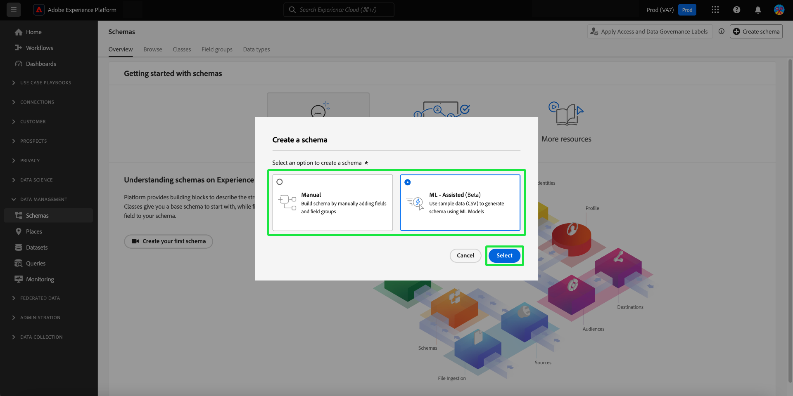

### [!BADGE Beta]{type=Informative}手動またはML支援のスキーマ作成 {#manual-or-assisted}

マシンラーニングアルゴリズムを使用して、アップロードされたファイルに基づくスキーマ構造を推奨する方法については、[機械学習を支援するスキーマ作成ガイド &#x200B;](../ui/ml-assisted-schema-creation.md)を参照してください。 このUI ガイドでは、手動作成ワークフローに焦点を当てます。

### 基本クラスの選択 {#choose-a-class}

[!UICONTROL Create schema] ワークフローが表示されます。 次に、スキーマのベースクラスを選択します。 これらのクラスが目的に合わない場合は、[!UICONTROL XDM Individual Profile]と[!UICONTROL XDM ExperienceEvent]のコアクラス、または[!UICONTROL Other]のいずれかを選択できます。 「[!UICONTROL Other] クラス」オプションを使用すると、[新しいクラスを作成するか、他の既存のクラスから選択できます。](#create-new-class)

これらのクラスについて詳しくは、[[!UICONTROL XDM individual profile]](../classes/individual-profile.md)および[[!UICONTROL XDM ExperienceEvent]](../classes/experienceevent.md)のドキュメントを参照してください。 このチュートリアルの目的では、**[!UICONTROL XDM Individual Profile]**&#x200B;を選択した後、**[!UICONTROL Next]**&#x200B;を選択します。

![[!UICONTROL Create schema] オプションと[!UICONTROL XDM individual profile]がハイライト表示された[!UICONTROL Next] ワークフロー。](../images/tutorials/create-schema/individual-profile-base-class.png)

### 命名とレビュー {#name-and-review}

クラスを選択すると、[!UICONTROL Name and review] セクションが表示されます。 このセクションでは、スキーマを識別するための名前と説明を指定します。 スキーマの名前を決定する際に考慮すべき重要な点がいくつかあります。

* 後でスキーマを簡単に見つけられるように、スキーマ名は短くわかりやすい名前にしてください。
* スキーマ名は一意である必要があります。つまり、将来再利用されないように十分に具体的でなければなりません。例えば、組織が異なるブランドに対して別々のロイヤルティプログラムを持つ場合、後で定義する他のロイヤルティ関連スキーマと区別しやすいように、スキーマに「ブランド A ロイヤルティメンバー」という名前を付けると効果的です。
* また、スキーマの説明を使用して、スキーマに関する追加のコンテキスト情報を提供することもできます。

このチュートリアルでは、ロイヤルティプログラムのメンバーに関連するデータを取り込むスキーマを作成するので、スキーマの名前は「[!DNL Loyalty Members]」とします。

&#x200B;選択したクラスとスキーマ構造を確認および検証するために、スキーマのベース構造（クラスによって提供）がキャンバスに表示されます。

人間に適した[!UICONTROL Schema display name]をテキストフィールドに入力します。 次に、適切な説明を入力して、スキーマを特定します。 スキーマ構造を確認し、設定に満足したら、**[!UICONTROL Finish]**&#x200B;を選択してスキーマを作成します。

![[!UICONTROL Name and review]、[!UICONTROL Create schema]、[!UICONTROL Schema display name]がハイライト表示された[!UICONTROL Description] ワークフローの[!UICONTROL Finish] セクション。](../images/ui/resources/schemas/name-and-review.png)

### スキーマの作成 {#compose-your-schema}

[!DNL Schema Editor] が表示されます。これは、スキーマを作成するキャンバスです。セルフタイトル付きのスキーマは、エディターに到着したときに、選択したベースクラスに含まれる標準フィールドとともに、キャンバスの&#x200B;**[!UICONTROL Structure]** セクションに自動的に作成されます。 スキーマに割り当てられたクラスは、**[!UICONTROL Class]** セクションの&#x200B;**[!UICONTROL Composition]**&#x200B;にも一覧表示されます。

>[!NOTE]
>
>**[!UICONTROL Schema properties]** サイドバーから、スキーマの表示名とオプションの説明を更新できます。 新しい名前を入力すると、キャンバスが自動的に更新され、スキーマの新しい名前が反映されます。

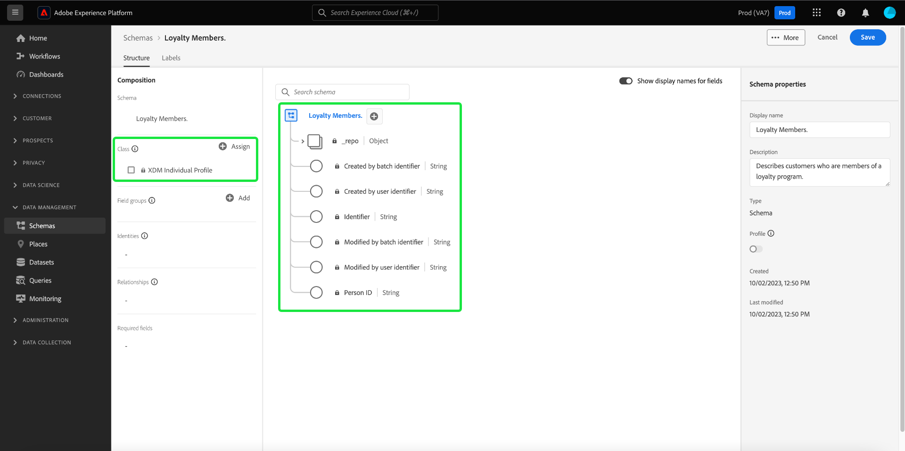

>[!NOTE]
>
>スキーマが保存される前の初期構成プロセスにおける任意の時点で[スキーマのクラスを変更](#change-class)できますが、その場合は細心の注意を払って行ってください。フィールドグループは特定のクラスにのみ適合するので、クラスを変更すると、キャンバスと追加したフィールドがリセットされます。

## フィールドグループの追加 {#field-group}

これで、フィールドグループを追加して、スキーマへのフィールドの追加を開始できます。フィールドグループは、特定の概念を記述するために一緒に使用されることが多い 1 つ以上のフィールドから成るグループです。このチュートリアルでは、フィールドグループを使用してロイヤルティプログラムのメンバーを記述し、氏名、生年月日、電話番号、住所などの重要な情報を取り込みます。

フィールドグループを追加するには、**[!UICONTROL Add]** サブセクションの&#x200B;**[!UICONTROL Field groups]**&#x200B;を選択します。

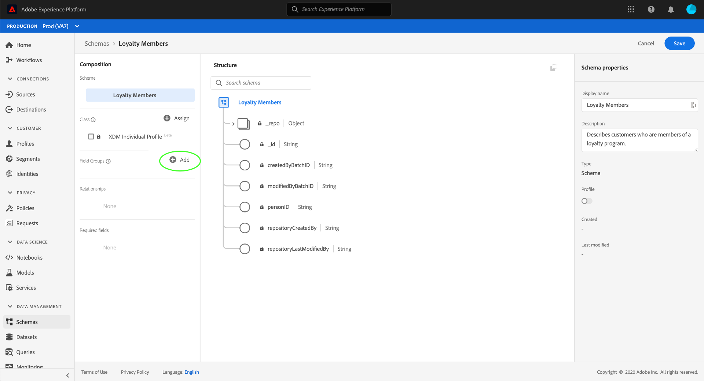

新しいダイアログが表示され、使用可能なフィールドグループのリストが表示されます。各フィールドグループは特定のクラスでのみ使用できるものなので、ダイアログには、選択したクラス（この場合は、[!DNL XDM Individual Profile] クラス）に適合するフィールドグループのみがリストされます。標準の XDM クラスを使用している場合、フィールドグループのリストは使用頻度に基づいてインテリジェントに並べ替えられます。

![[!UICONTROL Add field groups] ダイアログ。](../images/tutorials/create-schema/field-group-popularity.png)

左側のパネルでフィルターの 1 つを選択して、標準フィールドグループのリストを特定の[業種](../schema/industries/overview.md)（小売、金融機関、ヘルスケアなど）に絞り込むことができます。

![業界フィールドグループがハイライト表示された[!UICONTROL Add field groups] ダイアログ。](../images/tutorials/create-schema/industry-field-groups.png)

リストからフィールドグループを選択すると、右側のパネルに表示されます。必要に応じて複数のフィールドグループを選択し、各グループを右側のレールのリストに追加してから確認することができます。また、現在選択されているフィールドグループの右側にアイコンが表示され、提供されるフィールドの構造をプレビューできます。

![選択したフィールドグループのプレビューアイコンがハイライト表示された[!UICONTROL Add field groups] ダイアログ。](../images/tutorials/create-schema/preview-field-group-button.png)

フィールドグループをプレビューする際に、右側のパネルに、フィールドグループのスキーマに関する詳細な説明が表示されます。また、提供されたキャンバスでフィールドグループのフィールド間を移動することもできます。別のフィールドを選択すると、右側のパネルが更新され、該当するフィールドの詳細が表示されます。プレビューが終了したら&#x200B;**[!UICONTROL Back]**&#x200B;を選択して、フィールドグループ選択ダイアログに戻ります。

![&#x200B; デモグラフィックの詳細フィールドグループを含む[!UICONTROL Preview field group] ダイアログがプレビューされました。](../images/tutorials/create-schema/preview-field-group.png)

このチュートリアルでは、**[!UICONTROL Demographic Details]** フィールドグループを選択し、**[!UICONTROL Add field group]**&#x200B;を選択します。

![&#x200B; デモグラフィックの詳細フィールドグループが選択され、[!UICONTROL Add field groups]がハイライト表示された[!UICONTROL Add field groups] ダイアログ。](../images/tutorials/create-schema/demographic-details.png)

スキーマキャンバスが再び表示されます。**[!UICONTROL Field groups]** セクションに「[!UICONTROL Demographic Details]」が一覧表示され、**[!UICONTROL Structure]** セクションには、フィールドグループによって提供されたフィールドが含まれるようになりました。 **[!UICONTROL Field groups]** セクションの下でフィールドグループの名前を選択して、キャンバス内で提供される特定のフィールドを強調表示できます。

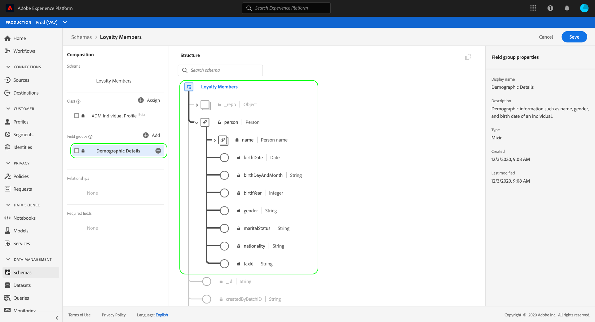

>[!NOTE]
>
>スキーマエディター内では、標準（Adobeで生成された）クラスとフィールドグループが南京錠アイコン（をインストールします。南京錠は、クラス名またはフィールドグループ名の横にある左側のパネルと、システム生成リソースの一部であるスキーマダイアグラム内の任意のフィールドの横に表示されます。
>
>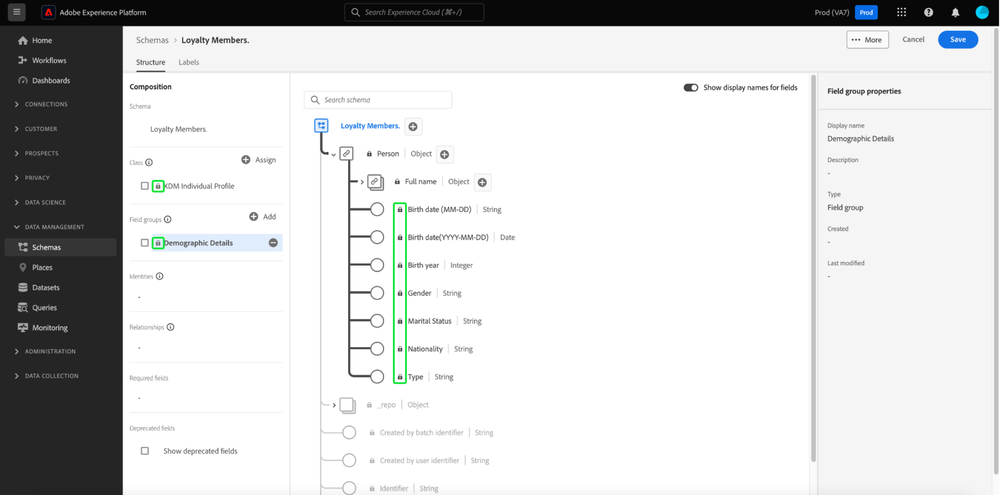

このフィールドグループは、最上位の名前`person`の下にデータタイプ「[!UICONTROL Person]」を持つ複数のフィールドを提供します。 このフィールドグループは、名前、生年月日、性別など、個人に関する情報を説明します。

>[!NOTE]
>
>フィールドでは、スカラータイプ（文字列、整数、配列、日付など）のほかに、[!DNL Schema Registry] 内で定義されている任意のデータタイプ（一般的な概念を表すフィールドのグループ）も使用できることを覚えておいてください。

`name` フィールドのデータ型は&quot;[!UICONTROL Full name]&quot;であり、これは共通の概念を説明し、名前、姓、礼儀タイトル、接尾辞などの名前関連のサブフィールドを含んでいることを意味します。

キャンバス内の様々なフィールドをクリックすると、それらがスキーマ構造に寄与する追加のフィールドが表示されます。

## さらなるフィールドグループの追加 {#field-group-2}

これで、同じ手順を繰り返して、別のフィールドグループを追加できるようになりました。今回の&#x200B;**[!UICONTROL Add field group]** ダイアログを表示すると、「[!UICONTROL Demographic Details]」フィールドグループがグレー表示され、その横にあるチェックボックスを選択できないことに注意してください。 これにより、現在のスキーマに既に含まれているフィールドグループが誤って複製されるのを防止できます。

このチュートリアルでは、リストから標準フィールドグループ **[!UICONTROL Personal Contact Details]**&#x200B;と&#x200B;**[!UICONTROL Loyalty Details]**&#x200B;を選択し、**[!UICONTROL Add field groups]**&#x200B;を選択してスキーマに追加します。

![2つの新しいフィールドグループが選択され、[!UICONTROL Add field groups]がハイライト表示された[!UICONTROL Add field groups] ダイアログ。](../images/tutorials/create-schema/more-field-groups.png)

キャンバスは、**[!UICONTROL Field groups]** セクションの&#x200B;**[!UICONTROL Composition]**&#x200B;にリストされている追加されたフィールドグループと、それらの複合フィールドがスキーマ構造に追加された状態で再び表示されます。

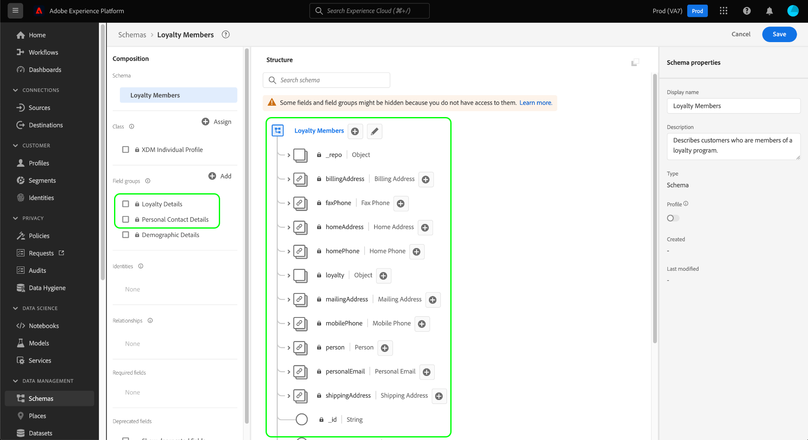

## カスタムフィールドグループの定義 {#define-field-group}

[!UICONTROL Loyalty Members] スキーマは、ロイヤルティプログラムのメンバーに関連するデータを取得するためのもので、スキーマに追加した標準の[!UICONTROL Loyalty Details] フィールドグループは、プログラムの種類、ポイント、結合日など、これらのほとんどを提供します。

ただし、場合によっては、ユースケースを達成するために、標準フィールドグループでカバーされない追加のカスタムフィールドを含める必要がある状況も考えられます。 カスタムロイヤルティフィールドを追加する場合は、次の 2 つの選択肢があります。

1. 新しいカスタムフィールドグループを作成して、これらのフィールドを取り込みます。 この方法については、このチュートリアルで説明します。
1. カスタムフィールドを使用して、標準の[!UICONTROL Loyalty Details] フィールドグループを拡張します。 これにより、[!UICONTROL Loyalty Details]がカスタムフィールドグループに変換され、元の標準フィールドグループは使用できなくなります。 標準フィールドグループ [!UICONTROL Schemas]の構造にカスタムフィールドを追加する[について詳しくは、](../ui/resources/schemas.md#custom-fields-for-standard-groups) UI ガイドを参照してください。

新しいフィールドグループを作成するには、以前と同様に&#x200B;**[!UICONTROL Add]** サブセクションで&#x200B;**[!UICONTROL Field groups]**&#x200B;を選択しますが、今回は、表示されるダイアログの上部にある&#x200B;**[!UICONTROL Create New Field group]**&#x200B;を選択します。 次に、新しいフィールドグループの表示名と説明を入力するように求められます。 このチュートリアルでは、新しいフィールドグループ「[!DNL Custom Loyalty Details]」に名前を付け、**[!UICONTROL Add field groups]**&#x200B;を選択します。

![[!UICONTROL Add field groups]、[!UICONTROL Create new field group]、[!UICONTROL Display name]の[!UICONTROL Description] ダイアログがハイライト表示されました。](../images/tutorials/create-schema/create-new-field-group.png)

>[!NOTE]
>
>クラス名の場合と同様に、フィールドグループ名は簡潔かつシンプルで、フィールドグループがスキーマにどのように寄与するかがよくわかるものにしてください。これらも一意なので、名前を再利用できません。名前が十分に具体的なものになるようにしてください。

「[!DNL Custom Loyalty Details]」は、キャンバスの左側の&#x200B;**[!UICONTROL Field groups]**&#x200B;の下に表示されるようになりましたが、まだ関連付けられているフィールドがないため、**[!UICONTROL Structure]**&#x200B;の下に新しいフィールドは表示されません。

## フィールドグループにフィールドを追加します。 {#field-group-fields}

これで「[!DNL Custom Loyalty Details]」フィールドグループを作成したので、このフィールドグループがスキーマに提供するフィールドをようやく定義できます。

まず、キャンバスでスキーマ名の横にある&#x200B;**プラス（＋）**&#x200B;アイコンを選択します。

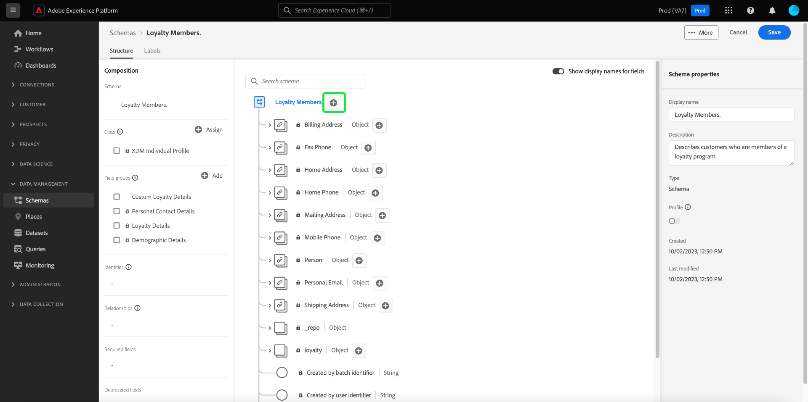

「[!UICONTROL Untitled Field]」プレースホルダーがキャンバスに表示され、右側のパネルが更新されて、フィールドの設定オプションが表示されます。

![[!UICONTROL Untitled Field]とスキーマ [!UICONTROL Field properties]がハイライト表示されたスキーマエディター。](../images/tutorials/create-schema/untitled-field.png)

このシナリオでは、スキーマには、人物の現在のロイヤルティ層の詳細を記述するオブジェクトタイプのフィールドが必要です。 右側のパネルのコントロールを使用して、関連するフィールドを保持するために使用するタイプ「`loyaltyTier`」の[!UICONTROL Object] フィールドの作成を開始します。

**[!UICONTROL Assign to]**&#x200B;で、フィールドを割り当てるフィールドグループを選択する必要があります。 すべてのスキーマフィールドはクラスかフィールドグループのどちらかに属していますが、このスキーマは標準クラスを使用しているので、フィールドグループの選択のみ可能です。 「[!DNL Custom Loyalty Details]」という名前を入力し始めると、該当するフィールドグループがリストに表示されるので、それを選択します。

終了したら「**[!UICONTROL Apply]**」を選択します。

![&#x200B; ロイヤルティ層オブジェクトがスキーマ [!UICONTROL Field properties]に追加されたスキーマエディターが強調表示されます。](../images/tutorials/create-schema/loyalty-tier-object.png)

変更内容が適用され、新しく作成された `loyaltyTier` オブジェクトが表示されます。これはカスタムフィールドなので、組織のテナント ID を名前空間とするオブジェクト内に自動的にネストされ、先頭にアンダースコアが付きます（この例では `_tenantId`）。

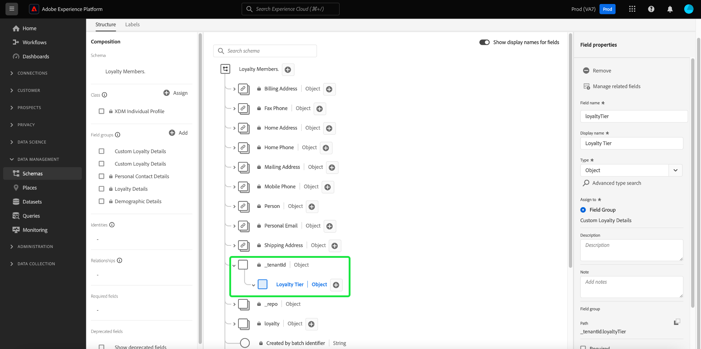

>[!NOTE]
>
>テナント ID オブジェクトの存在は、追加しようとしているフィールドが組織の名前空間に含まれていることを示しています。
>
>つまり、追加しようとしているフィールドは組織に固有のもので、組織のみがアクセスできる特定の領域にある [!DNL Schema Registry] に保存されることになります。他の標準クラス、フィールドグループ、データタイプおよびフィールドの名前との競合を防ぐために、定義するフィールドは、必ずテナント名前空間に追加する必要があります。

`loyaltyTier` オブジェクトの横にある&#x200B;**プラス（＋）**&#x200B;アイコンを選択して、サブフィールドの追加を開始します。新しいフィールドプレースホルダーが表示され、**[!UICONTROL Field properties]** セクションがキャンバスの右側に表示されます。

各フィールドには、次の情報が必要です。

* **[!UICONTROL Field Name]:** フィールドの名前（できればCamelCaseで記述）。 スペース文字は使用できません。 これは、コード内および他のダウンストリームアプリケーションでフィールドを参照するために使用される名前です。
   * 例：loyaltyLevel
* **[!UICONTROL Display Name]:** タイトルケースで記述されたフィールドの名前。 これは、スキーマの表示または編集時にキャンバスに表示される名前です。
   * 例：Loyalty Level
* **[!UICONTROL Type]:** フィールドのデータ型。 これには、基本的なスカラータイプと、[!DNL Schema Registry] に定義されている任意のデータタイプが含まれます。例：[!UICONTROL String]、[!UICONTROL Integer]、[!UICONTROL Boolean]、[!UICONTROL Person]、[!UICONTROL Address]、[!UICONTROL Phone number]など
* **[!UICONTROL Description]:** フィールドの説明は、オプションで最大200文字まで含める必要があります。

`loyaltyTier` オブジェクトの最初のフィールドは、`id` という文字列になります。これは、ロイヤルティメンバーの現在の階層の ID を表します。 この会社では、様々な要因に基づいて顧客ごとに異なるロイヤルティ層ポイントしきい値を設定しているので、階層 ID はロイヤルティメンバーごとに一意になります。 新しいフィールドのタイプを「[!UICONTROL String]」に設定すると、**[!UICONTROL Field properties]** セクションに、デフォルト値、形式、最大長など、制約を適用するためのいくつかのオプションが入力されます。 詳細については、[&#x200B; データ検証フィールドのベストプラクティス &#x200B;](../schema/best-practices.md#data-validation-fields)に関するドキュメントを参照してください。

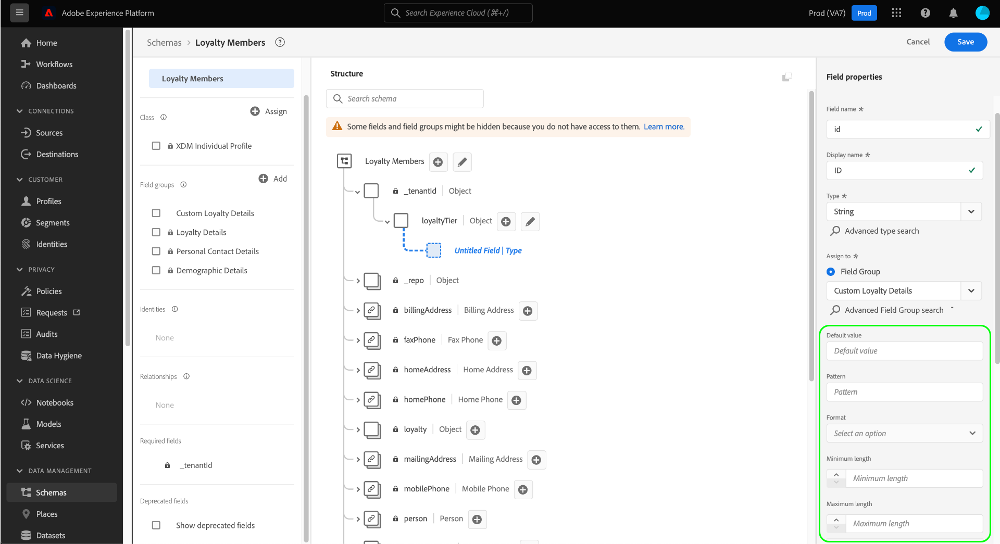

`id` はランダムに生成されるフリーフォーム文字列なので、それ以上の制約は必要ありません。**[!UICONTROL Apply]**&#x200B;を選択して変更を適用します。

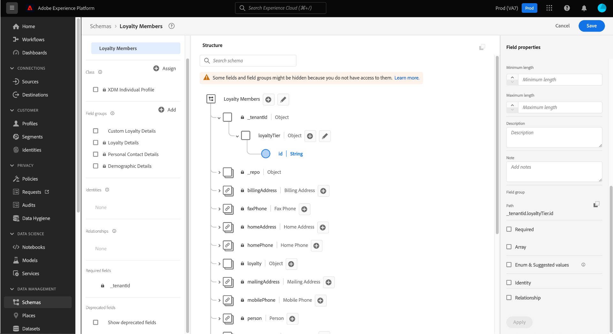

## フィールドグループにさらにフィールドを追加します。 {#field-group-fields-2}

`id` フィールドを追加したら、次のようなロイヤルティ層の情報を取り込むためのその他のフィールドを追加できます。

* 現在のポイントしきい値（整数）：メンバーが現在の階層に留まるために維持する必要があるロイヤルティポイントの最小数。
* 次の階層ポイントのしきい値（整数）：メンバーが次の階層に進むために獲得しなければならないロイヤルティポイントの数。
* 発効日（日時）：ロイヤルティメンバーがこの階層に参加した日付。

各フィールドをスキーマに追加するには、`loyalty` オブジェクトの横にある&#x200B;**プラス（+）** アイコンを選択し、必要な情報を入力します。

完了すると、`loyaltyTier` オブジェクトには `id`、`currentThreshold`、`nextThreshold`、および `effectiveDate` のフィールドが含まれます。

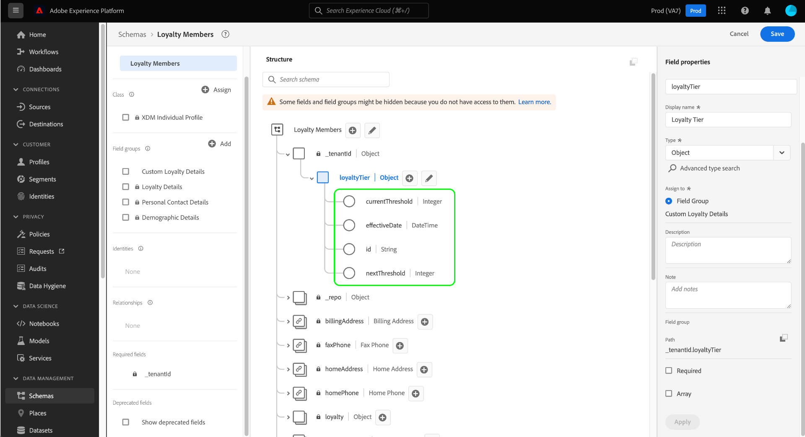

## フィールドグループへの列挙フィールドの追加 {#enum}

[!DNL Schema Editor] でフィールドを定義する場合、フィールドに含めることができるデータにさらに制約を加えるために、基本的なフィールドタイプに適用できるいくつかの追加オプションがあります。これらの制約のユースケースを次の表で説明します。

| 制約 | 説明 |
| --- | --- |
| [!UICONTROL Required] | データの取得にフィールドが必須であることを示します。このフィールドを含まないデータセットに基づいてスキーマセットにアップロードされたデータの取り込みは失敗します。 |
| [!UICONTROL Array] | フィールドに値の配列が含まれ、各値は指定されたデータタイプを持つことを示します。例えば、「[!UICONTROL String]」というデータ型を持つフィールドに対してこの制約を使用すると、フィールドに文字列の配列が含まれることを指定します。 |
| [!UICONTROL Enum & Suggested Values] | このフィールドに、可能な値の列挙リストの値の 1 つを含める必要があることを示します。または、このオプションを使用して、フィールドをそれらの値に制限することなく、文字列フィールドの推奨値のリストを提供することもできます。 |
| [!UICONTROL Identity] | このフィールドが ID フィールドであることを示します。ID フィールドの詳細については、[このチュートリアルの後半](#identity-field)で説明します。 |
| [!UICONTROL Relationship] | スキーマの関係は、結合スキーマと [!DNL Real-Time Customer Profile] を使用して推論できますが、同じクラスを共有するスキーマにのみ適用されます。 [!UICONTROL Relationship]制約は、このフィールドが異なるクラスに基づくスキーマのプライマリ IDを参照し、2つのスキーマ間の関係を意味することを示します。 詳しくは、[関係の定義](./relationship-ui.md)に関するチュートリアルを参照してください。 |

{style="table-layout:auto"}

>[!NOTE]
>
>必須フィールド、IDフィールド、関係フィールドは、左側のパネルの各セクションに表示され、スキーマの複雑さに関係なく、これらのフィールドを簡単に見つけることができます。

このチュートリアルでは、スキーマ内の `loyaltyTier` オブジェクトには、階層クラスを記述する新しい列挙型フィールドが必要です。値は 4 つのオプションのうちいずれかになります。このフィールドをスキーマに追加するには、**オブジェクトの横にある** プラス（+） `loyaltyTier` アイコンを選択し、**[!UICONTROL Field name]**&#x200B;と&#x200B;**[!UICONTROL Display name]**&#x200B;の必須フィールドに入力します。 **[!UICONTROL Type]**&#x200B;に「[!UICONTROL String]」を選択します。

![階層クラスオブジェクトを含むスキーマエディターが[!UICONTROL Field properties]で追加され、強調表示されます。](../images/tutorials/create-schema/tier-class-type.png)

フィールドの種類が選択された後、フィールドに追加のチェックボックスが表示されます。これには、**[!UICONTROL Array]**、**[!UICONTROL Enum & Suggested Values]**、**[!UICONTROL Identity]**、**[!UICONTROL Relationship]**&#x200B;のチェックボックスが含まれます。

「**[!UICONTROL Enum & Suggested Values]**」チェックボックスを選択し、「**[!UICONTROL Enum]**」を選択します。 ここでは、許容されるロイヤルティ層クラスごとに&#x200B;**[!UICONTROL Value]** （キャメルケース内）と&#x200B;**[!UICONTROL Display Name]** （タイトルケース内のオプションの読みやすい名前）を入力できます。

すべてのフィールドプロパティが完了したら、**[!UICONTROL Apply]**&#x200B;を選択して`tierClass` フィールドを`loyaltyTier` オブジェクトに追加します。

![列挙と提案の値フィールドのプロパティが完了し、[!UICONTROL Apply]が強調表示されています。](../images/tutorials/create-schema/tier-class-enum.png)

## 複数フィールドオブジェクトのデータタイプへの変換 {#datatype}

`loyaltyTier` オブジェクトには複数のフィールドが含まれ、他のスキーマで役立つ共通のデータ構造を表すようになりました。 [!DNL Schema Editor] を使用すると、再利用可能な複数フィールドオブジェクトを簡単に適用できます。そのためには、これらのオブジェクトの構造をデータタイプに変換します。

データタイプを使用すると、複数フィールド構造を一貫して使用でき、フィールドグループよりも柔軟性が高まります。これは、データタイプがスキーマ内のどこでも使用できるからです。これは、フィールドの&#x200B;**[!UICONTROL Type]**&#x200B;値を[!DNL Schema Registry]で定義されている任意のデータタイプの値に設定することによって行われます。

`loyaltyTier` オブジェクトをデータ型に変換するには、キャンバスの`loyaltyTier` フィールドを選択し、エディターの右側の&#x200B;**[!UICONTROL Convert to new data type]**&#x200B;の下にある&#x200B;**[!UICONTROL Field properties]**&#x200B;を選択します。

![loyaltyTier オブジェクトと[!UICONTROL Convert to new data type]が強調表示されたスキーマエディター。](../images/tutorials/create-schema/convert-data-type.png)

オブジェクトが正常に変換されたことを確認する通知が表示されます。 キャンバスでは、`loyaltyTier` フィールドにリンクアイコンが表示され、右側のパネルはデータタイプが「[!DNL Loyalty Tier]」であることを示しています。

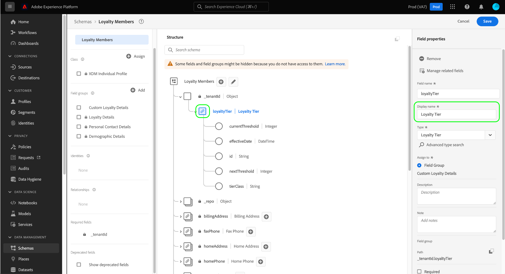

今後のスキーマでは、フィールドを「[!DNL Loyalty Tier]」タイプとして割り当てることができ、ID、階層クラス、ポイントしきい値、および発効日のフィールドが自動的に含まれるようになります。

>[!NOTE]
>
>また、スキーマの編集とは別に、カスタムデータタイプの作成や編集を行うこともできます。詳しくは、[データタイプの作成と編集](../ui/resources/data-types.md)に関するガイドを参照してください。

## スキーマフィールドの検索とフィルター

スキーマに、基本クラスで指定されるフィールドに加えて、複数のフィールドグループが含まれるようになりました。 より大きなスキーマを扱う場合は、左側のパネルでフィールドグループ名の横にあるチェックボックスをオンにして、表示されるフィールドを、目的のフィールドグループが指定するフィールドのみにフィルタリングできます。

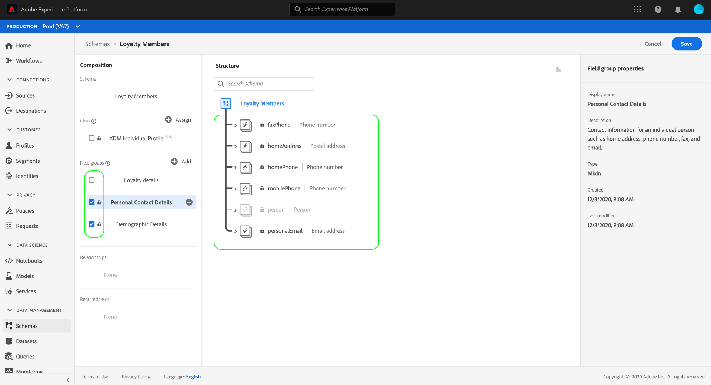

スキーマ内の特定のフィールドを検索する場合は、検索バーを使用すると、表示されるフィールドを、その下に指定されるフィールドグループに関係なく、名前でフィルタリングすることもできます。

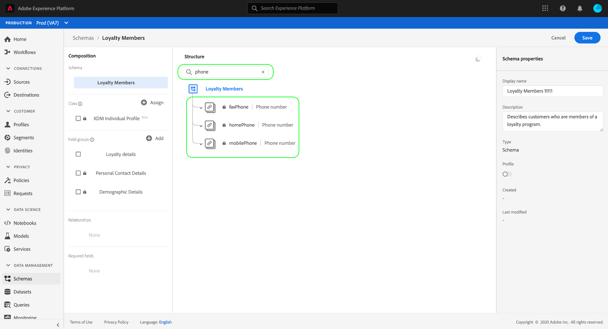

>[!IMPORTANT]
>
>検索機能では、一致するフィールドを表示する際に、選択したフィールドグループのフィルターを考慮に入れます。 検索クエリで期待した結果が表示されない場合は、関連するフィールドグループを除外していないことを再確認する必要があります。

## ID フィールドとしてのスキーマフィールドの設定 {#identity-field}

スキーマが提供する標準的なデータ構造を利用して、複数のソースから同じ個人に属するデータを識別できるため、セグメント化、レポート、データサイエンス分析など、様々なダウンストリームのユースケースが可能になります。個々のIDに基づいてデータを結合するには、該当するスキーマ内でキーフィールドを[!UICONTROL Identity] フィールドとしてマークする必要があります。

[!DNL Experience Platform]では、**[!UICONTROL Identity]**&#x200B;の[!DNL Schema Editor] チェックボックスを使用して、ID フィールドを簡単に表示できます。 ただし、データの特性に基づいて、どのフィールドが ID として使用するのに最適な候補であるかを判断する必要があります。

例えば、同じロイヤルティレベルに属するロイヤルティプログラムメンバーが何千人もいる場合や、同じ住所を共有するメンバーが複数存在する場合があります。 ただし、このシナリオでは、登録時に、ロイヤルティプログラムの各メンバーは個人のメールアドレスを入力します。 個人の電子メールアドレスは通常1人で管理されるので、フィールド `personalEmail.address` （[!UICONTROL Personal Contact Details] フィールドグループが提供）はID フィールドの候補として適しています。

>[!IMPORTANT]
>
>以下の手順では、既存のスキーマフィールドに ID 記述子を追加する方法について説明します。スキーマ自体の構造の中で ID フィールドを定義する代わりに、`identityMap` フィールドを使用して ID 情報を格納することもできます。
>
>`identityMap` を使用する予定がある場合は、スキーマに直接追加するプライマリ ID を上書きすることに注意してください。詳しくは、[スキーマ構成の基本ガイド](../schema/composition.md#identityMap)の `identityMap` の節を参照してください。

キャンバスで`personalEmail.address` フィールドを選択すると、**[!UICONTROL Identity]** チェックボックスが&#x200B;**[!UICONTROL Field properties]**&#x200B;の下に表示されます。 チェックボックスをオンにして、**[!UICONTROL Primary identity]**&#x200B;が表示されるように設定するオプションをオンにします。 このボックスも選択します。

>[!NOTE]
>
>各スキーマには、1 つのプライマリ ID フィールドのみを含めることができます。スキーマフィールドをプライマリ ID として設定した場合、後でスキーマ内の別の ID フィールドをプライマリとして設定しようとすると、エラーメッセージが表示されます。

次に、ドロップダウンの定義済み名前空間のリストから&#x200B;**[!UICONTROL Identity namespace]**&#x200B;を指定する必要があります。 このフィールドはお客様の電子メールアドレスなので、ドロップダウンから「[!UICONTROL Email]」を選択します。 「**[!UICONTROL Apply]**」を選択して、`personalEmail.address` フィールドの更新を確認します。

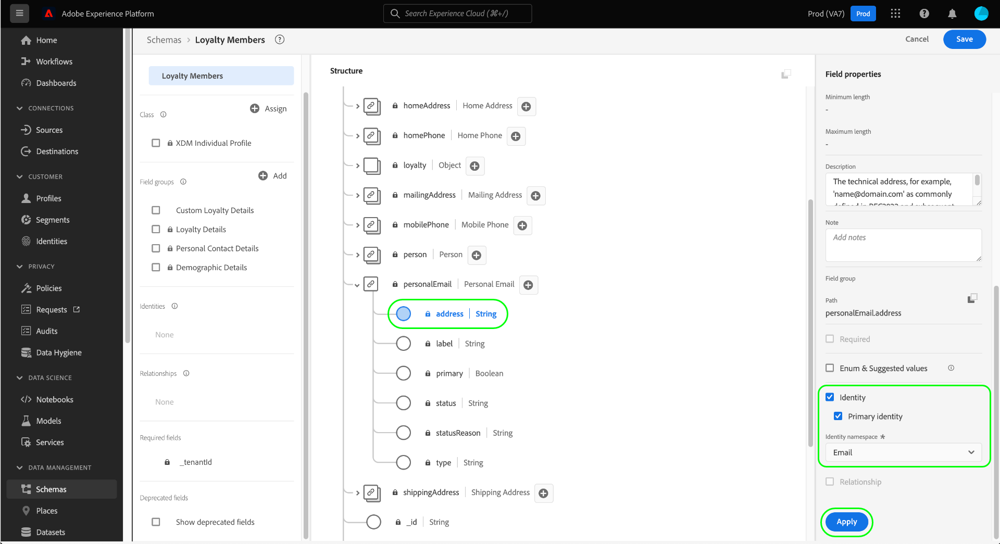

>[!NOTE]
>
>標準名前空間のリストとその定義については、[[!DNL Identity Service] ドキュメント](../../identity-service/troubleshooting-guide.md#standard-namespaces)を参照してください。

変更を適用すると、`personalEmail.address` のアイコンに ID フィールドになったことを示すフィンガープリントマークシンボルが表示されます。このフィールドは、**[!UICONTROL Identities]**&#x200B;の下の左側のパネルにも表示されます。

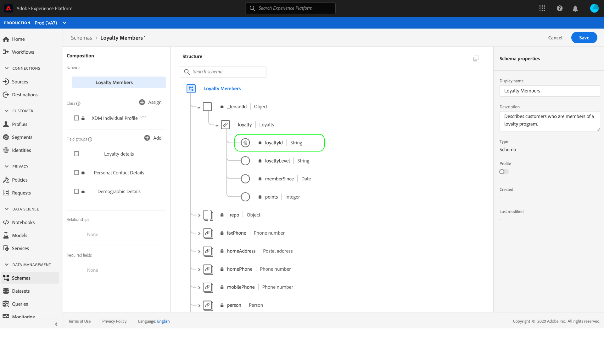

これで、`personalEmail.address` フィールドに取り込まれたすべてのデータを使用して、その個人を識別し、その顧客の単一のビューを結び付けることができます。[!DNL Experience Platform] での ID の操作について詳しくは、[[!DNL Identity Service]](../../identity-service/home.md) のドキュメントを参照してください。

## [!DNL Real-Time Customer Profile] で使用するためのスキーマの有効化  {#profile}

[[!DNL Real-Time Customer Profile]](../../profile/home.md) では、[!DNL Experience Platform] の ID データを活用して各顧客の全体像を提供します。 このサービスは、あらゆる角度からの堅牢な顧客属性プロファイルに加えて、[!DNL Experience Platform] と統合されたあらゆるシステムで顧客が行ってきたすべてのインタラクションのタイムスタンプ付きアカウントを構築します。 

スキーマを [!DNL Real-Time Customer Profile] で使用できるようにするには、プライマリ ID が定義されている必要があります。先にプライマリ ID を定義せずにスキーマを有効にしようとすると、エラーメッセージが表示されます。

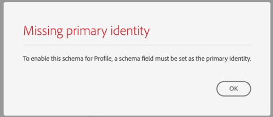

「ロイヤルティメンバー」スキーマを [!DNL Profile] で使用できるようにするには、まず、キャンバスでスキーマタイトルを選択します。

エディターの右側に、表示名、説明、タイプなど、スキーマに関する情報が表示されます。この情報に加えて、**[!UICONTROL Profile]**&#x200B;切り替えボタンがあります。

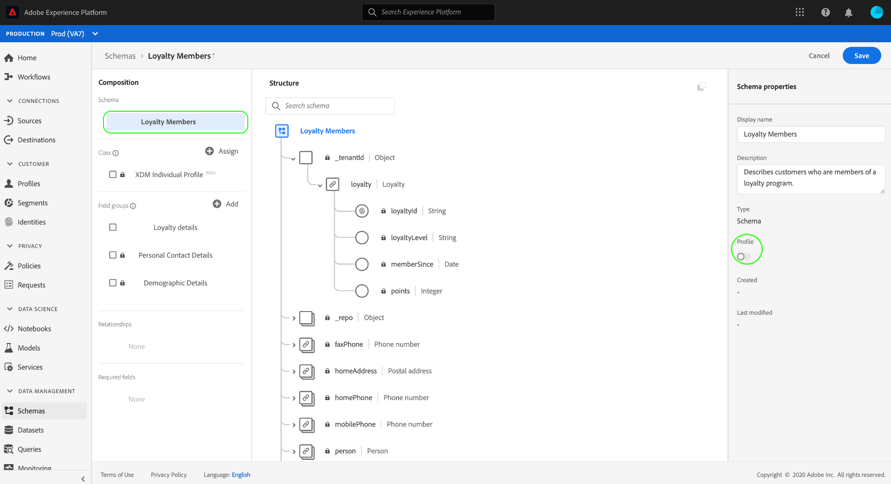

**[!UICONTROL Profile]**&#x200B;を選択すると、ポップオーバーが表示され、[!DNL Profile]のスキーマを有効にするかどうかを確認するメッセージが表示されます。

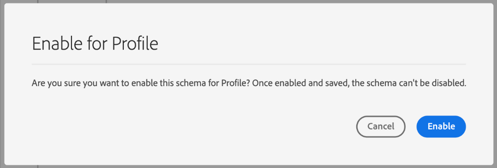

>[!WARNING]
>
>スキーマを [!DNL Real-Time Customer Profile] に対して有効にして保存したら、無効にはできません。

**[!UICONTROL Enable]**&#x200B;を選択して選択を確定します。 必要に応じて、**[!UICONTROL Profile]** トグルを再度選択してスキーマを無効にできますが、[!DNL Profile]が有効になっている間にスキーマが保存されると、無効にできなくなります。

## その他のアクション {#more}

>[!NOTE]
>
>XDM リソースを操作する場合、アクションはインベントリ テーブル （行メニュー）とリソース詳細ビュー（**[!UICONTROL More]**）の両方から使用できます。 **削除**、**JSON構造のコピー**、**パッケージに追加**&#x200B;など、アクションの完全なセットにアクセスするには、カスタム（テナント定義）リソースを選択する必要があります。 標準（Adobeが提供する）リソースのアクションは限られています。 アクション、制約、権限の概要については、[&#x200B; スキーマ、クラス、フィールドグループ、およびデータ型の管理：アクションと削除](../ui/explore.md#xdm-resource-actions)を参照してください。

スキーマエディター内で、スキーマのJSON構造をコピーしたり、スキーマを削除したりするためのクイックアクションを実行することもできます。 ビューの上部にある「[!UICONTROL More]」を選択すると、クイックアクションを含むドロップダウンが表示されます。

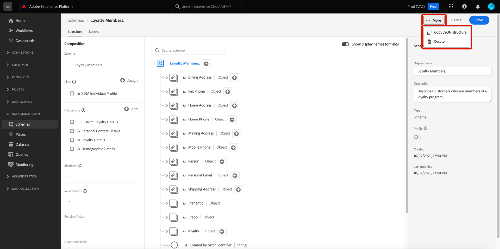

### スキーマの削除 {#delete-a-schema}

>[!CONTEXTUALHELP]
>id="platform_schemas_delete_profileenabledwithdatasets"
>title="スキーマを削除できない"
>abstract="スキーマは、プロファイルに対して有効になっており、データセットが関連付けられているので、削除できません。"

>[!CONTEXTUALHELP]
>id="platform_schemas_delete_profileenablednodatasets"
>title="スキーマを削除できない"
>abstract="スキーマは、プロファイルに対して有効になっているので、削除できません。"

>[!CONTEXTUALHELP]
>id="platform_schemas_delete_withdatasetsnotprofileenabled"
>title="スキーマを削除できない"
>abstract="スキーマは、データセットが関連付けられているので、削除できません。"

スキーマは、[!UICONTROL More] アクションを使用してスキーマエディターから、また[!UICONTROL Browse] タブのスキーマの詳細から、UI内で削除できます。 スキーマの削除を妨げる特定の条件があります。 次の場合、スキーマを削除できません：

* このスキーマはプロファイルに対して有効になっています。
* スキーマはプロファイルに対して有効になっており、関連するデータセットがあります。
* スキーマに関連付けられたデータセットがありますが、プロファイルに対しては有効になっていません。

### JSON 構造をコピー {#copy-json-structure}

スキーマライブラリ内の任意のスキーマの書き出しペイロードを生成するには、**[!UICONTROL Copy JSON structure]**&#x200B;を選択します。 このアクションは、JSON構造をクリップボードにコピーします。 書き出したJSONを使用して、スキーマと関連リソースを別のサンドボックスまたは組織に読み込むことができます。 これにより、異なる環境間でのスキーマの共有と再利用が簡単で効率的になります。

## 次の手順とその他のリソース

これで、スキーマの作成が完了したので、キャンバスに完全なスキーマが表示されます。 **[!UICONTROL Save]**&#x200B;を選択すると、スキーマが[!DNL Schema Library]に保存され、[!DNL Schema Registry]からアクセスできるようになります。

これで、新しいスキーマを使用して [!DNL Experience Platform] にデータを取り込めるようになりました。データの取得にスキーマを使用した後は、追加的な変更のみがおこなわれる場合があります。スキーマバージョン管理について詳しくは、[スキーマ構成の基本](../schema/composition.md)を参照してください。

[UI でのスキーマ関係の定義](./relationship-ui.md)に関するチュートリアルに従って、新しい関係フィールドを「ロイヤルティメンバー」スキーマに追加できるようになりました。

「ロイヤルティメンバー」スキーマは、[!DNL Schema Registry] API を使用して表示および管理することもできます。API の使用を開始するには、まず [[!DNL Schema Registry API] 開発者ガイド](../api/getting-started.md)を参照してください。

### ビデオリソース

>[!WARNING]
>
>次のビデオに示す [!DNL Experience Platform] UI は旧式のものです。最新の UI のスクリーンショットと機能については、上記のドキュメントを参照してください。

次のビデオでは、[!DNL Experience Platform] UI で単純なスキーマを作成する方法を示しています。

>[!VIDEO](https://video.tv.adobe.com/v/27012?quality=12&learn=on)

次のビデオは、フィールドグループとクラスの操作に関する理解を深めることを目的としています。

>[!VIDEO](https://video.tv.adobe.com/v/27013?quality=12&learn=on)

## 付録

以下の節では、[!DNL Schema Editor] の使用に関する追加情報について説明します。

### 新しいクラスの作成 {#create-new-class}

[!DNL Experience Platform] は、組織に固有のクラスに基づいてスキーマを定義する柔軟性を提供します。新しいクラスの作成方法については、[UI でのクラスの作成と編集](../ui/resources/classes.md#create)に関するガイドを参照してください。

### スキーマクラスの変更 {#change-class}

スキーマが保存される前の初期作成プロセス中の任意の時点で、スキーマのクラスを変更できます。

>[!WARNING]
>
>スキーマのクラスの再割り当ては、細心の注意を払って行う必要があります。 フィールドグループは特定のクラスにのみ適合するので、クラスを変更すると、キャンバスと追加したフィールドがリセットされます。

スキーマのクラスを変更する方法については、[UI でのスキーマの管理](../ui/resources/schemas.md#change-class)に関するガイドを参照してください。
