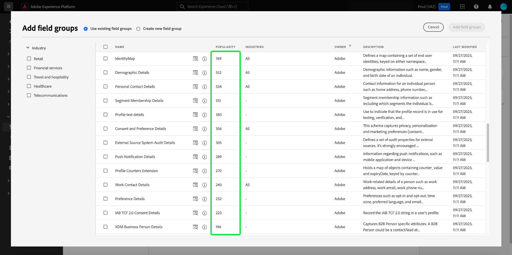

# を使用してスキーマを作成する [!DNL Schema Editor]

Adobe Experience Platformユーザーインターフェイスを使用すると、 [!DNL Experience Data Model] (XDM) スキーマ [!DNL Schema Editor]. このチュートリアルでは、 [!DNL Schema Editor].

>[!NOTE]
>
>デモ用に、このチュートリアルの手順では、顧客ロイヤルティプログラムのメンバーを説明するサンプルスキーマを作成します。 これらの手順を使用して、独自の目的で別のスキーマを作成できますが、まずサンプルスキーマの作成に従って、 [!DNL Schema Editor].

を使用してスキーマを作成する場合は、 [!DNL Schema Registry] API を使用する場合は、まず [[!DNL Schema Registry] 開発者ガイド](../api/getting-started.md) ～に関するチュートリアルを試みる前に [API を使用したスキーマの作成](create-schema-api.md).

## はじめに

このチュートリアルでは、スキーマの作成に関わるAdobe Experience Platformの様々な側面に関する十分な知識が必要です。 このチュートリアルを始める前に、次の概念に関するドキュメントを確認してください。

* [[!DNL Experience Data Model (XDM)]](../home.md)：[!DNL Platform] がカスタマーエクスペリエンスのデータの整理に使用する、標準化されたフレームワーク。
   * [スキーマ構成の基本](../schema/composition.md):XDM スキーマとその構築ブロック（クラス、スキーマフィールドグループ、データタイプ、個々のフィールドを含む）の概要です。
* [[!DNL Real-time Customer Profile]](../../profile/home.md)：複数のソースからの集計データに基づいて、統合されたリアルタイムの顧客プロファイルを提供します。

## を開きます。 [!UICONTROL スキーマ] workspace {#browse}

この [!UICONTROL スキーマ] ワークスペース [!DNL Platform] UI には、 [!DNL Schema Library]を使用すると、組織で使用可能なスキーマを表示管理できます。 ワークスペースには、 [!DNL Schema Editor]：このチュートリアル全体でスキーマを作成できるキャンバスです。

へのログイン後 [!DNL Experience Platform]を選択します。 **[!UICONTROL スキーマ]** 左側のナビゲーションで、 **[!UICONTROL スキーマ]** ワークスペース。 この **[!UICONTROL 参照]** 「 」タブには、スキーマのリスト ( [!DNL Schema Library]) を参照してください。 リストには、スキーマの基となる名前、型、クラス、動作（レコードまたは時系列）、およびスキーマが最後に変更された日時が含まれます。

詳しくは、 [UI での既存の XDM リソースの調査](../ui/explore.md) を参照してください。

## スキーマの作成と命名 {#create}

スキーマの構成を開始するには、「 **[!UICONTROL スキーマを作成]** の右上隅に **[!UICONTROL スキーマ]** ワークスペース。 ドロップダウンメニューが表示され、コアクラスの中から選択できます [!UICONTROL XDM 個人プロファイル] および [!UICONTROL XDM ExperienceEvent]. これらのクラスが目的に合わない場合は、 **[!UICONTROL 参照]** 他の使用可能なクラスから選択するか、 [新しいクラスを作成](#create-new-class).

このチュートリアルの目的で、 **[!UICONTROL XDM 個人プロファイル]**.

スキーマの基となる標準 XDM クラスを選択したので、 **[!UICONTROL フィールドグループを追加]** ダイアログが表示され、スキーマへのフィールドの追加をすぐに開始できます。 現時点では、「 」を選択します。 **[!UICONTROL キャンセル]** をクリックしてダイアログを終了します。

この [!DNL Schema Editor] が表示されます。 これは、スキーマを作成するキャンバスです。名称未設定のスキーマが **[!UICONTROL 構造]** セクションに追加されます。 スキーマに割り当てられたクラスは、の下にも表示されます。 **[!UICONTROL クラス]** in **[!UICONTROL 構成]** 」セクションに入力します。

>[!NOTE]
>
> スキーマが保存される前の初期構成プロセス中の任意の時点で[スキーマのクラスを変更](#change-class)できますが、これは非常に注意しておこなう必要があります。フィールドグループは特定のクラスとのみ互換性があるので、クラスを変更するとキャンバスと追加したフィールドがリセットされます。

エディターの右側にあるフィールドを使用して、スキーマの表示名と説明（オプション）を指定します。 名前を入力すると、キャンバスが更新され、スキーマの新しい名前が反映されます。

スキーマの名前を決定する際に考慮すべき重要な点がいくつかあります。

* 後でスキーマを簡単に見つけられるように、スキーマ名は短く、説明的な名前にする必要があります。
* スキーマ名は一意である必要があります。つまり、将来再利用されないように十分に具体的でなければなりません。例えば、組織が異なるブランドに対して別々のロイヤルティプログラムを持つ場合、後で定義する他のロイヤルティ関連スキーマと区別しやすいように、スキーマに「ブランド A ロイヤルティメンバー」という名前を付けると効果的です。
* また、スキーマの説明を使用して、スキーマに関する追加のコンテキスト情報を指定することもできます。

このチュートリアルでは、ロイヤルティプログラムのメンバーに関連するデータを取り込むスキーマを構成するので、スキーマの名前は「ロイヤルティメンバー」になります。

## フィールドグループを追加 {#field-group}

これで、フィールドグループを追加して、スキーマにフィールドを追加できます。 フィールドグループは、1 つ以上のフィールドのグループで、特定の概念を説明するために一緒に使用されることがよくあります。 このチュートリアルでは、フィールドグループを使用してロイヤルティプログラムのメンバーを説明し、名前、誕生日、電話番号、住所などの主要な情報を取り込みます。

フィールドグループを追加するには、「 **[!UICONTROL 追加]** 内 **[!UICONTROL フィールドグループ]** サブセクション

新しいダイアログが開き、使用可能なフィールドグループのリストが表示されます。 各フィールドグループは、特定のクラスでのみ使用するためのものなので、ダイアログには、選択したクラス ( この場合は [!DNL XDM Individual Profile] クラス ) です。 標準の XDM クラスを使用している場合、フィールドグループのリストは、使用頻度に基づいてインテリジェントに並べ替えられます。

リストからフィールドグループを選択すると、右側のパネルに表示されます。 必要に応じて複数のフィールドグループを選択し、確認する前に各フィールドグループを右側のレールのリストに追加できます。 また、現在選択されているフィールドグループの右側にアイコンが表示され、提供されるフィールドの構造をプレビューできます。

フィールドグループをプレビューする際に、フィールドグループのスキーマに関する詳細な説明が右側のパネルに表示されます。 また、提供されたキャンバスでフィールドグループのフィールド間を移動することもできます。 別のフィールドを選択すると、右側のレールが更新され、該当するフィールドの詳細が表示されます。 選択 **[!UICONTROL 戻る]** プレビューが完了したら、フィールドグループ選択ダイアログに戻ります。

このチュートリアルでは、 **[!UICONTROL 人口統計の詳細]** 「 」フィールドグループに移動して、「 」を選択します。 **[!UICONTROL フィールドグループを追加]**.

スキーマキャンバスが再び表示されます。この **[!UICONTROL フィールドグループ]** セクションに「 」が表示されるようになりました[!UICONTROL 人口統計の詳細]「と **[!UICONTROL 構造]** 「 」セクションには、フィールドグループが提供するフィールドが含まれます。 フィールドグループの名前は、 **[!UICONTROL フィールドグループ]** 「 」セクションを使用して、キャンバス内に表示される特定のフィールドをハイライト表示します。

このフィールドグループは、最上位の名前の下に複数のフィールドを表示します `person` データタイプ「[!UICONTROL 人物]&quot;. このフィールドグループは、名前、生年月日、性別など、個人に関する情報を説明します。

>[!NOTE]
>
>フィールドでは、スカラ型（文字列、整数、配列、日付など）と共に、 [!DNL Schema Registry].

この `name` フィールドのデータ型は「[!UICONTROL 人物名]」という意味では、一般的な概念を表し、名、姓、敬称、サフィックスなど、名前関連のサブフィールドが含まれます。

キャンバス内の様々なフィールドを選択して、スキーマ構造に影響を与える追加のフィールドを表示します。

## 別のフィールドグループを追加 {#field-group-2}

同じ手順を繰り返して、別のフィールドグループを追加できます。 次を表示する場合： **[!UICONTROL フィールドグループを追加]** 今回は、「[!UICONTROL 人口統計の詳細]「 」フィールドグループはグレー表示になっており、隣のチェックボックスは選択できません。 これにより、既に現在のスキーマに含まれているフィールドグループを誤って複製するのを防ぐことができます。

このチュートリアルでは、[!DNL Personal Contact Details]」ダイアログからフィールドグループを選択し、 **[!UICONTROL フィールドグループを追加]** をクリックしてスキーマに追加します。

追加すると、キャンバスが再び表示されます。&quot;[!UICONTROL 個人の連絡先の詳細]」が **[!UICONTROL フィールドグループ]** 内 **[!UICONTROL 構成]** セクション、および自宅住所、携帯電話などのフィールドが、 **[!UICONTROL 構造]**.

次に類似 `name` 「 」フィールドに値を入力すると、先ほど追加したフィールドが複数フィールドの概念を表します。 例： `homeAddress` のデータタイプは「[!UICONTROL 郵送先住所]&quot;および&quot; `mobilePhone` のデータタイプは「[!UICONTROL 電話番号]&quot;. これらの各フィールドを選択して展開し、データ型に含まれる追加のフィールドを確認できます。

## カスタムフィールドグループを定義する {#define-field-group}

「[!UICONTROL ロイヤルティメンバー]スキーマは、ロイヤルティプログラムのメンバーに関連するデータを取り込むためのものなので、特定のロイヤルティ関連フィールドが必要になります。

基準がある [!UICONTROL ロイヤルティの詳細] フィールドグループを追加します。このグループを使用して、ロイヤルティプログラムに関連する共通フィールドを取り込むことができます。 標準フィールドグループを使用して、スキーマでキャプチャした概念を表すことを強くお勧めしますが、標準ロイヤルティフィールドグループの構造では、特定のロイヤルティプログラムの関連データをすべて取り込めない場合があります。 このシナリオでは、新しいカスタムフィールドグループを定義して、代わりにこれらのフィールドを取り込むことを選択できます。

を開きます。 **[!UICONTROL フィールドグループを追加]** ダイアログが再び表示されますが、今回は「 **[!UICONTROL 新しいフィールドグループの作成]** 一番上の近くに 次に、フィールドグループの表示名と説明を入力するよう求められます。

クラス名と同様に、フィールドグループ名は短く単純で、フィールドグループがスキーマに与える影響を説明する必要があります。 これらも一意なので、名前を再利用できません。名前が十分に具体的であるようにしてください。

このチュートリアルでは、新しいフィールドグループに「Loyalty Details」と名前を付けます。

選択 **[!UICONTROL フィールドグループを追加]** に戻る [!DNL Schema Editor]. &quot;[!UICONTROL ロイヤルティの詳細]」が **[!UICONTROL フィールドグループ]** キャンバスの左側には表示されますが、関連付けられているフィールドはまだないので、下に新しいフィールドは表示されません。 **[!UICONTROL 構造]**.

## フィールドグループにフィールドを追加する {#field-group-fields}

「Loyalty Details」フィールドグループを作成したら、次に、フィールドグループがスキーマに貢献するフィールドを定義します。

まず、 **[!UICONTROL フィールドグループ]** 」セクションに入力します。 これをおこなうと、フィールドグループのプロパティがエディターの右側に表示され、 **プラス (+)** の下にスキーマ名の横に表示されるアイコン **[!UICONTROL 構造]**.

を選択します。 **プラス (+)** アイコン[!DNL Loyalty Members]」と入力して、構造内に新しいノードを作成します。 このノード ( `_tenantId` この例では ) は、IMS 組織のテナント ID を表し、前にアンダースコアが付きます。 テナント ID の存在は、追加するフィールドが組織の名前空間に限られていることを示しています。

つまり、追加しようとしているフィールドは組織に固有で、 [!DNL Schema Registry] （組織のみがアクセスできる特定の領域） 他の標準クラス、フィールドグループ、データタイプおよびフィールドの名前との競合を防ぐために、定義したフィールドは、常にテナント名前空間に追加する必要があります。

その名前空間ノード内には、[!UICONTROL 新規フィールド]&quot;. これは、[!UICONTROL ロイヤルティの詳細]」フィールドグループ内に存在します。

エディターの右側にあるコントロールを使用して、まず `loyalty` タイプ「 」のフィールド[!UICONTROL オブジェクト]」をクリックします。 終了したら、「 」を選択します。 **[!UICONTROL 適用]**.

変更が適用され、新しく作成された `loyalty` オブジェクトが表示されます。 を選択します。 **プラス (+)** オブジェクトの横にあるアイコンをクリックして、その他のロイヤルティ関連のフィールドを追加します。 A &quot;[!UICONTROL 新規フィールド]」が表示され、 **[!UICONTROL フィールドプロパティ]** セクションがキャンバスの右側に表示されます。

各フィールドには、次の情報が必要です。

* **[!UICONTROL フィールド名]:** キャメルケースで書かれたフィールドの名前。 例：loyaltyLevel
* **[!UICONTROL 表示名]:** フィールドの名前。タイトルケースで記述されます。 例：Loyalty Level
* **[!UICONTROL タイプ]:** フィールドのデータタイプ。 これには、基本的なスカラー型と、 [!DNL Schema Registry]. 例： [!UICONTROL 文字列], [!UICONTROL 整数], [!UICONTROL ブール値], [!UICONTROL 人物], [!UICONTROL 住所], [!UICONTROL 電話番号]など
* **[!UICONTROL 説明]:** フィールドのオプションの説明は、大文字と小文字で記述し、最大 200 文字にする必要があります。

の最初のフィールド `Loyalty` オブジェクトは、 `loyaltyId`. 新しいフィールドのタイプを「[!UICONTROL 文字列]「 **[!UICONTROL フィールドプロパティ]** 「 」セクションには、デフォルト値、形式、最大長など、制約を適用するためのオプションがいくつか設定されます。

選択したデータ型に応じて、様々な制約オプションを使用できます。次以降 `loyaltyId` 電子メールアドレスを選択します。[!UICONTROL 電子メール]」 **[!UICONTROL 形式]** ドロップダウンメニュー。 「**[!UICONTROL 適用]**」を選択して変更を適用します。

## フィールドグループにフィールドを追加する {#field-group-fields-2}

これで、 `loyaltyId` フィールドに、次のようなロイヤルティ関連の情報を取り込むためのフィールドを追加できます。

* ポイント（整数）
* メンバー登録日（日付）

各フィールドをスキーマに追加するには、 **プラス (+)** 横のアイコン `loyalty` オブジェクトを選択し、必要な情報を入力します。

完了すると、Loyalty オブジェクトに、loyalty ID、ポイント、メンバー登録日のフィールドが含まれます。

## フィールドグループに列挙フィールドを追加する {#enum}

フィールドを [!DNL Schema Editor]を使用する場合、フィールドに格納できるデータにさらに制約を加えるために、基本的なフィールドタイプに適用できる追加のオプションがいくつかあります。 これらの制限の使用例を次の表に示します。

| 制約 | 説明 |
| --- | --- |
| [!UICONTROL 必須] | データの取り込みにフィールドが必須であることを示します。 このフィールドを含まないデータセットに基づいてスキーマセットにアップロードされたデータの取得は失敗します。 |
| [!UICONTROL 配列] | フィールドに値の配列が含まれ、各値は指定されたデータ型を持つことを示します。 例えば、データ型が「[!UICONTROL 文字列]&quot;は、フィールドに文字列の配列を含めることを指定します。 |
| [!UICONTROL 列挙] | このフィールドに、可能な値の列挙リストの値の 1 つを含める必要があることを示します。 |
| [!UICONTROL ID] | このフィールドが ID フィールドであることを示します。 ID フィールドの詳細については、[このチュートリアルの後半](#identity-field)で説明します。 |
| [!UICONTROL 関係] | スキーマの関係は、和集合スキーマと [!DNL Real-time Customer Profile]同じクラスを共有するスキーマにのみ適用されます。 この [!UICONTROL 関係] 制約は、このフィールドが、異なるクラスに基づいてスキーマのプライマリ ID を参照し、2 つのスキーマ間の関係を意味することを示します。 に関するチュートリアルを参照してください。 [関係の定義](./relationship-ui.md) を参照してください。 |

{style=&quot;table-layout:auto&quot;}

>[!NOTE]
>
>必須、ID または関係のフィールドが左側のレールに表示され、複雑さに関係なく、これらのフィールドを簡単に見つけることができます。
>
>

このチュートリアルでは、 [!DNL "loyalty"] スキーマのオブジェクトには、顧客の「ロイヤルティレベル」を説明する新しい enum フィールドが必要です。このフィールドの値は、4 つのオプションの中の 1 つのみです。 このフィールドをスキーマに追加するには、 **プラス (+)** 横のアイコン `loyalty` オブジェクトを選択し、 **[!UICONTROL フィールド名]** および **[!UICONTROL 表示名]**. の場合 **[!UICONTROL タイプ]**&#x200B;を選択します。[!UICONTROL 文字列]&quot;.

タイプが選択された後、フィールドに対して追加のチェックボックスが表示されます。これには、 **[!UICONTROL 配列]**, **[!UICONTROL Enum]**、および **[!UICONTROL ID]**.

を選択します。 **[!UICONTROL Enum]** チェックボックスをオンにして開きます。 **[!UICONTROL 列挙値]** 」の節を参照してください。 ここで、許容可能な各ロイヤルティレベルの&#x200B;**[!UICONTROL 値]**（キャメルケース）と&#x200B;**[!UICONTROL ラベル]**（タイトルケースでの読みやすい名前でオプション）を入力できます。

すべてのフィールドプロパティを完了したら、「 **[!UICONTROL 適用]** を追加します。[!DNL loyaltyLevel]」フィールドから `loyalty` オブジェクト。

## 複数フィールドオブジェクトのデータ型への変換 {#datatype}

この `loyalty` オブジェクトには、複数のロイヤルティ固有のフィールドが含まれ、他のスキーマで役立つ共通のデータ構造を表します。 この [!DNL Schema Editor] では、再利用可能な複数フィールドオブジェクトを簡単に適用できます。そのためには、これらのオブジェクトの構造をデータ型に変換します。

データ型を使用すると、複数フィールド構造を一貫して使用でき、フィールドグループよりも柔軟性が高まります。これは、データ型がスキーマ内の任意の場所で使用できるからです。 これは、フィールドの **[!UICONTROL タイプ]** の値を、 [!DNL Schema Registry].

次の手順で `loyalty` オブジェクトをデータ型に設定する場合は、 `loyalty` ～の下のフィールド **[!UICONTROL 構造]**&#x200B;を選択し、「 **[!UICONTROL 新しいデータ型に変換]** エディターの右側の下に **[!UICONTROL フィールドプロパティ]**. オブジェクトが正常に変換されたことを示す緑のポップオーバーが表示されます。

さて、下を見ると **[!UICONTROL 構造]**&#x200B;で、 `loyalty` フィールドのデータ型は「[!DNL Loyalty]」と表示され、その横に小さなロックアイコンが表示されます。これは、フィールドが個々のフィールドではなく、複数フィールドのデータ型の一部であることを示しています。

今後のスキーマでは、フィールドを「[!DNL Loyalty]「 」タイプの場合は、ID、ロイヤルティレベル、メンバー登録日、ポイントのフィールドが自動的に含まれます。

>[!NOTE]
>
>また、スキーマの編集とは別に、カスタムデータタイプの作成や編集をおこなうこともできます。 詳しくは、 [データ型の作成と編集](../ui/resources/data-types.md) を参照してください。

## スキーマフィールドの検索とフィルタリング

スキーマに、基本クラスで提供されるフィールドに加えて、複数のフィールドグループが含まれるようになりました。 大きなスキーマを扱う場合は、左側のレールでフィールドグループ名の横にあるチェックボックスをオンにして、表示されるフィールドを、目的のフィールドグループが提供するフィールドのみにフィルタリングできます。

スキーマ内の特定のフィールドを検索する場合は、検索バーを使用して、表示されるフィールドを、その下に提供されるフィールドグループに関係なく、名前でフィルタリングすることもできます。

>[!IMPORTANT]
>
>検索機能は、一致するフィールドを表示する際に、選択したフィールドグループフィルターを考慮に入れます。 検索クエリで期待した結果が表示されない場合は、関連するフィールドグループがフィルタリングされていないことを再確認する必要がある場合があります。

## ID フィールドとしてのスキーマフィールドの設定 {#identity-field}

スキーマが提供する標準的なデータ構造を利用して、複数のソースにわたって同じ個人に属するデータを識別でき、セグメント化、レポート、データサイエンス分析など、様々なダウンストリームの使用例に使用できます。 個々の ID に基づいてデータをステッチするには、キーフィールドを [!UICONTROL ID] フィールドを使用できます。

[!DNL Experience Platform] を使用すると、ID フィールドを簡単に示すことができます **[!UICONTROL ID]** チェックボックスを [!DNL Schema Editor]. ただし、データの特性に基づいて、ID として使用するのに最適な候補はどのフィールドかを決定する必要があります。

例えば、同じ「ロイヤルティレベル」に属するロイヤリティプログラムメンバーが数千人いる場合がありますが、ロイヤルティプログラムの各メンバーは一意のを持ちます `loyaltyId` （このインスタンスでは、個々のメンバーの電子メールアドレスになります）。 この事実は `loyaltyId` は、各メンバーの一意の識別子で、ID フィールドの適切な候補となります。 `loyaltyLevel` がではありません。

>[!IMPORTANT]
>
>以下の手順では、既存のスキーマフィールドに ID 記述子を追加する方法を説明します。 スキーマ自体の構造内で ID フィールドを定義する代わりに、 `identityMap` id 情報を格納するフィールドを指定します。
>
>を使用する予定がある場合、 `identityMap`に含める場合、スキーマに直接追加したプライマリ id が上書きされることに注意してください。 詳しくは、 `identityMap` 内 [スキーマ構成ガイドの基本事項](../schema/composition.md#identityMap) を参照してください。

内 **[!UICONTROL 構造]** エディターの「 」セクションで、 `loyaltyId` フィールドと **[!UICONTROL ID]** の下に表示されるチェックボックス **[!UICONTROL フィールドプロパティ]**. チェックボックスと、をに設定するオプションをオンにします。 **[!UICONTROL プライマリID]** が表示されます。 このボックスも選択します。

>[!NOTE]
>
>各スキーマには、1 つのプライマリ ID フィールドのみを含めることができます。スキーマフィールドをプライマリ ID として設定した場合、後でスキーマ内の別の ID フィールドをプライマリとして設定しようとすると、エラーメッセージが表示されます。

次に、 **[!UICONTROL ID 名前空間]** 」をドロップダウンの定義済み名前空間のリストから選択します。 次以降 `loyaltyId` はお客様のメールアドレスで、[!UICONTROL 電子メール]」をドロップダウンから選択します。 選択 **[!UICONTROL 適用]** 更新を確認するには、 `loyaltyId` フィールドに入力します。

>[!NOTE]
>
>標準名前空間のリストとその定義については、 [[!DNL Identity Service] ドキュメント](../../identity-service/troubleshooting-guide.md#standard-namespaces).

変更を適用した後、 `loyaltyId` は、それが id フィールドになったことを示すフィンガープリント記号を表示します。

これで、 `loyaltyId` フィールドは、その個人を識別し、その顧客の単一のビューをつなぎ合わせるのに使用されます。 での ID の使用について詳しくは、以下を参照してください。 [!DNL Experience Platform]、次を確認してください： [[!DNL Identity Service]](../../identity-service/home.md) ドキュメント。

## でのスキーマ使用の有効化 [!DNL Real-time Customer Profile] {#profile}

[[!DNL Real-time Customer Profile]](../../profile/home.md) での id データの活用 [!DNL Experience Platform] 各顧客の全体像を提供する。 このサービスは、顧客属性の堅牢な 360°プロファイルと、と統合されたシステム全体で顧客が持つすべてのインタラクションのタイムスタンプ付きアカウントを構築します。 [!DNL Experience Platform].

スキーマをで使用できるようにするには [!DNL Real-time Customer Profile]の場合は、プライマリ ID が定義されている必要があります。 最初にプライマリ ID を定義せずにスキーマを有効にしようとすると、エラーメッセージが表示されます。

 

での「ロイヤルティメンバー」スキーマの使用を有効にするには [!DNL Profile]を選択し、「[!DNL Loyalty Members]」 **[!UICONTROL 構造]** 」セクションに表示されます。

エディターの右側に、スキーマの表示名、説明、タイプなどの情報が表示されます。 この情報に加えて、 **[!UICONTROL プロファイル]** 切り替えボタン。

選択 **[!UICONTROL プロファイル]** スキーマを有効にするかどうかを確認するポップオーバーが表示されます。 [!DNL Profile].

 

>[!WARNING]
>
>スキーマが [!DNL Real-time Customer Profile] とを保存した場合、無効にすることはできません。

選択 **[!UICONTROL 有効にする]** をクリックして選択を確定します。 次の項目を選択できます。 **[!UICONTROL プロファイル]** 必要に応じてスキーマを再度無効にします。ただし、スキーマは [!DNL Profile] が有効になっている場合は、無効にできなくなります。

## 次の手順と追加のリソース

これで、スキーマの合成が完了し、キャンバスに完全なスキーマが表示されます。 選択 **[!UICONTROL 保存]** スキーマは [!DNL Schema Library]を使用し、 [!DNL Schema Registry].

これで、新しいスキーマを使用して、にデータを取り込めるようになります。 [!DNL Platform]. データの取得にスキーマを使用した後は、追加的な変更のみがおこなわれる場合があります。スキーマバージョン管理について詳しくは、「[スキーマ合成の基本](../schema/composition.md)」を参照してください。

次のチュートリアルに従ってください： [UI でのスキーマ関係の定義](./relationship-ui.md) をクリックして、「ロイヤルティメンバー」スキーマに新しい関係フィールドを追加します。

「ロイヤルティメンバー」スキーマは、 [!DNL Schema Registry] API API の使用を開始するには、まず [[!DNL Schema Registry API] 開発者ガイド](../api/getting-started.md).

### ビデオリソース

>[!WARNING]
>
>この [!DNL Platform] 次のビデオに示す UI は古くなっています。 最新の UI のスクリーンショットと機能については、上記のドキュメントを参照してください。

次のビデオでは、 [!DNL Platform] UI

>[!VIDEO](https://video.tv.adobe.com/v/27012?quality=12&learn=on)

次のビデオは、フィールドグループとクラスの操作に関する理解を深めるためのものです。

>[!VIDEO](https://video.tv.adobe.com/v/27013?quality=12&learn=on)

## 付録

以下の節では、 [!DNL Schema Editor].

### 新しいクラスの作成 {#create-new-class}

[!DNL Experience Platform] は、組織に固有のクラスに基づいてスキーマを定義する柔軟性を提供します。新しいクラスの作成方法については、 [UI でのクラスの作成と編集](../ui/resources/classes.md#create).

### スキーマクラスの変更 {#change-class}

スキーマが保存される前の初期構成プロセス中の任意の時点で、スキーマのクラスを変更できます。

>[!WARNING]
>
>スキーマのクラスの再割り当ては、非常に注意しておこなう必要があります。 フィールドグループは特定のクラスとのみ互換性があるので、クラスを変更するとキャンバスと追加したフィールドがリセットされます。

スキーマのクラスを変更する方法については、 [UI でのスキーマの管理](../ui/resources/schemas.md).
