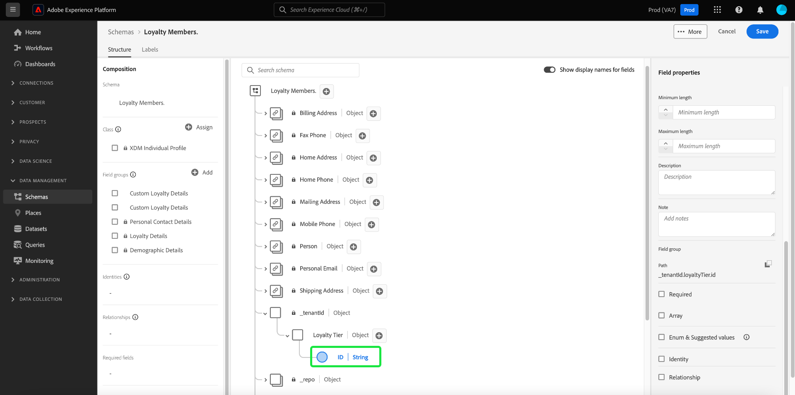

# を使用してスキーマを作成する [!DNL Schema Editor]

Adobe Experience Platformユーザーインターフェイスを使用すると、 [!DNL Experience Data Model] (XDM) スキーマ [!DNL Schema Editor]. このチュートリアルでは、 [!DNL Schema Editor].

デモ用に、このチュートリアルの手順では、顧客ロイヤルティプログラムのメンバーを説明するサンプルスキーマを作成します。 これらの手順を使用して、独自の目的で別のスキーマを作成できますが、まずサンプルスキーマの作成に従って、 [!DNL Schema Editor].

>[!NOTE]
>
>CSV データを Platform に取り込む場合は、 [AI で生成されたレコメンデーションによって作成された XDM スキーマにそのデータをマッピングします。](../../ingestion/tutorials/map-csv/recommendations.md) （現在はベータ版）。手動でスキーマを作成する必要はありません。
>
>を使用してスキーマを作成する場合は、 [!DNL Schema Registry] API( まず、 [[!DNL Schema Registry] 開発者ガイド](../api/getting-started.md) ～に関するチュートリアルを試みる前に [API を使用したスキーマの作成](create-schema-api.md).

## はじめに

このチュートリアルでは、スキーマの作成に関わるAdobe Experience Platformの様々な側面に関する十分な知識が必要です。 このチュートリアルを始める前に、次の概念に関するドキュメントを確認してください。

* [[!DNL Experience Data Model (XDM)]](../home.md)：[!DNL Platform] が、カスタマーエクスペリエンスデータを整理する際に使用する、標準化されたフレームワーク。
   * [スキーマ構成の基本](../schema/composition.md):XDM スキーマとその構築ブロック（クラス、スキーマフィールドグループ、データタイプ、個々のフィールドを含む）の概要です。
* [[!DNL Real-Time Customer Profile]](../../profile/home.md)：複数のソースからの集計データに基づいて、統合されたリアルタイムの顧客プロファイルを提供します。

## を開きます。 [!UICONTROL スキーマ] workspace {#browse}

この [!UICONTROL スキーマ] ワークスペース [!DNL Platform] UI には、 [!DNL Schema Library]を使用すると、組織で使用可能なスキーマを表示管理できます。 ワークスペースには、 [!DNL Schema Editor]：このチュートリアル全体でスキーマを作成できるキャンバスです。

へのログイン後 [!DNL Experience Platform]を選択します。 **[!UICONTROL スキーマ]** 左側のナビゲーションで、 **[!UICONTROL スキーマ]** ワークスペース。 この **[!UICONTROL 参照]** 「 」タブには、スキーマのリスト ( [!DNL Schema Library]) を参照してください。 リストには、スキーマの基となる名前、型、クラス、動作（レコードまたは時系列）、およびスキーマが最後に変更された日時が含まれます。

詳しくは、 [UI での既存の XDM リソースの調査](../ui/explore.md) を参照してください。

## スキーマの作成と命名 {#create}

スキーマの構成を開始するには、「 **[!UICONTROL スキーマを作成]** の右上隅に **[!UICONTROL スキーマ]** ワークスペース。 ドロップダウンメニューが表示され、コアクラスの中から選択できます [!UICONTROL XDM 個人プロファイル] および [!UICONTROL XDM ExperienceEvent]. これらのクラスが目的に合わない場合は、 **[!UICONTROL 参照]** 他の使用可能なクラスから選択するか、 [新しいクラスを作成](#create-new-class).

このチュートリアルの目的で、 **[!UICONTROL XDM 個人プロファイル]**.

この [!DNL Schema Editor] が表示されます。 これは、スキーマを作成するキャンバスです。名称未設定のスキーマが **[!UICONTROL 構造]** セクションに追加されます。 スキーマに割り当てられたクラスは、の下にも表示されます。 **[!UICONTROL クラス]** in **[!UICONTROL 構成]** 」セクションに入力します。

>[!NOTE]
>
> スキーマが保存される前の初期構成プロセス中の任意の時点で[スキーマのクラスを変更](#change-class)できますが、これは非常に注意しておこなう必要があります。フィールドグループは特定のクラスとのみ互換性があるので、クラスを変更するとキャンバスと追加したフィールドがリセットされます。

の下 **[!UICONTROL スキーマのプロパティ]**&#x200B;で、スキーマの表示名と説明（オプション）を入力します。 名前を入力すると、キャンバスが更新され、スキーマの新しい名前が反映されます。

スキーマの名前を決定する際に考慮すべき重要な点がいくつかあります。

* 後でスキーマを簡単に見つけられるように、スキーマ名は短く、説明的な名前にする必要があります。
* スキーマ名は一意である必要があります。つまり、将来再利用されないように十分に具体的でなければなりません。例えば、組織が異なるブランドに対して別々のロイヤルティプログラムを持つ場合、後で定義する他のロイヤルティ関連スキーマと区別しやすいように、スキーマに「ブランド A ロイヤルティメンバー」という名前を付けると効果的です。
* また、スキーマの説明を使用して、スキーマに関する追加のコンテキスト情報を指定することもできます。

このチュートリアルでは、ロイヤルティプログラムのメンバーに関連するデータを取り込むスキーマを構成するので、スキーマの名前は「[!DNL Loyalty Members]&quot;.

## フィールドグループを追加 {#field-group}

これで、フィールドグループを追加して、スキーマにフィールドを追加できます。 フィールドグループは、1 つ以上のフィールドのグループで、特定の概念を説明するために一緒に使用されることがよくあります。 このチュートリアルでは、フィールドグループを使用してロイヤルティプログラムのメンバーを説明し、名前、誕生日、電話番号、住所などの主要な情報を取り込みます。

フィールドグループを追加するには、「 **[!UICONTROL 追加]** 内 **[!UICONTROL フィールドグループ]** サブセクション

新しいダイアログが開き、使用可能なフィールドグループのリストが表示されます。 各フィールドグループは、特定のクラスでのみ使用するためのものなので、ダイアログには、選択したクラス ( この場合は [!DNL XDM Individual Profile] クラス ) です。 標準の XDM クラスを使用している場合、フィールドグループのリストは、使用頻度に基づいてインテリジェントに並べ替えられます。

左側のレールでいずれかのフィルターを選択して、標準フィールドグループのリストを特定の [業界](../schema/industries/overview.md) 小売、金融サービス、医療など。

リストからフィールドグループを選択すると、右側のパネルに表示されます。 必要に応じて複数のフィールドグループを選択し、確認する前に各フィールドグループを右側のレールのリストに追加できます。 また、現在選択されているフィールドグループの右側にアイコンが表示され、提供されるフィールドの構造をプレビューできます。

フィールドグループをプレビューする際に、右側のパネルに、フィールドグループのスキーマに関する詳細な説明が表示されます。 また、提供されたキャンバスでフィールドグループのフィールド間を移動することもできます。 別のフィールドを選択すると、右側のレールが更新され、該当するフィールドの詳細が表示されます。 選択 **[!UICONTROL 戻る]** プレビューが完了したら、フィールドグループ選択ダイアログに戻ります。

このチュートリアルでは、 **[!UICONTROL 人口統計の詳細]** 「 」フィールドグループに移動して、「 」を選択します。 **[!UICONTROL フィールドグループを追加]**.

スキーマキャンバスが再び表示されます。この **[!UICONTROL フィールドグループ]** セクションに「 」が表示されるようになりました[!UICONTROL 人口統計の詳細]「と **[!UICONTROL 構造]** 「 」セクションには、フィールドグループが提供するフィールドが含まれます。 フィールドグループの名前は、 **[!UICONTROL フィールドグループ]** 「 」セクションを使用して、キャンバス内に表示される特定のフィールドをハイライト表示します。

このフィールドグループは、最上位の名前の下に複数のフィールドを表示します `person` データタイプ「[!UICONTROL 人物]&quot;. このフィールドグループは、名前、生年月日、性別など、個人に関する情報を説明します。

>[!NOTE]
>
>フィールドでは、スカラ型（文字列、整数、配列、日付など）と共に、 [!DNL Schema Registry].

この `name` フィールドのデータ型は「[!UICONTROL 氏名]」という意味では、一般的な概念を表し、名、姓、敬称、サフィックスなど、名前関連のサブフィールドが含まれます。

キャンバス内の様々なフィールドを選択して、スキーマ構造に影響を与える追加のフィールドを表示します。

## さらにフィールドグループを追加 {#field-group-2}

同じ手順を繰り返して、別のフィールドグループを追加できます。 次を表示する場合： **[!UICONTROL フィールドグループを追加]** 今回は、「[!UICONTROL 人口統計の詳細]「 」フィールドグループはグレー表示になっており、隣のチェックボックスは選択できません。 これにより、既に現在のスキーマに含まれているフィールドグループを誤って複製するのを防ぐことができます。

このチュートリアルでは、標準フィールドグループを選択します **[!UICONTROL 個人の連絡先の詳細]** および **[!UICONTROL ロイヤルティの詳細]** リストから、 **[!UICONTROL フィールドグループを追加]** スキーマに追加します。

キャンバスが再び表示され、追加したフィールドグループがの下にリストされます。 **[!UICONTROL フィールドグループ]** 内 **[!UICONTROL 構成]** セクション、およびその複合フィールドがスキーマ構造に追加されました。

## カスタムフィールドグループを定義する {#define-field-group}

この [!UICONTROL ロイヤルティメンバー] スキーマは、ロイヤルティプログラムのメンバーに関連するデータと標準の [!UICONTROL ロイヤルティの詳細] スキーマに追加したフィールドグループは、プログラムタイプ、ポイント、結合日など、これらのほとんどを提供します。

ただし、使用例を達成するために、標準フィールドグループでカバーされない追加のカスタムフィールドを含めたい場合があります。 カスタムロイヤルティフィールドを追加する場合、次の 2 つのオプションがあります。

1. 新しいカスタムフィールドグループを作成して、これらのフィールドをキャプチャします。 これは、このチュートリアルで説明する方法です。
1. 標準の拡張 [!UICONTROL ロイヤルティの詳細] カスタムフィールドを含むフィールドグループを作成します。 これは [!UICONTROL ロイヤルティの詳細] をカスタムフィールドグループに変換すると、元の標準フィールドグループは使用できなくなります。 詳しくは、 [!UICONTROL スキーマ] UI ガイドを参照してください。 [標準フィールドグループの構造にカスタムフィールドを追加する](../ui/resources/schemas.md#custom-fields-for-standard-groups).

新しいフィールドグループを作成するには、 **[!UICONTROL 追加]** 内 **[!UICONTROL フィールドグループ]** 前と同様のサブセクションですが、今回はオンにします **[!UICONTROL 新しいフィールドグループの作成]** 表示されるダイアログの上部付近に表示されます。 次に、新しいフィールドグループの表示名と説明を入力するよう求められます。 このチュートリアルでは、新しいフィールドグループに「[!DNL Custom Loyalty Details]」を選択し、 **[!UICONTROL フィールドグループを追加]**.

>[!NOTE]
>
>クラス名と同様に、フィールドグループ名は短く単純で、フィールドグループがスキーマに与える影響を説明する必要があります。 これらも一意なので、名前を再利用できません。名前が十分に具体的であるようにしてください。

&quot;[!DNL Custom Loyalty Details]」が **[!UICONTROL フィールドグループ]** キャンバスの左側には表示されますが、関連付けられているフィールドはまだないので、下に新しいフィールドは表示されません。 **[!UICONTROL 構造]**.

## フィールドグループにフィールドを追加する {#field-group-fields}

これで、[!DNL Custom Loyalty Details]「フィールドグループ」の場合は、フィールドグループがスキーマに貢献するフィールドを定義する時です。

まず、 **プラス (+)** キャンバス内のスキーマ名の横にあるアイコン。

「[!UICONTROL 名称未設定フィールド]「 」プレースホルダーがキャンバスに表示され、右側のレールが更新されてフィールドの設定オプションが表示されます。

このシナリオでは、スキーマには、人物の現在のロイヤルティ層の詳細を説明するオブジェクトタイプのフィールドが必要です。 右側のパネルのコントロールを使用して、 `loyaltyTier` タイプ「 」のフィールド[!UICONTROL オブジェクト]」をクリックします。

の下 **[!UICONTROL 割り当て先]**&#x200B;に値を入力する場合は、フィールドを割り当てるフィールドグループを選択する必要があります。 すべてのスキーマフィールドはクラスまたはフィールドグループに属しているので、このスキーマは標準クラスを使用するので、唯一のオプションはフィールドグループを選択することです。 名前&quot;[!DNL Custom Loyalty Details]」をクリックし、リストからフィールドグループを選択します。

終了したら、「 」を選択します。 **[!UICONTROL 適用]**.

変更が適用され、新しく作成された `loyaltyTier` オブジェクトが表示されます。 これはカスタムフィールドなので、組織のテナント ID に名前空間化されたオブジェクト内に自動的にネストされ、前にアンダースコア (`_tenantId` （この例では）。

>[!NOTE]
>
>テナント ID オブジェクトが存在する場合、追加するフィールドが組織の名前空間に含まれていることを示します。
>
>つまり、追加しようとしているフィールドは組織に固有で、 [!DNL Schema Registry] （組織のみがアクセスできる特定の領域） 他の標準クラス、フィールドグループ、データタイプおよびフィールドの名前との競合を防ぐために、定義したフィールドは、常にテナント名前空間に追加する必要があります。

を選択します。 **プラス (+)** 横のアイコン `loyaltyTier` オブジェクトを使用してサブフィールドの追加を開始します。 新しいフィールドプレースホルダーが表示され、 **[!UICONTROL フィールドプロパティ]** セクションがキャンバスの右側に表示されます。

各フィールドには、次の情報が必要です。

* **[!UICONTROL フィールド名]:** フィールドの名前。できれば camelCase で記述します。 スペース文字は使用できません。 これは、コード内のフィールドおよび他のダウンストリームアプリケーションでフィールドを参照するために使用される名前です。
   * 例：loyaltyLevel
* **[!UICONTROL 表示名]:** フィールドの名前。タイトルケースで記述されます。 これは、スキーマの表示または編集時にキャンバスに表示される名前です。
   * 例：Loyalty Level
* **[!UICONTROL タイプ]:** フィールドのデータタイプ。 これには、基本的なスカラー型と、 [!DNL Schema Registry]. 例： [!UICONTROL 文字列], [!UICONTROL 整数], [!UICONTROL ブール値], [!UICONTROL 人物], [!UICONTROL 住所], [!UICONTROL 電話番号]など
* **[!UICONTROL 説明]:** フィールドの説明（オプション）は、最大 200 文字で指定する必要があります。

の最初のフィールド `loyaltyTier` オブジェクトは、 `id`：ロイヤルティメンバーの現在の層の ID を表します。 この会社は、異なる要因に基づいて顧客ごとに異なるロイヤルティ層ポイントのしきい値を設定するので、階層 ID は各ロイヤルティメンバーに対して一意です。 新しいフィールドのタイプを「[!UICONTROL 文字列]「」、および **[!UICONTROL フィールドプロパティ]** 「 」セクションには、デフォルト値、形式、最大長など、制約を適用するためのオプションがいくつか設定されます。

次以降 `id` は、ランダムに生成されるフリーフォーム文字列で、それ以上の制約は必要ありません。 「**[!UICONTROL 適用]**」を選択して変更を適用します。

## フィールドグループにフィールドを追加する {#field-group-fields-2}

これで、 `id` フィールドに、次のようなロイヤルティ層情報を取り込むためのフィールドを追加できます。

* 現在のポイントしきい値（整数）:メンバーが現在の層にとどまるために維持する必要があるロイヤルティポイントの最小数。
* 次の階層ポイントしきい値（整数）:メンバーが次の層に卒業するために生じる必要があるロイヤルティポイントの数。
* 発効日（日時）:ロイヤルティメンバーがこの層に参加した日付。

各フィールドをスキーマに追加するには、 **プラス (+)** 横のアイコン `loyalty` オブジェクトを選択し、必要な情報を入力します。

完了したら、 `loyaltyTier` オブジェクトに次のフィールドが含まれます： `id`, `currentThreshold`, `nextThreshold`、および `effectiveDate`.

## フィールドグループに列挙フィールドを追加する {#enum}

フィールドを [!DNL Schema Editor]を使用する場合、フィールドに格納できるデータにさらに制約を加えるために、基本的なフィールドタイプに適用できる追加のオプションがいくつかあります。 これらの制限の使用例を次の表に示します。

| 制約 | 説明 |
| --- | --- |
| [!UICONTROL 必須] | データの取り込みにフィールドが必須であることを示します。 このフィールドを含まないデータセットに基づいてスキーマセットにアップロードされたデータの取得は失敗します。 |
| [!UICONTROL 配列] | フィールドに値の配列が含まれ、各値は指定されたデータ型を持つことを示します。 例えば、データ型が「[!UICONTROL 文字列]&quot;は、フィールドに文字列の配列を含めることを指定します。 |
| [!UICONTROL 列挙と推奨値] | 列挙型は、このフィールドに、可能な値の列挙リストの値の 1 つを含める必要があることを示します。 また、このオプションを使用して、文字列フィールドに推奨値のリストを指定するだけで、その値にフィールドを制限する必要はありません。 詳しくは、 [列挙と推奨値の定義](../ui/fields/enum.md) UI でこれらの種類のフィールドを管理する方法について詳しくは、を参照してください。 |
| [!UICONTROL ID] | このフィールドが ID フィールドであることを示します。 ID フィールドの詳細については、[このチュートリアルの後半](#identity-field)で説明します。 |
| [!UICONTROL 関係] | スキーマの関係は、和集合スキーマと [!DNL Real-Time Customer Profile]同じクラスを共有するスキーマにのみ適用されます。 この [!UICONTROL 関係] 制約は、このフィールドが、異なるクラスに基づいてスキーマのプライマリ ID を参照し、2 つのスキーマ間の関係を意味することを示します。 に関するチュートリアルを参照してください。 [関係の定義](./relationship-ui.md) を参照してください。 |

{style=&quot;table-layout:auto&quot;}

>[!NOTE]
>
>必須、ID または関係フィールドは、左側のパネルの各セクションに表示され、スキーマの複雑さに関係なく、これらのフィールドを簡単に見つけることができます。

このチュートリアルでは、 `loyaltyTier` スキーマ内のオブジェクトには、階層クラスを記述する新しい enum フィールドが必要です。この場合、値は 4 つのオプションのうち 1 つのみにすることができます。 このフィールドをスキーマに追加するには、 **プラス (+)** 横のアイコン `loyaltyTier` オブジェクトを選択し、 **[!UICONTROL フィールド名]** および **[!UICONTROL 表示名]**. の場合 **[!UICONTROL タイプ]**&#x200B;を選択します。[!UICONTROL 文字列]&quot;.

タイプが選択された後、フィールドに対して追加のチェックボックスが表示されます。これには、 **[!UICONTROL 配列]**, **[!UICONTROL 列挙と推奨値]**, **[!UICONTROL ID]**、および **[!UICONTROL 関係]**.

を選択します。 **[!UICONTROL 列挙と推奨値]** 「 」チェックボックスをオンにして、「 」を選択します。 **[!UICONTROL Enum]**. ここで、 **[!UICONTROL 値]** （キャメルケースで）および **[!UICONTROL 表示名]** 許容可能な各ロイヤルティ層クラスの（タイトルケースでの読みやすい名前でオプション）。

すべてのフィールドプロパティを完了したら、「 **[!UICONTROL 適用]** を追加します。 `tierClass` フィールドから `loyaltyTier` オブジェクト。

## 複数フィールドオブジェクトのデータ型への変換 {#datatype}

この `loyaltyTier` オブジェクトに複数のフィールドが含まれ、他のスキーマで役立つ共通のデータ構造を表すようになりました。 この [!DNL Schema Editor] では、再利用可能な複数フィールドオブジェクトを簡単に適用できます。そのためには、これらのオブジェクトの構造をデータ型に変換します。

データ型を使用すると、複数フィールド構造を一貫して使用でき、フィールドグループよりも柔軟性が高まります。これは、データ型がスキーマ内の任意の場所で使用できるからです。 これは、フィールドの **[!UICONTROL タイプ]** の値を、 [!DNL Schema Registry].

次の手順で `loyaltyTier` オブジェクトをデータ型に設定する場合は、 `loyaltyTier` 「 」フィールドを選択し、「 」を選択します。 **[!UICONTROL 新しいデータ型に変換]** 編集者の右側の **[!UICONTROL フィールドプロパティ]**.

オブジェクトが正常に変換されたことを確認する通知が表示されます。 キャンバスに、 `loyaltyTier` フィールドにリンクアイコンが表示され、右側のレールに「[!DNL Loyalty Tier]&quot;.

今後のスキーマでは、フィールドを「[!DNL Loyalty Tier]「 」タイプの場合は、ID、層クラス、ポイントのしきい値、有効日のフィールドが自動的に含まれます。

>[!NOTE]
>
>また、スキーマの編集とは別に、カスタムデータタイプの作成や編集をおこなうこともできます。 詳しくは、 [データ型の作成と編集](../ui/resources/data-types.md) を参照してください。

## スキーマフィールドの検索とフィルタリング

スキーマに、基本クラスで提供されるフィールドに加えて、複数のフィールドグループが含まれるようになりました。 大きなスキーマを扱う場合は、左側のレールでフィールドグループ名の横にあるチェックボックスをオンにして、表示されるフィールドを、目的のフィールドグループが提供するフィールドのみにフィルタリングできます。

スキーマ内の特定のフィールドを検索する場合は、検索バーを使用して、表示されるフィールドを、その下に提供されるフィールドグループに関係なく、名前でフィルタリングすることもできます。

>[!IMPORTANT]
>
>検索機能は、一致するフィールドを表示する際に、選択したフィールドグループフィルターを考慮に入れます。 検索クエリで期待した結果が表示されない場合は、関連するフィールドグループがフィルタリングされていないことを再確認する必要がある場合があります。

## ID フィールドとしてのスキーマフィールドの設定 {#identity-field}

スキーマが提供する標準的なデータ構造を利用して、複数のソースにわたって同じ個人に属するデータを識別でき、セグメント化、レポート、データサイエンス分析など、様々なダウンストリームの使用例に使用できます。 個々の ID に基づいてデータをステッチするには、キーフィールドを [!UICONTROL ID] フィールドを使用できます。

[!DNL Experience Platform] を使用すると、ID フィールドを簡単に示すことができます **[!UICONTROL ID]** チェックボックスを [!DNL Schema Editor]. ただし、データの特性に基づいて、ID として使用するのに最適な候補はどのフィールドかを決定する必要があります。

例えば、同じロイヤルティレベルに属する数千のロイヤルティプログラムメンバーが存在し、同じ住所を共有する複数のロイヤリティプログラムメンバーが存在する可能性があります。 ただし、このシナリオでは、登録時に、ロイヤルティプログラムの各メンバーが個人の電子メールアドレスを提供します。 個人の電子メールアドレスは通常 1 人のユーザーが管理するので、「 」フィールド `personalEmail.address` ( [!UICONTROL 個人の連絡先の詳細] フィールドグループ ) は、id フィールドに適した候補です。

>[!IMPORTANT]
>
>以下の手順では、既存のスキーマフィールドに ID 記述子を追加する方法を説明します。 スキーマ自体の構造内で ID フィールドを定義する代わりに、 `identityMap` id 情報を格納するフィールドを指定します。
>
>を使用する予定がある場合、 `identityMap`に含める場合、スキーマに直接追加したプライマリ id が上書きされることに注意してください。 詳しくは、 `identityMap` 内 [スキーマ構成ガイドの基本事項](../schema/composition.md#identityMap) を参照してください。

を選択します。 `personalEmail.address` キャンバスのフィールドと **[!UICONTROL ID]** の下に表示されるチェックボックス **[!UICONTROL フィールドプロパティ]**. チェックボックスと、をに設定するオプションをオンにします。 **[!UICONTROL プライマリID]** が表示されます。 このボックスも選択します。

>[!NOTE]
>
>各スキーマには、1 つのプライマリ ID フィールドのみを含めることができます。スキーマフィールドをプライマリ ID として設定した場合、後でスキーマ内の別の ID フィールドをプライマリとして設定しようとすると、エラーメッセージが表示されます。

次に、 **[!UICONTROL ID 名前空間]** 」をドロップダウンの定義済み名前空間のリストから選択します。 このフィールドは顧客の電子メールアドレスなので、[!UICONTROL 電子メール]」をドロップダウンから選択します。 選択 **[!UICONTROL 適用]** 更新を確認するには、 `personalEmail.address` フィールドに入力します。

>[!NOTE]
>
>標準名前空間のリストとその定義については、 [[!DNL Identity Service] ドキュメント](../../identity-service/troubleshooting-guide.md#standard-namespaces).

変更を適用した後、 `personalEmail.address` は、それが id フィールドになったことを示すフィンガープリント記号を表示します。 「 」フィールドは、の左側のレールにもリストされます。 **[!UICONTROL ID]**.

これで、 `personalEmail.address` フィールドは、その個人を識別し、その顧客の単一のビューをつなぎ合わせるのに使用されます。 での ID の使用について詳しくは、以下を参照してください。 [!DNL Experience Platform]、次を確認してください： [[!DNL Identity Service]](../../identity-service/home.md) ドキュメント。

## でのスキーマ使用の有効化 [!DNL Real-Time Customer Profile] {#profile}

[[!DNL Real-Time Customer Profile]](../../profile/home.md) での id データの活用 [!DNL Experience Platform] 各顧客の全体像を提供する。 このサービスは、顧客属性の堅牢な 360°プロファイルと、と統合されたシステム全体で顧客が持つすべてのインタラクションのタイムスタンプ付きアカウントを構築します。 [!DNL Experience Platform].

スキーマをで使用できるようにするには [!DNL Real-Time Customer Profile]の場合は、プライマリ ID が定義されている必要があります。 最初にプライマリ ID を定義せずにスキーマを有効にしようとすると、エラーメッセージが表示されます。

での「ロイヤルティメンバー」スキーマの使用を有効にするには [!DNL Profile]まず、キャンバスでスキーマタイトルを選択します。

エディターの右側に、スキーマの表示名、説明、タイプなどの情報が表示されます。 この情報に加えて、 **[!UICONTROL プロファイル]** 切り替えボタン。

選択 **[!UICONTROL プロファイル]** スキーマを有効にするかどうかを確認するポップオーバーが表示されます。 [!DNL Profile].

>[!WARNING]
>
>スキーマが [!DNL Real-Time Customer Profile] とを保存した場合、無効にすることはできません。

選択 **[!UICONTROL 有効にする]** をクリックして選択を確定します。 次の項目を選択できます。 **[!UICONTROL プロファイル]** 必要に応じてスキーマを再度無効にします。ただし、スキーマは [!DNL Profile] が有効になっている場合は、無効にできなくなります。

## 次の手順と追加のリソース

これで、スキーマの合成が完了し、キャンバスに完全なスキーマが表示されます。 選択 **[!UICONTROL 保存]** スキーマは [!DNL Schema Library]を使用し、 [!DNL Schema Registry].

これで、新しいスキーマを使用して、にデータを取り込めるようになります。 [!DNL Platform]. データの取得にスキーマを使用した後は、追加的な変更のみがおこなわれる場合があります。スキーマバージョン管理について詳しくは、「[スキーマ合成の基本](../schema/composition.md)」を参照してください。

次のチュートリアルに従ってください： [UI でのスキーマ関係の定義](./relationship-ui.md) をクリックして、「ロイヤルティメンバー」スキーマに新しい関係フィールドを追加します。

「ロイヤルティメンバー」スキーマは、 [!DNL Schema Registry] API API の使用を開始するには、まず [[!DNL Schema Registry API] 開発者ガイド](../api/getting-started.md).

### ビデオリソース

>[!WARNING]
>
>この [!DNL Platform] 次のビデオに示す UI は古くなっています。 最新の UI のスクリーンショットと機能については、上記のドキュメントを参照してください。

次のビデオでは、 [!DNL Platform] UI

>[!VIDEO](https://video.tv.adobe.com/v/27012?quality=12&learn=on)

次のビデオは、フィールドグループとクラスの操作に関する理解を深めるためのものです。

>[!VIDEO](https://video.tv.adobe.com/v/27013?quality=12&learn=on)

## 付録

以下の節では、 [!DNL Schema Editor].

### 新しいクラスの作成 {#create-new-class}

[!DNL Experience Platform] は、組織に固有のクラスに基づいてスキーマを定義する柔軟性を提供します。新しいクラスの作成方法については、 [UI でのクラスの作成と編集](../ui/resources/classes.md#create).

### スキーマクラスの変更 {#change-class}

スキーマが保存される前の初期構成プロセス中の任意の時点で、スキーマのクラスを変更できます。

>[!WARNING]
>
>スキーマのクラスの再割り当ては、非常に注意しておこなう必要があります。 フィールドグループは特定のクラスとのみ互換性があるので、クラスを変更するとキャンバスと追加したフィールドがリセットされます。

スキーマのクラスを変更する方法については、 [UI でのスキーマの管理](../ui/resources/schemas.md#change-class).
