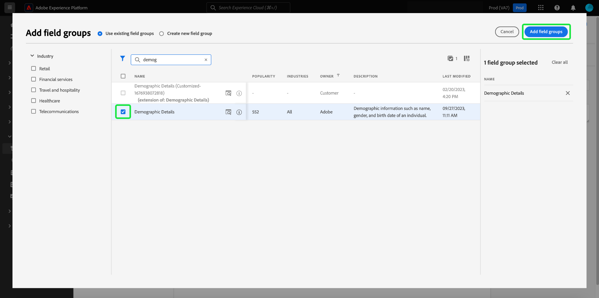

# [!DNL Schema Editor]

Adobe Experience Platformのユーザーインターフェイスを使用すると、[!DNL Schema Editor] と呼ばれるインタラクティブなビジュアルキャンバスで [!DNL Experience Data Model](XDM) スキーマを作成および管理できます。 このチュートリアルでは、[!DNL Schema Editor] を使用してスキーマを作成する方法について説明します。

>[!NOTE]
>
>デモ用に、このチュートリアルの手順では、顧客ロイヤルティプログラムのメンバーを説明するサンプルスキーマを作成します。 これらの手順を使用して、独自の目的で異なるスキーマを作成できますが、まずサンプルスキーマの作成に従って、[!DNL Schema Editor] の機能を学ぶことをお勧めします。

代わりに [!DNL Schema Registry] API を使用してスキーマを作成する場合は、まず [API](create-schema-api.md) を使用したスキーマの作成に関するチュートリアルを読む前に、『[[!DNL Schema Registry]  開発者ガイド ](../api/getting-started.md)』を読んでください。

## はじめに

このチュートリアルでは、スキーマの作成に関わるAdobe Experience Platformの様々な側面に関する十分な知識が必要です。 このチュートリアルを始める前に、次の概念に関するドキュメントを確認してください。

* [[!DNL Experience Data Model (XDM)]](../home.md)：顧客体験データを編成する際に [!DNL Platform] に使用される標準化されたフレームワーク。
   * [スキーマ構成の基本](../schema/composition.md):XDM スキーマとその構成要素（クラス、スキーマフィールドグループ、データタイプ、個々のフィールドを含む）の概要です。
* [[!DNL Real-time Customer Profile]](../../profile/home.md)：複数のソースからの集計データに基づいて、統合されたリアルタイムの顧客プロファイルを提供します。

## [!UICONTROL  スキーマ ] ワークスペースを開きます。 {#browse}

[!DNL Platform] UI の [!UICONTROL  スキーマ ] ワークスペースでは、[!DNL Schema Library] が視覚化され、組織で使用可能なスキーマを表示できます。 ワークスペースには、このチュートリアル全体でスキーマを作成できるキャンバス [!DNL Schema Editor] も含まれています。

[!DNL Experience Platform] にログインした後、左のナビゲーションで「**[!UICONTROL スキーマ]**」を選択して、「**[!UICONTROL スキーマ]**」ワークスペースを開きます。 「**[!UICONTROL 参照]**」タブには、スキーマのリスト（[!DNL Schema Library] の表現）が表示され、表示やカスタマイズができます。 リストには、スキーマの基となる名前、型、クラス、動作（レコードまたは時系列）、およびスキーマが最後に変更された日時が含まれます。

詳しくは、[UI での既存の XDM リソースの参照 ](../ui/explore.md) のガイドを参照してください。

## スキーマの作成と命名 {#create}

スキーマの構成を開始するには、**[!UICONTROL スキーマ]** ワークスペースの右上隅にある「**[!UICONTROL スキーマ]** を作成」を選択します。 ドロップダウンメニューが表示され、コアクラス [!UICONTROL XDM Individual Profile] と [!UICONTROL XDM ExperienceEvent] のどちらかを選択できます。 これらのクラスが目的に合わない場合は、「**[!UICONTROL 参照]**」を選択して他の使用可能なクラスから選択するか、[ 新しいクラス ](#create-new-class) を作成します。

このチュートリアルの目的では、「**[!UICONTROL XDM Individual Profile]**」を選択します。

スキーマの基にする標準の XDM クラスを選択したので、**[!UICONTROL フィールドグループを追加]** ダイアログが表示され、スキーマへのフィールドの追加をすぐに開始できます。 ここでは、「**[!UICONTROL キャンセル]**」を選択してダイアログを閉じます。

[!DNL Schema Editor] が表示されます。 これは、スキーマを作成するキャンバスです。名称未設定のスキーマは、エディターに到達すると、キャンバスの「**[!UICONTROL 構造]**」セクションに自動的に作成され、そのクラスに基づくすべてのスキーマに含まれる標準フィールドも作成されます。 スキーマに割り当てられたクラスは、 **[!UICONTROL 構成]** セクションの **[!UICONTROL クラス]** にも表示されます。

>[!NOTE]
>
> スキーマが保存される前の初期構成プロセス中の任意の時点で[スキーマのクラスを変更](#change-class)できますが、これは非常に注意しておこなう必要があります。フィールドグループは特定のクラスとのみ互換性があるので、クラスを変更するとキャンバスと追加したフィールドがリセットされます。

エディターの右側のフィールドを使用して、スキーマの表示名と説明（オプション）を指定します。 名前を入力すると、キャンバスが更新され、スキーマの新しい名前が反映されます。

スキーマの名前を決定する際に考慮すべき重要な点がいくつかあります。

* 後でスキーマを簡単に見つけられるように、スキーマ名は短く、説明的にする必要があります。
* スキーマ名は一意である必要があります。つまり、将来再利用されないように十分に具体的でなければなりません。例えば、組織が異なるブランドに対して別々のロイヤルティプログラムを持つ場合、後で定義する他のロイヤルティ関連スキーマと区別しやすいように、スキーマに「ブランド A ロイヤルティメンバー」という名前を付けると効果的です。
* スキーマの説明を使用して、スキーマに関する追加のコンテキスト情報を指定することもできます。

このチュートリアルでは、ロイヤルティプログラムのメンバーに関連するデータを取り込むスキーマを構成するので、スキーマの名前は「ロイヤルティメンバー」になります。

## フィールドグループの追加 {#field-group}

これで、フィールドグループを追加して、スキーマにフィールドを追加できます。 フィールドグループは、1 つ以上のフィールドのグループで、特定の概念を説明するために一緒に使用されることがよくあります。 このチュートリアルでは、フィールドグループを使用してロイヤルティプログラムのメンバーを説明し、名前、誕生日、電話番号、住所などの主要な情報を取り込みます。

フィールドグループを追加するには、「**[!UICONTROL フィールドグループ]**」サブセクションで「**[!UICONTROL 追加]**」を選択します。

新しいダイアログが開き、使用可能なフィールドグループのリストが表示されます。 各フィールドグループは、特定のクラスでのみ使用するため、ダイアログには、選択したクラス（この場合は [!DNL XDM Individual Profile] クラス）と互換性のあるフィールドグループのみが表示されます。 標準の XDM クラスを使用している場合、フィールドグループのリストは、使用頻度に基づいてインテリジェントに並べ替えられます。

リストからフィールドグループを選択すると、右側のパネルに表示されます。 必要に応じて複数のフィールドグループを選択し、確認する前に右側のレールのリストに各フィールドグループを追加できます。 また、現在選択されているフィールドグループの右側にアイコンが表示され、提供されるフィールドの構造をプレビューできます。

フィールドグループをプレビューする際に、右側のパネルに、フィールドグループのスキーマに関する詳細な説明が表示されます。 また、提供されたキャンバスで、フィールドグループのフィールド間を移動することもできます。 異なるフィールドを選択すると、右側のレールが更新され、該当するフィールドに関する詳細が表示されます。 プレビューが終了したら、「**[!UICONTROL 戻る]**」を選択して、フィールドグループ選択ダイアログに戻ります。

このチュートリアルでは、**[!UICONTROL 人口統計の詳細]** フィールドグループを選択し、**[!UICONTROL フィールドグループを追加]** を選択します。

スキーマキャンバスが再び表示されます。「**[!UICONTROL フィールドグループ]**」セクションに「[!UICONTROL  人口統計の詳細 ]」が表示され、「**[!UICONTROL 構造]**」セクションにはフィールドグループが提供するフィールドが含まれます。 「**[!UICONTROL フィールドグループ]**」セクションでフィールドグループの名前を選択して、キャンバス内の特定のフィールドをハイライト表示できます。

このフィールドグループは、最上位の名前 `person` の下に、データ型「[!UICONTROL Person]」の複数のフィールドを表示します。 このフィールドグループは、名前、生年月日、性別など、個人に関する情報を説明します。

>[!NOTE]
>
>フィールドでは、スカラ型（文字列、整数、配列、日付など）と、[!DNL Schema Registry] 内で定義された任意のデータ型（共通概念を表すフィールドのグループ）を使用できます。

`name` フィールドのデータ型は「[!UICONTROL  人名 ]」です。つまり、一般的な概念を表し、名、姓、敬称、サフィックスなど、名前に関連するサブフィールドが含まれます。

キャンバス内の異なるフィールドを選択して、スキーマ構造に影響を与える追加のフィールドを表示します。

## 別のフィールドグループの追加 {#field-group-2}

同じ手順を繰り返して、別のフィールドグループを追加できます。 今回は、**[!UICONTROL フィールドグループを追加]** ダイアログを表示すると、「[!UICONTROL  人口統計の詳細 ]」フィールドグループが灰色表示になっていて、隣のチェックボックスは選択できないことに注意してください。 これにより、既に現在のスキーマに含まれているフィールドグループを誤って複製するのを防ぎます。

このチュートリアルでは、ダイアログから「[!DNL Personal Contact Details]」フィールドグループを選択し、「**[!UICONTROL フィールドグループを追加]**」を選択してスキーマに追加します。

追加すると、キャンバスが再び表示されます。「[!UICONTROL  個人の連絡先の詳細 ]」が **[!UICONTROL 構成]** の **[!UICONTROL フィールドグループ]** に、自宅住所、携帯電話などのフィールドが **[!UICONTROL 構造]** に追加されました。

`name` フィールドと同様、先ほど追加したフィールドは複数フィールドの概念を表します。 例えば、`homeAddress` のデータ型は「[!UICONTROL  郵送先住所 ]」、`mobilePhone` のデータ型は「[!UICONTROL  電話番号 ]」です。 これらの各フィールドを選択して展開し、データ型に含まれる追加のフィールドを確認できます。

## カスタムフィールドグループの定義 {#define-field-group}

「[!UICONTROL  ロイヤルティメンバー ]」スキーマは、ロイヤルティプログラムのメンバーに関連するデータを取り込むためのものなので、特定のロイヤルティ関連のフィールドが必要になります。

標準の [!UICONTROL Loyalty Details] フィールドグループをスキーマに追加して、ロイヤルティプログラムに関連する共通のフィールドを取り込むことができます。 標準のフィールドグループを使用して、スキーマによって取り込まれた概念を表すことを強くお勧めしますが、標準のロイヤルティフィールドグループの構造では、特定のロイヤルティプログラムの関連データをすべて取り込めない場合があります。 このシナリオでは、新しいカスタムフィールドグループを定義して、代わりにこれらのフィールドを取り込むことができます。

**[!UICONTROL フィールドグループを追加]** ダイアログを再度開きますが、今度は上部近くにある「**[!UICONTROL 新しいフィールドグループを作成]**」を選択します。 次に、フィールドグループの表示名と説明を入力するよう求められます。

クラス名と同様に、フィールドグループ名は短く単純で、フィールドグループがスキーマに与える影響を説明する必要があります。 これらも一意なので、名前を再利用できません。名前が十分に具体的であるようにしてください。

このチュートリアルでは、新しいフィールドグループに「Loyalty Details」と名前を付けます。

「**[!UICONTROL フィールドグループを追加]**」を選択して、[!DNL Schema Editor] に戻ります。 「[!UICONTROL Loyalty Details]」がキャンバスの左側にある「**[!UICONTROL フィールドグループ]**」の下に表示されるはずですが、関連付けられたフィールドはまだないので、「**[!UICONTROL 構造]**」の下に新しいフィールドは表示されません。

## フィールドグループにフィールドを追加する {#field-group-fields}

「Loyalty Details」フィールドグループを作成したら、次に、フィールドグループがスキーマに貢献するフィールドを定義します。

まず、「**[!UICONTROL フィールドグループ]**」セクションでフィールドグループ名を選択します。 これをおこなうと、フィールドグループのプロパティがエディターの右側に表示され、**[!UICONTROL 構造]** の下でスキーマ名の横に **プラス (+)** アイコンが表示されます。

「[!DNL Loyalty Members]」の横にある **プラス (+)** アイコンを選択して、構造内に新しいノードを作成します。 このノード（この例では `_tenantId` と呼ばれます）は、IMS 組織のテナント ID を表し、前にアンダースコアが付いています。 テナント ID の存在は、追加するフィールドが組織の名前空間に限られていることを示しています。

つまり、追加するフィールドは組織に固有で、[!DNL Schema Registry] 内の組織のみがアクセスできる特定の領域に保存されます。 他の標準クラス、フィールドグループ、データタイプ、フィールドの名前との競合を防ぐために、定義したフィールドは常にテナント名前空間に追加する必要があります。

その名前空間ノード内には、「[!UICONTROL  新しいフィールド ]」があります。 これは、「[!UICONTROL Loyalty Details]」フィールドグループの先頭です。

エディターの右側にあるコントロールを使用して、まず、ロイヤルティ関連のフィールドの保持に使用する「[!UICONTROL Object]」型の `loyalty` フィールドを作成します。 終了したら、「**[!UICONTROL 適用]**」を選択します。

変更が適用され、新しく作成された `loyalty` オブジェクトが表示されます。 オブジェクトの横にある **プラス (+)** アイコンを選択して、その他のロイヤルティ関連のフィールドを追加します。 「[!UICONTROL  新しいフィールド ]」が表示され、「**[!UICONTROL フィールドプロパティ]**」セクションがキャンバスの右側に表示されます。

各フィールドには、次の情報が必要です。

* **[!UICONTROL フィールド名]:** キャメルケースで書かれたフィールド名。例：loyaltyLevel
* **[!UICONTROL 表示名]:** タイトルケースで書かれたフィールド名。例：Loyalty Level
* **[!UICONTROL 型]:** フィールドのデータ型。これには、基本的なスカラー型と [!DNL Schema Registry] で定義されたデータ型が含まれます。 例：[!UICONTROL  文字列 ]、[!UICONTROL  整数 ]、[!UICONTROL  ブール値 ]、[!UICONTROL  人物 ]、[!UICONTROL  住所 ]、[!UICONTROL  電話番号 ] など。
* **[!UICONTROL 説明]:** フィールドのオプションの説明は、大文字と小文字で記述し、最大 200 文字にする必要があります。

`Loyalty` オブジェクトの最初のフィールドは、`loyaltyId` という文字列になります。 新しいフィールドのタイプを「[!UICONTROL String]」に設定すると、**[!UICONTROL フィールドのプロパティ]** セクションに、デフォルト値、形式、最大長など、制約を適用するためのオプションが設定されます。

選択したデータ型に応じて、様々な制約オプションを使用できます。`loyaltyId` は電子メールアドレスになるので、**[!UICONTROL フォーマット]** ドロップダウンメニューから「[!UICONTROL email]」を選択します。 「**[!UICONTROL 適用]**」を選択して変更を適用します。

## フィールドグループにフィールドを追加する {#field-group-fields-2}

`loyaltyId` フィールドを追加したら、次のようなロイヤルティ関連の情報を取り込むためのフィールドを追加できます。

* ポイント（整数）
* メンバー登録日（日付）

各フィールドをスキーマに追加するには、`loyalty` オブジェクトの横にある **プラス (+)** アイコンを選択し、必要な情報を入力します。

完了すると、Loyalty オブジェクトに、ロイヤルティ ID、ポイント、およびメンバー登録のフィールドが含まれます。

## 列挙フィールドをフィールドグループに追加する {#enum}

[!DNL Schema Editor] でフィールドを定義する場合、フィールドに含めることのできるデータにさらに制約を加えるために、基本的なフィールドタイプに適用できる追加のオプションがいくつかあります。 これらの制限の使用例を次の表に示します。

| 制約 | 説明 |
| --- | --- |
| [!UICONTROL 必須] | データの取り込みにフィールドが必須であることを示します。 このフィールドを含まないデータセットに基づいてスキーマセットにアップロードされたデータの取得は失敗します。 |
| [!UICONTROL 配列] | フィールドに値の配列が含まれ、各値は指定されたデータ型を持つことを示します。 例えば、データ型が「[!UICONTROL String]」のフィールドに対してこの制約を使用すると、フィールドに文字列の配列が含まれます。 |
| [!UICONTROL Enum] | このフィールドに、可能な値の列挙リストの値の 1 つを含める必要があることを示します。 |
| [!UICONTROL ID] | このフィールドが ID フィールドであることを示します。 ID フィールドの詳細については、[このチュートリアルの後半](#identity-field)で説明します。 |
| [!UICONTROL 関係] | 和集合スキーマと [!DNL Real-time Customer Profile] を使用してスキーマの関係を推論することはできますが、これは同じクラスを共有するスキーマにのみ当てはまります。 [!UICONTROL Relationship] 制約は、このフィールドが、2 つのスキーマ間の関係を意味する、異なるクラスに基づくスキーマのプライマリ ID を参照することを示します。 詳しくは、[ 関係の定義 ](./relationship-ui.md) に関するチュートリアルを参照してください。 |

{style=&quot;table-layout:auto&quot;}

>[!NOTE]
>
>必須、ID または関係の各フィールドが左側のパネルに表示され、スキーマの複雑さに関係なく、これらのフィールドを簡単に見つけることができます。
>
>

このチュートリアルでは、スキーマ内の [!DNL "loyalty"] オブジェクトに、顧客の「ロイヤルティレベル」を説明する新しい列挙フィールドが必要です。この値は、4 つのオプションの中の 1 つのみです。 このフィールドをスキーマに追加するには、`loyalty` オブジェクトの横にある **プラス (+)** アイコンを選択し、**[!UICONTROL フィールド名]** と **[!UICONTROL 表示名]** の必須フィールドに入力します。 **[!UICONTROL 型]** の場合は、「[!UICONTROL  文字列 ]」を選択します。

**[!UICONTROL 配列]**、**[!UICONTROL 列挙]**、**[!UICONTROL ID]** のチェックボックスなど、タイプが選択された後に、フィールドに追加のチェックボックスが表示されます。

「**[!UICONTROL 列挙]**」チェックボックスを選択して、下の「**[!UICONTROL 列挙値]**」セクションを開きます。 ここで、許容可能な各ロイヤルティレベルの&#x200B;**[!UICONTROL 値]**（キャメルケース）と&#x200B;**[!UICONTROL ラベル]**（タイトルケースでの読みやすい名前でオプション）を入力できます。

すべてのフィールドプロパティを完了したら、「**[!UICONTROL 適用]**」を選択して、「[!DNL loyaltyLevel]」フィールドを `loyalty` オブジェクトに追加します。

## 複数フィールドオブジェクトのデータ型への変換 {#datatype}

`loyalty` オブジェクトには、複数のロイヤルティ固有のフィールドが含まれ、他のスキーマで役立つ共通のデータ構造を表しています。 [!DNL Schema Editor] を使用すると、再利用可能な複数フィールドオブジェクトを簡単に適用できます。これらのオブジェクトの構造をデータ型に変換します。

データ型を使用すると、複数フィールド構造を一貫して使用でき、フィールドグループよりも柔軟性が高まります。データ型は、スキーマ内の任意の場所で使用できるからです。 これは、フィールドの **[!UICONTROL 型]** の値を、[!DNL Schema Registry] で定義された任意のデータ型の値に設定することでおこなわれます。

`loyalty` オブジェクトをデータ型に変換するには、**[!UICONTROL 構造]** の下の `loyalty` フィールドを選択し、**[!UICONTROL エディターの右側にある「**[!UICONTROL  フィールドのプロパティ ]**」の下の「 新しいデータ型に変換]**」を選択します。 オブジェクトが正常に変換されたことを確認する緑色のポップオーバーが表示されます。

**[!UICONTROL 構造]** の下を見ると、`loyalty` フィールドのデータ型が「[!DNL Loyalty]」で、フィールドの横に小さなロックアイコンが表示され、個々のフィールドではなく、複数フィールドデータ型の一部であることがわかります。

今後のスキーマでは、フィールドを「[!DNL Loyalty]」型として割り当て、ID、ロイヤルティレベル、メンバー登録日、ポイントのフィールドを自動的に含めることができます。

>[!NOTE]
>
>また、スキーマの編集とは独立して、カスタムデータタイプの作成や編集をおこなうこともできます。 詳しくは、[ データ型の作成と編集 ](../ui/resources/data-types.md) のガイドを参照してください。

## スキーマフィールドの検索とフィルタリング

スキーマに、基本クラスで指定されたフィールドに加えて、複数のフィールドグループが含まれるようになりました。 大きなスキーマを扱う場合は、左側のレールでフィールドグループ名の横にあるチェックボックスをオンにして、表示するフィールドを、目的のフィールドグループが提供するフィールドにのみフィルタリングできます。

スキーマ内の特定のフィールドを検索する場合は、検索バーを使用して、表示されるフィールドを、その下に提供されるフィールドグループに関係なく、名前でフィルタリングすることもできます。

>[!IMPORTANT]
>
>検索機能は、一致するフィールドを表示する際に、選択したフィールドグループフィルターを考慮に入れます。 検索クエリで期待した結果が表示されない場合は、関連するフィールドグループがフィルタリングされていないことを再確認する必要がある場合があります。

## ID フィールドとしてのスキーマフィールドの設定 {#identity-field}

スキーマが提供する標準のデータ構造を活用して、複数のソースにわたって同じ個人に属するデータを識別でき、セグメント化、レポート、データサイエンス分析など、様々なダウンストリームの使用例に使用できます。 個々の ID に基づいてデータをステッチするには、キーフィールドを該当するスキーマ内で [!UICONTROL ID] フィールドとしてマークする必要があります。

[!DNL Experience Platform] では、の ID チェックボックスを使用して、ID フィールドを **** 簡単に示しま [!DNL Schema Editor]す。ただし、データの性質に基づいて、ID として使用するのに最適な候補フィールドを決定する必要があります。

例えば、同じ「ロイヤルティレベル」に属するロイヤルティプログラムメンバーが数千人いる場合がありますが、ロイヤルティプログラムの各メンバーは一意の `loyaltyId`（この場合、個々のメンバーの電子メールアドレス）を持ちます。 `loyaltyId` が各メンバーの一意の識別子であることは、ID フィールドの適切な候補となりますが、`loyaltyLevel` は異なります。

>[!IMPORTANT]
>
>次に説明する手順では、ID 記述子を既存のスキーマフィールドに追加する方法を説明します。 スキーマ自体の構造内で ID フィールドを定義する代わりに、 `identityMap` フィールドを使用して ID 情報を格納することもできます。
>
>`identityMap` を使用する予定がある場合は、スキーマに直接追加するプライマリ ID が上書きされることに注意してください。 詳しくは、『[ スキーマ構成の基本ガイド ](../schema/composition.md#identityMap)』の `identityMap` の節を参照してください。

エディターの「**[!UICONTROL 構造]**」セクションで、「`loyaltyId`」フィールドを選択し、「**[!UICONTROL フィールドのプロパティ]**」の下に「**[!UICONTROL ID]**」チェックボックスが表示されます。 チェックボックスをオンにし、「**[!UICONTROL プライマリID]**」に設定するオプションを表示します。 このボックスも選択します。

>[!NOTE]
>
>各スキーマには、1 つのプライマリ ID フィールドのみを含めることができます。スキーマフィールドをプライマリ ID として設定した後で、スキーマ内の別の ID フィールドをプライマリとして設定しようとすると、エラーメッセージが表示されます。

次に、ドロップダウン内の事前定義済みの名前空間のリストから **[!UICONTROL ID 名前空間]** を指定する必要があります。 `loyaltyId` は顧客の電子メールアドレスなので、ドロップダウンから「[!UICONTROL  電子メール ]」を選択します。 「**[!UICONTROL 適用]**」を選択して、「`loyaltyId`」フィールドの更新を確定します。

>[!NOTE]
>
>標準名前空間とその定義のリストについては、[[!DNL Identity Service]  ドキュメント ](../../identity-service/troubleshooting-guide.md#standard-namespaces) を参照してください。

変更を適用した後、 `loyaltyId` のアイコンに指紋の記号が表示され、現在は ID フィールドであることが示されます。

`loyaltyId` フィールドに取り込まれたすべてのデータを使用して、個人を特定し、その顧客の単一の表示をつなぎ合わせることができます。 [!DNL Experience Platform] での ID の使用について詳しくは、[[!DNL Identity Service]](../../identity-service/home.md) のドキュメントを参照してください。

## [!DNL Real-time Customer Profile] でのスキーマの使用を有効にする {#profile}

[[!DNL Real-time Customer Profile]](../../profile/home.md) では、の id データを [!DNL Experience Platform] 利用して、各顧客の全体像を提供します。このサービスは、顧客属性の堅牢な 360 °プロファイルと、[!DNL Experience Platform] と統合されたシステム全体で顧客が持つすべてのインタラクションのタイムスタンプ付きのアカウントを構築します。

[!DNL Real-time Customer Profile] で使用できるように、スキーマにプライマリ ID が定義されている必要があります。 最初にプライマリ ID を定義せずにスキーマを有効にしようとすると、エラーメッセージが表示されます。

 

[!DNL Profile] での「ロイヤルティメンバー」スキーマの使用を有効にするには、エディターの「**[!UICONTROL 構造]**」セクションで「[!DNL Loyalty Members]」を選択します。

エディターの右側に、スキーマの表示名、説明、タイプなどの情報が表示されます。 この情報に加えて、**[!UICONTROL プロファイル]** 切り替えボタンがあります。

「**[!UICONTROL Profile]**」を選択すると、[!DNL Profile] のスキーマを有効にするかどうかを確認するポップオーバーが表示されます。

 

>[!WARNING]
>
>[!DNL Real-time Customer Profile] に対して有効にして保存したスキーマは無効にできません。

「**[!UICONTROL 有効]**」を選択して選択を確定します。 「**[!UICONTROL プロファイル]**」切り替えをもう一度選択して、必要に応じてスキーマを無効にできます。ただし、[!DNL Profile] を有効にしている間にスキーマを保存すると、無効にできなくなります。

## 次の手順とその他のリソース

これで、スキーマの合成が完了し、キャンバスに完全なスキーマが表示されます。 「**[!UICONTROL 保存]**」を選択すると、スキーマが [!DNL Schema Library] に保存され、[!DNL Schema Registry] からアクセスできるようになります。

これで、新しいスキーマを使用して、データを [!DNL Platform] に取り込むことができます。 データの取得にスキーマを使用した後は、追加的な変更のみがおこなわれる場合があります。スキーマバージョン管理について詳しくは、「[スキーマ合成の基本](../schema/composition.md)」を参照してください。

次に、UI での [ スキーマ関係の定義 ](./relationship-ui.md) に関するチュートリアルに従って、新しい関係フィールドを「ロイヤルティメンバー」スキーマに追加できます。

「ロイヤルティメンバー」スキーマは、[!DNL Schema Registry] API を使用して表示および管理することもできます。 API の使用を開始するには、まず『[[!DNL Schema Registry API]  開発者ガイド ](../api/getting-started.md)』を読んでください。

### ビデオリソース

>[!WARNING]
>
>次のビデオに示す [!DNL Platform] UI は最新ではありません。 最新の UI スクリーンショットと機能については、上記のドキュメントを参照してください。

次のビデオでは、[!DNL Platform] UI で簡単なスキーマを作成する方法を示します。

>[!VIDEO](https://video.tv.adobe.com/v/27012?quality=12&learn=on)

次のビデオは、フィールドグループとクラスの操作に関する理解を深めるためのものです。

>[!VIDEO](https://video.tv.adobe.com/v/27013?quality=12&learn=on)

## 付録

以下の節では、[!DNL Schema Editor] の使用に関する追加情報を示します。

### 新しいクラスの作成 {#create-new-class}

[!DNL Experience Platform] は、組織に固有のクラスに基づいてスキーマを定義する柔軟性を提供します。新しいクラスの作成方法については、[UI でのクラスの作成と編集に関するガイド ](../ui/resources/classes.md#create) を参照してください。

### スキーマクラスの変更 {#change-class}

スキーマが保存される前の最初の構成プロセス中の任意の時点で、スキーマのクラスを変更できます。

>[!WARNING]
>
>スキーマのクラスの再割り当ては、細心の注意を払っておこなう必要があります。 フィールドグループは特定のクラスとのみ互換性があるので、クラスを変更するとキャンバスと追加したフィールドがリセットされます。

スキーマのクラスを変更する方法については、[UI でのスキーマの管理 ](../ui/resources/schemas.md) に関するガイドを参照してください。
