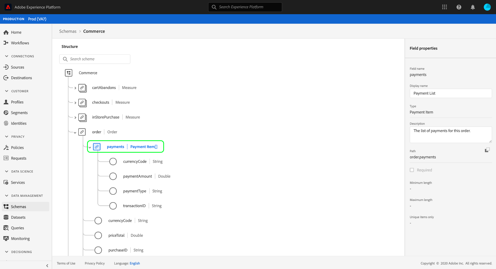

# UIでのXDMリソースの参照

Adobe Experience Platformでは、Adobeが提供する標準リソースや組織が定義するカスタムリソースを含む、すべてのExperience Data Model(XDM)リソースが [!DNL Schema Library]に保存されます。 Experience PlatformUIで、内の任意の既存のスキーマ、クラス、ミックスインまたはデータ型の構造とフィールドを表示でき [!DNL Schema Library]ます。 これは、データ取り込みの計画と準備を行う際に特に便利です。UIは、これらのXDMリソースが提供する各フィールドに必要なデータタイプと使用例に関する情報を提供します。

このチュートリアルでは、Experience PlatformUIの既存のスキーマ、クラス、ミックスイン、データタイプを調べる手順を説明します。

## XDMリソースの検索 {#lookup}

In the Platform UI, select **[!UICONTROL Schemas]** in the left navigation. [!UICONTROL スキーマ] ・ワークスペースには、組織内の既存のすべてのXDMリソースを調査する「 **[!UICONTROL 参照」タブと、Classes Classes]** Mixins、Data Mixins、Data Typesを詳細に調査する専用タブが用意されています。 **[!UICONTROL Browseタブは、Classes Classes Classes Classes Classes Classes Class Classes Classes Classes Classes Classes Classes Classes Classes, Classes Classes Classes C]** Classes, Classes, C **[!UICONTROL Classes, C]** Cl Classes, Classes, Classes, Classes, Classes, Classes, Classes, Classes, Classes, Classes, Classes, Classes, Classes, Classes, Classes, C **** Classes, Classes, Classes, Classes

「 [!UICONTROL 参照] 」タブで、フィルターアイコン()を使用して左側のレールにコントロールを表示し、リストに表示されている結果を絞り込むことができます。

例えば、Adobeが提供する標準データ型のみを表示するようにリストをフィルタリングするには、TypeSectionの **[!UICONTROL 下に]** Datatype **[!UICONTROL 、OwnerOwnerSectionの下に]** OwnerOwnerSection **[!UICONTROL を、それぞれ]** Adobeを選択し **** ます。

「 **[!UICONTROL プロファイルに含める]** 」トグルを使用すると、結果をフィルタリングして、リアルタイム顧客プロファイルで使用可能になっているスキーマで使用されているリソースのみを表示できます 。

検索バーを使用して、検索クエリと名前が一致するリソースに結果を絞り込むこともできます。

調査するリソースが見つかったら、リストから名前を選択し、キャンバスの構造を表示します。

## キャンバスでのXDMリソースの探索 {#explore}

リソースを選択すると、キャンバスにその構造が表示されます。

サブプロパティを含むオブジェクトタイプのフィールドは、最初にキャンバスに表示されたときに、デフォルトですべて折りたたまれます。 フィールドのサブプロパティを表示するには、名前の横のアイコンを選択します。

### システム生成フィールド {#system-fields}

一部のスキーマフィールドには、およびのように、アンダースコアが先頭に付加され `_repo` てい `_id`ます。 これらは、データの取り込み時に自動的に生成および割り当てを行うフィールドのプレースホルダです。

したがって、Platformに取り込む際は、これらのフィールドのほとんどをデータの構造から除外する必要があります。主な例外はフィールドで、組織で作成するすべてのXDMフィールドは名前を付ける必要があります。 `_{TENANT_ID}`

### データタイプ {#data-types}

キャンバスに表示される各フィールドについて、名前の横に対応するデータタイプが表示され、一目で取り込みが必要なデータのタイプを示します。

角括弧(`[]`)が付いたデータ型は、そのデータ型の配列を表します。 例えば、 **[!UICONTROL String]** \[]のデータ型は、フィールドに文字列値の配列が必要であることを示します。 データタイプが **[!UICONTROL Payment Item]¥[]の場合は、** Payment Item  データタイプに準拠するオブジェクトの配列を示します。

配列フィールドがオブジェクトタイプに基づいている場合は、キャンバスでそのアイコンを選択して、各配列項目に対して期待される属性を表示できます。

### [!UICONTROL フィールドプロパティ] {#field-properties}

キャンバスで任意のフィールドの名前を選択すると、右側のパネルが更新され、「 **[!UICONTROL フィールドプロパティ]**」の下にそのフィールドの詳細が表示されます。 例えば、フィールドの使用例、デフォルト値、パターン、形式、必須フィールドかどうかに関係なく、その他の説明を入力できます。

検査対象のフィールドが列挙型フィールドの場合、右側のレールには、フィールドが受け取ると想定する有効な値も表示されます。

### IDフィールド {#identity}

IDフィールドを含むスキーマを検査する場合、これらのフィールドは指紋アイコン()でキャンバス内に強調表示されます。 IDフィールドの名前を選択すると、 [ID名前空間や、そのフィールドがスキーマの主IDであるかどうかなどの追加情報を表示できます](../../identity-service/namespaces.md) 。

### 関係フィールド {#relationship}

また、関係フィールドはキャンバスで一意にハイライト表示され、フィールドが参照する宛先スキーマの名前が表示されます。 関係フィールドの名前を選択すると、宛先スキーマのプライマリIDのID名前空間を表示できます。

>[!NOTE]
>
>XDMスキーマでの関係の使用について詳しくは、UIでの関係の  作成に関するチュートリアルを参照してください。

## 次の手順

このドキュメントでは、Experience PlatformUIで既存のXDMリソースを調べる方法を説明します。 [!UICONTROL スキーマ] Workspaceとの各機能の詳細については、「 [!DNL Schema Editor]スキーマ作成のチュートリアル 」を参照してください。