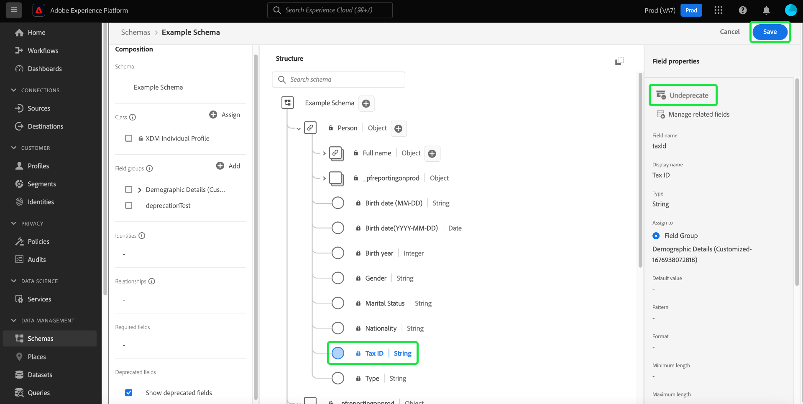

# UI での XDM フィールドの廃止

エクスペリエンスデータモデル (XDM) を使用すると、データの取り込み後にスキーマフィールドを廃止することで、ビジネスニーズの変更に合わせてデータモデルを柔軟に管理できます。 不要なフィールドを非推奨にして、UI ビューから削除したり、ダウンストリーム UI から非表示にしたりできます。 好都合なことに、スキーマエディターのチェックボックスを使用すると、廃止されたフィールドを表示でき、必要に応じて非推奨のフィールドを非推奨にすることもできます。

非推奨のフィールドはデフォルトで UI に表示されないので、スキーマエディターでスキーマが整理され、不要なフィールドがセグメントビルダーやジャーニーデザイナーなどのダウンストリーム依存関係に追加されるのを防ぎます。 また、フィールドの廃止は後方互換性もあります。 非推奨のフィールド（セグメントやクエリなど）を使用する他のシステムは、引き続き意図したとおりに評価されます。 非推奨のフィールドが既存のセグメントで使用されている場合、通常どおりに扱われます。つまり、フィールドはセグメントビルダーキャンバスに期待どおりに表示されるか、非推奨のフィールドで使用可能なデータに基づいて評価されます。 これは、既存のデータフローに悪影響を与えない、改行しない変更です。

>[!NOTE]
>
>データをスキーマに取り込む前に、不要なフィールドグループを削除できます。 詳しくは、 [スキーマからフィールドグループを削除する方法](../ui/resources/schemas.md#remove-fields) を参照してください。

データをスキーマに取り込むと、重大な変更を加えない限り、スキーマからフィールドを削除できなくなります。 この場合、 [スキーマエディター](./create-schema-ui.md) または [スキーマレジストリ API](https://developer.adobe.com/experience-platform-apis/references/schema-registry/).

このドキュメントでは、スキーマユーザーインターフェイスのスキーマエディターを使用して、様々な XDM リソースのフィールドを廃止するExperience Platformについて説明します。 API を使用した XDM フィールドの廃止手順については、 [スキーマレジストリ API を使用した XDM フィールドの廃止](./field-deprecation-api.md).

## フィールドを廃止 {#deprecate}

カスタムフィールドを廃止するには、編集するスキーマのスキーマエディターに移動します。 廃止するフィールドをから選択します。 [!UICONTROL 構造] キャンバスのセクション、その後に **[!UICONTROL 廃止]** から [!UICONTROL フィールドプロパティ].

選択を確認するダイアログが表示され、フィールドが和集合スキーマの UI ビューから削除され、ダウンストリーム UI で非表示になることが通知されます。 アクションを完了するには、「 **[!UICONTROL 確認]**.

これで、フィールドが UI ビューから削除されました。

>[!NOTE]
>
>非推奨になった後は、セグメント化ダッシュボード、Customer Journey Analytics、Adobe Journey Optimizerなどのダウンストリーム UI で、廃止されたフィールドがワークフローの一部として表示されなくなりました。 ただし、ダウンストリーム UI には、必要に応じて非推奨のフィールドを表示し、非推奨のフィールドを通常どおりに引き続き扱うオプションがあります。 詳しくは、それぞれのドキュメントを参照してください。 非推奨のフィールドを使用するクエリやセグメントは、引き続き期待どおりに実行されます。

## 廃止されたフィールドを表示 {#show-deprecated}

以前に廃止されたフィールドを表示するには、スキーマエディターで関連するスキーマに移動します。 を選択します。 **[!UICONTROL 廃止されたフィールドを表示]** チェックボックスを [!UICONTROL 構成] セクション内に表示されます。

非推奨のフィールドが UI ビューに表示されます。 選択 **[!UICONTROL 保存]** をクリックして設定を確定します。

## フィールドの非推奨 {#undeprecate-fields}

非推奨のフィールドを元に戻すには、まず [廃止されたフィールドを表示](#show-deprecated) 上記のように、非推奨のフィールドをエディターの [!UICONTROL 構造] 」セクションに入力します。 次に、 **[!UICONTROL 非推奨]** から [!UICONTROL フィールドプロパティ] サイドバーの後に **[!UICONTROL 保存]**.

この [!UICONTROL フィールドの非推奨] ダイアログが表示されます。 変更を確定するには、「 」を選択します。 **[!UICONTROL 確認]**.

![この [!UICONTROL フィールドの非推奨] ダイアログがハイライト表示されます。](../images/tutorials/field-deprecation/undeprecate-field-dialog.png)

このフィールドは、UI ビューおよびダウンストリーム UI で標準として表示されるようになりました。 これでも、フィールドを非推奨にするオプションが追加されました。

## 次の手順

このドキュメントでは、スキーマエディターの UI を使用して XDM フィールドを廃止する方法について説明しました。 カスタムリソースのフィールドの設定について詳しくは、 [API での XDM フィールドの定義](./custom-fields-api.md). 記述子の管理について詳しくは、 [記述子エンドポイントガイド](../api/descriptors.md).
