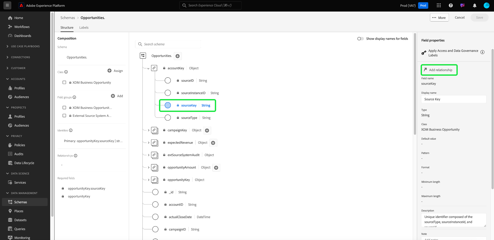

# Real-time Customer Data Platform B2B エディションでの 2 つのスキーマ間における多対 1 の関係を定義 {#relationship-b2b}

>[!CONTEXTUALHELP]
>id="platform_xdm_b2b_reference_schema"
>title="参照スキーマ"
>abstract="関係を確立するスキーマを選択します。スキーマのクラスによっては、B2B コンテキストの他のエンティティとの既存の関係を持つこともあります。B2B スキーマクラスがお互いにどのように関連しているかについて詳しくは、ドキュメントを参照してください。"

Adobe Real-Time Customer Data Platform B2B editionには、[&#x200B; アカウント &#x200B;](../classes/b2b/business-account.md)、[&#x200B; 商談 &#x200B;](../classes/b2b/business-opportunity.md)、[&#x200B; キャンペーン &#x200B;](../classes/b2b/business-campaign.md) など、基本的な B2B データエンティティをキャプチャするエクスペリエンスデータモデル（XDM）クラスがいくつか用意されています。 これらのクラスに基づいてスキーマを構築し、それらを [&#x200B; リアルタイム顧客プロファイル &#x200B;](../../profile/home.md) で使用できるようにすると、異なるソースのデータを結合スキーマと呼ばれる統合表現に統合できます。

ただし、和集合スキーマには、同じクラスを共有するスキーマによってキャプチャされたフィールドのみを含めることができます。 スキーマの関係は、ここに格納されます。 B2B スキーマで関係を実装することで、これらのビジネスエンティティの相互関係を記述し、ダウンストリームセグメント化のユースケースに複数のクラスの属性を含めることができます。

次の図は、基本的な実装において、様々な B2B クラスがどのように相互に関連付けられるかを示す例を示しています。

このチュートリアルでは、Real-Time CDP B2B editionで 2 つのスキーマ間に多対 1 の関係を定義する手順を説明します。

>[!NOTE]
>
>Real-Time Customer Data Platform B2B editionを使用していない場合や、1 対 1 の関係を作成する場合は、代わりに [1 対 1 の関係の作成 &#x200B;](./relationship-ui.md) に関するガイドを参照してください。
>
>このチュートリアルでは、Experience Platform UI で B2B スキーマ間の関係を手動で確立する方法について重点的に説明します。 B2B ソース接続からデータを取り込む場合は、自動生成ユーティリティを使用して、必要なスキーマ、ID および関係を作成します。 [&#x200B; 自動生成ユーティリティの使用 &#x200B;](../../sources/connectors/adobe-applications/marketo/marketo-namespaces.md) について詳しくは、B2B 名前空間とスキーマに関するソースドキュメントを参照してください。

## はじめに

このチュートリアルでは、[!DNL Experience Platform] UI の [!DNL XDM System] とスキーマエディターに関する十分な知識が必要です。 このチュートリアルを始める前に、次のドキュメントを確認してください。

* [Experience Platformの XDM システム &#x200B;](../home.md):XDM と [!DNL Experience Platform] での実装の概要です。
* [スキーマ構成の基本](../schema/composition.md)：XDM スキーマの構築ブロックの紹介。
* [&#x200B; 次を使用してスキーマを作成  [!DNL Schema Editor]](create-schema-ui.md):UI でスキーマを作成および編集する方法の基本を説明するチュートリアル。

## ソースおよび参照スキーマの定義

この関係で定義される 2 つのスキーマが既に作成されていると想定されます。デモ目的で、このチュートリアルは、（「[!DNL Opportunities]」スキーマで定義された）ビジネスオポチュニティと、関連する（「[!DNL Accounts]」スキーマで定義された）ビジネスアカウントとの関係を作成します。

スキーマ関係は、**参照スキーマ** のプライマリ ID フィールドを参照する **ソーススキーマ** 内の専用フィールドで表されます。 以降の手順では、「[!DNL Opportunities]」はソーススキーマとして機能し、「[!DNL Accounts]」は参照スキーマとして機能します。

### B2B の関係での ID について

>[!CONTEXTUALHELP]
>id="platform_xdm_b2b_identity_namespace"
>title="参照 ID 名前空間"
>abstract="参照スキーマのプライマリ ID フィールドの名前空間 (タイプ)。参照スキーマは、関係に参加するために、確立されたプライマリ ID フィールドが必要です。B2B 関係の ID について詳しくは、ドキュメントを参照してください。"

関係を確立するには、参照スキーマに定義済みのプライマリ ID が必要です。 B2B エンティティのプライマリ ID を設定する場合は、様々なシステムや場所にわたって文字列ベースのエンティティ ID を収集すると、重複する可能性があり、Experience Platformでデータの競合が発生する可能性があることに注意してください。

これに対処するために、すべての標準 B2B クラスには、[[!UICONTROL B2B Source] データタイプ &#x200B;](../data-types/b2b-source.md) に準拠する「キー」フィールドが含まれています。 このデータタイプは、B2B エンティティの文字列識別子のフィールドと、識別子のソースに関するその他のコンテキスト情報を提供します。 これらのフィールドの 1 つ（`sourceKey`）は、データタイプ内の他のフィールドの値を連結して、エンティティの完全に一意の ID を生成します。 このフィールドは、B2B エンティティスキーマのプライマリ ID として常に使用する必要があります。

>[!NOTE]
>
>[XDM フィールドを ID として設定 &#x200B;](../ui/fields/identity.md) する場合、の下で ID を定義する ID 名前空間を指定する必要があります。 これは、Adobeが提供する標準の名前空間、または組織が定義するカスタム名前空間にできます。 実際には、名前空間は単なるコンテキスト文字列であり、ID タイプを分類する組織にとって意味がある場合は、任意の値に設定できます。 詳しくは、[ID 名前空間 &#x200B;](../../identity-service/features/namespaces.md) の概要を参照してください。

参照目的で、次の節では、関係が定義される前に、このチュートリアルで使用する各スキーマの構造について説明します。 プライマリ ID が定義されているスキーマ構造と、それらが使用するカスタム名前空間に注意してください。

### 商談スキーマ

ソーススキーマ「[!DNL Opportunities]」は、[!UICONTROL XDM Business Opportunity] クラスに基づいています。 クラス `opportunityKey` が提供するフィールドの 1 つは、スキーマの識別子として機能します。 特に、`opportunityKey` オブジェクトの `sourceKey` フィールドは、[!DNL B2B Opportunity] というカスタム名前空間でスキーマのプライマリ ID として設定されます。

**[!UICONTROL フィールドプロパティ]** の節で示すように、このスキーマは [!DNL Real-Time Customer Profile] で使用できるようになりました。

### [!DNL Accounts] スキーマ

参照スキーマ「[!DNL Accounts]」は、[!UICONTROL XDM Account] クラスに基づいています。 ルートレベルの `accountKey` フィールドには、[!DNL B2B Account] と呼ばれるカスタム名前空間の下でプライマリ ID として機能する `sourceKey` が含まれています。 このスキーマは、プロファイルでも使用できるようになりました。

## ソーススキーマで関係フィールドを定義 {#relationship-field}

>[!CONTEXTUALHELP]
>id="platform_xdm_b2b_relationship_name_current"
>title="現在のスキーマからの関係名"
>abstract="現在のスキーマから参照スキーマへの関係を説明するラベル (例：「関連するアカウント」)。このラベルは、関連する B2B エンティティからのデータにコンテキストを付与するために、プロファイルとセグメント化で使用されます。B2B スキーマの関係の構築について詳しくは、ドキュメントを参照してください。"

>[!CONTEXTUALHELP]
>id="platform_xdm_b2b_relationship_name_reference"
>title="参照スキーマからの関係名"
>abstract="参照スキーマから現在のスキーマへの関係を説明するラベル (例：「関連するオポチュニティ」)。このラベルは、関連する B2B エンティティからのデータにコンテキストを付与するために、プロファイルとセグメント化で使用されます。B2B スキーマの関係の構築について詳しくは、ドキュメントを参照してください。"

2 つのスキーマ間の関係を定義するには、ソーススキーマに、参照スキーマのプライマリ ID を示す専用のフィールドが必要です。 標準 B2B クラスには、一般的に関連するビジネスエンティティ用の専用のソースキーフィールドが含まれています。 例えば、[!UICONTROL XDM Business Opportunity] クラスには、関連するアカウント（`accountKey`）と関連するキャンペーン（`campaignKey`）のソースキーフィールドが含まれています。 ただし、デフォルトのコンポーネント以上が必要な場合は、カスタムフィールドグループを使用して、他の [!UICONTROL B2B Source] フィールドをスキーマに追加することもできます。

>[!NOTE]
>
>現在、ソーススキーマから参照スキーマに定義できるのは、多対 1 および 1 対 1 の関係のみです。 1 対多の関係の場合、「多」を表すスキーマで関係フィールドを定義する必要があります。

関係フィールドを設定するには、キャンバス内で該当するフィールドを選択し、**[!UICONTROL スキーマプロパティ]** サイドバーで [!UICONTROL &#x200B; 関係を追加 &#x200B;] を選択します。 [!DNL Opportunities] スキーマの場合、目標はアカウントとの多対 1 の関係を確立することなので、これは `accountKey.sourceKey` のフィールドになります。

[!UICONTROL &#x200B; 関係を追加 &#x200B;] ダイアログが表示されます。 このダイアログを使用して、関係の詳細を指定します。 関係タイプは、デフォルトで **[!UICONTROL 多対 1]** に設定されます。

**[!UICONTROL 参照スキーマ]** の下で、検索バーまたはドロップダウンメニューを使用して、参照スキーマの名前を探します。 参照スキーマの名前をハイライト表示すると、「**[!UICONTROL 参照 ID 名前空間]** フィールドが、参照スキーマのプライマリ ID の名前空間に自動的に更新されます。

>[!NOTE]
>
>使用可能な参照スキーマのリストが、適切なスキーマのみを含むようにフィルタリングされます。 スキーマ **必須** にはプライマリ ID が割り当てられ、B2B クラスまたは個人プロファイルクラスのいずれかである必要があります。 見込み客クラススキーマに関係を設定できません。

**[!UICONTROL 現在のスキーマからの関係名]** および **[!UICONTROL 参照スキーマからの関係名]** で、それぞれソーススキーマおよび参照スキーマのコンテキストの関係にわかりやすい名前を指定します。 終了したら、「**[!UICONTROL 適用]**」を選択して変更を確定し、関係を保存します。

>[!NOTE]
>
>関係名は 35 文字以下にする必要があります。

キャンバスが再び表示され、関係フィールドが、以前に指定したわかりやすい名前でマークされます。 関係名も左側のパネルに表示され、簡単に参照できます。

参照スキーマの構造を表示すると、スキーマのプライマリ ID フィールドの横にある左側のパネルに関係マーカーが表示されます。

## B2B スキーマ関係の編集 {#edit-schema-relationship}

スキーマの関係が確立されたら、ソーススキーマの関係フィールドを選択してから、**[!UICONTROL 関係を編集]** を選択します。

>[!NOTE]
>
>関連するすべての関係を表示するには、参照スキーマのプライマリ ID フィールドに続いて [!UICONTROL &#x200B; 関係の表示 &#x200B;] を選択します。
>{width="100" zoomable="yes"}

[!UICONTROL &#x200B; 関係を編集 &#x200B;] ダイアログが表示されます。 このダイアログから、参照スキーマと関係名を変更したり、関係を削除したりできます。 多対 1 関係タイプは変更できません。

データの整合性を維持し、セグメント化やその他のプロセスの中断を避けるために、リンクされたデータセットとのスキーマ関係を管理する際に、次のガイドラインを考慮してください。

* スキーマがデータセットに関連付けられている場合は、セグメント化に悪影響を及ぼす可能性があるので、関係を直接削除しないでください。 代わりに、関係を削除する前に、関連するデータセットを削除します。
* 最初に既存の関係を削除しないと、参照スキーマを変更できません。 ただし、関連するデータセットとの関係を削除すると、意図しない結果が生じる可能性があるので、慎重に行う必要があります。
* 既存のリンクされたデータセットを使用してスキーマに新しい関係を追加すると、意図したとおりに動作せず、競合が発生する可能性があります。

## 関係のフィルタリングと検索 {#filter-and-search}

[!UICONTROL &#x200B; スキーマ &#x200B;] ワークスペースの「[!UICONTROL &#x200B; 関係 &#x200B;]」タブから、スキーマ内の特定の関係をフィルタリングして検索できます。 このビューを使用すると、関係をすばやく見つけて管理できます。 フィルタリングオプションの手順について詳しくは、[&#x200B; スキーマリソースの調査 &#x200B;](../ui/explore.md#lookup) に関するドキュメントを参照してください。

## 次の手順

このチュートリアルでは、[!DNL Schema Editor] を使用して 2 つのスキーマ間に多対 1 の関係を正常に作成しました。 これらのスキーマに基づくデータセットを使用してデータが取り込まれ、そのデータがプロファイルデータストアでアクティブ化されると、[&#x200B; 複数クラスのセグメント化のユースケース &#x200B;](../../rtcdp/segmentation/b2b.md) に対して両方のスキーマの属性を使用できます。
