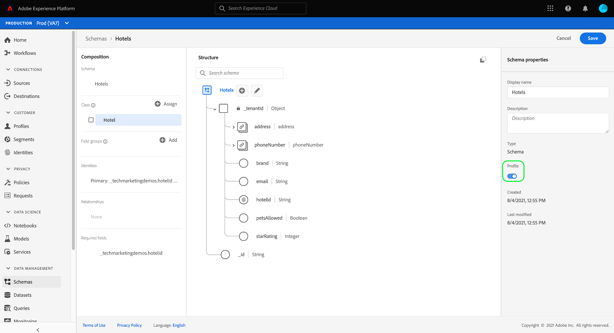
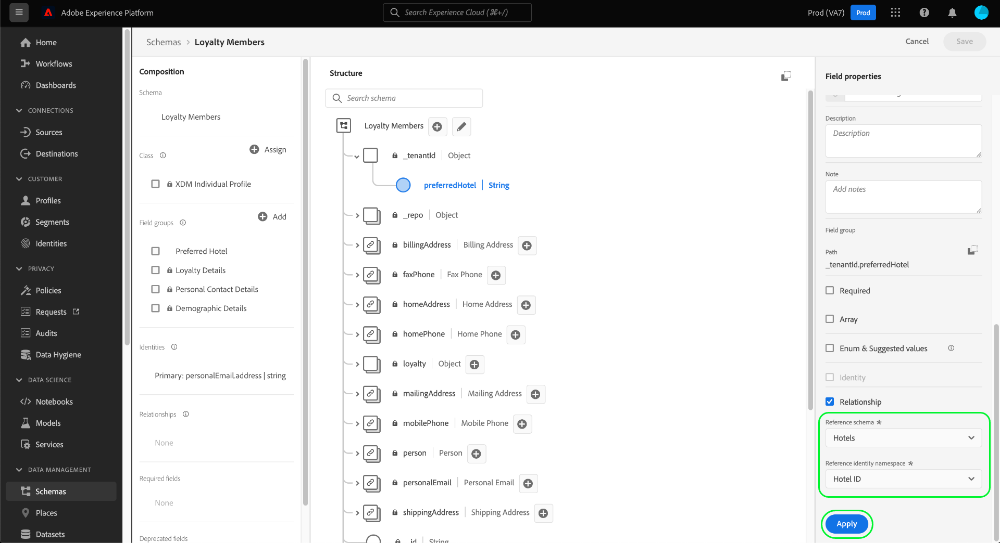

# [!DNL Schema Editor]

>[!NOTE]
>
>リアルタイム顧客データプラットフォームB2Bエディションを使用している場合は、代わりに[B2Bの関係の作成](./relationship-b2b.md)に関するガイドを参照してください。

様々なチャネルでの顧客とブランドとの関係を理解する能力は、Adobe Experience Platform の重要な部分です。[!DNL Experience Data Model](XDM)スキーマの構造内でこれらの関係を定義すると、顧客データに関する複雑なインサイトを得ることができます。

和集合スキーマと[!DNL Real-time Customer Profile]を使用してスキーマの関係を推論することはできますが、これは同じクラスを共有するスキーマにのみ適用されます。 異なるクラスに属する2つのスキーマ間の関係を確立するには、宛先スキーマのIDを参照するソーススキーマに、専用の関係フィールドを追加する必要があります。

このドキュメントでは、[!DNL Experience Platform]ユーザーインターフェイスのスキーマエディターを使用して2つのスキーマ間の関係を定義するためのチュートリアルを提供します。 API を使用してスキーマ関係を定義する手順については、[スキーマレジストリ API を使用した関係の定義](relationship-api.md)についてのチュートリアルを参照してください。

## はじめに

このチュートリアルでは、[!DNL XDM System]と[!DNL Experience Platform] UIのスキーマエディターに関する十分な知識が必要です。 このチュートリアルを始める前に、次のドキュメントを確認してください。

* [Experience PlatformのXDMシステム](../home.md):XDMと、での実装の概要で [!DNL Experience Platform]す。
* [スキーマ構成の基本](../schema/composition.md)：XDM スキーマの構築ブロックの紹介。
* [ [!DNL Schema Editor]](create-schema-ui.md)を使用してスキーマを作成します。の操作の基本を説明するチュートリアルで [!DNL Schema Editor]す。

## ソースと宛先のスキーマの定義

この関係で定義される 2 つのスキーマが既に作成されていると想定されます。このチュートリアルでは、デモ目的で、組織のロイヤルティプログラム（「[!DNL Loyalty Members]」スキーマで定義）のメンバーと、お気に入りのホテル（「[!DNL Hotels]」スキーマで定義）との間に関係を作成します。

>[!IMPORTANT]
>
>関係を確立するには、両方のスキーマでプライマリIDが定義され、[!DNL Real-time Customer Profile]に対して有効になっている必要があります。 スキーマを適切に設定する方法に関するガイダンスが必要な場合は、『スキーマ作成チュートリアル』の「プロファイル](./create-schema-ui.md#profile)でのスキーマの使用」に関する節を参照してください。[

スキーマの関係は、**ソーススキーマ**&#x200B;内の専用フィールドで表され、**宛先スキーマ**&#x200B;内の別のフィールドを参照します。 次の手順では、「[!DNL Loyalty Members]」がソーススキーマで、「[!DNL Hotels]」が宛先スキーマとして機能します。

以下の節では、関係が定義される前に、このチュートリアルで使用する各スキーマの構造について説明します。

### [!DNL Loyalty Members] schema

ソーススキーマ「[!DNL Loyalty Members]」は[!DNL XDM Individual Profile]クラスに基づいており、UIでのスキーマの作成に関するチュートリアルで[構築されたスキーマです。 ](create-schema-ui.md)`_tenantId`名前空間の下に`loyalty`オブジェクトが含まれ、この中に複数のロイヤルティ固有のフィールドが含まれます。 これらのフィールドの1つである`loyaltyId`は、[!UICONTROL Email]名前空間の下のスキーマのプライマリIDとして機能します。 **[!UICONTROL スキーマのプロパティ]**&#x200B;で見たように、このスキーマは[!DNL Real-time Customer Profile]で使用できるようになっています。

### [!DNL Hotels] スキーマ

宛先スキーマ「[!DNL Hotels]」は、カスタムの「[!DNL Hotels]」クラスに基づいており、ホテルを説明するフィールドが含まれています。

関係に参加するには、宛先スキーマにプライマリIDが必要です。 この例では、 `hotelId`フィールドが、カスタムの「Hotel ID」ID名前空間を使用するプライマリIDとして使用されます。

>[!NOTE]
>
>カスタムID名前空間の作成方法については、[IDサービスのドキュメント](../../identity-service/namespaces.md#manage-namespaces)を参照してください。

プライマリIDが設定されたら、宛先スキーマを[!DNL Real-time Customer Profile]に対して有効にする必要があります。

## 関係スキーマフィールドグループの作成

>[!NOTE]
>
>この手順は、ソーススキーマに、宛先スキーマへの参照として使用する専用の文字列タイプフィールドがない場合にのみ必要です。 このフィールドがソーススキーマで既に定義されている場合は、次の[関係フィールドを定義](#relationship-field)する手順に進んでください。

2 つのスキーマ間の関係を定義するには、ソーススキーマに、ターゲットスキーマへの参照として使用する専用のフィールドが必要です。新しいスキーマフィールドグループを作成して、このフィールドをソーススキーマに追加できます。

まず、「**[!UICONTROL フィールドグループ]**」セクションで「**[!UICONTROL 追加]**」を選択します。

[!UICONTROL フィールドグループを追加]ダイアログが表示されます。 ここから、「**[!UICONTROL 新しいフィールドグループを作成]**」を選択します。 表示されるテキストフィールドに、新しいフィールドグループの表示名と説明を入力します。 終了したら「**[!UICONTROL フィールドグループを追加]**」を選択します。

キャンバスが再び表示され、 **[!UICONTROL フィールドグループ]**&#x200B;セクションに「[!DNL Favorite Hotel]」が表示されます。 フィールドグループ名を選択し、ルートレベルの`Loyalty Members`フィールドの横にある「**[!UICONTROL フィールドを追加]**」を選択します。

キャンバスの`_tenantId`名前空間の下に新しいフィールドが表示されます。 **[!UICONTROL フィールドのプロパティ]**&#x200B;で、フィールドの名前と表示名を指定し、型を「[!UICONTROL String]」に設定します。

終了したら、「**[!UICONTROL 適用]**」を選択します。

更新された`favoriteHotel`フィールドがキャンバスに表示されます。 「**[!UICONTROL 保存]**」を選択して、変更をスキーマに確定します。

## ソーススキーマでの関係フィールドの定義 {#relationship-field}

ソーススキーマに専用の参照フィールドが定義されたら、それを関係フィールドとして指定できます。

キャンバスの`favoriteHotel`フィールドを選択し、「**[!UICONTROL フィールドプロパティ]**」の下で「**[!UICONTROL 関係]**」チェックボックスが表示されるまで下にスクロールします。 このチェックボックスを選択すると、関係フィールドを設定するために必要なパラメーターが表示されます。

「**[!UICONTROL 参照スキーマ]**」のドロップダウンを選択し、関係の宛先スキーマを選択します（この例では「[!DNL Hotels]」）。 宛先スキーマが[!DNL Profile]に対して有効になっている場合、**[!UICONTROL 「参照ID名前空間]**」フィールドは、宛先スキーマのプライマリIDの名前空間に自動的に設定されます。 スキーマにプライマリ ID が定義されていない場合は、使用する名前空間をドロップダウンメニューから手動で選択する必要があります。終了したら「**[!UICONTROL 適用]**」を選択します。

これで、`favoriteHotel`フィールドがキャンバス内で関係としてハイライト表示され、宛先スキーマの名前と参照ID名前空間が表示されます。 「**[!UICONTROL 保存]**」を選択して変更を保存し、ワークフローを完了します。

## 次の手順

このチュートリアルでは、[!DNL Schema Editor]を使用して2つのスキーマ間に1対1の関係を作成しました。 API を使用して関係を定義する手順については、[スキーマレジストリ API を使用した関係の定義](relationship-api.md)についてのチュートリアルを参照してください。
