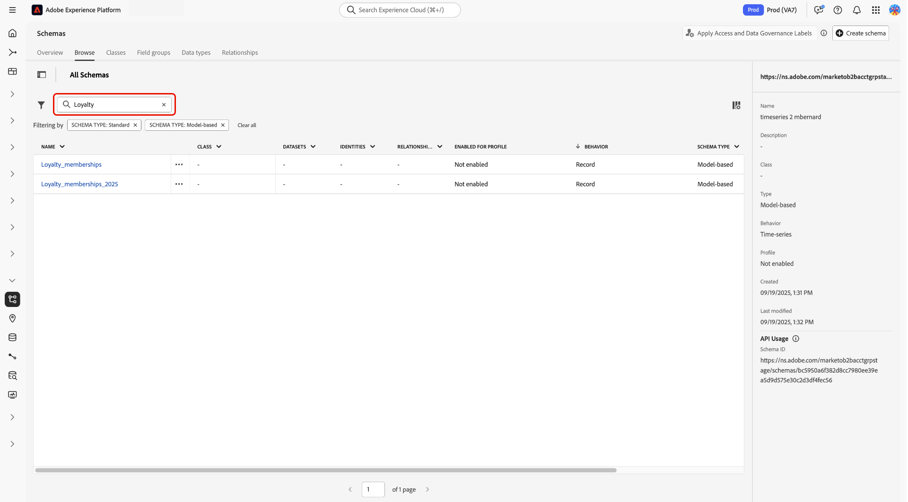
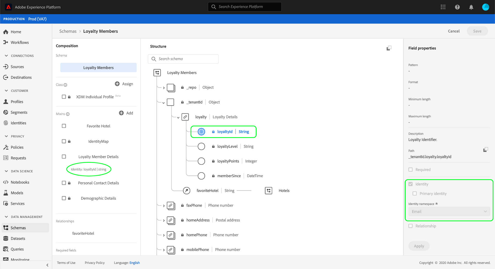

# UIでのスキーマリソースの確認

Adobe Experience Platformでは、すべてのExperience Data Model （XDM） スキーマリソースが[!DNL Schema Library]に保存されます。これには、Adobeが提供する標準リソースと、組織で定義されたカスタムリソースが含まれます。 Experience Platform UIでは、[!DNL Schema Library]内の既存のスキーマ、クラス、フィールドグループ、またはデータタイプの構造とフィールドを表示できます。 UIは、これらのXDM リソースによって提供される各フィールドの想定されるデータタイプとユースケースに関する情報を提供するため、データ取り込みの計画と準備を行う際に特に役立ちます。

このチュートリアルでは、Experience Platform UIで既存のスキーマ、クラス、フィールドグループ、データタイプを調べる手順について説明します。

## スキーマリソースの検索 {#lookup}

Experience Platform UIで、左側のナビゲーションで「**[!UICONTROL Schemas]**」を選択します。 [!UICONTROL Schemas] ワークスペースには、組織内のすべてのスキーマを探索するための&#x200B;**[!UICONTROL Browse]** タブと、それぞれ&#x200B;**[!UICONTROL Classes]**、**[!UICONTROL Field groups]**、**[!UICONTROL Data types]**&#x200B;および&#x200B;**[!UICONTROL Relationships]**&#x200B;を探索するための追加の専用タブが用意されています。

フィルターアイコン（）は、左側のパネルにコントロールを表示して、リストされた結果を絞り込みます。 リソースフィルターは、**[!UICONTROL Browse]** タブと&#x200B;**[!UICONTROL Relationships]** タブのスキーマと関係にそれぞれ使用できます。

[!UICONTROL Browse] ワークスペースの「[!UICONTROL Schemas]」タブで、スキーマインベントリをフィルタリングできます。 **[!UICONTROL Included in Profile]** トグルを使用すると、[&#x200B; リアルタイム顧客プロファイル &#x200B;](../../profile/home.md)で使用が有効になっているスキーマのみを表示できます。 **[!UICONTROL Show adhoc schemas]** トグルを使用して、1つのデータセットでのみ使用できるように名前空間が設定されたフィールドで作成されたスキーマのリストをフィルタリングします。

![&#x200B; フィルターパネルがハイライト表示された[!UICONTROL Schemas] ワークスペース [!UICONTROL Browse] タブ。](../images/ui/explore/filters.png)

[!UICONTROL Relationship] ワークスペースの「[!UICONTROL Schemas]」タブで、4つの条件に基づいて関係のリストをフィルタリングできます。 フィルターには、[!UICONTROL Source schema]、[!UICONTROL Destination schema]、[!UICONTROL Source class]および[!UICONTROL Destination class]が含まれます。 次の表に、フィルターの説明を示します。

| フィルター | 説明 |
|-----------------------------------|------------|
| [!UICONTROL Source schema] | 選択したスキーマが開始点または「ソース」であるすべての関係を表示するには、[!UICONTROL Source schema] ドロップダウンメニューからスキーマを選択します。 |
| [!UICONTROL Destination schema] | 選択したスキーマがターゲットまたは「宛先」であるすべての関係を表示するには、[!UICONTROL Destination schema] ドロップダウンメニューからスキーマを選択します。 |
| [!UICONTROL Source class] | 開始するスキーマのクラスに基づいて関係をフィルタリングするには、[!UICONTROL Source class] ドロップダウンメニューからクラスを選択します。 |
| [!UICONTROL Destination class] | 特定のクラスのスキーマで終わる関係を表示するには、[!UICONTROL Destination class] ドロップダウンメニューからクラスを選択します。 |

{style="table-layout:auto"}

検索バーを使用して、結果をさらに絞り込むこともできます。

検索結果に表示されるリソースは、最初にタイトルの一致、次に説明の一致で順序付けされます。 次に、これらのカテゴリのいずれかで一致する単語が多いほど、リソースがリストに表示されます。

探索するリソースが見つかったら、リストから名前を選択して、キャンバスで構造を表示します。

## スキーマ、クラス、フィールドグループ、データタイプの管理：アクションと削除 {#xdm-resource-actions}

XDM リソースを管理または削除する必要がある場合、またはアクション（削除など）が使用できず、その理由を把握する必要がある場合は、この節を使用します。

### アクションの検索場所（インラインと詳細ページ） {#where-to-find-actions}

リソースの削除、書き出し、コピーなどのアクションを実行するには、次のいずれかのエントリポイントを使用します。

**[!UICONTROL Browse]**、**[!UICONTROL Classes]**、**[!UICONTROL Field groups]**&#x200B;および&#x200B;**[!UICONTROL Data types]**&#x200B;のタブでは、管理アクションは2つの場所で使用できます。

- **テーブル内のインライン**：各リソース行には、使用可能なアクションへの直接アクセスを提供するアクション メニュー（例：**[!UICONTROL …]**）が含まれています。

- **リソース詳細ビュー**：詳細ビューで完全なアクションにアクセスするには、**カスタム（テナント定義）** リソースを選択する必要があります。 標準（Adobeが提供する）リソースのアクションは限られており、削除、JSON構造のコピー、パッケージに追加などのオプションは表示されません。 在庫からカスタムリソースを選択して詳細ビューを開き、ページヘッダーの&#x200B;**[!UICONTROL More]** メニューを使用して使用可能なアクションにアクセスします。

これらのアクションは、サポートされているリソースタイプ（スキーマ、クラス、フィールドグループ、データタイプ）の両方のエントリポイントで一貫しています。

### 使用可能なアクション {#available-actions}

リソースタイプと権限に応じて、次のアクションを使用できます。

- **[!UICONTROL Delete]** – 組織からカスタムリソースを完全に削除します（制約が許可されている場合）。 削除がブロックされている場合は、[制約](#delete-constraints)を参照してください。
- **[!UICONTROL Download sample file]** — リソース構造に基づいてサンプル データ ファイルを生成します。 手順：[&#x200B; サンプル XDM データを生成](./sample.md)。
- **[!UICONTROL Copy JSON structure]** – 再利用、書き出し、または検査のために、リソース定義をJSON形式でコピーします。 手順：[XDM スキーマを書き出し](./export.md)。
- **[!UICONTROL Add to package]** — サンドボックス間で書き出しまたは読み込みを行うために、サンドボックスパッケージにリソースを含めます。 ステップバイステップ：[&#x200B; オブジェクトをパッケージに書き出す](../../sandboxes/ui/sandbox-tooling.md#export-objects)。

リソースタイプの種類は、次のとおりです。

- **カスタム（テナント定義）** スキーマ、クラス、フィールドグループ、データタイプの場合、上記のすべてのアクションを使用できます。
- **標準（Adobe定義）**&#x200B;のクラス、フィールドグループ、およびデータタイプの場合：
   - **[!UICONTROL Download sample file]**&#x200B;のみが利用できます。
   - **削除**、**コピーJSON構造**、**パッケージに追加**&#x200B;は使用できません。

### 動作を削除 {#delete-behavior}

不要になったカスタムリソースを削除する場合は、**[!UICONTROL Delete]** アクションを使用します。

>[!IMPORTANT]
>
> リソースを削除すると、そのリソースは組織から完全に削除され、元に戻すことはできません。 使用状況、権限、またはシステムの制約により、一部のリソースを削除できません。

リソースを削除するには：

1. テーブル内のリソースを見つけるか、その詳細ビューを開きます。
2. アクションメニュー（**[!UICONTROL …]**&#x200B;または&#x200B;**[!UICONTROL More]**）を選択します。
3. **[!UICONTROL Delete]** を選択します。
4. もう一度&#x200B;**[!UICONTROL Delete]**&#x200B;を選択して、ダイアログのアクションを確認します。

確認後、リソースは組織から完全に削除されます。

リソースに対して削除が使用できない場合、アクションを実行できない理由を説明するツールヒントが表示され、このオプションは無効になります。

### 制約（データセット、プロファイル、RBAC、テナントとグローバル） {#delete-constraints}

**[!UICONTROL Delete]**&#x200B;などのアクションが使用できない、または無効になっている場合は、通常、次のいずれかの条件が原因です。

- **権限（RBAC）**：管理アクションを実行するには、必要な権限（**[!UICONTROL Manage Schemas]**&#x200B;など）が必要です。 権限がない場合は、ツールヒントでアクションが無効に表示されます。 権限の設定方法については、[&#x200B; アクセス制御UIの概要](../../access-control/ui/overview.md)を参照してください。

- **データセットの関連付け**: 1つ以上のデータセット（データセットに関連付けられたスキーマなど）で使用されているリソースを削除できません。 データセットの依存関係を特定して削除するには、[&#x200B; データセットの削除](../../catalog/datasets/user-guide.md#delete)を参照してください。

- **プロファイルの有効化**: リアルタイム顧客プロファイルに対して有効になっているスキーマを削除できません。 プロファイルの有効化がスキーマにどのような影響を与えるかについては、[&#x200B; リアルタイム顧客プロファイルの有効化の計画](../schema/profile-enablement-planning.md)を参照してください。

- **テナントとグローバルリソース**：テナント定義（カスタム）リソースは削除できますが（制約が適用されます）、標準（Adobe提供）クラス、フィールドグループ、データタイプは削除できません。

これらの制約は、UIに直接反映されます。 アクションが使用できない場合は、無効と表示され、特定の制限について説明するツールヒントが含まれます。

リソースを削除できない場合は、上記の条件を確認して、権限の更新、依存関係の削除、データモデルの調整が必要かどうかを判断します。

キャンバスでのスキーマ編集ワークフローの詳細については、[UIでのスキーマの作成と編集](./resources/schemas.md)を参照してください。

## キャンバスでのXDM リソースの探索 {#explore}

リソースを選択すると、その構造がキャンバスで開きます。

サブプロパティを含むすべてのオブジェクトタイプフィールドは、最初にキャンバスに表示されたときに、デフォルトで折りたたまれます。 任意のフィールドのサブプロパティを表示するには、フィールド名の横にあるアイコンを選択します。

### 標準クラスおよびフィールドグループインジケーター {#standard-class-and-field-group-indicator}

スキーマエディター内では、標準（Adobeで生成された）クラスとフィールドグループが南京錠アイコン（をインストールします。南京錠は、クラス名またはフィールドグループ名の横にある左側のパネルと、システム生成リソースの一部であるスキーマダイアグラム内の任意のフィールドの横に表示されます。

ガイダンスについては、[標準フィールドグループにカスタムフィールドを追加](./resources/schemas.md)のドキュメントを参照してください。 標準クラスは編集できません。

### システム生成フィールド {#system-fields}

フィールド名の前にはアンダースコアが付いています（`_repo`や`_id`など）。 これらは、データが取り込まれる際にシステムが自動的に生成して割り当てるフィールドのプレースホルダーを表します。

そのため、Experience Platformに取り込む際には、これらのフィールドのほとんどをデータ構造から除外する必要があります。 このルールの主な例外は[`_{TENANT_ID}` フィールド &#x200B;](../api/getting-started.md#know-your-tenant_id)です。このフィールドは、組織の下で作成されたすべてのXDM フィールドの下に名前空間を設定する必要があります。

### データタイプ {#data-types}

キャンバスに表示される各フィールドの対応するデータタイプは、フィールドが取り込む必要のあるデータタイプを一目で示す名前の横に表示されます。

角括弧（`[]`）が付いたデータ型は、その特定のデータ型の配列を表します。 例えば、**[!UICONTROL String]\[]**&#x200B;というデータ型は、フィールドに文字列値の配列が必要であることを示します。 **[!UICONTROL Payment Item]\[]**&#x200B;のデータ型は、[!UICONTROL Payment Item] データ型に準拠するオブジェクトの配列を示します。

配列フィールドがオブジェクトタイプに基づいている場合は、キャンバスでそのアイコンを選択して、各配列項目の期待属性を表示できます。

### [!UICONTROL Field properties] {#field-properties}

キャンバス内の任意のフィールドの名前を選択すると、右側のパネルが更新され、そのフィールドの詳細が&#x200B;**[!UICONTROL Field properties]**&#x200B;の下に表示されます。 これには、フィールドの意図されるユースケース、デフォルト値、パターン、形式、フィールドが必要かどうかの説明などが含まれます。

検査中のフィールドが列挙フィールドの場合、右側のパネルには、フィールドが受け取ると想定される許容値も表示されます。

### ID フィールド {#identity}

ID フィールドを含むスキーマを検査する場合、これらのフィールドは、スキーマに提供するクラスまたはフィールドグループの下の左側のパネルに一覧表示されます。 左側のパネルでID フィールド名を選択すると、ネストの深さに関係なく、カンバス内のフィールドが表示されます。

ID フィールドは、指紋アイコン （）を持つキャンバスで強調表示されます。 ID フィールドの名前を選択すると、[ID名前空間](../../identity-service/features/namespaces.md)や、フィールドがスキーマのプライマリ IDであるかどうかの追加情報を表示できます。

>[!NOTE]
>
>ID フィールドとダウンストリーム Experience Platform サービスとの関係について詳しくは、[ID フィールドの定義](./fields/identity.md)に関するガイドを参照してください。

### 関係フィールド {#relationship}

関係フィールドを含むスキーマを検査する場合、そのフィールドは&#x200B;**[!UICONTROL Relationships]**&#x200B;の下の左側のパネルに一覧表示されます。 左側のパネルで関係フィールド名を選択すると、ネストの深さに関係なく、カンバス内のフィールドが表示されます。 関係フィールドは、フィールドがリンクする参照スキーマの名前を示す、キャンバス内で一意にハイライト表示されます。 B2B機能を持つ組織の場合、カスタムの関係名を記述でき、このような場合はキャンバスに表示されます。

参照スキーマのプライマリ IDのID名前空間を表示するには、関係フィールドを選択し、**[!UICONTROL Edit relationship]** サイドバーの[!UICONTROL Field properties]を選択します。 関係のパラメーターは、表示される[!UICONTROL Edit relationship] ダイアログに表示されます。

XDM スキーマでの関係の使用について詳しくは、[UIでの関係の作成](../tutorials/relationship-ui.md)に関するチュートリアルを参照してください。

## 次の手順

このドキュメントでは、Experience Platform UIで既存のXDM リソースを調査する方法について説明しました。 [!UICONTROL Schemas] ワークスペースと[!DNL Schema Editor]のさまざまな機能について詳しくは、[[!UICONTROL Schemas] ワークスペースの概要](./overview.md)を参照してください。
