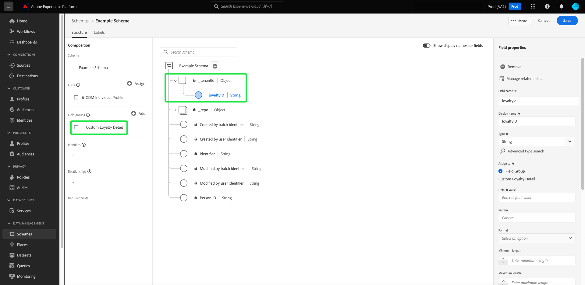

# スキーマエディターでのフィールドベースのワークフロー（ベータ版）

>[!IMPORTANT]
>
>このベータ版ドキュメントで説明しているワークフローは、Adobe Experience Platformで一般に利用できるようになりました。 スキーマエディターでのフィールドベースのワークフローに関する最新のガイダンスについては、 [スキーマ UI ガイド](./resources/schemas.md) 代わりに、 このガイドは間もなく削除されます。

Adobe Experience Platformは、堅牢な標準化された [フィールドグループ](../schema/composition.md#field-group) エクスペリエンスデータモデル (XDM) スキーマで使用する場合。 これらのフィールドグループの構造とセマンティクスは、Platform の様々なセグメント化の使用例や他のダウンストリームアプリケーションに対応するように、慎重に調整されています。 また、独自のカスタムフィールドグループを定義して、独自のビジネスニーズに対応することもできます。

スキーマにフィールドグループを追加すると、そのスキーマはそのグループに含まれるすべてのフィールドを継承します。 ただし、必ずしも使用するとは限らない、関連するフィールドグループの他のフィールドを含める必要がなく、個々のフィールドをスキーマに追加できるようになりました。

このガイドでは、Platform UI で個々のフィールドをスキーマに追加する様々な方法について説明します。

## 前提条件

このチュートリアルは、 [XDM スキーマの構成](../schema/composition.md) と、Platform UI でのスキーマエディターの使用方法について説明します。 続けるには、次の手順を開始する必要があります。 [新しいスキーマの作成](./resources/schemas.md) を標準クラスに割り当ててから、このガイドに進みます。

## 標準フィールドグループから追加されたフィールドを削除 {#remove-field-group}

標準フィールドグループをスキーマに追加した後、不要な標準フィールドを削除できます。

>[!NOTE]
>
>標準フィールドグループからフィールドを削除しても、作業中のスキーマにのみ影響し、フィールドグループ自体には影響しません。 1 つのスキーマから標準フィールドを削除した場合、同じフィールドグループを使用する他のすべてのスキーマでも、それらのフィールドは引き続き使用できます。

次の例では、標準フィールドグループが **[!UICONTROL 人口統計の詳細]** がスキーマに追加されました。 次のような単一のフィールドを削除するには `taxId`をクリックし、キャンバスのフィールドを選択して、「 」を選択します。 **[!UICONTROL 削除]** をクリックします。

削除するフィールドが複数ある場合は、フィールドグループ全体を管理できます。 キャンバスでグループに属するフィールドを選択し、「 」を選択します。 **[!UICONTROL 関連するフィールドの管理]** をクリックします。

該当するフィールドグループの構造を示すダイアログが表示されます。 ここから、提供されたチェックボックスを使用して、必要なフィールドを選択または選択解除できます。 満足したら、「 」を選択します。 **[!UICONTROL 確認]**.

キャンバスが再び表示され、選択したフィールドのみがスキーマ構造に存在します。

## 標準フィールドをスキーマに直接追加

事前に対応するフィールドグループを把握しておく必要なく、標準フィールドグループのフィールドを直接スキーマに追加できます。 標準フィールドをスキーマに追加するには、プラス (**+**) アイコンをクリックします。 An **[!UICONTROL 名称未設定フィールド]** プレースホルダーがスキーマ構造に表示され、右側のレールが更新されて、フィールドを設定するコントロールが表示されます。

の下 **[!UICONTROL フィールド名]**&#x200B;追加するフィールドの名前を入力します。 クエリに一致する標準フィールドが自動的に検索され、以下にリストされます。 **[!UICONTROL 推奨される標準フィールド]**（所属するフィールドグループを含む）

一部の標準フィールドは同じ名前を共有しますが、構造は、その標準フィールドの元のフィールドグループによって異なる場合があります。 標準フィールドがフィールドグループ構造内の親オブジェクト内にネストされている場合、子フィールドが追加されると、親フィールドもスキーマに含まれます。

プレビューアイコン () をクリックし、標準フィールドの横に表示されます。 標準フィールドをスキーマに追加するには、プラスアイコン () をクリックします。

キャンバスが更新され、フィールドグループ構造内でネストされている親フィールドを含む、スキーマに追加された標準フィールドが表示されます。 フィールドグループの名前も、以下に表示されます。 **[!UICONTROL フィールドグループ]** をクリックします。 同じフィールドグループからさらにフィールドを追加する場合は、 **[!UICONTROL 関連するフィールドの管理]** をクリックします。

## スキーマに直接カスタムフィールドを追加

標準フィールドのワークフローと同様に、独自のカスタムフィールドを直接スキーマに追加することもできます。

スキーマのルートレベルにフィールドを追加するには、プラス (**+**) アイコンをクリックします。 An **[!UICONTROL 名称未設定フィールド]** プレースホルダーがスキーマ構造に表示され、右側のレールが更新されて、フィールドを設定するコントロールが表示されます。

追加するフィールドの名前を入力すると、一致する標準フィールドの検索が自動的に開始されます。 代わりに新しいカスタムフィールドを作成するには、 **([!UICONTROL 新規フィールド])**.

ここから、フィールドの表示名とデータタイプを指定します。 の下 **[!UICONTROL フィールドグループを割り当て]**&#x200B;に値を入力する場合は、新しいフィールドを関連付けるフィールドグループを選択する必要があります。 以前にフィールドグループの名前を入力したことがある場合は、その名前を入力します [作成されたカスタムフィールドグループ](./resources/field-groups.md#create) ドロップダウンリストに表示されます。 または、フィールドに一意の名前を入力して、新しいフィールドグループを作成することもできます。

>[!WARNING]
>
>既存のカスタムフィールドグループを選択した場合、そのフィールドグループを使用する他のスキーマも、変更を保存した後で、新しく追加されたフィールドを継承します。 このため、このタイプの伝播を行う場合は、既存のフィールド・グループを選択する必要があります。 それ以外の場合は、代わりに新しいカスタムフィールドグループを作成する必要があります。

完了したら、「**[!UICONTROL 適用]**」を選択します。

新しいフィールドがキャンバスに追加され、名前空間がユーザーの下に表示されます [テナント ID](../api/getting-started.md#know-your-tenant_id) 標準 XDM フィールドとの競合を避けるために使用します。 新しいフィールドを関連付けたフィールドグループも、の下に表示されます。 **[!UICONTROL フィールドグループ]** をクリックします。

>[!NOTE]
>
>選択したカスタムフィールドグループで提供されている残りのフィールドは、デフォルトでスキーマから削除されます。 これらのフィールドの一部をスキーマに追加する場合は、グループに属するフィールドを選択し、「 」を選択します。 **[!UICONTROL 関連するフィールドの管理]** をクリックします。

### 標準フィールドグループの構造にカスタムフィールドを追加する

作業中のスキーマに、標準フィールドグループによって提供されるオブジェクトタイプのフィールドがある場合、独自のカスタムフィールドをその標準オブジェクトに追加できます。 プラス (**+**) アイコンをクリックし、右側のレールでカスタムフィールドの詳細を指定します。

変更を適用すると、新しいフィールドが標準オブジェクト内のテナント ID 名前空間の下に表示されます。 このネストされた名前空間は、同じフィールドグループを使用する他のスキーマでの変更が壊れるのを防ぐために、フィールドグループ内のフィールド名の競合を防ぎます。

## 次の手順

このガイドでは、Platform UI のスキーマエディターの新しいフィールドベースのワークフローについて説明しました。 UI でのスキーマ管理について詳しくは、 [UI の概要](./overview.md).
