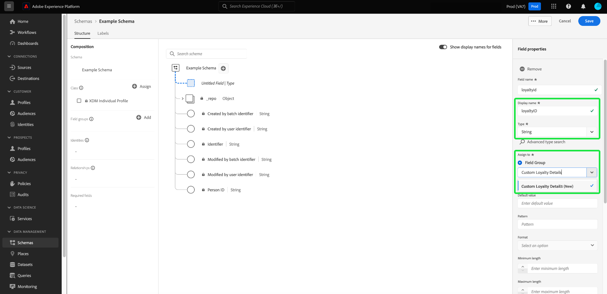

# スキーマエディターでのフィールドベースのワークフロー（ベータ版）

>[!IMPORTANT]
>
>このドキュメントで説明するワークフローは、現在ベータ版です。 機能とドキュメントは変更される場合があります。

Adobe Experience Platformは、エクスペリエンスデータモデル (XDM) スキーマで使用できる、標準化された [ フィールドグループ ](../schema/composition.md#field-group) の堅牢なセットを提供します。 これらのフィールドグループの構造とセマンティクスは、Platform の様々なセグメント化の使用例やその他のダウンストリームアプリケーションに合わせて慎重に調整されています。 独自のカスタムフィールドグループを定義して、独自のビジネスニーズに対応することもできます。

フィールドグループをスキーマに追加すると、そのスキーマはそのグループに含まれるすべてのフィールドを継承します。 ただし、必ずしも使用するとは限らない、関連するフィールドグループの他のフィールドを含める必要がなく、個々のフィールドをスキーマに追加できるようになりました。

このガイドでは、Platform UI で個々のフィールドをスキーマに追加する様々な方法について説明します。

## 前提条件

このチュートリアルでは、XDM スキーマ ](../schema/composition.md) の [ 構成と、Platform UI でのスキーマエディターの使用方法に精通していることを前提としています。 これに従うには、[ 新しいスキーマ ](./resources/schemas.md) を作成し、標準クラスに割り当ててから、このガイドを続行する必要があります。

## 標準フィールドグループから追加されたフィールドを削除する

標準フィールドグループをスキーマに追加した後、不要な標準フィールドを削除できます。

>[!NOTE]
>
>標準フィールドグループからフィールドを削除しても、作業中のスキーマにのみ影響し、フィールドグループ自体には影響しません。 1 つのスキーマで標準フィールドを削除した場合、同じフィールドグループを使用する他のすべてのスキーマでも、それらのフィールドは引き続き使用できます。

次の例では、標準フィールドグループ **[!UICONTROL 人口統計的詳細]** がスキーマに追加されています。 `taxId` などの 1 つのフィールドを削除するには、キャンバスでフィールドを選択し、右側のレールで「**[!UICONTROL 削除]**」を選択します。

削除するフィールドが複数ある場合は、フィールドグループ全体を管理できます。 キャンバスでグループに属するフィールドを選択し、右側のレールで「**[!UICONTROL 関連するフィールドを管理]**」を選択します。

問題のフィールドグループの構造を示すダイアログが表示されます。 ここから、提供されたチェックボックスを使用して、必要なフィールドを選択または選択解除できます。 満足したら、「**[!UICONTROL フィールドを追加]**」を選択します。

キャンバスが再び表示され、選択したフィールドのみがスキーマ構造に存在します。

## カスタムフィールドをスキーマに直接追加

以前に [ カスタムフィールドグループ ](./resources/field-groups.md#create) を作成した場合は、事前にカスタムフィールドグループに個別に追加する必要なく、直接スキーマにカスタムフィールドを追加できます。

>[!WARNING]
>
>カスタムフィールドをスキーマに追加する場合、関連付ける既存のカスタムフィールドグループを選択する必要があります。 つまり、カスタムフィールドをスキーマに直接追加するには、作業中のサンドボックスで事前に定義された 1 つ以上のカスタムフィールドグループが必要です。 また、そのカスタムフィールドグループを使用する他のスキーマも、変更を保存した後、新しく追加されたフィールドを継承します。

スキーマのルートレベルにフィールドを追加するには、キャンバスでスキーマ名の横にあるプラス (**+**) アイコンを選択します。 スキーマ構造に「 **[!UICONTROL 名称未設定フィールド]** 」プレースホルダーが表示され、右側のレールが更新されて、フィールドを設定するコントロールが表示されます。

右側のパネルのコントロールを使用して、フィールドの名前、表示名、データタイプを指定します。 「**[!UICONTROL フィールドグループを割り当て]**」で、新しいフィールドを関連付けるカスタムフィールドグループを選択します。

終了したら、「**[!UICONTROL 適用]**」を選択します。

新しいフィールドがキャンバスに追加され、標準の XDM フィールドとの競合を避けるために、[ テナント ID](../api/getting-started.md#know-your-tenant_id) の下に名前空間が設定されます。 新しいフィールドに関連付けたフィールドグループも、左側のレールの **[!UICONTROL フィールドグループ]** の下に表示されます。

>[!NOTE]
>
>選択したカスタムフィールドグループによって提供された残りのフィールドは、デフォルトでスキーマから削除されます。 これらのフィールドの一部をスキーマに追加する場合は、グループに属するフィールドを選択し、右側のレールで「**[!UICONTROL 関連するフィールドを管理]**」を選択します。

### 標準フィールドグループの構造にフィールドを追加する

作業中のスキーマに、標準フィールドグループが提供するオブジェクトタイプのフィールドがある場合、独自のカスタムフィールドをその標準オブジェクトに追加できます。 オブジェクトのルートの横にあるプラス (**+**) アイコンを選択し、右側のレールにカスタムフィールドの詳細を入力します。

変更を適用すると、新しいフィールドが標準オブジェクト内のテナント ID 名前空間の下に表示されます。 このネストされた名前空間は、同じフィールドグループを使用する他のスキーマでの変更が壊れないように、フィールドグループ内のフィールド名の競合を防ぎます。

## 次の手順

このガイドでは、Platform UI のスキーマエディターの新しいフィールドベースのワークフローについて説明しました。 UI でのスキーマ管理について詳しくは、「[UI の概要 ](./overview.md)」を参照してください。
