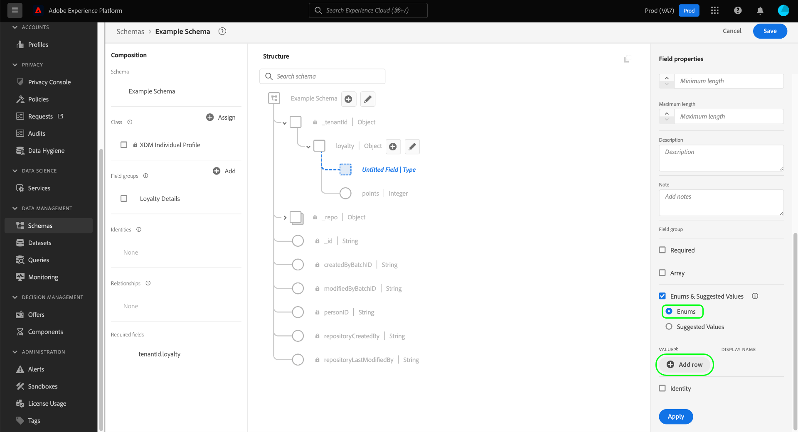

# UI で列挙と推奨値を定義する {#enums-and-suggested-values}

>[!CONTEXTUALHELP]
>id="platform_xdm_enum_suggestedvalue"
>title="列挙と推奨値"
>abstract="An **Enum** 文字列フィールドを制限して、事前定義された値のセットと一致するデータのみを取り込めるようにします。 各列挙制約には、 **表示名** セグメント化 UI の属性ドロップダウンを設定する **推奨値** フィールドの場合は、取り込みを制限せず、セグメントに表示される表示名のみを決定します。 共通のクラスまたはフィールドグループに属するフィールドを共有する複数のスキーマがあり、各スキーマ間でそのフィールドに異なる列挙または推奨値を定義した場合、それらの値は結合され、和集合スキーマに追加されます。"

エクスペリエンスデータモデル (XDM) では、文字列フィールドに受け入れられる値または推奨される値の事前定義セットを指定して、そのフィールドに取り込まれる値やセグメント化での動作をより適切に制御できます。

**[!UICONTROL 列挙]** 文字列フィールドに取り込める値を事前定義済みのセットに制限します。 データを列挙フィールドに取り込もうとしたが、その値が設定で定義された値と一致しない場合、取り込みは拒否されます。

列挙とは異なり、 **[!UICONTROL 推奨値]** 「 」オプションを使用すると、取り込む値を制限しない文字列フィールドの推奨値のセットを示すことができます。 代わりに、推奨値は、 [セグメント化 UI](../../../segmentation/ui/overview.md) 文字列フィールドを属性として含める場合。

条件 [新しいフィールドの定義](./overview.md#define) (Adobe Experience Platformユーザーインターフェイス ) で、タイプをに設定します。 [!UICONTROL 文字列]に値を指定しない場合、 [enum](#enum) または [推奨値](#suggested-values) そのフィールドの

このドキュメントでは、 [!UICONTROL スキーマ] UI ワークスペース。 UI での列挙の設定方法やその下流の効果など、列挙と推奨される値の概要については、次のビデオを参照してください。

>[!VIDEO](https://video.tv.adobe.com/v/3409501/?quality=12&learn=on)

## 列挙を定義 {#enum}

選択 **[!UICONTROL 列挙と推奨値]**&#x200B;を選択し、「 **[!UICONTROL 列挙]**. 追加のコントロールが表示され、列挙の値の制約を指定できます。 制約を追加するには、 **[!UICONTROL 行を追加]**.

以下 **[!UICONTROL 値]** 」列には、フィールドを制限する正確な値を指定する必要があります。 オプションで、人間にやさしい **[!UICONTROL 表示名]** 制約についても同様です。これは、セグメント化での値の表現方法に影響します。

引き続き **[!UICONTROL 行を追加]** 目的の制約とオプションのラベルを列挙に追加するには、「 」アイコン () をクリックします。 終了したら、「 」を選択します。 **[!UICONTROL 適用]** をクリックして、変更をスキーマに適用します。

キャンバスが更新され、変更が反映されます。 このスキーマを将来調査する際は、右側のパネル内の列挙フィールドの制約を表示および編集できます。

## 推奨値の定義 {#suggested-values}

選択 **[!UICONTROL 列挙と推奨値]**&#x200B;を選択し、「 **[!UICONTROL 推奨値]** 追加のコントロールを表示します。 ここからを選択します。 **[!UICONTROL 行を追加]** をクリックして、推奨値の追加を開始します。

以下 **[!UICONTROL 表示名]** 列に、セグメント化 UI に表示する値のわかりやすい名前を指定します。 その他の推奨値を追加するには、「 **[!UICONTROL 行を追加]** 必要に応じて、この手順を繰り返します。 以前に追加した行を削除するには、  問題の行の横に表示されます。

終了したら、「 」を選択します。 **[!UICONTROL 適用]** をクリックして、変更をスキーマに適用します。

>[!NOTE]
>
>フィールドの更新された推奨値がセグメント化 UI に反映されるまでに、およそ 5 分の遅延があります。

### 標準フィールドの推奨値の管理 {#standard-fields}

標準 XDM コンポーネントの一部のフィールドには、独自の推奨値 ( 例： `eventType` から [[!UICONTROL XDM ExperienceEvent] クラス](../../classes/experienceevent.md) カスタムフィールドと同じ方法で、これらの標準フィールドに推奨値を追加で作成できます。 また、使用例に適さない標準的な推奨値を無効にすることもできますが、フィールド定義から完全に削除することはできません。

>[!IMPORTANT]
>
>対応する列挙制約を持たない標準フィールドの推奨値のみを無効にできます。 つまり、 **[!UICONTROL 列挙]** の代わりにオプションが有効になっています **[!UICONTROL 推奨値]**&#x200B;の場合、フィールドは列挙として制限され、これらの制約を無効にすることはできません。
>
>詳しくは、 [以下の節](#evolution) ：列挙を更新するルールと、既存のスキーマフィールドに推奨される値について詳しくは、を参照してください。

標準の推奨値を無効にするには、該当する値の横にある切り替えを選択します。 提案された値の組み合わせ（すべてを含む）を無効にすることができます。

![標準で推奨される [!UICONTROL イベントタイプ] フィールドが UI で無効になっている。](../../images/ui/fields/enum/suggested-standard.png)

標準フィールドに新しい推奨値を追加するには、 **[!UICONTROL 行を追加]**. 組織で以前に追加された推奨値を削除するには、「  問題の行の横に表示されます。

## 列挙と推奨値の変化ルール {#evolution}

列挙フィールドを持つスキーマを使用して、データを Platform に取り込んだ後、スキーマ定義に対してさらに変更を加える場合は、システムに既に存在するデータに従う必要があります。 一般に、既存のフィールドに対して行った変更は、そのフィールドにのみ適用されます **less** 制限的な フィールドは、既に存在するよりも制限を厳しくすることはできません。

列挙と推奨値に関しては、次のルールが取り込み後に適用されます。

* あなた **可能** 推奨値を既存の推奨値と共に任意のフィールドに追加します。
* あなた **可能** 既存の推奨値を持つフィールドからカスタム推奨値を削除します。
* あなた **可能** 推奨値のみを含み、列挙制約を含まないフィールドから、標準の推奨値を無効にします。
* あなた **可能** 既存のカスタム列挙フィールドに新しい enum 値を追加します。
* あなた **可能** カスタムフィールドの enum 値を推奨値のみに切り替えるか、列挙値や推奨値のない文字列に変換します。 **このスイッチは、適用後は元に戻すことができません。**
* あなた **CANNOT** 標準フィールドから列挙制約を追加または削除します。
* あなた **CANNOT** 標準フィールドから推奨値を削除します（無効のみ）。
* あなた **CANNOT** 既存の列挙を持たないフィールドに、列挙制約を追加します。
* あなた **CANNOT** カスタムフィールドの既存の enum 制約の数より少ない数の値を削除します。
* あなた **CANNOT** 推奨値から列挙に切り替えます。

## 列挙と推奨値の結合ルール {#merging}

複数のスキーマが同じ列挙フィールドを異なる設定で使用し、それらのスキーマが和集合に含まれる場合、列挙の違いの紐付け方法に関しては、特定のルールが適用されます。 正確なルールは、同じ標準フィールド ( `eventType`) または異なるフィールドグループ内の同じカスタムフィールドパスを参照している場合に、これらのパスを使用します。

同じ標準フィールドを参照する場合：

* その他の推奨値は次のとおりです。 **追加** 組合内で
* 同じ列挙キーの推奨値に対して行われた更新は次のとおりです **更新済み** 組合内で

異なるフィールドグループで同じカスタムフィールドパスを参照する場合：

* その他の推奨値は次のとおりです。 **追加** 組合内で
* 複数のスキーマで同じ追加の推奨値が定義されている場合、それらの値は次のようになります **マージ済み** 組合内で つまり、マージ後に同じ推奨値が 2 回表示されることはありません。

## 検証の制限

現在のシステムの制限により、取り込み中に列挙がシステムによって検証されない場合は 2 つあります。

1. 列挙は [配列フィールド](./array.md).
1. 列挙は、スキーマ階層内で複数のレベルで定義されています。

## 次の手順

このガイドでは、UI で文字列フィールドの列挙と推奨値を定義する方法について説明しました。 スキーマレジストリ API を使用した列挙と推奨値の管理方法について詳しくは、次を参照してください [チュートリアル](../../tutorials/suggested-values.md).

で他の XDM フィールドタイプを定義する方法を学ぶには [!DNL Schema Editor]詳しくは、 [UI でのフィールドの定義](./overview.md#special).
