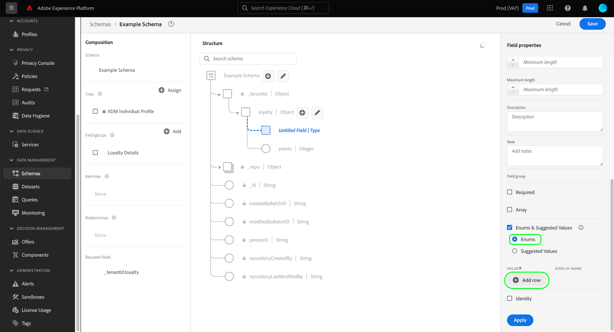
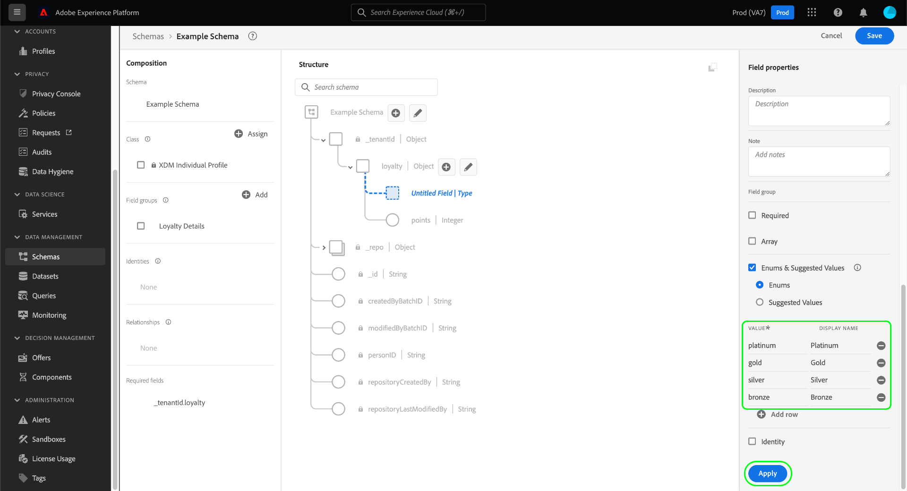
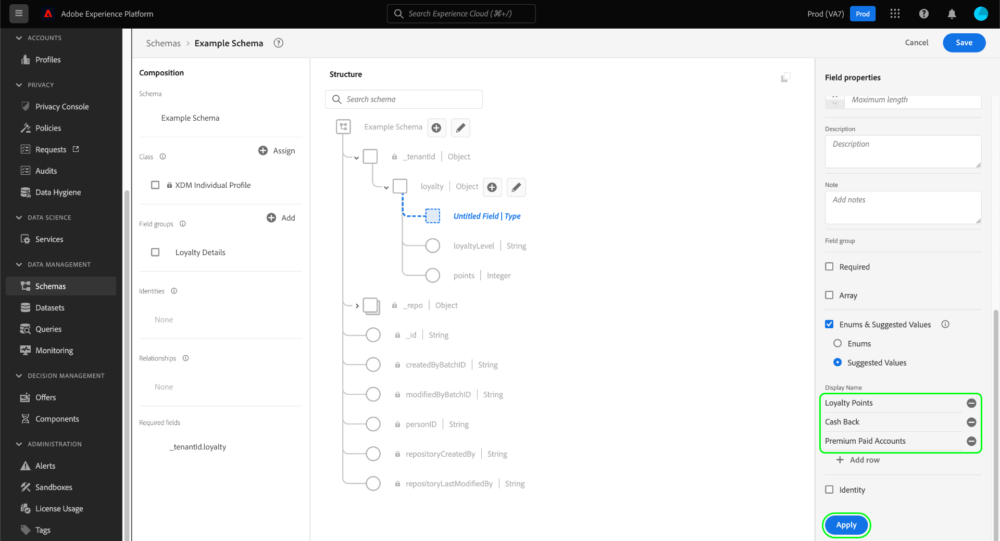
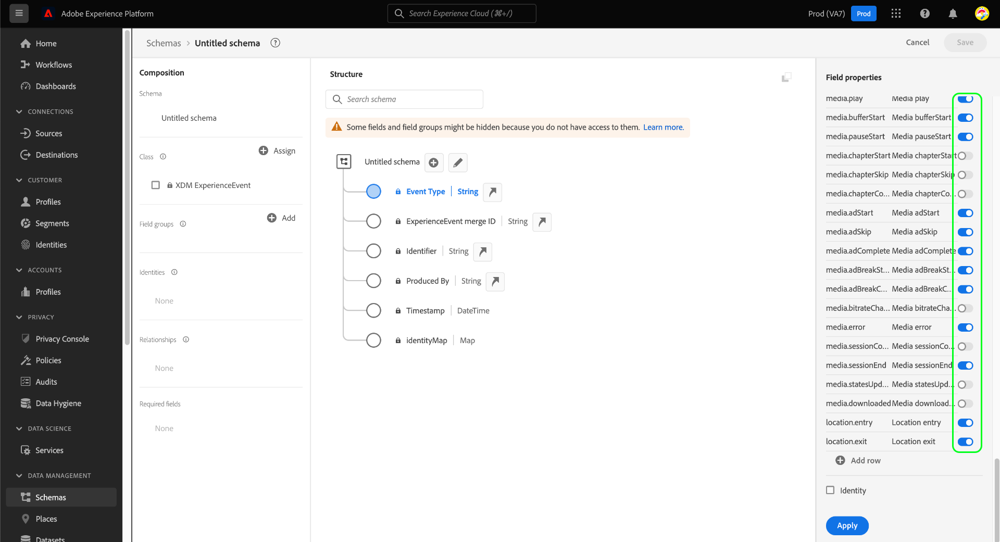
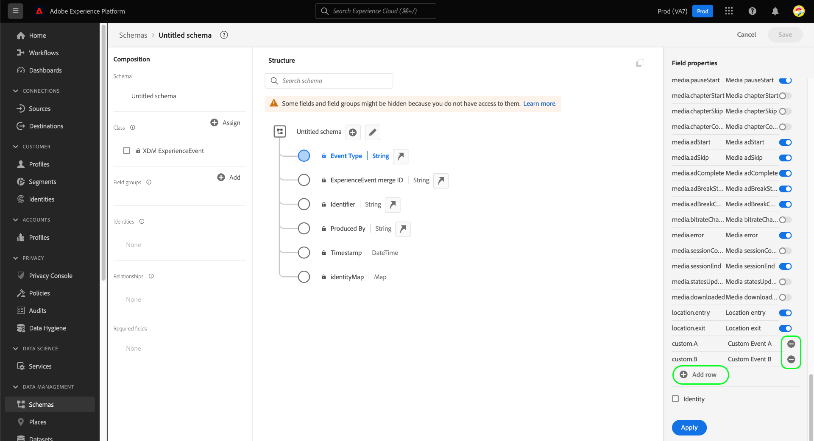
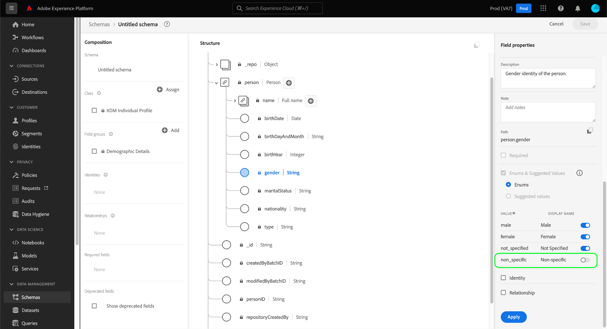

# UI で列挙と推奨値を定義 {#enums-and-suggested-values}

>[!CONTEXTUALHELP]
>id="platform_xdm_enum_suggestedvalue"
>title="列挙と推奨値"
>abstract="**列挙**&#x200B;は、文字列フィールドを制約して、事前定義済みの値のセットに一致するデータのみを取り込みます。各列挙制約には、セグメント化 UI の属性ドロップダウンに入力する&#x200B;**表示名**&#x200B;を割り当てることができます。フィールドの&#x200B;**推奨値**&#x200B;は、取り込みを制限するものではなく、セグメント化に表示される表示名を決定するだけです。共通のクラスまたはフィールドグループに属するフィールドを共有する複数のスキーマがあり、各スキーマ間でそのフィールドに対して異なる列挙または推奨値を定義した場合、これらの値は結合されて、結合スキーマに追加されます。"

Experience Data Model （XDM）では、文字列フィールドに受け入れられるまたは提案された値の事前定義されたセットを与えることで、そのフィールドに取り込まれる値や、セグメント化でどのように動作するかを適切に制御できます。

**[!UICONTROL Enums]**&#x200B;文字列フィールドに取り込むことができる値を、定義済みのセットに制限します。 列挙フィールドにデータを取り込もうとし、値がその設定で定義されているどれにも一致しない場合、取り込みは拒否されます。

列挙とは対照的に、**[!UICONTROL Suggested values]** オプションを使用すると、取り込み可能な値を制限しない文字列フィールドの推奨値のセットを示すことができます。 代わりに、推奨される値は、文字列フィールドを属性として含める場合、[&#x200B; セグメント化UI](../../../segmentation/ui/overview.md)で使用できる定義済みの値に影響します。

Adobe Experience Platform ユーザーインターフェイスで新しいフィールド [を](./overview.md#define)定義し、型を[!UICONTROL String]に設定すると、そのフィールドに[列挙型](#enum)または[推奨値](#suggested-values)を定義するオプションが与えられます。

このドキュメントでは、[!UICONTROL Schemas] UI ワークスペースで列挙と推奨値を定義する方法について説明します。 UIでの設定方法やダウンストリームのエフェクトなど、列挙と推奨値の概要については、次のビデオをご覧ください。

>[!VIDEO](https://video.tv.adobe.com/v/3413679/?captions=jpn&quality=12&learn=on)

## 列挙の定義 {#enum}

**[!UICONTROL Enums and Suggested Values]**&#x200B;を選択してから、**[!UICONTROL Enums]**&#x200B;を選択します。 追加のコントロールが表示され、列挙の値の制約を指定できます。 制約を追加するには、**[!UICONTROL Add row]**&#x200B;を選択します。

UIで選択された列挙オプションを示す

**[!UICONTROL Value]**&#x200B;列の下で、フィールドを制約する値を正確に指定する必要があります。 制約に対して人間に適した&#x200B;**[!UICONTROL Display Name]**&#x200B;をオプションで指定することもできます。これは、値がセグメンテーションでどのように表示されるかに影響します。

**[!UICONTROL Add row]**&#x200B;を引き続き使用して、目的の制約とオプションのラベルを列挙に追加するか、以前に追加した行の横にある削除アイコン（）を選択して削除します。 完了したら、**[!UICONTROL Apply]**&#x200B;を選択して、変更をスキーマに適用します。

カンバスが更新され、変更が反映されます。 今後このスキーマを検討する場合は、右側のパネルで列挙フィールドの制約を表示および編集できます。

## 推奨値の定義 {#suggested-values}

**[!UICONTROL Enums and Suggested Values]**&#x200B;を選択し、**[!UICONTROL Suggested Values]**&#x200B;を選択して追加のコントロールを表示します。 ここから、**[!UICONTROL Add row]**&#x200B;を選択して、推奨値の追加を開始します。

**[!UICONTROL Display Name]**&#x200B;列の下で、セグメント UIに表示する値に人間に適した名前を指定します。 より多くの推奨値を追加するには、**[!UICONTROL Add row]**&#x200B;をもう一度選択し、必要に応じてプロセスを繰り返します。 以前に追加した行を削除するには、該当する行の横にある削除アイコン 選択します。

完了したら、**[!UICONTROL Apply]**&#x200B;を選択して、変更をスキーマに適用します。

>[!NOTE]
>
>フィールドの更新された推奨値がセグメント UIに反映されるまでに、おおよその5分の遅延があります。

### 標準フィールドの推奨値の管理

標準XDM コンポーネントの一部のフィールドには、`eventType` クラス [[!UICONTROL XDM ExperienceEvent]の](../../classes/experienceevent.md)など、独自の推奨値が含まれています。 標準フィールドに追加の推奨値を作成することはできますが、組織で定義されていない推奨値を変更または削除することはできません。 UIで標準フィールドを表示する場合、推奨される値は表示されますが、読み取り専用です。

標準フィールドに新しい推奨値を追加するには、**[!UICONTROL Add row]**&#x200B;を選択します。 組織によって以前に追加された推奨値を削除するには、該当する行の横にある削除アイコン 選択します。

<!-- 
### Removing suggested values for standard fields

Only suggested values that you define can be removed from a standard field. Existing suggested values can be disabled so that they no longer appear in the segmentation dropdown, but they cannot be removed outright.

For example, consider a profile schema where the a suggested value for the standard `person.gender` field is disabled:

In this example, the display name "[!UICONTROL Non-specific]" is now disabled from being shown in the segmentation dropdown list. However, the value `non_specific` is still part of the list of enumerated fields and is therefore still allowed on ingestion. In other words, you cannot disable the actual enum value for the standard field as it would go against the principle of only allowing changes that make a field less restrictive.

See the [section below](#evolution) for more information on the rules for updating enums and suggested values for existing schema fields. 
-->

## 列挙と推奨値の展開ルール {#evolution}

列挙フィールドを持つスキーマを使用してExperience Platformにデータを取り込んだ後、スキーマ定義に加えるさらなる変更は、システム内の既にデータに準拠する必要があります。 一般的に、既存のフィールドに対して行われた変更は、そのフィールドを&#x200B;**より小さい**&#x200B;制限にすることしかできません。 フィールドを既存より制限することはできません。

列挙と推奨値に関しては、次のルールが取り込み後に適用されます。

* 標準フィールドとカスタムフィールドの推奨値を既存の推奨値に追加するには、**CAN**&#x200B;します。
* **CAN**&#x200B;は、既存の推奨値を持つカスタムフィールドから推奨値を削除できます。
* 既存のカスタム列挙フィールドに新しい列挙値を&#x200B;**CAN**&#x200B;追加できます。
* **CAN**&#x200B;は、カスタムフィールドの列挙値を推奨値のみに切り替えたり、列挙値や推奨値のない文字列に変換したりできます。 **この切り替えは、一度適用すると元に戻せません。**
* 標準フィールドから列挙または推奨値を&#x200B;**削除できません**。
* 既存の列挙がないフィールドに列挙値を&#x200B;**CANNOT**&#x200B;追加できます。
* カスタムフィールドの既存のすべての列挙値よりも少ない値を&#x200B;**削除することはできません**。
* **は、推奨値から列挙に切り替えることはできません**。

## 列挙と推奨値のルールの結合 {#merging}

複数のスキーマが異なる設定で同じ列挙フィールドを使用し、それらのスキーマが結合に含まれている場合、列挙の違いがどのように紐付けられるかに関して、特定のルールが適用されます。 正確なルールは、スキーマが同じ標準フィールド （`eventType`など）を参照しているか、異なるフィールドグループで同じカスタムフィールドパスを参照しているかどうかに応じて異なります。

同じ標準フィールドを参照する場合：

* 追加の推奨値は、和集合の&#x200B;**Appended**&#x200B;です。
* 同じ列挙キーの推奨値に対して行われた更新は、和集合の&#x200B;**UPDATED**&#x200B;です。

異なるフィールドグループで同じカスタムフィールドパスを参照する場合：

* 追加の推奨値は、和集合の&#x200B;**Appended**&#x200B;です。
* 複数のスキーマで同じ追加の推奨値が定義されている場合、それらの値は和集合の&#x200B;**結合**&#x200B;です。 つまり、マージ後に同じ推奨値が2回表示されなくなります。

## 検証の制限

現在のシステム制限により、取り込み中に列挙がシステムによって検証されない場合が2つあります。

1. 列挙は[配列フィールド &#x200B;](./array.md)で定義されています。
1. 列挙は、スキーマ階層の1つ以上のレベルで定義されます。

## 次の手順

このガイドでは、UIで文字列フィールドの列挙と推奨値を定義する方法について説明しました。 Schema Registry APIを使用して列挙と推奨値を管理する方法について詳しくは、次の[&#x200B; チュートリアル &#x200B;](../../tutorials/suggested-values.md)を参照してください。

[!DNL Schema Editor]で他のXDM フィールドタイプを定義する方法については、[UIでのフィールドの定義](./overview.md#special)の概要を参照してください。
