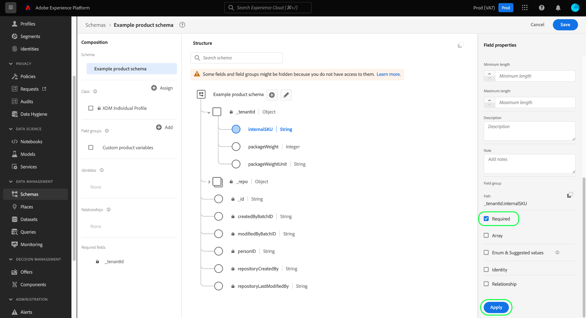

# UI での必須フィールドの定義

エクスペリエンスデータモデル (XDM) の必須フィールドは、データの取り込み中に特定のレコードまたは時系列イベントを受け入れるために、有効な値を指定する必要があることを示します。 必須フィールドの一般的な使用例には、ユーザー ID 情報やタイムスタンプが含まれます。

Adobe Experience Platformユーザーインターフェイスで新しいフィールド ](./overview.md#define) を定義する場合、右側のパネルで「**[!UICONTROL 必須]**」チェックボックスを選択して、必須フィールドに設定できます。 [「**[!UICONTROL 適用]**」を選択して、変更をスキーマに適用します。

フィールドがテナント ID オブジェクトの下のルートレベル属性の場合、そのパスはすぐに左側のレールの **[!UICONTROL 必須フィールド]** の下に表示されます。

ただし、必須フィールドが、必須フィールドとしてマークされていないオブジェクト内にネストされている場合は、左側のレールの **[!UICONTROL 必須フィールド]** の下にネストされたフィールドは表示されません。

次の例では、`loyaltyId` フィールドは必要に応じて設定されますが、親オブジェクト `loyalty` は設定されません。 この場合、データの取り込み時に `loyalty` が除外された場合、子フィールド `loyaltyId` が必要としてマークされていても、検証エラーは発生しません。 つまり、 `loyalty` はオプションですが、 `loyaltyId` フィールドを含める場合は、そのフィールドを含める必要があります。

ネストされたフィールドをスキーマで常に必須にする場合は、すべての親フィールドを必須に設定する必要もあります（テナント ID オブジェクトを除く）。

## 次の手順

このガイドでは、UI で必須フィールドを定義する方法を説明しました。 [!DNL Schema Editor] で他の XDM フィールドタイプを定義する方法については、[UI でのフィールドの定義 ](./overview.md#special) の概要を参照してください。
