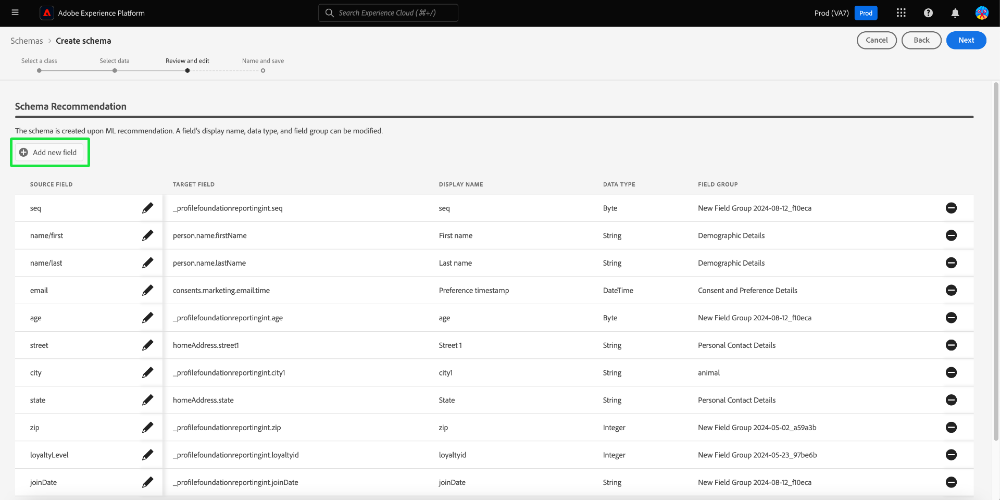

# 機械学習によるスキーマ作成

>[!AVAILABILITY]
>
>* 機械学習によるスキーマ作成は、現在ベータ版です。 ドキュメントと機能は変更される場合があります。

ML アルゴリズムを使用して、サンプルデータからスキーマを生成します。 このプロセスにより、大規模で複雑なデータセットの構造、フィールド、データタイプを定義する際の時間が節約され、精度が向上します。

ML スキーマの生成を使用すると、新しいデータソースをすばやく統合し、手動で作成した場合のミスを減らすことができます。 技術に詳しくないユーザーでも、このテンプレートを使用してスキーマを生成したり、大きくて複雑なデータセットを追加の手間をかけずに管理したりできます。 この支援により、データの取得からインサイトの獲得までのプロセスが迅速化され、新しいデータソースの組み合わせやデータ分析の実行が容易になります。

## はじめに

このチュートリアルでは、スキーマ作成の要件について十分に理解している必要があります。 このガイドを進める前に、[ スキーマの作成および編集の UI ガイド ](./resources/schemas.md) を参照する必要があります。

このガイドでは、機械学習（ML）アルゴリズムを使用してスキーマを作成し、サンプルデータからスキーマを生成する方法について説明します。 スキーマの作成について詳しくは、[ 手動スキーマ作成ワークフローガイド ](https://experienceleague.adobe.com/ja/docs/experience-platform/xdm/ui/resources/schemas#add-field-groups) を参照してください。また、スキーマ作成プロセスを理解しやすくするために、スキーマエディターの [ フィールドベースのワークフロー ](https://experienceleague.adobe.com/ja/docs/experience-platform/xdm/ui/field-based-workflows) に関するドキュメントを参照してください。

>[!NOTE]
>
>[!DNL Schema Registry] API を使用してスキーマを作成することもできます。 API を使用して手動でスキーマを作成するには、まず [[!DNL Schema Registry]  開発者ガイド ](../api/getting-started.md) を参照してから、[API を使用したスキーマの作成 ](../tutorials/create-schema-api.md) に関するチュートリアルを試してください。

## スキーマ作成ワークフローに移動します。 {#navigate-to-schema-creation-workflow}

Experience Platform UI の左側のナビゲーションから、「**[!UICONTROL スキーマ]** ワークスペースを選択します。 **[!UICONTROL スキーマ]** ワークスペースが表示されます。 **[!UICONTROL スキーマを作成]** を選択して、新しいスキーマを追加し、スキーマ作成ワークフローを開始します。

## スキーマの作成 {#create-a-schema}

[!UICONTROL &#x200B; スキーマを作成 &#x200B;] ダイアログが表示されます。 **[ML-Assisted]** スキーマ作成オプションを選択し、続いて **[!UICONTROL 選択]** を選択して選択内容を確定します。

![[!UICONTROL ML – 支援 [!UICONTROL &#x200B; がハイライト表示された &#x200B;] スキーマを作成 &#x200B;] ダイアログ ](../images/ui/ml-schema-creation/use-sample-csv.png)

### 基本クラスを選択 {#select-base-class}

[!UICONTROL &#x200B; スキーマを作成 &#x200B;] ワークフローが表示されます。 スキーマの基本クラスを選択し、続いて **[!UICONTROL 次へ]** を選択します。

### CSV ファイルのアップロード {#upload-csv}

作成ワークフローの **[!UICONTROL データを選択]** ステージが表示されます。 「**[!UICONTROL ファイルをアップロード]**」セクションで、「**[!UICONTROL ファイルを選択]** または「**[!UICONTROL ファイルをドラッグ&amp;ドロップ]**」セクションを選択します。 コンピューターから.csv ファイルを選択して、スキーマを生成します。

### データのプレビュー {#preview-data}

「[!UICONTROL &#x200B; ファイルをアップロード &#x200B;]」セクションにはインポートした CSV ファイルの名前が表示され、「**[!UICONTROL プレビュー]**」セクションにはアップロードしたファイルのサンプルデータの行が表示されます。 「**[!UICONTROL 次へ]**」を選択して、ワークフローを続行します。

### スキーマのレビューと編集 {#review-schema}

作成ワークフローの **[!UICONTROL レビューと編集]** ステージが表示され、機械学習による支援 **[!UICONTROL スキーマのレコメンデーション]** が表形式で表示されます。 この段階では、機械学習モデルで生成された推奨スキーマから、フィールドを編集、追加、削除できます。 このテーブルには、次のフィールドが含まれています。

| フィールド名 | 説明 |
|------------------|---------------------------------------------------------|
| [!UICONTROL &#x200B; データテーブル &#x200B;] | フィールドが発生するデータセットまたはデータベース。 |
| [!UICONTROL Source フィールド &#x200B;] | ソースシステムからの元のフィールド名。 |
| [!UICONTROL &#x200B; ターゲットフィールド &#x200B;] | データがマッピングされるターゲットシステムのフィールド名。 |
| [!UICONTROL 表示名] | ユーザーインターフェイスにフィールドを表示するために使用される名前。 この名前は、よりわかりやすい、または説明的である必要があります。 |
| [!UICONTROL &#x200B; データタイプ &#x200B;] | フィールドに保存されるデータのタイプ （例：`String`、`Date`）。 |
| [!UICONTROL &#x200B; フィールドグループ &#x200B;] | 使用またはコンテキストに基づくフィールドの分類（例：[!UICONTROL &#x200B; デモグラフィックの詳細 &#x200B;]、[!UICONTROL Commerceの詳細 &#x200B;]）。 |

#### フィールドを追加 {#add-field}

スキーマにフィールドを追加するには、「**[!UICONTROL 新しいフィールドを追加]**」を選択します。

[!UICONTROL &#x200B; フィールドを選択 &#x200B;] ダイアログが表示されます。 ダイアログには、現在のスキーマの図が含まれています。 目的のフィールドを選択し、「**[選択]**」を選択して、スキーマに新しいフィールドを追加します。 必要に応じて、「**[キャンセル]**」を選択してダイアログを閉じます。

推奨スキーマに新しい行が表示されます。 これで、フィールドを編集できます。

#### フィールドの編集 {#edit-field}

フィールドを編集するには、編集する行の鉛筆アイコンを選択します。 詳細パネルが右側に表示され、カスタムフィールドマッピングを編集できます。 詳細パネルには、[!UICONTROL &#x200B; ターゲットフィールド &#x200B;]、[!UICONTROL &#x200B; 表示名 &#x200B;]、[!UICONTROL &#x200B; データタイプ &#x200B;]、および [!UICONTROL &#x200B; フィールドグループ &#x200B;] が含まれています。 必要な変更を加え、「**[!UICONTROL 適用]**」を選択して確定します。 鉛筆アイコンをもう一度選択して、詳細パネルを閉じます。

#### フィールドを削除 {#remove-field}

フィールドを削除するには、削除する行のマイナスアイコンを選択します。

>[!CAUTION]
>
>この項目を削除するときに確認ダイアログが表示されません。

#### 推奨スキーマを承認 {#approve}

推奨スキーマを承認して **[!UICONTROL スキーマを作成]** ワークフローを続行するには、「**[次へ]**」を選択します。

### スキーマに名前を付けて保存 {#name-and-save}

作成ワークフローの **[!UICONTROL 名前を付けて保存]** ステージが表示されます。 **[スキーマ表示名]** と説明（オプション）を入力します。 「**[スキーマの生成]**」セクションには、ML で生成されたスキーマの図が表示されます。 「**[完了]**」を選択して、スキーマ作成ワークフローを完了します。

### スキーマエディターで表示 {#view-in-editor}

スキーマエディターが表示され、新しく作成したスキーマがキャンバスに表示されます。 「**[!UICONTROL 保存]**」を選択して、「[!UICONTROL &#x200B; スキーマ &#x200B;] ワークスペースに戻ります。

## 次の手順

スキーマを作成したら、スキーマエディターを使用して、必要に応じてさらに変更を加えることができます。 これで、新しいスキーマをデータソースと統合し、データ分析に使用する準備が整いました。

スキーマエディターの使用について詳しくは、[ 既存のスキーマの編集 ](https://experienceleague.adobe.com/ja/docs/experience-platform/xdm/ui/resources/schemas#edit) ガイドを参照してください。
