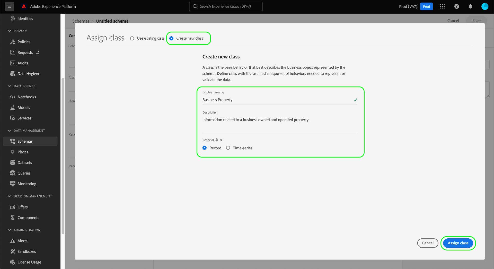

# UI でのクラスの作成と編集

エクスペリエンスデータモデル (XDM) で、クラスは、スキーマに格納されるデータ（レコードまたは時系列）の動作面を定義します。 これに加えて、クラスは、そのクラスに基づくすべてのスキーマに含める必要のある共通のプロパティの最小数を記述し、複数の互換性のあるデータセットを結合する方法を提供します。

Adobeは、[!DNL XDM Individual Profile] と [!DNL XDM ExperienceEvent] を含む、いくつかの標準（「コア」）XDM クラスを提供します。 これらのコアクラスに加えて、独自のカスタムクラスを作成して、組織の具体的な使用例を説明することもできます。

このドキュメントでは、Adobe Experience Platform UI でカスタムクラスを作成、編集、管理する方法の概要を説明します。

## 前提条件

このガイドでは、XDM システムに関する十分な知識が必要です。 Experience Platformエコシステム内での XDM の役割の概要については、[XDM の概要 ](../../home.md) を参照してください。XDM スキーマにクラスが貢献する方法については、[ スキーマ構成の基本 ](../../schema/composition.md) を参照してください。

このガイドは必須ではありませんが、 [!DNL Schema Editor] の様々な機能に慣れるために、 [UI でのスキーマの構成 ](../../tutorials/create-schema-ui.md) に関するチュートリアルに従うことをお勧めします。

## 新しいクラスの作成 {#create}

「**[!UICONTROL スキーマ]**」ワークスペースで、「**[!UICONTROL スキーマを作成]**」を選択し、ドロップダウンから「**[!UICONTROL 参照]**」を選択します。

使用可能なクラスのリストから選択できるダイアログが表示されます。 ダイアログの上部で、「**[!UICONTROL 新しいクラスを作成]**」を選択します。 次に、新しいクラスに、表示名（クラスを説明する短く、一意で、わかりやすいクラス名）、説明、およびスキーマが定義するデータの動作（「[!UICONTROL Record]」または「[!UICONTROL Time-series]」）を指定します。

終了したら、「**[!UICONTROL クラスを割り当て]**」を選択します。

[!DNL Schema Editor] が表示され、作成したカスタムクラスに基づく新しいスキーマがキャンバスに表示されます。 クラスにはまだフィールドが追加されていないので、スキーマには `_id` フィールドのみが含まれます。これは、[!DNL Schema Registry] 内のすべてのリソースに自動的に適用される、システム生成の一意の識別子を表します。

>[!IMPORTANT]
>
>組織で定義されたクラスを実装するスキーマを作成する場合、スキーマフィールドグループは互換性のあるクラスでのみ使用できることに注意してください。 定義したクラスは新しいので、**[!UICONTROL フィールドグループの追加]** ダイアログには互換性のあるフィールドグループが表示されません。 代わりに、そのクラスで使用する新しいフィールドグループ ](./field-groups.md#create) を作成する必要があります。 [次に新しいクラスを実装するスキーマを作成すると、定義したフィールドグループが一覧表示され、使用できます。

これで、[ クラス ](#add-fields) にフィールドを追加し、そのクラスを使用するすべてのスキーマで共有できるようになりました。

## 既存のクラスの編集 {#edit}

>[!NOTE]
>
>完全に編集およびカスタマイズできるのは、組織で定義されたカスタムクラスだけです。 Adobeで定義されたコアクラスの場合、各スキーマのコンテキスト内で編集できるのはフィールドの表示名だけです。 詳しくは、[ スキーマフィールド ](./schemas.md#display-names) の表示名の編集の節を参照してください。
>
>カスタムクラスを保存してデータ取り込みで使用した後は、その後は追加的な変更のみおこなうことができます。 詳しくは、[ スキーマ進化のルール ](../../schema/composition.md#evolution) を参照してください。

既存のクラスを編集するには、「**[!UICONTROL 参照]**」タブを選択し、編集するクラスを採用しているスキーマの名前を選択します。

>[!TIP]
>
>ワークスペースの検索およびフィルタリング機能を使用して、スキーマを見つけやすくすることができます。 詳しくは、[XDM リソース ](../explore.md) のガイドを参照してください。

[!DNL Schema Editor] が表示され、スキーマの構造がキャンバスに表示されます。 これで、[ クラス ](#add-fields) にフィールドを追加し始めることができます。

## クラスへのフィールドの追加 {#add-fields}

カスタムクラスを使用するスキーマを [!UICONTROL  スキーマエディター ] で開くと、クラスへのフィールドの追加を開始できます。 新しいフィールドを追加するには、スキーマ名の横にある **プラス (+)** アイコンを選択します。

>[!IMPORTANT]
>
>クラスに追加するフィールドは、そのクラスを使用するすべてのスキーマで使用されます。 したがって、すべてのスキーマの使用例で役立つフィールドを慎重に検討する必要があります。 このクラスの一部のスキーマでのみ使用される可能性のあるフィールドを追加する場合は、代わりに [ フィールドグループ ](./field-groups.md#create) を作成して、それらのスキーマに追加することを検討してください。

キャンバスに **[!UICONTROL 新しいフィールド]** が表示され、右側のレールが更新されて、フィールドのプロパティを設定するコントロールが表示されます。 フィールドを設定してクラスに追加する手順について詳しくは、[UI でのフィールドの定義 ](../fields/overview.md#define) に関するガイドを参照してください。

引き続き、必要な数のフィールドをクラスに追加します。 終了したら、「**[!UICONTROL 保存]**」を選択して、スキーマとクラスの両方を保存します。

このクラスを使用するスキーマを以前に作成した場合は、新しく追加されたフィールドがそれらのスキーマに自動的に表示されます。

## スキーマクラスの変更 {#schema}

スキーマのクラスは、最初の作成プロセスの間、保存前の任意の時点で変更できます。 詳しくは、[ スキーマの作成と編集 ](./schemas.md#change-class) のガイドを参照してください。

## 次の手順

このドキュメントでは、Platform UI を使用してクラスを作成および編集する方法について説明しました。 [!UICONTROL  スキーマ ] ワークスペースの機能について詳しくは、[[!UICONTROL  スキーマ ] ワークスペースの概要 ](../overview.md) を参照してください。

[!DNL Schema Registry] API を使用してクラスを管理する方法については、[classes エンドポイントガイド ](../../api/classes.md) を参照してください。
