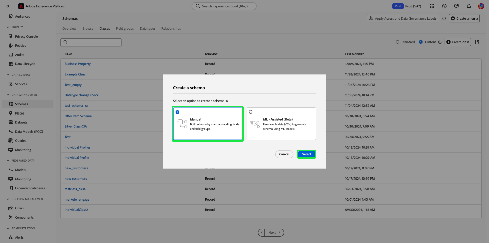
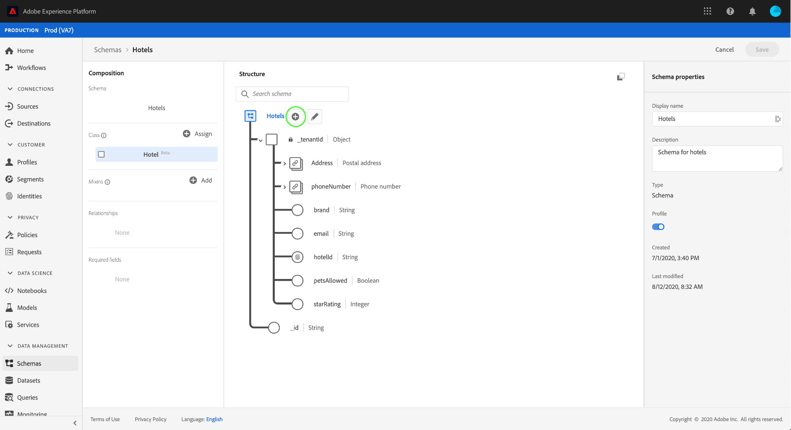

# UI でのクラスの作成と編集 {#ui-create-and-edit}

>[!CONTEXTUALHELP]
>id="platform_schemas_class_filter"
>title="標準またはカスタムのクラスフィルター"
>abstract="使用可能なクラスのリストは、作成方法に基づいて事前にフィルタリングされています。ラジオボタンを選択して、「標準」オプションと「カスタム」オプションのいずれかを選択します。「標準」オプションは、アドビが作成したエンティティを表示し、XDM 個人プロファイルクラスと XDM エクスペリエンスイベントクラスの両方を含みます。「カスタム」オプションは、組織内で作成したエンティティを表示します。クラスの作成と編集について詳しくは、ドキュメントを参照してください。"

Adobe Experience Platformでは、スキーマのクラスは、スキーマに含まれるデータの行動的側面（レコードまたは時系列）を定義します。 これに加えて、クラスは、そのクラスに基づくすべてのスキーマに含める必要のある共通のプロパティの最小数を記述し、複数の互換性のあるデータセットを結合する方法を提供します。

Adobeには、[XDM Individual Profile](../../classes/individual-profile.md)や[XDM ExperienceEvent](../../classes/experienceevent.md)など、いくつかの標準（「コア」） Experience Data Model （XDM）クラスが用意されています。 これらのコアクラスに加えて、独自のカスタムクラスを作成して、組織のより具体的なユースケースを説明することもできます。

このドキュメントでは、Experience Platform UIでカスタムクラスを作成、編集、管理する方法の概要を説明します。

>[!NOTE]
>
>XDM アクションは、インベントリ テーブルとリソースの詳細ビュー（**[!UICONTROL More]**）から使用できます。 完全なアクションは、カスタム（テナント定義）リソースにのみ適用されます。標準リソースのオプションは限られています。 [&#x200B; スキーマ、クラス、フィールドグループ、およびデータタイプの管理：アクションと削除](../explore.md#xdm-resource-actions)を参照してください。

## 前提条件 {#prerequisites}

このガイドでは、XDM システムに関する実用的な理解が必要です。 Experience Platform エコシステム内でのXDMの役割の概要については、[XDMの概要](../../home.md)を参照し、クラスがXDM スキーマに貢献する方法については、[&#x200B; スキーマ構成の基本](../../schema/composition.md)を参照してください。

このガイドでは必須ではありませんが、[UIでのスキーマの作成](../../tutorials/create-schema-ui.md)に関するチュートリアルに従って、スキーマエディターのさまざまな機能を理解することをお勧めします。

## はじめに {#getting-started}

Experience Platform UIで、左側のナビゲーションで「**[!UICONTROL Schemas]**」を選択して[!UICONTROL Schemas] ワークスペースを開き、「**[!UICONTROL Classes]**」タブを選択します。 使用可能なクラスのリストが表示されます。

![[!UICONTROL Classes] ワークスペース [!UICONTROL Schemas]と[!UICONTROL Classes]の[!UICONTROL Schemas] タブ内のクラスの数が強調表示されています。](../../images/ui/resources/classes/available-classes.png)

## フィルタークラス {#filter}

クラスのリストは、作成方法に基づいて自動的にフィルタリングされます。 デフォルト設定には、Adobeで定義されたクラスが表示されます。 リストをフィルタリングして、組織が作成したリストを表示することもできます。 ラジオボタンを選択して、[!UICONTROL Standard]と[!UICONTROL Custom]のオプションから選択します。 [!UICONTROL Standard] オプションにはAdobeで作成されたエンティティが表示され、[!UICONTROL Custom] オプションには組織内で作成されたエンティティが表示されます。

![[!UICONTROL Classes]と[!UICONTROL Schemas]がハイライト表示された[!UICONTROL Standard] ワークスペースの[!UICONTROL Custom] タブ。](../../images/ui/resources/classes/standard-and-custom-classes.png)

>[!TIP]
>
>検索機能を使用して、名前に基づいてクラスをフィルタリングまたは検索します。 詳しくは、[XDM リソースの探索](../explore.md)に関するガイドを参照してください。

## 新しいクラスの作成 {#create}

Experience Platform UIでクラスを作成するには、**[!UICONTROL Create class]**&#x200B;または&#x200B;**[!UICONTROL Create schema]**&#x200B;を通じて2つの方法があります。

### クラスを作成

**[!UICONTROL Create class]** ワークスペースの「[!UICONTROL Classes]」タブから「[!UICONTROL Schemas]」を選択します。

![[!UICONTROL Classes]が強調表示された[!UICONTROL Schemas] ワークスペースの[!UICONTROL Create class] タブ &#x200B;](../../images/ui/resources/classes/create-class.png)

[!UICONTROL Create class] ダイアログが表示されます。 クラスの[!UICONTROL Display name]と[!UICONTROL Description]を入力し、ラジオボタンを使用してクラスの意図された動作を選択します。 クラスのタイプは[!UICONTROL Record]または[!UICONTROL Time-series]です。 **[!UICONTROL Create]**&#x200B;を選択して選択を確定し、[!UICONTROL Classes] タブに戻ります。

![[!UICONTROL Create class]がハイライト表示された[!UICONTROL Create] ダイアログ。](../../images/ui/resources/classes/create-class-dialog.png)

作成したクラスが使用可能で、[!UICONTROL Classes] ビューに表示されます。

![最近作成されたクラスがハイライト表示された[!UICONTROL Classes] ワークスペースの[!UICONTROL Schemas] タブ。](../../images/ui/resources/classes/new-class-listing.png)

### スキーマを作成

または、スキーマを手動で作成してクラスを作成することもできます。 **[!UICONTROL Create schema]** ワークスペースの「[!UICONTROL Classes]」タブから「[!UICONTROL Schemas]」を選択します。

![[!UICONTROL Classes]が強調表示された[!UICONTROL Schemas] ワークスペースの[!UICONTROL Create schema] タブ &#x200B;](../../images/ui/resources/classes/create-schema.png)

表示される&#x200B;**[!UICONTROL Manual]** ダイアログで「[!UICONTROL Create a schema]」を選択します。

>[!NOTE]
>
>マシンラーニング支援スキーマ作成ワークフローを使用する場合は、ファイルをアップロードし、マシンラーニングアルゴリズムを使用して推奨スキーマを生成できます。 このスキーマ作成ワークフローでは、スキーマのベースクラスを指定する必要はありません。 マシンラーニングがcsv ファイルに基づいてスキーマ構造を推奨する方法については、[機械学習支援スキーマ作成ガイド &#x200B;](../ml-assisted-schema-creation.md)を参照してください。

スキーマ作成ワークフローが表示されます。 [!UICONTROL Schema details] セクションで、**[!UICONTROL Other]**&#x200B;を選択します。 使用可能なクラスのリストが表示されます。 **[!UICONTROL Create class]** を選択します。

![[!UICONTROL Create schema] セクションで[!UICONTROL Other]が強調表示された[!UICONTROL Schema details] ワークフロー。](../../images/ui/resources/classes/other-schema-details.png)

[!UICONTROL Create class] ダイアログが表示されます。 クラスの[!UICONTROL Display name]と[!UICONTROL Description]を入力し、ラジオボタンを使用してクラスの意図された動作を選択します。 クラスのタイプは[!UICONTROL Record]または[!UICONTROL Time-series]です。 **[!UICONTROL Create]**&#x200B;を選択して選択を確定し、[!UICONTROL Classes] タブに戻ります。

![[!UICONTROL Create class]がハイライト表示された[!UICONTROL Create] ダイアログ。](../../images/ui/resources/classes/create-class-from-schema.png)

クラスリストが[!UICONTROL Schema details] セクションで更新され、新しく作成したクラスが自動的に選択されます。 スキーマの作成を続行するには、**[!UICONTROL Next]**&#x200B;を選択してください。

![新しいクラスが選択され、[!UICONTROL Schema details]が強調表示された[!UICONTROL Next] セクション。](../../images/ui/resources/classes/select-new-class.png)

クラスを選択すると、[!UICONTROL Name and review] セクションが表示されます。 このセクションでは、スキーマを識別するための名前と説明を指定します。&#x200B;スキーマのベース構造（クラスから提供される）がキャンバスに表示され、選択したクラスとスキーマ構造を確認および検証できます。

人間に適した[!UICONTROL Schema display name]をテキストフィールドに入力します。 次に、適切な説明を入力して、スキーマを特定します。 スキーマ構造を確認し、設定に満足したら、**[!UICONTROL Finish]**&#x200B;を選択してスキーマを作成します。

![[!UICONTROL Name and review]、[!UICONTROL Create schema]、[!UICONTROL Schema display name]がハイライト表示された[!UICONTROL Description] ワークフローの[!UICONTROL Finish] セクション。](../../images/ui/resources/classes/schema-details.png)

## クラスへのフィールドの追加 {#add-fields}

スキーマエディターでカスタムクラスを使用するスキーマを開いたら、クラスへのフィールドの追加を開始できます。 新しいフィールドを追加するには、スキーマ名の横にある&#x200B;**プラス（+）** アイコンを選択します。

>[!IMPORTANT]
>
>組織で定義されたクラスを実装するスキーマを構築する場合、スキーマフィールドグループは互換性のあるクラスでのみ使用できます。 定義したクラスは新しいので、**[!UICONTROL Add field group]** ダイアログに互換性のあるフィールドグループは表示されません。 代わりに、そのクラスで使用する新しいフィールドグループ [を](./field-groups.md#create)作成する必要があります。 次回、新しいクラスを実装するスキーマを作成する際には、定義したフィールドグループが一覧表示され、使用できるようになります。

>[!IMPORTANT]
>
>クラスに追加するフィールドは、そのクラスを使用するすべてのスキーマで使用されることに注意してください。 したがって、どのフィールドがすべてのスキーマのユースケースで役立つかを慎重に検討する必要があります。 このクラスの一部のスキーマでのみ使用されるフィールドを追加する場合は、代わりに[&#x200B; フィールドグループ &#x200B;](./field-groups.md#create)を作成して、それらのスキーマに追加することを検討してください。

**[!UICONTROL Untitled Field]** プレースホルダーがキャンバスに表示され、右側のパネルが更新されて、フィールドのプロパティを設定するためのコントロールが表示されます。 **[!UICONTROL Assign to]**&#x200B;で、**[!UICONTROL Class]**&#x200B;を選択します。

![&#x200B; スキーマエディターのキャンバス内の名称未設定のフィールドで、「[!UICONTROL Class]に割り当て」フィールドプロパティが選択され、強調表示されている](../../images/ui/resources/classes/assign-to-class.png)。

フィールドを設定してクラスに追加する方法について詳しくは、[UIでのフィールドの定義](../fields/overview.md#define)に関するガイドを参照してください。 必要な数のフィールドをクラスに追加します。 完了したら、**[!UICONTROL Save]**&#x200B;を選択して、スキーマとクラスの両方を保存します。

![&#x200B; スキーマエディターのキャンバスに新しく作成されたスキーマで、[!UICONTROL Save]がハイライト表示されています。](../../images/ui/resources/classes/save.png)

このクラスを使用するスキーマを以前に作成した場合、新しく追加されたフィールドは、それらのスキーマに自動的に表示されます。

## クラスの編集 {#edit-a-class}

>[!NOTE]
>
>組織で定義されたカスタムクラスのみが完全に編集およびカスタマイズできます。 Adobeで定義されたコアクラスの場合、個々のスキーマのコンテキスト内で編集できるのは、フィールドの表示名のみです。 詳しくは、[&#x200B; スキーマフィールドの表示名の編集](./schemas.md#display-names)の節を参照してください。
>
>カスタムクラスを保存してデータ取り込みに使用すると、その後は追加の変更のみを行うことができます。 詳しくは、[&#x200B; スキーマ進化のルール &#x200B;](../../schema/composition.md#evolution)を参照してください。

クラスを拡張する既存のスキーマを編集するか、スキーマを手動で作成することで、スキーマワークフローを通じてクラスを編集できます。 クラスを直接編集することはできません。 [!UICONTROL Browse] ワークスペースの[!UICONTROL Schemas] タブ内から、既存のクラスまたは&#x200B;**[!UICONTROL Create a schema]**&#x200B;を選択します。

![既存のクラスと[!UICONTROL Create a schema]が強調表示されたスキーマエディター。](../../images/ui/resources/classes/edit-class-options.png)

新しいスキーマを作成する場合は、[&#x200B; スキーマの作成](#create-schema)の節を参照してください。 スキーマの作成が完了すると（または既存のスキーマを選択した後）、スキーマエディターが表示されます。 既存のクラスフィールドを更新するには、スキーマ構造からフィールドを選択します。 フィールドの情報は右側のパネルに表示されます。 [!UICONTROL Assign to]を確認
オプション **[!UICONTROL Class]**&#x200B;が選択されているか、更新がクラスに影響しません。

![&#x200B; フィールドを選択して強調表示し、右側のパネルが表示され、[!UICONTROL Assign to]が強調表示されたスキーマエディター。](../../images/ui/resources/classes/edit-existing-field.png)

フィールドに必要な変更を加え、右側のパネルで下にスクロールして&#x200B;**[!UICONTROL Apply]**&#x200B;を選択し、変更を保存します。

>[!IMPORTANT]
>
> フィールドに対して行った更新は、そのクラスを使用するすべてのスキーマに適用され、スキーマ進化[の](../../schema/composition.md#evolution) ルールに従います。

![&#x200B; フィールドが選択され、右側のパネルが表示されているスキーマエディター、[!UICONTROL Apply]を強調表示します。](../../images/ui/resources/classes/save-changes.png)

新しいフィールドを追加するには、[&#x200B; クラスにフィールドを追加する](#add-fields-to-a-class) ガイドに従います。 完了したら、**[!UICONTROL Save]**&#x200B;を選択して、スキーマとクラスの両方を保存します。

![[!UICONTROL Save]が強調表示されたスキーマエディター。](../../images/ui/resources/classes/save-schema.png)

## スキーマクラスの変更 {#schema}

スキーマのクラスは、最初の作成プロセスの任意の時点で保存する前に変更できます。 ただし、フィールドグループは特定のクラスとのみ互換性があるため、注意して行う必要があります。 クラスを変更すると、キャンバスと追加したフィールドがリセットされます。
詳しくは、[&#x200B; スキーマの作成と編集](./schemas.md#change-class)に関するガイドを参照してください。

## 次の手順 {#next-steps}

このドキュメントでは、Experience Platform UIを使用してクラスを作成および編集する方法について説明しました。 [!UICONTROL Schemas] ワークスペースの機能について詳しくは、[[!UICONTROL Schemas] ワークスペースの概要](../overview.md)を参照してください。

Schema Registry APIを使用してクラスを管理する方法については、[&#x200B; クラスエンドポイントガイド &#x200B;](../../api/classes.md)を参照してください。
