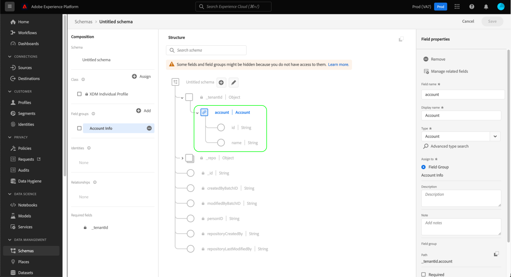

# UI を使用したデータタイプの作成と編集

エクスペリエンスデータモデル (XDM) では、データタイプは、複数のサブフィールドを含む再利用可能なフィールドです。 スキーマフィールドグループと同様に、複数フィールド構造を一貫して使用できますが、データ型はスキーマ構造の任意の場所に含めることができるのに対して、フィールドグループはルートレベルでのみ追加できるので、より柔軟です。

Adobe Experience Platformには、様々な一般的なエクスペリエンス管理の使用例を扱うために使用できる、多くの標準データ型が用意されています。 ただし、独自のビジネスニーズに対応するために、独自のカスタムデータタイプを定義することもできます。

このチュートリアルでは、Platform ユーザーインターフェイスでカスタムデータ型を作成および編集する手順を説明します。

## 前提条件

このガイドでは、XDM システムに関する十分な知識が必要です。 Experience Platformエコシステム内での XDM の役割の概要については、[XDM の概要 ](../../home.md) を参照し、データタイプが XDM スキーマに与える影響については、[ スキーマ構成の基本 ](../../schema/composition.md) を参照してください。

このガイドは必須ではありませんが、 [!DNL Schema Editor] の様々な機能に慣れるために、 [UI でのスキーマの構成 ](../../tutorials/create-schema-ui.md) に関するチュートリアルに従うことをお勧めします。

## データ型の [!DNL Schema Editor] を開きます。

Platform UI で、左のナビゲーションで「**[!UICONTROL スキーマ]**」を選択して「[!UICONTROL  スキーマ ]」ワークスペースを開き、「**[!UICONTROL データタイプ]**」タブを選択します。 使用可能なデータタイプのリストが表示されます。これには、Adobeが定義したデータタイプや、組織が作成したデータタイプが含まれます。

ここから、次の 2 つのオプションを使用できます。

- [新しいデータ型の作成](#create)
- [編集する既存のデータ型の選択](#edit)

### 新しいデータ型の作成 {#create}

「**[!UICONTROL データ型]**」タブで、「**[!UICONTROL データ型]** を作成」を選択します。

[!DNL Schema Editor] が表示され、新しいデータ型の現在の構造がキャンバスに表示されます。 エディターの右側で、データタイプの表示名と説明（オプション）を指定できます。 データ型をスキーマに追加する際に識別される方法なので、データ型に一意で簡潔な名前を付けてください。

このチュートリアルでは、レストランのプロパティを説明するデータ型を作成するので、データ型には「Restaurant」という表示名が付けられます。

ここから、[ 次のセクション ](#add-fields) に進み、新しいデータ型へのフィールドの追加を開始できます。

### 既存のデータタイプの編集

>[!NOTE]
>
>リアルタイム顧客プロファイルで使用可能になっているスキーマで既存のデータ型を使用した場合、その後は、そのデータ型に対して非破壊的な変更のみを加えることができます。 詳しくは、[ スキーマ進化のルール ](../../schema/composition.md#evolution) を参照してください。

組織で定義されたカスタムデータタイプのみを編集できます。 表示されるリストを絞り込むには、フィルターアイコン（）を選択し、[!UICONTROL  所有者 ] に基づいてフィルタリングするコントロールを表示します。 **[!UICONTROL 顧客]** を選択して、組織が所有するカスタムデータ型のみを表示します。

編集するデータ型をリストから選択して、右側のパネルを開き、データ型の詳細を表示します。 右側のパネルでデータタイプの名前を選択し、[!DNL Schema Editor] で構造を開きます。

## データ型へのフィールドの追加 {#add-fields}

データ型へのフィールドの追加を開始するには、キャンバスのルートレベルフィールドの横にある **プラス (+)** アイコンを選択します。 下に新しいフィールドが表示され、右側のレールが更新されて新しいフィールドのコントロールが表示されます。

右側のパネルのコントロールを使用して、新しいフィールドの詳細を設定します。 フィールドを設定してデータ型に追加する方法に関する詳しい手順については、[UI でのフィールドの定義 ](../fields/overview.md#define) に関するガイドを参照してください。

Restaurant データ型には、レストランの名前を表す文字列フィールドが必要です。 したがって、[!UICONTROL  フィールド名 ] は「名前」に、[!UICONTROL  型 ] は「[!UICONTROL String]」に設定されます。 「**[!UICONTROL 適用]**」を選択して、変更をフィールドに適用します。

必要に応じて、引き続きデータ型にフィールドを追加します。 サンプルの Restaurant データタイプに、ブランド、座席数、床面積の追加フィールドが追加されました。

基本フィールドに加えて、カスタムデータ型内に追加のデータ型をネストすることもできます。 例えば、Restaurant データ型には、プロパティの住所を表すフィールドが必要です。 このシナリオでは、新しい「住所」フィールドを追加し、標準のデータ型&quot;[!UICONTROL  郵送先住所 ]&quot;が割り当てられます。

データを記述する際に、次のように柔軟なデータ型を使用できます。データ型は、データ型でもあるフィールドを使用できます。フィールド自体には、さらにデータ型を含めることができます。 これにより、XDM スキーマ全体で共通のデータパターンを抽象化して再利用し、複雑なデータ構造を簡単に表現できます。

データ型へのフィールドの追加が完了したら、「**[!UICONTROL 保存]**」を選択して変更内容を保存し、データ型を [!DNL Schema Library] に追加します。

## データ型をクラスまたはフィールドグループに追加する

データ型を作成したら、スキーマで使用できます。 XDM スキーマは、クラスと 0 個以上のフィールドグループで構成されるので、データ型で提供されるフィールドを直接スキーマに追加することはできません。 代わりに、クラスまたはフィールドグループに含める必要があります。

まず、[ クラスへのフィールドの追加 ](./classes.md#add-fields) または [ フィールドグループへのフィールドの追加 ](./field-groups.md#add-fields) の手順に従います。 新しいフィールドに **[!UICONTROL 型]** を選択する場合は、ドロップダウンメニューからデータ型の名前を選択します。

## 複数フィールドオブジェクトのデータ型への変換 {#convert}

[!DNL Schema Editor] 内に複数のサブフィールドを含むオブジェクトタイプフィールドを作成する場合、そのフィールドをデータ型に変換して、同じフィールド構造を別のクラスまたはフィールドグループで使用できます。

オブジェクトタイプのフィールドをデータ型に変換するには、キャンバスでそのフィールドを選択します。 フィールドを変換する前に、**[!UICONTROL 表示名]** が、オブジェクトに格納されるデータを説明する名前であることを確認します。これは、データ型の名前になります。 フィールドを変換する準備が整ったら、右側のパネルで「**[!UICONTROL 新しいデータ型に変換]**」を選択します。

キャンバスは、フィールドのデータ型を「[!UICONTROL Object]」から新しいデータ型に更新します。 サブフィールドの横には小さなロックアイコンも表示され、個々のフィールドではなく、複数フィールドのデータ型の一部であることを示します。 この構造は、新しいフィールドを定義する際に **[!UICONTROL 型]** ドロップダウンからこのデータ型を選択することで、他のクラスやフィールドグループで再利用できるようになりました。

## 次の手順

このガイドでは、Platform UI を使用してデータタイプを作成および編集する方法について説明しました。 [!UICONTROL  スキーマ ] ワークスペースの機能について詳しくは、[[!UICONTROL  スキーマ ] ワークスペースの概要 ](../overview.md) を参照してください。

[!DNL Schema Registry] API を使用してデータ型を管理する方法については、『[ データ型エンドポイントガイド ](../../api/data-types.md)』を参照してください。
