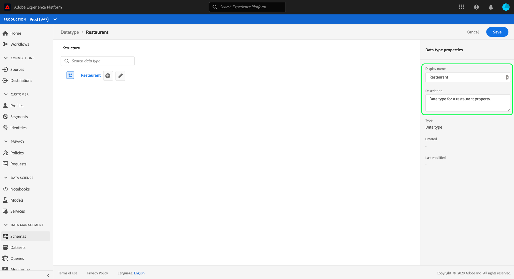
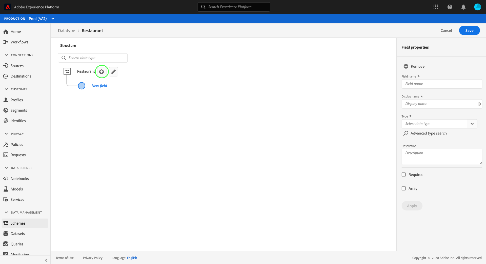
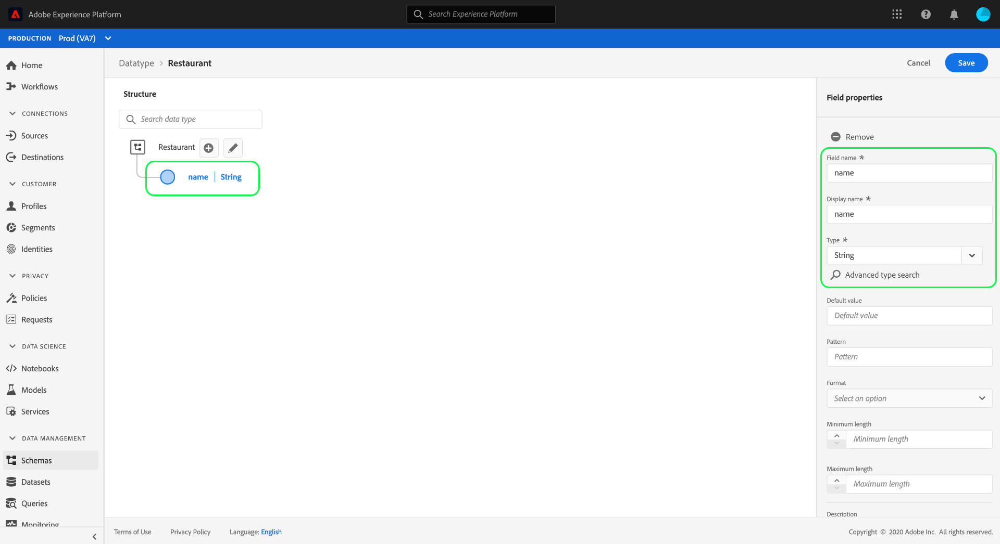
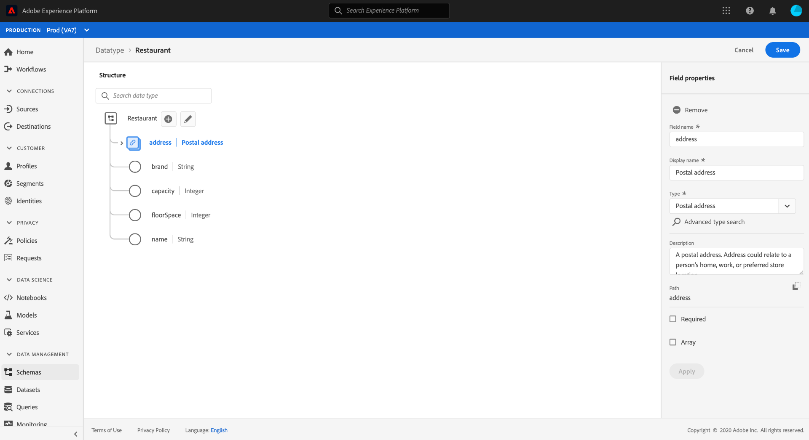
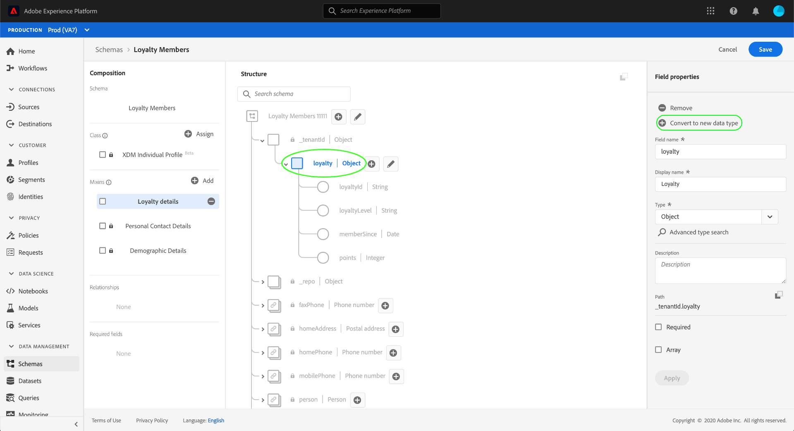
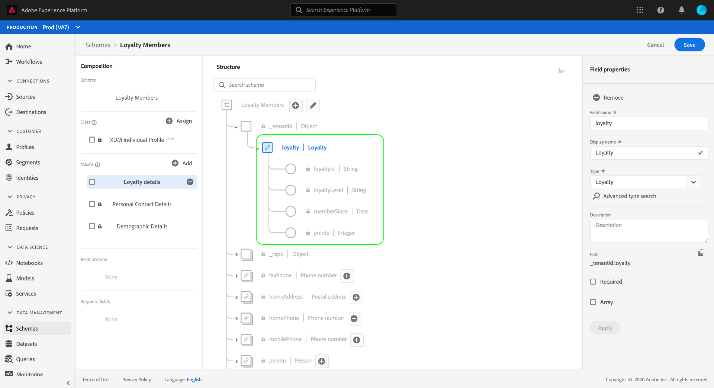

# UI を使用したデータタイプの作成と編集 {#ui-create-and-edit}

>[!CONTEXTUALHELP]
>id="platform_schemas_datatype_filter"
>title="標準またはカスタムのデータタイプフィルター"
>abstract="使用可能なデータタイプのリストは、作成方法に基づいて事前にフィルタリングされています。ラジオボタンを選択して、「標準」オプションと「カスタム」オプションのいずれかを選択します。「標準」オプションは、アドビが作成したエンティティを表示し、「カスタム」オプションは、組織内で作成したエンティティを表示します。データタイプの作成と編集について詳しくは、ドキュメントを参照してください。"

Experience Data Model （XDM）では、データタイプは、複数のサブフィールドを含む再利用可能なフィールドです。 マルチフィールド構造を一貫して使用できるという点でスキーマフィールドグループと似ていますが、データタイプは、スキーマ構造のどこにでも含めることができるのに対し、フィールドグループはルートレベルでのみ追加できるため、より柔軟です。

Adobe Experience Platformには、体験管理の一般的なユースケースをカバーするために利用できる、さまざまな標準データタイプが用意されています。 しかし、独自のビジネスニーズを満たすために、独自のカスタムデータタイプを定義することもできます。

>[!NOTE]
>
>フィールドが特定のデータタイプとして定義されている場合、別のスキーマで異なるデータタイプで同じフィールドを作成することはできません。 この制約は、組織のテナント全体に適用されます。

このチュートリアルでは、Experience Platform ユーザーインターフェイスでカスタムデータタイプを作成および編集する手順について説明します。

## 前提条件 {#prerequisites}

このガイドでは、XDM システムに関する実用的な理解が必要です。 Experience Platform エコシステム内でのXDMの役割の概要については、[XDMの概要](../../home.md)を参照し、データ型がXDM スキーマにどのように役立つかについては、[ スキーマ構成の基本](../../schema/composition.md)を参照してください。

このガイドでは必須ではありませんが、[UIでのスキーマの作成](../../tutorials/create-schema-ui.md)に関するチュートリアルに従って、[!DNL Schema Editor]の様々な機能に慣れることもお勧めします。

## データ型の[!DNL Schema Editor]を開きます {#data-type}

Experience Platform UIで、左側のナビゲーションで「**[!UICONTROL Schemas]**」を選択して[!UICONTROL Schemas] ワークスペースを開き、「**[!UICONTROL Data types]**」タブを選択します。 使用可能なデータタイプのリストが表示されます。 データタイプのリストは、作成方法に基づいて自動的にフィルタリングされます。 デフォルト設定には、Adobeで定義されたデータタイプが表示されます。 リストをフィルタリングして、組織が作成したリストを表示することもできます。

![左側のナビゲーションに[!UICONTROL Schemas]が表示され、[!UICONTROL Schemas]がハイライト表示されている[!UICONTROL Data types] ワークスペース。](../../images/ui/resources/data-types/data-types-tab.png)

ここから、次のオプションを使用できます。

- [新しいデータタイプの作成](#create)
- [フィルターデータタイプ](#filter)
- [編集する既存のデータタイプを選択](#edit)

>[!NOTE]
>
>XDM アクションは、インベントリ テーブルとリソースの詳細ビュー（**[!UICONTROL More]**）から使用できます。 完全なアクションは、カスタム（テナント定義）リソースにのみ適用されます。標準リソースのオプションは限られています。 [ スキーマ、クラス、フィールドグループ、およびデータタイプの管理：アクションと削除](../explore.md#xdm-resource-actions)を参照してください。

### 新しいデータタイプの作成 {#create}

「**[!UICONTROL Data types]**」タブから「**[!UICONTROL Create data type]**」を選択します。

![[!UICONTROL Schemas]がハイライト表示された[!UICONTROL Data types] ワークスペース [!UICONTROL Create data type] タブ。](../../images/ui/resources/data-types/create.png)

[!DNL Schema Editor]が表示され、キャンバス内の新しいデータタイプの現在の構造が表示されます。 エディターの右側では、データタイプの表示名とオプションの説明を指定できます。 データタイプに一意で簡潔な名前を付けます。スキーマにデータタイプを追加する際に、データタイプを識別する方法を指定します。

このチュートリアルでは、レストランのプロパティを説明するデータ型を作成します。このデータ型には「レストラン」という表示名が付けられます。

ここから、[次のセクション ](#add-fields)にスキップして、新しいデータタイプにフィールドを追加できます。

### フィルターデータタイプ {#filter}

使用可能なデータタイプのリストは、作成方法に基づいて事前にフィルタリングされています。ラジオボタンを選択して、[!UICONTROL Standard]と[!UICONTROL Custom]のオプションから選択します。 [!UICONTROL Standard] オプションにはAdobeで作成されたエンティティが表示され、[!UICONTROL Custom] オプションには組織内で作成されたエンティティが表示されます。

![[!UICONTROL Data types]と[!UICONTROL Schemas]がハイライト表示された[!UICONTROL Standard] ワークスペースの[!UICONTROL Custom] タブ。](../../images/ui/resources/data-types/standard-and-custom-data-types.png)

### 既存のデータタイプの編集 {#edit}

>[!NOTE]
>
>リアルタイム顧客プロファイルで使用が有効になっているスキーマで既存のデータタイプを使用すると、その後、そのデータタイプに対して非破壊的な変更のみを行うことができます。 詳しくは、[ スキーマ進化のルール ](../../schema/composition.md#evolution)を参照してください。

編集できるのは、組織で定義されたカスタムデータタイプのみです。 組織が所有するカスタムデータタイプのみを表示するには、**[!UICONTROL Custom]**&#x200B;を選択します。

リストから編集するデータタイプを選択して、右側のパネルを開き、データタイプの詳細を表示します。 詳細パネルから、サンプルファイルをダウンロードしたり、JSON構造をコピーしたり、データタイプをパッケージに追加したりすることもできます。

右側のパネルでデータタイプの名前を選択して、[!DNL Schema Editor]で構造を開きます。

![ データタイプ [!UICONTROL Data types]とデータタイプ [!UICONTROL Schemas]がハイライト表示された[!UICONTROL Custom] ワークスペースの[!UICONTROL Name] タブ。](../../images/ui/resources/data-types/edit.png)

## データタイプへのフィールドの追加 {#add-fields}

データタイプにフィールドを追加するには、キャンバスのルートレベルフィールドの横にある&#x200B;**プラス（+）** アイコンを選択します。 下に新しいフィールドが表示され、右側のパネルが更新されて、新しいフィールドのコントロールが表示されます。

右側のパネルのコントロールを使用して、新しいフィールドの詳細を設定します。 フィールドを設定してデータタイプに追加する方法について詳しくは、[UIでのフィールドの定義](../fields/overview.md#define)に関するガイドを参照してください。

レストランのデータタイプには、レストラン名を表す文字列フィールドが必要です。 そのため、[!UICONTROL Field name]は「name」に設定され、[!UICONTROL Type]は「[!UICONTROL String]」に設定されます。 フィールドに変更を適用するには、**[!UICONTROL Apply]**&#x200B;を選択します。

必要に応じて、データタイプにさらにフィールドを追加します。 例のレストランのデータタイプには、ブランド、座席数、フロアスペースのフィールドが追加されました。

基本フィールドに加えて、カスタムデータタイプ内に追加のデータタイプをネストすることもできます。 たとえば、レストランのデータタイプには、プロパティの物理アドレスを表すフィールドが必要です。 このシナリオでは、標準データタイプ「[!UICONTROL Postal address]」が割り当てられている新しい「住所」フィールドを追加できます。

これは、柔軟なデータ型がデータを記述する点でどのように機能するかを示します。データ型は、データ型でもあるフィールドを採用することができ、それ自体はさらなるデータ型を含むことができます。 これにより、XDM スキーマ全体で共通のデータパターンを抽象化して再利用できるので、複雑なデータ構造を容易に表現できます。

データタイプへのフィールドの追加が完了したら、**[!UICONTROL Save]**&#x200B;を選択して変更を保存し、データタイプを[!DNL Schema Library]に追加します。

## スキーマへのデータタイプの追加 {#add-data-type}

データタイプを作成したら、スキーマでデータタイプを使用できます。 XDM スキーマはクラスと0以上のフィールドグループで構成されているため、データタイプで提供されるフィールドをスキーマに直接追加することはできません。 代わりに、クラスまたはフィールドグループに含める必要があります。

最初に、[ クラスへのフィールドの追加](./classes.md#add-fields)または[ フィールドグループへのフィールドの追加](./field-groups.md#add-fields)に関する手順を実行します。 または、[ スキーマに直接フィールドを追加](./schemas.md#add-individual-fields)し、そこから親クラスまたはフィールドグループを選択することもできます。 新しいフィールドの&#x200B;**[!UICONTROL Type]**&#x200B;を選択する場合は、ドロップダウンメニューからデータタイプの名前を選択します。

## 複数フィールドオブジェクトのデータタイプへの変換 {#convert}

[!DNL Schema Editor]に複数のサブフィールドを含むオブジェクト型フィールドを作成する場合、そのフィールドをデータタイプに変換して、同じフィールド構造を別のクラスまたはフィールドグループで使用できるようにします。

オブジェクトタイプフィールドをデータタイプに変換するには、キャンバスでフィールドを選択します。 フィールドを変換する前に、オブジェクトに含まれるデータが&#x200B;**[!UICONTROL Display name]**&#x200B;で記述されていることを確認します。これは、データ型の名前になります。 フィールドを変換する準備ができたら、右側のパネルで「**[!UICONTROL Convert to new data type]**」を選択します。

キャンバスは、フィールドのデータ型を&quot;[!UICONTROL Object]&quot;から新しいデータ型に更新します。 この構造は、新しいフィールドを定義するときに&#x200B;**[!UICONTROL Type]** ドロップダウンからこのデータタイプを選択することで、他のクラスやフィールドグループで再利用できるようになりました。

## 次の手順 {#next-steps}

このガイドでは、Experience Platform UIを使用してデータタイプを作成および編集する方法について説明しました。 [!UICONTROL Schemas] ワークスペースの機能について詳しくは、[[!UICONTROL Schemas] ワークスペースの概要](../overview.md)を参照してください。

[!DNL Schema Registry] APIを使用してデータ型を管理する方法については、[ データ型エンドポイントガイド ](../../api/data-types.md)を参照してください。
