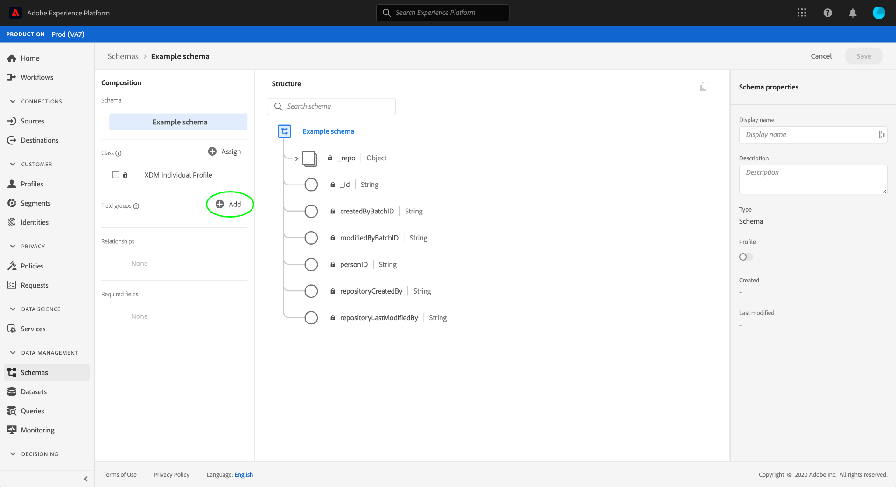
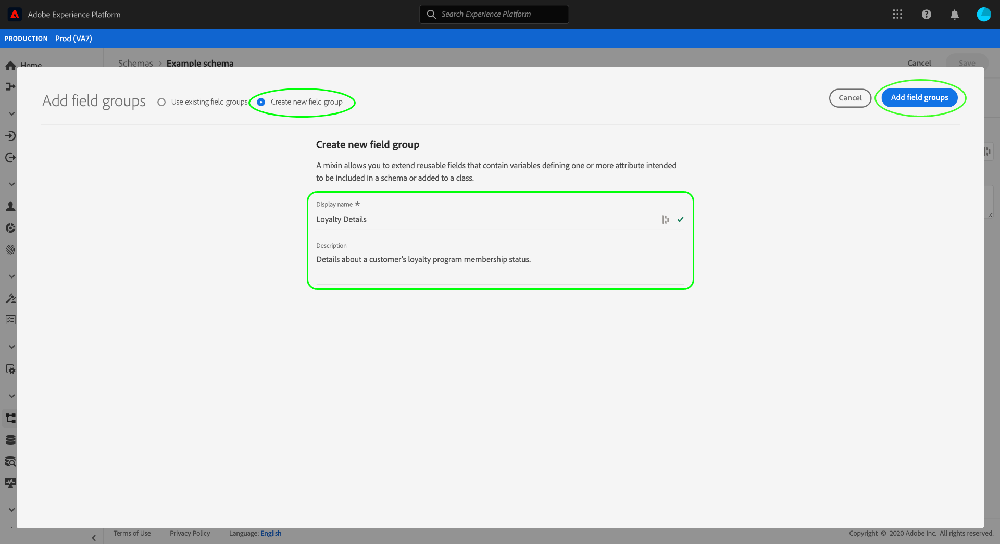
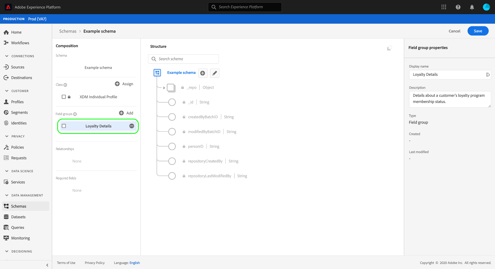
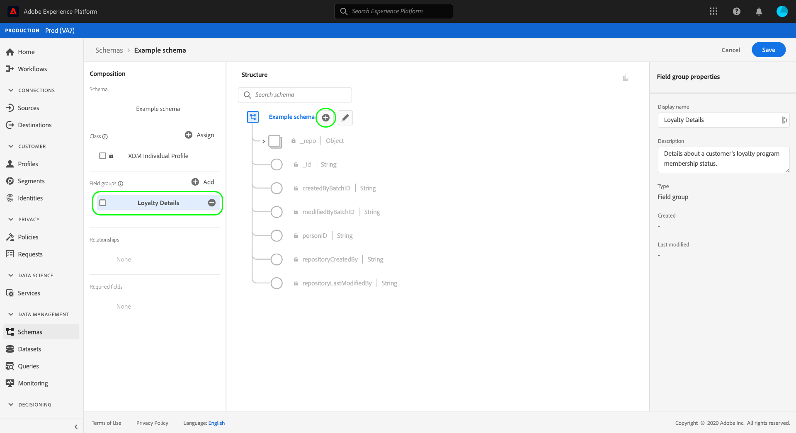
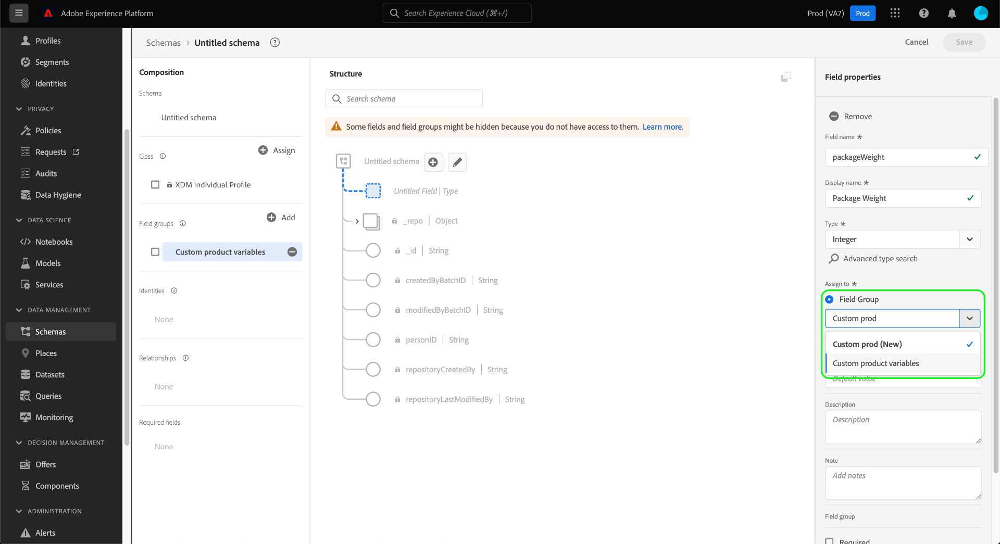
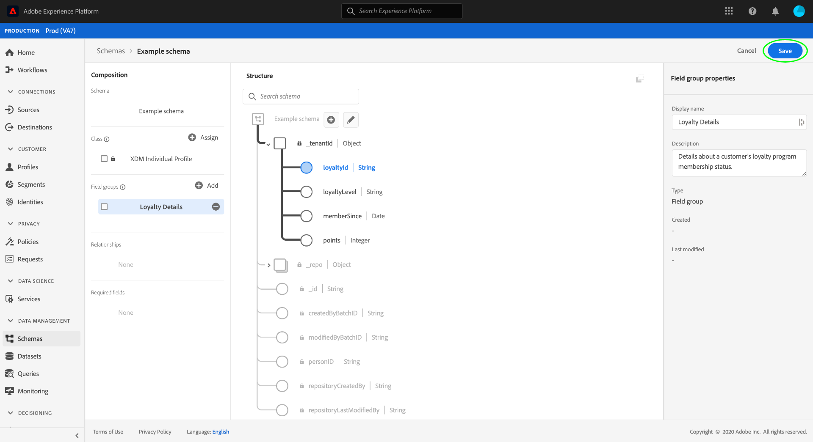

# UI でのスキーマフィールドグループの作成と編集 {#ui-create-and-edit}

>[!CONTEXTUALHELP]
>id="platform_schemas_fieldgroup_filter"
>title="標準またはカスタムのフィールドグループフィルター"
>abstract="使用可能なフィールドグループのリストは、作成方法に基づいて事前にフィルタリングされています。ラジオボタンを選択して、「標準」オプションと「カスタム」オプションのいずれかを選択します。「標準」オプションは、アドビが作成したエンティティを表示し、「カスタム」オプションは、組織内で作成したエンティティを表示します。フィールドグループの作成と編集について詳しくは、ドキュメントを参照してください。"

Experience Data Model （XDM）では、スキーマフィールドグループは、個人情報、ホテルの好み、住所などの特定の機能を実装する1つ以上のフィールドを定義する、再利用可能なコンポーネントです。 フィールドグループは、互換性のあるクラスを実装するスキーマの一部として含まれることを意図しています。

フィールドグループは、フィールドグループが表すデータの動作（レコードまたは時系列）に基づいて、互換性のあるクラスを定義します。 つまり、すべてのフィールドグループがすべてのクラスで使用できるわけではありません。

Adobe Experience Platformには、幅広いマーケティングのユースケースをカバーする多くの標準フィールドグループが用意されています。 ただし、独自のカスタムフィールドグループを作成および編集して、XDM スキーマ内のビジネスに関連する追加の概念を定義することもできます。 このガイドでは、Experience Platform UIで組織のカスタムフィールドグループを作成、編集、管理する方法の概要を説明します。

>[!NOTE]
>
>XDM アクションは、インベントリ テーブルとリソースの詳細ビュー（**[!UICONTROL More]**）から使用できます。 完全なアクションは、カスタム（テナント定義）リソースにのみ適用されます。標準リソースのオプションは限られています。 [&#x200B; スキーマ、クラス、フィールドグループ、およびデータタイプの管理：アクションと削除](../explore.md#xdm-resource-actions)を参照してください。

## 前提条件 {#prerequisites}

このガイドでは、XDM システムに関する実用的な理解が必要です。 Experience Platform エコシステム内でのXDMの役割の概要については、[XDMの概要](../../home.md)を参照し、XDM スキーマにフィールドグループがどのように貢献しているかについてスキーマ構成[の](../../schema/composition.md)基本を参照してください。

このガイドでは必須ではありませんが、[UIでのスキーマの作成](../../tutorials/create-schema-ui.md)に関するチュートリアルに従って、[!DNL Schema Editor]の様々な機能に慣れることもお勧めします。

## 新しいフィールドグループの作成 {#create}

新しいフィールドグループを作成するには、まずフィールドグループが追加されるスキーマを選択する必要があります。 [新しいスキーマを作成](./schemas.md#create)するか、[既存のスキーマを選択して編集](./schemas.md#edit)するかを選択できます。

[!DNL Schema Editor]でスキーマを開いたら、左側のパネルの&#x200B;**[!UICONTROL Add]** セクションの横にある[!UICONTROL Field groups]を選択します。

表示されるダイアログで、**[!UICONTROL Create new field group]**&#x200B;を選択します。 ここでは、フィールドグループに&#x200B;**[!UICONTROL Display name]**&#x200B;と&#x200B;**[!UICONTROL Description]**&#x200B;を指定できます。 終了したら「**[!UICONTROL Add field groups]**」を選択します。

[!DNL Schema Editor]が再び表示され、新しいフィールドグループが左側のパネルに表示されます。 これは新しいフィールドグループであるため、現在、スキーマにフィールドは提供されないため、キャンバスは変更されません。 フィールドグループ [にフィールドを](#add-fields)追加できるようになりました。

## フィルターフィールドグループ {#filter}

使用可能なフィールドグループのリストは、作成方法に基づいて事前にフィルタリングされています。デフォルト設定には、Adobeで定義されたフィールドグループが表示されます。 ただし、リストをフィルタリングして、組織で作成したリストを表示することもできます。 ラジオボタンを選択して、[!UICONTROL Standard]と[!UICONTROL Custom]のオプションから選択します。 [!UICONTROL Standard] オプションにはAdobeで作成されたエンティティが表示され、[!UICONTROL Custom] オプションには組織内で作成されたエンティティが表示されます。

![[!UICONTROL Field groups]と[!UICONTROL Schemas]がハイライト表示された[!UICONTROL Standard] ワークスペースの[!UICONTROL Custom] タブ。](../../images/ui/resources/field-groups/standard-and-custom-field-groups.png)

## 既存のフィールドグループの編集 {#edit}

>[!NOTE]
>
>組織で定義されたカスタムフィールドグループのみが完全に編集およびカスタマイズできます。 Adobeで定義されたコアフィールドグループの場合、個々のスキーマのコンテキスト内で編集できるのは、フィールドの表示名のみです。 スキーマエディターには、南京錠アイコン（）。 詳しくは、[&#x200B; スキーマフィールドの表示名の編集](./schemas.md#display-names)の節を参照してください。
>
>カスタムフィールドグループが保存され、データ取り込み用のスキーマで使用された後は、フィールドグループに追加の変更のみを行うことができます。 詳しくは、[&#x200B; スキーマ進化のルール &#x200B;](../../schema/composition.md#evolution)を参照してください。

既存のフィールドグループを編集するには、まず[!DNL Schema Editor]内のフィールドグループを使用するスキーマを開く必要があります。 [既存のスキーマを選択して編集](./schemas.md#edit)するか、[新しいスキーマを作成して](./schemas.md#create)問題のフィールドグループを追加できます。

エディターでスキーマを開いたら、[&#x200B; フィールドグループにフィールドを追加](#add-fields)できます。

## フィールドグループへのフィールドの追加 {#add-fields}

>[!NOTE]
>
>このセクションでは、カスタムフィールドグループへのフィールドの追加に焦点を当てます。 標準フィールドグループにカスタムフィールドを追加する方法について詳しくは、[&#x200B; スキーマ UI ガイド &#x200B;](./schemas.md#custom-fields-for-standard-groups)を参照してください。

カスタムフィールドグループにフィールドを追加するには、まず、キャンバス内のスキーマ名の横にある&#x200B;**プラス（+）** アイコンを選択します。

**[!UICONTROL Untitled Field]** プレースホルダーがキャンバスに表示され、右側のパネルが更新されて、フィールドのプロパティを設定するためのコントロールが表示されます。 異なるフィールドタイプを設定する方法の具体的な手順については、[UIでのフィールドの定義](../fields/overview.md#define)に関するガイドを参照してください。

**[!UICONTROL Assign to]**&#x200B;で「**[!UICONTROL Field Group]**」オプションを選択し、ドロップダウンを使用してリストから目的のフィールドグループを選択します。 フィールドグループ名を入力し始めると、結果を絞り込むことができます。

**[!UICONTROL Assign to]**&#x200B;で「**[!UICONTROL Field Group]**」オプションを選択し、ドロップダウンを使用してリストから目的のフィールドグループを選択します。 フィールドグループ名を入力し始めると、結果を絞り込むことができます。

フィールドがスキーマに追加されると、選択したフィールドグループに割り当てられます。 必要な数のフィールドをフィールドグループに追加し続けます。 完了したら、**[!UICONTROL Save]**&#x200B;を選択して、スキーマとフィールドグループの両方を保存します。

同じフィールドグループが既に他のスキーマで使用されている場合、新しく追加されたフィールドは、それらのスキーマに自動的に表示されます。

## 次の手順 {#next-steps}

このガイドでは、Experience Platform UIを使用してフィールドグループを作成および編集する方法について説明しました。 [!UICONTROL Schemas] ワークスペースの機能について詳しくは、[[!UICONTROL Schemas] ワークスペースの概要](../overview.md)を参照してください。

[!DNL Schema Registry] APIを使用してフィールドグループを管理する方法については、[&#x200B; フィールドグループエンドポイントガイド &#x200B;](../../api/field-groups.md)を参照してください。
