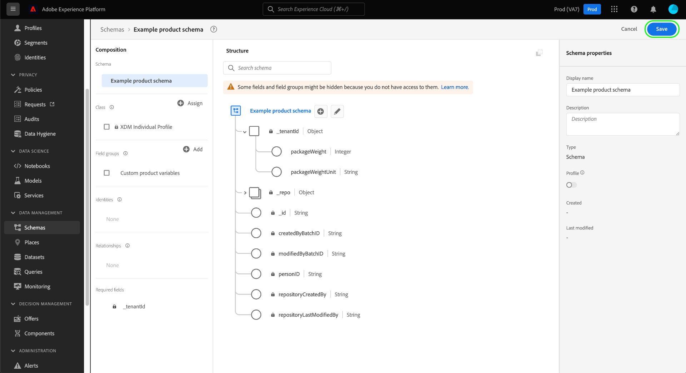

# UIでのスキーマフィールドグループの作成と編集

エクスペリエンスデータモデル(XDM)では、スキーマフィールドグループは、個人の詳細、ホテルの環境設定、住所など、特定の機能を実装する1つ以上のフィールドを定義する再利用可能なコンポーネントです。 フィールドグループは、互換性のあるクラスを実装するスキーマの一部として含まれるように意図されています。

フィールドグループは、フィールドグループが表すデータ（レコードまたは時系列）の動作に基づいて、互換性のあるクラスを定義します。 つまり、すべてのフィールドグループがすべてのクラスで使用できるわけではありません。

Adobe Experience Platformは、様々なマーケティングの使用例に対応する多くの標準的なフィールドグループを提供しています。 ただし、独自のカスタムフィールドグループを作成および編集して、XDMスキーマ内のビジネスに関連する追加の概念を定義することもできます。 このガイドでは、Platform UIで組織のカスタムフィールドグループを作成、編集、管理する方法の概要を説明します。

## 前提条件

このガイドでは、XDMシステムに関する十分な知識が必要です。 Experience Platformエコシステム内でのXDMの役割の概要については、[XDMの概要](../../home.md)を参照し、フィールドグループがXDMスキーマに与える影響については、[スキーマ構成の基本](../../schema/composition.md)を参照してください。

このガイドは必須ではありませんが、 [!DNL Schema Editor]の様々な機能に慣れるために、 [UIでのスキーマの作成](../../tutorials/create-schema-ui.md)に関するチュートリアルに従うことをお勧めします。

## 新しいフィールドグループを作成する {#create}

新しいフィールドグループを作成するには、まずフィールドグループを追加するスキーマを選択する必要があります。 [新しいスキーマ](./schemas.md#create)を作成するか、[編集する既存のスキーマを選択します。](./schemas.md#edit)

[!DNL Schema Editor]でスキーマを開いたら、左側のレールの「[!UICONTROL フィールドグループ]」セクションの横にある「**[!UICONTROL 追加]**」を選択します。

ダイアログが開き、組織の既存のフィールドグループのリストが表示されます。 ダイアログの上部近くにある「**[!UICONTROL 新しいフィールドグループを作成]**」を選択します。 ここで、フィールドグループに&#x200B;**[!UICONTROL 表示名]**&#x200B;と&#x200B;**[!UICONTROL 説明]**&#x200B;を指定できます。 終了したら、「**[!UICONTROL フィールドグループを追加]**」を選択します。

[!DNL Schema Editor]が再び表示され、左側のレールに新しいフィールドグループが表示されます。 これはまったく新しいフィールドグループなので、現在、スキーマにフィールドを提供しないので、キャンバスは変更されません。 これで、[フィールドグループ](#add-fields)へのフィールドの追加を開始できます。

## 既存のフィールドグループの編集 {#edit}

>[!NOTE]
>
>組織で定義されたカスタムフィールドグループのみを完全に編集およびカスタマイズできます。 Adobeで定義されたコアフィールドグループの場合、個々のスキーマのコンテキスト内で編集できるのはフィールドの表示名のみです。 詳しくは、[スキーマフィールドの表示名の編集](./schemas.md#display-names)の節を参照してください。
>
>カスタムフィールドグループを保存し、データ取得用にスキーマで使用した後は、その後はフィールドグループに追加的な変更のみを加えることができます。 詳しくは、[スキーマ進化のルール](../../schema/composition.md#evolution)を参照してください。

既存のフィールドグループを編集するには、まず[!DNL Schema Editor]内でフィールドグループを採用するスキーマを開く必要があります。 [編集する既存のスキーマを選択](./schemas.md#edit)するか、[新しいスキーマを作成](./schemas.md#create)して、該当するフィールドグループを追加します。

エディターでスキーマを開いたら、[フィールドグループ](#add-fields)へのフィールドの追加を開始できます。

## フィールドグループにフィールドを追加する {#add-fields}

[!DNL Schema Editor]のフィールドグループにフィールドを追加するには、まず左側のレールでフィールドグループの名前を選択し、キャンバスでスキーマ名の横にある&#x200B;**プラス(+)**&#x200B;アイコンを選択します。

キャンバスに&#x200B;**[!UICONTROL 新しいフィールド]**&#x200B;が表示され、右側のレールが更新されて、フィールドのプロパティを設定するコントロールが表示されます。 フィールドを設定してフィールドグループに追加する方法に関する具体的な手順については、UIでのフィールドの定義](../fields/overview.md#define)に関する[のガイドを参照してください。

引き続き、フィールドグループに必要な数のフィールドを追加します。 終了したら、「**[!UICONTROL 保存]**」を選択して、スキーマとフィールドグループの両方を保存します。

同じフィールドグループが他のスキーマで既に使用されている場合、新しく追加されたフィールドは自動的にそれらのスキーマに表示されます。

## 次の手順

このガイドでは、Platform UIを使用してフィールドグループを作成および編集する方法について説明しました。 [!UICONTROL スキーマ]ワークスペースの機能について詳しくは、[[!UICONTROL スキーマ]ワークスペースの概要](../overview.md)を参照してください。

[!DNL Schema Registry] APIを使用してフィールドグループを管理する方法については、『[フィールドグループエンドポイントガイド](../../api/field-groups.md)』を参照してください。