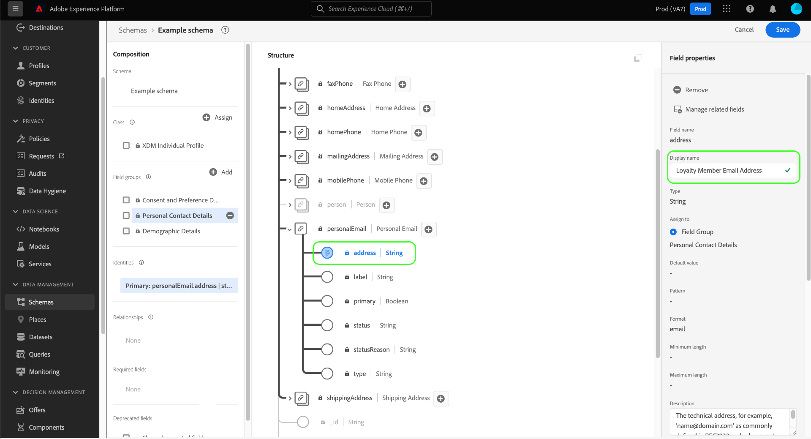

# UI でのスキーマの作成と編集

このガイドでは、Adobe Experience Platform UI で組織のエクスペリエンスデータモデル (XDM) スキーマを作成、編集、管理する方法の概要を説明します。

>[!IMPORTANT]
>
>XDM スキーマは非常にカスタマイズ可能なので、スキーマの作成手順は、スキーマが取り込むデータの種類に応じて異なる場合があります。 その結果、このドキュメントでは、UI のスキーマで実行できる基本的な操作についてのみ説明し、クラス、スキーマフィールドグループ、データタイプ、フィールドのカスタマイズなどの関連手順は除外します。
>
>スキーマ作成プロセスの完全なツアーについては、[ スキーマ作成のチュートリアル ](../../tutorials/create-schema-ui.md) に従って、完全なサンプルスキーマを作成し、[!DNL Schema Editor] の多くの機能に慣れてください。

## 前提条件

このガイドでは、XDM システムに関する十分な知識が必要です。 Experience Platformエコシステム内での XDM の役割の概要については、[XDM の概要 ](../../home.md) を参照し、スキーマの構築方法の概要については、[ スキーマ構成の基本 ](../../schema/composition.md) を参照してください。

## 新しいスキーマの作成 {#create}

「[!UICONTROL  スキーマ ]」ワークスペースの右上隅にある「**[!UICONTROL スキーマ]** を作成」を選択します。 表示されるドロップダウンで、**[!UICONTROL XDM Individual Profile]** と **[!UICONTROL XDM ExperienceEvent]** をスキーマの基本クラスとして選択できます。 または、「**[!UICONTROL 参照]**」を選択して使用可能なクラスの完全なリストから選択するか、代わりに [ 新しいカスタムクラス ](./classes.md#create) を作成します。

クラスを選択すると、[!DNL Schema Editor] が表示され、スキーマの基本構造（クラスで指定）がキャンバスに表示されます。 ここから、右側のレールを使用して、スキーマの **[!UICONTROL 表示名]** と **[!UICONTROL 説明]** を追加できます。

これで、[ スキーマフィールドグループ ](#add-field-groups) を追加して、スキーマの構造の構築を開始できます。

## 既存のスキーマの編集 {#edit}

>[!NOTE]
>
>スキーマを保存し、データ取り込みで使用した後は、追加的な変更のみを加えることができます。 詳しくは、[ スキーマ進化のルール ](../../schema/composition.md#evolution) を参照してください。

既存のスキーマを編集するには、「**[!UICONTROL 参照]**」タブを選択し、編集するスキーマの名前を選択します。

>[!TIP]
>
>ワークスペースの検索およびフィルタリング機能を使用して、スキーマを見つけやすくすることができます。 詳しくは、[XDM リソース ](../explore.md) のガイドを参照してください。

スキーマを選択すると、キャンバスにスキーマの構造が表示され、[!DNL Schema Editor] が表示されます。 スキーマが使用している場合、[ フィールドグループ ](#add-field-groups) をスキーマに追加したり、[ フィールドの表示名を編集 ](#display-names) したり、[ 既存のカスタムフィールドグループ ](./field-groups.md#edit) を編集したりできるようになりました。

## スキーマへのフィールドグループの追加 {#add-field-groups}

>[!NOTE]
>
>この節では、既存のフィールドグループをスキーマに追加する方法について説明します。 新しいカスタムフィールドグループを作成する場合は、代わりに [ フィールドグループの作成と編集 ](./field-groups.md#create) に関するガイドを参照してください。

[!DNL Schema Editor] 内でスキーマを開いたら、フィールドグループを使用してスキーマにフィールドを追加できます。 開始するには、左側のレールで「**[!UICONTROL フィールドグループ]**」の横にある「**[!UICONTROL 追加]**」を選択します。

ダイアログが表示され、スキーマ用に選択できるフィールドグループのリストが表示されます。 フィールドグループは 1 つのクラスとのみ互換性があるので、スキーマの選択されたクラスに関連付けられているフィールドグループのみが表示されます。 デフォルトでは、リストされたフィールドグループは、組織内での使用頻度に基づいて並べ替えられます。

追加するフィールドの一般的なアクティビティまたはビジネス領域がわかっている場合は、左側のパネルで 1 つ以上の業種カテゴリを選択して、表示されるフィールドグループのリストをフィルターします。

>[!NOTE]
>
>XDM での業界固有のデータモデリングのベストプラクティスについて詳しくは、[ 業界データモデル ](../../schema/industries/overview.md) に関するドキュメントを参照してください。

検索バーを使用して、目的のフィールドグループを見つけることもできます。 クエリと名前が一致するフィールドグループがリストの上部に表示されます。 **[!UICONTROL 標準フィールド]** の下に、必要なデータ属性を記述したフィールドを含むフィールドグループが表示されます。

スキーマに追加するフィールドグループの名前の横にあるチェックボックスを選択します。 リストから複数のフィールドグループを選択でき、選択した各フィールドグループが右側のパネルに表示されます。

>[!TIP]
>
>リストに表示されたフィールドグループに対して、情報アイコン () にマウスポインターを置くか、フォーカスして、フィールドグループが取り込むデータの種類に関する簡単な説明を表示できます。 また、プレビューアイコン () を選択して、フィールドグループがスキーマに追加する前に提供したフィールドの構造を確認することもできます。

フィールドグループを選択したら、「**[!UICONTROL フィールドグループを追加]**」を選択して、スキーマに追加します。

[!DNL Schema Editor] が再び表示され、キャンバスにフィールドグループが指定したフィールドが表示されます。

## リアルタイム顧客プロファイルのスキーマの有効化 {#profile}

[リアルタイム顧客プロ](../../../profile/home.md) ファイルは、異なるソースからデータを生成し、各顧客の完全なビューを構築します。スキーマによって取り込まれたデータをこのプロセスに参加させる場合は、[!DNL Profile] で使用するスキーマを有効にする必要があります。

>[!IMPORTANT]
>
>[!DNL Profile] のスキーマを有効にするには、プライマリ ID フィールドが定義されている必要があります。 詳しくは、[ID フィールドの定義 ](../fields/identity.md) に関するガイドを参照してください。

スキーマを有効にするには、まず左のパネルでスキーマの名前を選択し、次に右のパネルで「**[!UICONTROL プロファイル]**」切り替えを選択します。

スキーマを有効にして保存すると、無効にできないという警告を示すポップオーバーが表示されます。 **[!UICONTROL Enable]** を選択して続行します。

「[!UICONTROL  プロファイル ]」切り替えを有効にしてキャンバスが再び表示されます。

>[!IMPORTANT]
>
>スキーマはまだ保存されていないので、スキーマをリアルタイム顧客プロファイルに参加させることについての考えを変えた場合、戻り値はありません。有効なスキーマを保存すると、無効にできなくなります。 「**[!UICONTROL プロファイル]**」切り替えをもう一度選択して、スキーマを無効にします。

プロセスを終了するには、「**[!UICONTROL 保存]**」を選択してスキーマを保存します。

これで、スキーマがリアルタイム顧客プロファイルで使用できるようになります。 Platform がこのスキーマに基づいてデータをデータセットに取り込むと、そのデータは統合されたプロファイルデータに取り込まれます。

## スキーマフィールドの表示名の編集 {#display-names}

クラスを割り当て、フィールドグループをスキーマに追加したら、標準の XDM リソースで提供されているフィールドかカスタムの XDM リソースかに関係なく、スキーマのフィールドの表示名を編集できます。

>[!NOTE]
>
>標準のクラスまたはフィールドグループに属するフィールドの表示名は、特定のスキーマのコンテキストでのみ編集できます。 つまり、あるスキーマで標準フィールドの表示名を変更しても、同じ関連付けられたクラスまたはフィールドグループを使用する他のスキーマには影響しません。
>
>スキーマのフィールドの表示名を変更すると、変更内容は、そのスキーマに基づく既存のデータセットに直ちに反映されます。

スキーマフィールドの表示名を編集するには、キャンバスでフィールドを選択します。 右側のレールで、**[!UICONTROL 表示名]** の下に新しい名前を入力します。

右側のレールで「**[!UICONTROL 適用]**」を選択すると、キャンバスが更新され、フィールドの新しい表示名が表示されます。 「**[!UICONTROL 保存]**」を選択して、変更をスキーマに適用します。

## スキーマのクラスの変更 {#change-class}

スキーマが保存される前の最初の構成プロセス中の任意の時点で、スキーマのクラスを変更できます。

>[!WARNING]
>
>スキーマのクラスの再割り当ては、細心の注意を払っておこなう必要があります。 フィールドグループは特定のクラスとのみ互換性があるので、クラスを変更するとキャンバスと追加したフィールドがリセットされます。

クラスを再割り当てするには、キャンバスの左側で「**[!UICONTROL 割り当て]**」を選択します。

ダイアログが開き、組織で定義されたクラス（所有者は「[!UICONTROL Customer]」）と、Adobeで定義された標準クラスを含む、使用可能なすべてのクラスのリストが表示されます。

リストからクラスを選択し、ダイアログの右側に説明を表示します。 「**[!UICONTROL クラス構造をプレビュー]**」を選択して、クラスに関連付けられているフィールドとメタデータを確認することもできます。 「**[!UICONTROL クラスの割り当て]**」を選択して続行します。

新しいクラスを割り当てるかどうかを確認する新しいダイアログが開きます。 「**[!UICONTROL 割り当て]**」を選択して確定します。

クラスの変更を確認した後、キャンバスがリセットされ、構成の進行状況がすべて失われます。

## 次の手順

このドキュメントでは、Platform UI でのスキーマの作成と編集の基本について説明します。 UI で完全なスキーマを構築するための包括的なワークフローについては、[ スキーマ作成のチュートリアル ](../../tutorials/create-schema-ui.md) を参照することを強くお勧めします。一意の使用例のカスタムフィールドグループやデータタイプの作成も含まれます。

[!UICONTROL  スキーマ ] ワークスペースの機能について詳しくは、[[!UICONTROL  スキーマ ] ワークスペースの概要 ](../overview.md) を参照してください。

[!DNL Schema Registry] API でスキーマを管理する方法については、『[ スキーマエンドポイントガイド ](../../api/schemas.md)』を参照してください。
