# UI でのスキーマの作成と編集 {#create-edit-schemas-in-ui}

このガイドでは、Adobe Experience Platform UIでExperience Data Model （XDM）スキーマを作成、編集、管理する方法の概要を説明します。

>[!IMPORTANT]
>
>XDM スキーマは非常にカスタマイズ可能であるため、スキーマを作成する手順は、スキーマをキャプチャするデータの種類によって異なります。 その結果、このドキュメントでは、UIのスキーマで実行できる基本的なインタラクションのみを説明し、クラス、スキーマフィールドグループ、データタイプ、フィールドのカスタマイズなどの関連する手順は除外されます。
>
>スキーマ作成プロセスの完全なツアーについては、[ スキーマ作成チュートリアル ](../../tutorials/create-schema-ui.md)に従って、完全な例のスキーマを作成し、[!DNL Schema Editor]の多くの機能を理解してください。

## 前提条件 {#prerequisites}

このガイドでは、XDM システムに関する実用的な理解が必要です。 Experience Platform エコシステム内でのXDMの役割の概要については、[XDMの概要](../../home.md)を、スキーマの構築方法の概要については、[ スキーマ構成の基本](../../schema/composition.md)を参照してください。

## 新しいスキーマの作成 {#create}

[!UICONTROL Schemas] ワークスペースで、右上隅の&#x200B;**[!UICONTROL Create schema]**&#x200B;を選択します。 「スキーマタイプを選択」ドロップダウンメニューが表示され、[!UICONTROL Standard]または[!UICONTROL Relational] スキーマのオプションが表示されます。

![[!UICONTROL Create Schema]がハイライト表示され、「スキーマタイプを選択」ドロップダウンが表示されているスキーマワークスペース ](../../images/ui/resources/schemas/create-schema.png)。

## リレーショナルスキーマを作成 {#create-relational-schema}

>[!AVAILABILITY]
>
>Data Mirrorとリレーショナルスキーマは、Adobe Journey Optimizer **オーケストレーションキャンペーン**&#x200B;のライセンス保有者が利用できます。 また、ライセンスと機能の有効化に応じて、Customer Journey Analytics ユーザー向けの&#x200B;**限定リリース**&#x200B;としても利用できます。 アクセスについては、Adobe担当者にお問い合わせください。

レコードをきめ細かく制御する構造化されたリレーショナルスタイルのスキーマを定義するには、**[!UICONTROL Relational]**&#x200B;を選択します。 リレーショナルスキーマは、プライマリキーの適用、レコードレベルのバージョン管理、プライマリキーと外部キーを介したスキーマレベルの関係をサポートします。 また、変更データキャプチャを使用した増分取り込みに最適化されており、キャンペーンオーケストレーション、Data Distiller、B2Bの実装で使用される複数のデータモデルをサポートしています。

詳しくは、[Data Mirror](../../data-mirror/overview.md)または[ リレーショナルスキーマ ](../../schema/relational.md)の概要を参照してください。

### 手動で作成 {#create-manually}

>[!AVAILABILITY]
>
>DDL ファイルのアップロードは、Adobe Journey Optimizer オーケストレーションされたキャンペーンライセンス所有者のみが使用できます。 UIの表示が異なる場合があります。

**[!UICONTROL Create a relational schema]** ダイアログが表示されます。 スキーマ構造を定義するには、**[!UICONTROL Create manually]**&#x200B;または[**[!UICONTROL Upload DDL file]**](#upload-ddl-file)のいずれかを選択できます。

**[!UICONTROL Create a relational schema]** ダイアログで「**[!UICONTROL Create manually]**」を選択し、「**[!UICONTROL Next]**」を選択します。

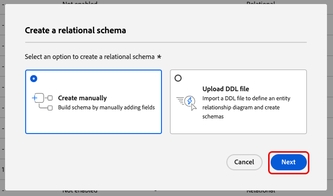

**[!UICONTROL Relational schema details]** ページが表示されます。 スキーマの表示名とオプションの説明を入力し、**[!UICONTROL Finish]**&#x200B;を選択してスキーマを作成します。

![[!UICONTROL Schema display name]、[!UICONTROL Description]、[!UICONTROL Finish]がハイライト表示されたリレーショナルスキーマの詳細ビュー。](../../images/ui/resources/schemas/relational-details.png)

スキーマエディターが開き、スキーマ構造を定義するための空のキャンバスが表示されます。 通常どおりフィールドを追加できます。

#### バージョン識別子フィールドを追加する {#add-version-identifier}

バージョンの追跡を有効にし、変更データキャプチャをサポートするには、スキーマでバージョン識別子フィールドを指定する必要があります。 スキーマエディターで、プラス（）スキーマ名の横にあるアイコンをクリックして、新しいフィールドを追加します。

`updateSequence`などのフィールド名を入力し、**[!UICONTROL DateTime]**&#x200B;または&#x200B;**[!UICONTROL Number]**&#x200B;のデータタイプを選択します。

右側のパネルで「**[!UICONTROL Version Identifier]**」チェックボックスを有効にし、「**[!UICONTROL Apply]**」を選択してフィールドを確定します。

>[!IMPORTANT]
>
>レコードレベルの更新をサポートし、データキャプチャの取り込みを変更するには、リレーショナルスキーマにバージョン識別子フィールドを含める必要があります。

関係を定義するには、スキーマエディターで&#x200B;**[!UICONTROL Add Relationship]**&#x200B;を選択して、スキーマレベルのプライマリ/外部キー関係を作成します。 詳しくは、[ スキーマレベルの関係の追加](../../tutorials/relationship-ui.md#relationship-field)に関するチュートリアルを参照してください。

次に、[ プライマリキーの定義](../fields/identity.md#define-a-identity-field)に進み、[必要に応じてフィールドを追加](#add-field-groups)します。 Experience Platform ソースで変更データキャプチャを有効にする方法のガイダンスについては、[変更データキャプチャ取り込みガイド ](../../../sources/tutorials/api/change-data-capture.md)を参照してください。

>[!NOTE]
>
>保存すると、[!UICONTROL Type] サイドバーの[!UICONTROL  Schema properties] フィールドは、これが[!UICONTROL Relational] スキーマであることを示します。 これは、スキーマインベントリビューの詳細サイドバーにも表示されます。
>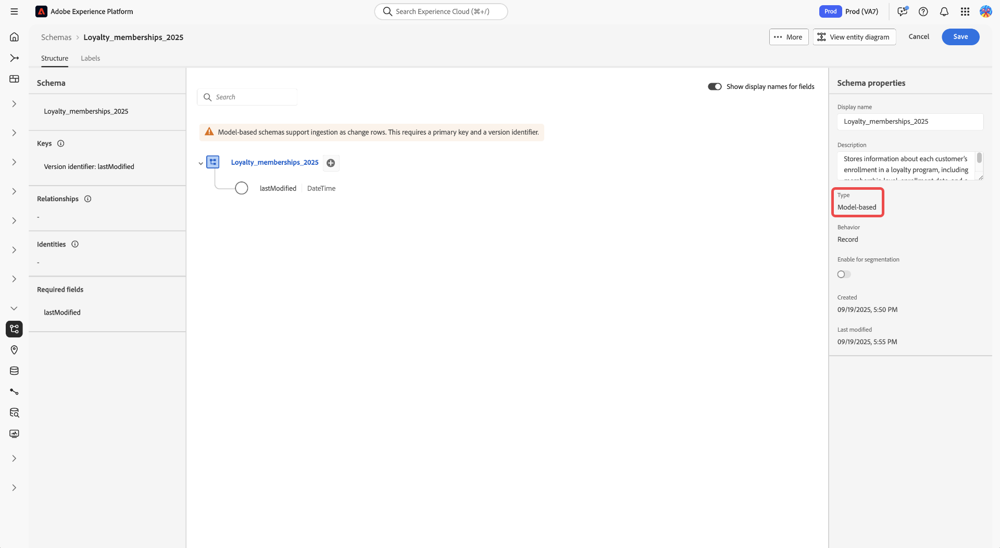

### DDL ファイルのアップロード {#upload-ddl-file}

>[!AVAILABILITY]
>
>DDL ファイルのアップロードは、Adobe Journey Optimizer オーケストレーションされたキャンペーンライセンス所有者のみが使用できます。

このワークフローを使用して、DDL ファイルをアップロードしてスキーマを定義します。 **[!UICONTROL Create a relational schema]** ダイアログで「**[!UICONTROL Upload DDL file]**」を選択し、ローカル DDL ファイルをシステムからドラッグするか、「**[!UICONTROL Choose files]**」を選択します。 Experience Platformはスキーマを検証し、ファイルのアップロードが成功した場合は緑色のチェックマークを表示します。 **[!UICONTROL Next]**&#x200B;を選択してアップロードを確認します。

![ リレーショナルスキーマを作成ダイアログ（[!UICONTROL Upload DDL file]が選択され、[!UICONTROL Next]がハイライト表示されている） ](../../images/ui/resources/schemas/upload-ddl-file.png)

[!UICONTROL Select entities and fields to import] ダイアログが表示され、スキーマをプレビューできます。 スキーマ構造を確認し、ラジオボタンとチェックボックスを使用して、各エンティティにプライマリキーとバージョン識別子が指定されていることを確認します。

>[!IMPORTANT]
>
>テーブル構造には、**プライマリキー**&#x200B;と&#x200B;**バージョン識別子**&#x200B;を含める必要があります（datetimeまたはnumber型の`updateSequence` フィールドなど）。
>
>変更データキャプチャの取り込みでは、増分処理を有効にするために、String タイプの`_change_request_type`という名前の特別な列も必要です。 このフィールドは、データ変更の種類（例：`u` （upsert）または`d` （delete））を示します。

取り込み中は必要ですが、`_change_request_type`などの制御列はスキーマに保存されず、最終的なスキーマ構造には表示されません。 正しく表示されたら、**[!UICONTROL Done]**&#x200B;を選択してスキーマを作成します。

>[!NOTE]
>
>DDL アップロードでサポートされる最大ファイルサイズは10 MBです。

![ インポートされたフィールドが表示され、[!UICONTROL Finish]が強調表示されたリレーショナルスキーマレビュービュー。](../../images/ui/resources/schemas/entities-and-files-to-inport.png)

スキーマエディターでスキーマが開き、保存する前に構造を調整できます。

次に、[追加フィールド ](#add-field-groups)に進み、[必要に応じてスキーマレベルの関係](../../tutorials/relationship-ui.md#relationship-field)を追加します。

Experience Platform ソースで変更データキャプチャを有効にする方法のガイダンスについては、[変更データキャプチャ取り込みガイド ](../../../sources/tutorials/api/change-data-capture.md)を参照してください。

## 標準スキーマの作成 {#standard-based-creation}

「スキーマタイプを選択」ドロップダウンメニューから「標準スキーマタイプ」を選択すると、[!UICONTROL Create a schema] ダイアログが表示されます。 このダイアログでは、フィールドとフィールドグループを追加してスキーマを手動で作成するか、CSV ファイルをアップロードしてML アルゴリズムを使用してスキーマを生成するかを選択できます。 ダイアログからスキーマ作成ワークフローを選択します。

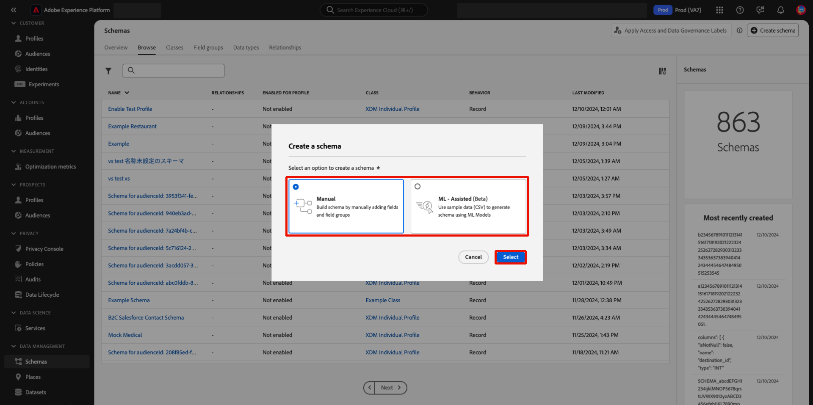

### [!BADGE Beta]{type=Informative}手動またはML支援のスキーマ作成 {#manual-or-assisted}

マシンラーニングアルゴリズムを使用して、csv ファイルに基づくスキーマ構造を推奨する方法については、[機械学習支援スキーマ作成ガイド ](../ml-assisted-schema-creation.md)を参照してください。 このUI ガイドでは、手動作成ワークフローに焦点を当てます。

### 手動スキーマ作成 {#manual-creation}

[!UICONTROL Create schema] ワークフローが表示されます。 スキーマの基本クラスを選択するには、**[!UICONTROL Individual Profile]**、**[!UICONTROL Experience Event]**&#x200B;または&#x200B;**[!UICONTROL Other]**&#x200B;のいずれかを選択し、その後&#x200B;**[!UICONTROL Next]**&#x200B;を選択して選択を確定します。 これらのクラスについて詳しくは、[[!UICONTROL XDM individual profile]](../../classes/individual-profile.md)および[[!UICONTROL XDM ExperienceEvent]](../../classes/experienceevent.md)のドキュメントを参照してください。

![3つのクラスオプションと[!UICONTROL Create schema]がハイライト表示された[!UICONTROL Next] ワークフロー。](../../images/ui/resources/schemas/schema-class-options.png)

**[!UICONTROL Other]**&#x200B;を選択すると、使用可能なクラスのリストが表示されます。 ここから、既存のクラスを参照してフィルタリングできます。

![[!UICONTROL Create schema] セクションで[!UICONTROL Other]が強調表示された[!UICONTROL Schema details] ワークフロー。](../../images/ui/resources/schemas/other-schema-details.png)

ラジオボタンを選択して、カスタムクラスと標準クラスのどちらに属しているかに基づいてクラスをフィルタリングします。 業界に基づいて使用可能な結果をフィルタリングしたり、検索フィールドを使用して特定のクラスを検索したりすることもできます。

![検索バー、[!UICONTROL Create schema]および[!UICONTROL Custom]がハイライト表示された[!UICONTROL Industries] ワークフロー。](../../images/ui/resources/schemas/filter-and-search.png)

適切なクラスを決めるには、各クラスの情報とプレビューアイコンがあります。 情報アイコン （）は、クラスとそのクラスが関連付けられている業界の説明を示すダイアログを開きます。

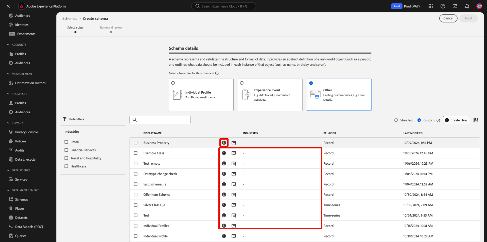

プレビューアイコン （）は、スキーマ図とそのプロパティを含むクラスのプレビューダイアログを開きます。

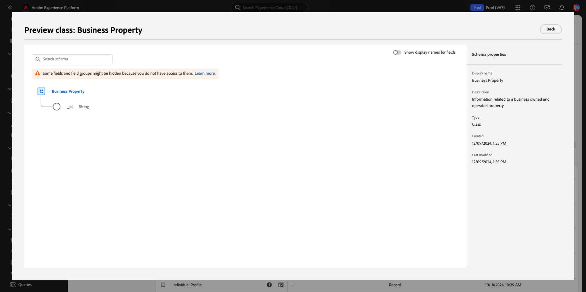

任意の行を選択してクラスを選択し、**[!UICONTROL Next]**&#x200B;を選択して選択を確定します。

![使用可能なクラスのテーブルから選択されたクラスと[!UICONTROL Create schema]が強調表示された[!UICONTROL Next] ワークフロー。](../../images/ui/resources/schemas/select-class.png)

クラスを選択すると、[!UICONTROL Name and review] セクションが表示されます。 このセクションでは、スキーマを識別するための名前と説明を指定します。&#x200B;スキーマのベース構造（クラスから提供される）がキャンバスに表示され、選択したクラスとスキーマ構造を確認および検証できます。

人間に適した[!UICONTROL Schema display name]をテキストフィールドに入力します。 次に、適切な説明を入力して、スキーマを特定します。 スキーマ構造を確認し、設定に満足したら、**[!UICONTROL Finish]**&#x200B;を選択してスキーマを作成します。

![[!UICONTROL Name and review]、[!UICONTROL Create schema]、[!UICONTROL Schema display name]がハイライト表示された[!UICONTROL Description] ワークフローの[!UICONTROL Finish] セクション。](../../images/ui/resources/schemas/name-and-review.png)

スキーマエディターが表示され、キャンバスにスキーマの構造が表示されます。 必要に応じて、[ クラスにフィールドを追加できるようになりました](../../ui/resources/classes.md#add-fields)。

## 既存のスキーマの編集 {#edit}

>[!NOTE]
>
>スキーマを保存してデータ取り込みに使用すると、追加の変更のみを行うことができます。 詳しくは、[ スキーマ進化のルール ](../../schema/composition.md#evolution)を参照してください。

既存のスキーマを編集するには、「**[!UICONTROL Browse]**」タブを選択し、編集するスキーマの名前を選択します。 検索バーを使用して、使用可能なオプションのリストを絞り込むこともできます。

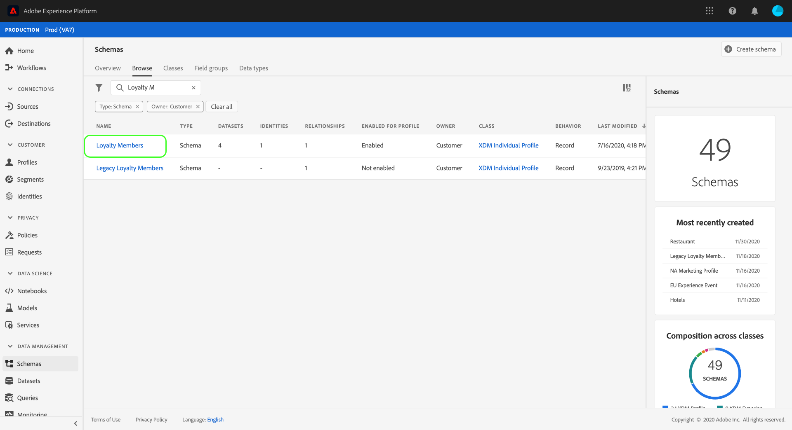

>[!TIP]
>
>ワークスペースの検索およびフィルタリング機能を使用すると、スキーマを見つけやすくなります。 詳しくは、[XDM リソースの探索](../explore.md)に関するガイドを参照してください。

スキーマを選択すると、キャンバスにスキーマの構造が表示された[!DNL Schema Editor]が表示されます。 スキーマに[ フィールドグループ ](#add-field-groups)を追加できるようになりました（または、これらのグループから[個々のフィールド ](#add-individual-fields)を追加）、[ フィールド表示名を編集](#display-names)、または[既存のカスタムフィールドグループを編集](./field-groups.md#edit) （スキーマに含まれる場合）。

## その他のアクション {#more}

>[!NOTE]
>
>XDM アクションは、インベントリ テーブルとリソースの詳細ビュー（**[!UICONTROL More]**）から使用できます。 完全なアクションは、カスタム（テナント定義）リソースにのみ適用されます。標準リソースのオプションは限られています。 [ スキーマ、クラス、フィールドグループ、およびデータタイプの管理：アクションと削除](../explore.md#xdm-resource-actions)を参照してください。

次に、スキーマエディターのヘッダーアクションについて説明します。

スキーマエディター内で、スキーマのJSON構造をコピーするためのクイックアクションを実行したり、スキーマがリアルタイム顧客プロファイルに対して有効になっていないか、関連するデータセットがある場合にスキーマを削除したりすることもできます。 ビューの上部にある「[!UICONTROL More]」を選択すると、クイックアクションを含むドロップダウンが表示されます。

JSON構造のコピー機能を使用すると、スキーマとデータパイプラインの構築中にサンプルペイロードがどのように表示されるかを確認できます。 この機能は、ID マップなど、スキーマ内に複雑なオブジェクトマップ構造がある場合に特に便利です。

## 表示名切り替え {#display-name-toggle}

スキーマエディターには、元のフィールド名と、より読みやすい表示名を切り替えるための切り替えスイッチが用意されています。 この柔軟性により、フィールドの検出性が向上し、スキーマを編集できます。トグルは、スキーマエディタービューの右上にあります。

>[!NOTE]
>
>フィールド名から表示名への変更は、純粋に表面的なものであり、下流のリソースは変更されません。

![[!UICONTROL Show display names for fields]が強調表示されたスキーマエディター。](../../images/ui/resources/schemas/display-name-toggle.png)

標準フィールドグループの表示名はシステムで生成されますが、[表示名](#display-names) セクションの説明に従ってカスタマイズできます。 表示名は、マッピングやデータセットのプレビューなど、複数のUI ビューに反映されます。 デフォルト設定はオフで、フィールド名は元の値で表示されます。

## スキーマへのフィールドグループの追加 {#add-field-groups}

>[!NOTE]
>
>この節では、既存のフィールドグループをスキーマに追加する方法について説明します。 新しいカスタムフィールドグループを作成する場合は、代わりに[ フィールドグループの作成と編集](./field-groups.md#create)に関するガイドを参照してください。

[!DNL Schema Editor]内のスキーマを開いたら、フィールドグループを使用してスキーマにフィールドを追加できます。 開始するには、左側のパネルの&#x200B;**[!UICONTROL Add]**&#x200B;の横にある&#x200B;**[!UICONTROL Field groups]**&#x200B;を選択します。

![[!UICONTROL Add] セクションの[!UICONTROL Field groups]が強調表示されたスキーマエディター。](../../images/ui/resources/schemas/add-field-group-button.png)

ダイアログが表示され、スキーマに選択できるフィールドグループのリストが表示されます。 フィールドグループは1つのクラスとしか互換性がないので、スキーマで選択したクラスに関連付けられているフィールドグループのみが一覧表示されます。 デフォルトでは、リストされたフィールドグループは、組織内での使用頻度に基づいて並べ替えられます。

![[!UICONTROL Add field groups] ダイアログがハイライト表示され、[!UICONTROL Popularity]列がハイライト表示されています。](../../images/ui/resources/schemas/field-group-popularity.png)

追加するフィールドの一般的なアクティビティまたはビジネス領域がわかっている場合は、左側のパネルで1つ以上の業界垂直型カテゴリを選択して、表示されるフィールドグループのリストをフィルタリングします。

![[!UICONTROL Add field groups] ダイアログがハイライト表示され、[!UICONTROL Industry] フィルターと[!UICONTROL Industry]列がハイライト表示されています。](../../images/ui/resources/schemas/industry-filter.png)

>[!NOTE]
>
>XDMでの業界固有のデータモデリングのベストプラクティスについて詳しくは、[業界データモデル ](../../schema/industries/overview.md)に関するドキュメントを参照してください。

検索バーを使用して、目的のフィールドグループを見つけることもできます。 クエリと一致する名前のフィールドグループがリストの上部に表示されます。 **[!UICONTROL Standard Fields]**&#x200B;の下に、目的のデータ属性を記述するフィールドを含むフィールドグループが表示されます。

![[!UICONTROL Add field groups]検索機能がハイライト表示された[!UICONTROL Standard fields] ダイアログ。](../../images/ui/resources/schemas/field-group-search.png)

スキーマに追加するフィールドグループの名前の横にあるチェックボックスを選択します。 リストから複数のフィールドグループを選択し、選択した各フィールドグループを右側のパネルに表示できます。

![ チェックボックス選択機能がハイライト表示された[!UICONTROL Add field groups] ダイアログ。](../../images/ui/resources/schemas/add-field-group.png)

>[!TIP]
>
>リストされているフィールドグループの場合、情報アイコン（）にカーソルを合わせるか、フォーカスを合わせると、フィールドグループがキャプチャするデータの種類の簡単な説明を表示できます。 プレビューアイコン（）を選択して、フィールドグループが提供するフィールドの構造をスキーマに追加する前に表示することもできます。

フィールドグループを選択したら、**[!UICONTROL Add field groups]**&#x200B;を選択してスキーマに追加します。

![ フィールドグループが選択され、[!UICONTROL Add field groups]が強調表示された[!UICONTROL Add field groups] ダイアログ。](../../images/ui/resources/schemas/add-field-group-finish.png)

[!DNL Schema Editor]が再び表示され、キャンバスに表示されるフィールドグループが提供するフィールドが表示されます。

![ スキーマの例を含む[!DNL Schema Editor]が表示されます。](../../images/ui/resources/schemas/field-groups-added.png)

>[!NOTE]
>
>スキーマエディター内では、標準（Adobeで生成された）クラスとフィールドグループが南京錠アイコン をインストールします。南京錠は、クラス名またはフィールドグループ名の横にある左側のパネルと、システム生成リソースの一部であるスキーマダイアグラム内の任意のフィールドの横に表示されます。
>
>

スキーマにフィールドグループを追加した後、必要に応じて、オプションで[既存のフィールド ](#remove-fields)を削除するか、[新しいカスタムフィールド ](#add-fields)をそれらのグループに追加できます。

### フィールドグループから追加されたフィールドの削除 {#remove-fields}

フィールドグループをスキーマに追加したら、フィールドグループからグローバルにフィールドを削除するか、現在のスキーマからローカルにフィールドを非表示にすることができます。 これらのアクションの違いを理解することは、意図しないスキーマの変更を避けるために非常に重要です。

>[!IMPORTANT]
>
>**[!UICONTROL Remove]**&#x200B;を選択すると、フィールドグループ自体からフィールドが削除され、そのフィールドグループを使用する&#x200B;*すべての* スキーマに影響を与えます。
>フィールドグループ **を含むすべてのスキーマからフィールドを**&#x200B;削除する場合を除き、このオプションを使用しないでください。

フィールドグループからフィールドを削除するには、キャンバスでフィールドを選択し、右側のパネルで「**[!UICONTROL Remove]**」を選択します。 次の例は、`taxId` グループの&#x200B;**[!UICONTROL Demographic Details]** フィールドを示しています。

![[!DNL Schema Editor]がハイライト表示された[!UICONTROL Remove]です。 このアクションは、1つのフィールドを削除します。](../../images/ui/resources/schemas/remove-single-field.png)

フィールドグループ自体から削除せずにスキーマから複数のフィールドを非表示にするには、**[!UICONTROL Manage related fields]** オプションを使用します。 キャンバスのグループから任意のフィールドを選択し、右側のパネルで&#x200B;**[!UICONTROL Manage related fields]**&#x200B;を選択します。

![[!DNL Schema Editor]の[!UICONTROL Manage related fields]がハイライト表示されています。](../../images/ui/resources/schemas/manage-related-fields.png)

フィールドグループの構造を示すダイアログが表示されます。 チェックボックスを使用して、含めるフィールドを選択または選択解除します。

![選択したフィールドと[!UICONTROL Manage related fields]がハイライト表示された[!UICONTROL Confirm] ダイアログ。](../../images/ui/resources/schemas/select-fields.png)

**[!UICONTROL Confirm]**&#x200B;を選択してキャンバスを更新し、選択したフィールドを反映します。

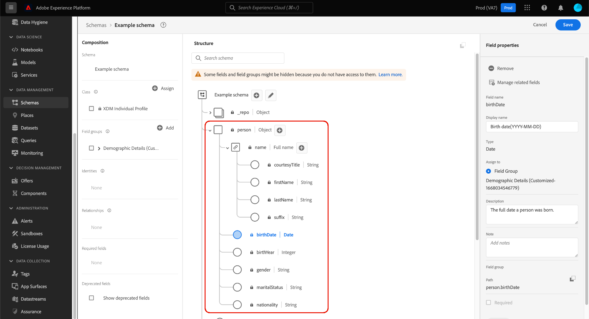

### フィールドを削除または非推奨にする際のフィールドの動作 {#field-removal-deprecation-behavior}

各アクションの範囲を理解するには、次の表を使用します。

| アクション | 現在のスキーマにのみ適用 | フィールドグループを変更 | 他のスキーマに影響します | 説明 |
|--------------------------|--------------------------------|----------------------|-----------------------|-------------|
| **フィールドを削除** | × | ○ | ○ | フィールドグループからフィールドを削除します。 これにより、そのグループを使用するすべてのスキーマから削除されます。 |
| **関連フィールドの管理** | ○ | × | × | 現在のスキーマからのみフィールドを非表示にします。 フィールドグループは変更されません。 |
| **非推奨フィールド** | × | ○ | ○ | フィールドグループで、フィールドを非推奨（廃止予定）とマークします。 このスキーマは使用できなくなりました。 |

>[!NOTE]
>
>この動作は、レコードベースとイベントベースの両方のスキーマで一貫しています。

### フィールドグループへのカスタムフィールドの追加 {#add-fields}

スキーマにフィールドグループを追加した後、そのグループの追加フィールドを定義できます。 ただし、1つのスキーマのフィールドグループに追加されたフィールドは、同じフィールドグループを使用する他のすべてのスキーマにも表示されます。

さらに、カスタムフィールドが標準フィールドグループに追加されると、そのフィールドグループはカスタムフィールドグループに変換され、元の標準フィールドグループは使用できなくなります。

カスタムフィールドを標準フィールドグループに追加する場合は、特定の手順については、以下の[節](#custom-fields-for-standard-groups)を参照してください。 カスタムフィールドグループにフィールドを追加する場合は、フィールドグループ UI ガイドの[ カスタムフィールドグループの編集](./field-groups.md)の節を参照してください。

既存のフィールドグループを変更しない場合は、[新しいカスタムフィールドグループを作成して、代わりに追加フィールドを定義できます](./field-groups.md#create)。

## スキーマへの個々のフィールドの追加 {#add-individual-fields}

特定のユースケースでフィールドグループ全体を追加しない場合は、スキーマエディターを使用して、個々のフィールドをスキーマに直接追加できます。 [標準フィールドグループ ](#add-standard-fields)から個別のフィールドを追加するか、[独自のカスタムフィールドを追加](#add-custom-fields)できます。

>[!IMPORTANT]
>
>スキーマエディターでは、個々のフィールドをスキーマに直接追加することができますが、XDM スキーマ内のすべてのフィールドをクラスまたはクラスと互換性のあるフィールドグループで提供する必要があるという事実は変わりません。 以下の節で説明するように、すべての個々のフィールドは、スキーマに追加されたときに、キーステップとしてクラスまたはフィールドグループに関連付けられます。

### 標準フィールドを追加 {#add-standard-fields}

標準フィールドグループのフィールドを、対応するフィールドグループを事前に把握することなく、スキーマに直接追加できます。 スキーマに標準フィールドを追加するには、キャンバス内のスキーマ名の横にあるプラス（**+**）アイコンを選択します。 **[!UICONTROL Untitled Field]** プレースホルダーがスキーマ構造に表示され、右側のパネルが更新され、フィールドを設定するためのコントロールが表示されます。

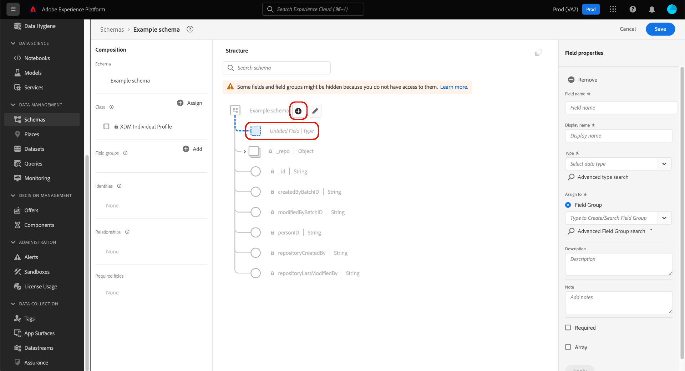

**[!UICONTROL Field name]**&#x200B;で、追加するフィールドの名前を入力します。 クエリに一致する標準フィールドが自動的に検索され、それらが属するフィールドグループを含む&#x200B;**[!UICONTROL Recommended Standard Fields]**&#x200B;の下に一覧表示されます。

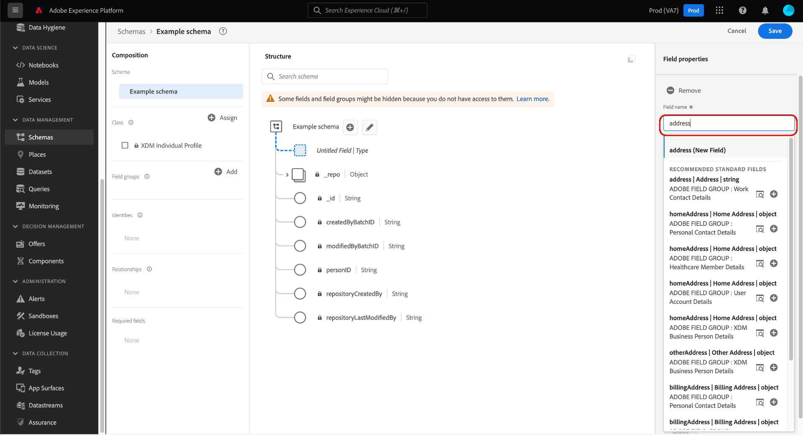

一部の標準フィールドは同じ名前を共有していますが、その構造は、元のフィールドグループによって異なる場合があります。 標準フィールドがフィールドグループ構造の親オブジェクト内にネストされている場合、子フィールドが追加されると、親フィールドもスキーマに含まれます。

標準フィールドの横にあるプレビューアイコン（）を選択して、フィールドグループの構造を表示し、ネストする方法をより詳細に把握します。 標準フィールドをスキーマに追加するには、プラスアイコン（）を選択します。

キャンバスが更新され、スキーマに追加された標準フィールド（フィールドグループ構造内でネストされている親フィールドを含む）が表示されます。 フィールドグループの名前は、左側のパネルの&#x200B;**[!UICONTROL Field groups]**&#x200B;の下にも表示されます。 同じフィールドグループからさらにフィールドを追加する場合は、右側のパネルで「**[!UICONTROL Manage related fields]**」を選択します。

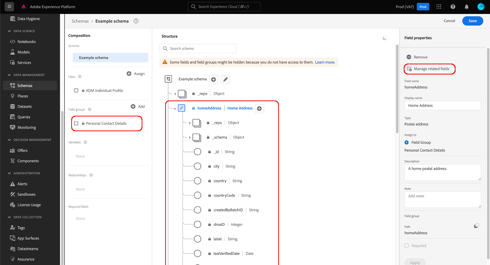

### カスタムフィールドを追加 {#add-custom-fields}

標準フィールドのワークフローと同様に、独自のカスタムフィールドをスキーマに直接追加することもできます。

スキーマのルートレベルにフィールドを追加するには、キャンバス内のスキーマ名の横にあるプラス（**+**）アイコンを選択します。 **[!UICONTROL Untitled Field]** プレースホルダーがスキーマ構造に表示され、右側のパネルが更新され、フィールドを設定するためのコントロールが表示されます。

追加するフィールド名を入力すると、システムは一致する標準フィールドの検索を自動的に開始します。 代わりに新しいカスタムフィールドを作成するには、**（[!UICONTROL New Field]）**&#x200B;が付いた一番上のオプションを選択します。

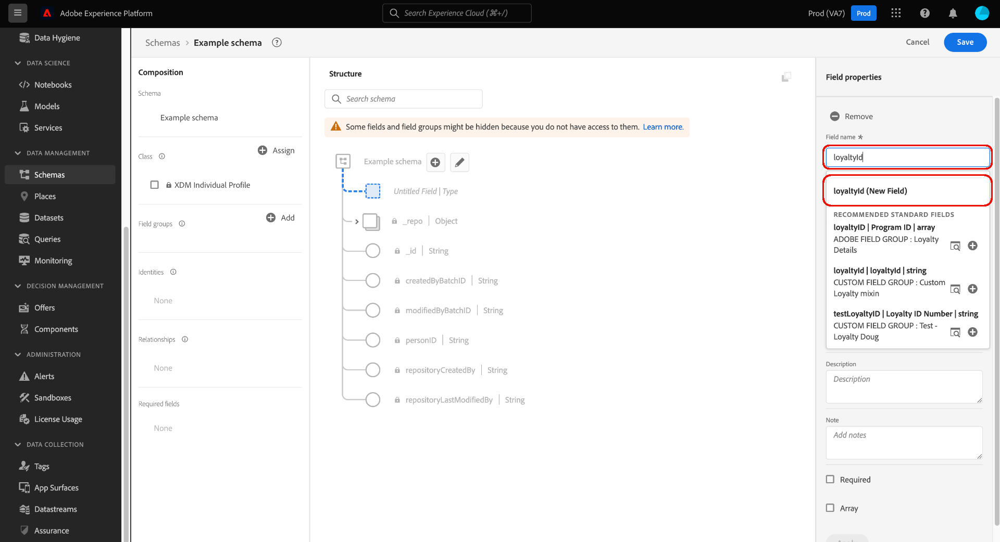

フィールドの表示名とデータタイプを指定したら、次の手順では、フィールドを親XDM リソースに割り当てます。 スキーマでカスタムクラスを使用している場合は、代わりに[割り当てられたクラス ](#add-to-class)または[ フィールドグループ ](#add-to-field-group)にフィールドを追加することを選択できます。 ただし、スキーマで標準クラスを使用している場合は、カスタムフィールドをフィールドグループにのみ割り当てることができます。

#### カスタムフィールドグループへのフィールドの割り当て {#add-to-field-group}

>[!NOTE]
>
>この節では、カスタムフィールドグループにフィールドを割り当てる方法のみを説明します。 代わりに新しいカスタムフィールドを使用して標準フィールドグループを拡張する場合は、[標準フィールドグループへのカスタムフィールドの追加](#custom-fields-for-standard-groups)の節を参照してください。

**[!UICONTROL Assign to]**&#x200B;で、**[!UICONTROL Field Group]**&#x200B;を選択します。 スキーマで標準クラスを使用している場合、これは使用可能な唯一のオプションであり、デフォルトで選択されています。

次に、関連付ける新しいフィールドのフィールドグループを選択する必要があります。 指定したテキスト入力で、フィールドグループの名前を入力します。 入力に一致する既存のカスタムフィールドグループがある場合、それらはドロップダウンリストに表示されます。 または、一意の名前を入力して、新しいフィールドグループを作成することもできます。

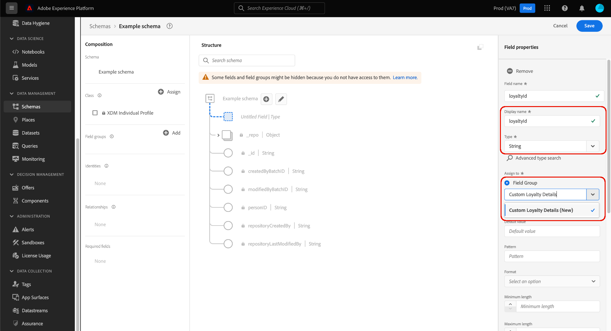

>[!WARNING]
>
>既存のカスタムフィールドグループを選択した場合、そのフィールドグループを使用する他のスキーマも、変更を保存した後に新しく追加されたフィールドを継承します。 このため、この種類の伝播が必要な場合にのみ、既存のフィールドグループを選択します。 それ以外の場合は、代わりに新しいカスタムフィールドグループを作成することをお勧めします。

リストからフィールドグループを選択したら、**[!UICONTROL Apply]**&#x200B;を選択します。

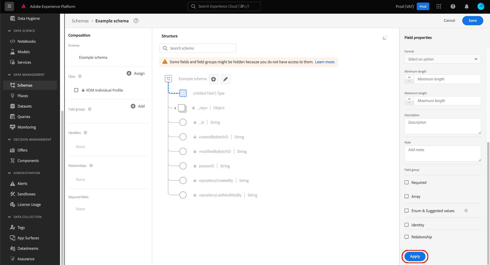

新しいフィールドがキャンバスに追加され、標準XDM フィールドとの競合を避けるために、[ テナント ID](../../api/getting-started.md#know-your-tenant_id)の下に名前空間が設定されます。 新しいフィールドを関連付けたフィールドグループは、左側のパネルの&#x200B;**[!UICONTROL Field groups]**&#x200B;の下にも表示されます。

>[!NOTE]
>
>選択したカスタムフィールドグループによって提供される残りのフィールドは、デフォルトでスキーマから削除されます。 これらのフィールドの一部をスキーマに追加する場合は、グループに属するフィールドを選択し、右側のパネルで「**[!UICONTROL Manage related fields]**」を選択します。

#### カスタムクラスへのフィールドの割り当て {#add-to-class}

**[!UICONTROL Assign to]**&#x200B;で、**[!UICONTROL Class]**&#x200B;を選択します。 以下の入力フィールドは、現在のスキーマのカスタムクラスの名前に置き換えられ、新しいフィールドがこのクラスに割り当てられることを示します。

![新しいフィールド割り当てに選択されている[!UICONTROL Class] オプション。](../../images/ui/resources/schemas/assign-field-to-class.png)

必要に応じてフィールドの設定を続行し、完了したら&#x200B;**[!UICONTROL Apply]**&#x200B;を選択します。

![[!UICONTROL Apply]が新しいフィールドに選択されています。](../../images/ui/resources/schemas/assign-field-to-class-apply.png)

新しいフィールドがキャンバスに追加され、標準XDM フィールドとの競合を避けるために、[ テナント ID](../../api/getting-started.md#know-your-tenant_id)の下に名前空間が設定されます。 左側のパネルでクラス名を選択すると、クラスの構造の一部として新しいフィールドが表示されます。

### 標準フィールドグループの構造にカスタムフィールドを追加する {#custom-fields-for-standard-groups}

作業中のスキーマに、標準フィールドグループによって提供されるオブジェクトタイプフィールドがある場合は、独自のカスタムフィールドをその標準オブジェクトに追加できます。

>[!WARNING]
>
>1つのスキーマのフィールドグループに追加されたフィールドは、同じフィールドグループを使用する他のすべてのスキーマにも表示されます。 さらに、カスタムフィールドが標準フィールドグループに追加されると、そのフィールドグループはカスタムフィールドグループに変換され、元の標準フィールドグループは使用できなくなります。
>
>この機能のベータ版に参加すると、以前にカスタマイズした標準フィールドグループを知らせるダイアログが表示されます。 **[!UICONTROL Acknowledge]**&#x200B;を選択すると、リストされたリソースはカスタムフィールドグループに変換されます。
>
>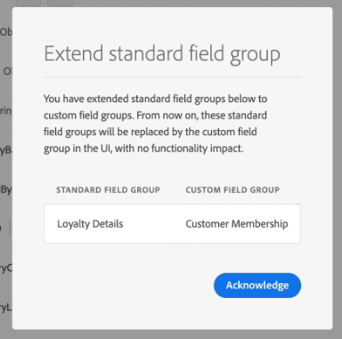

開始するには、標準フィールドグループによって提供されるオブジェクトのルートの横にあるプラス（**+**）アイコンを選択します。

警告メッセージが表示され、標準フィールドグループを変換するかどうかを確認するメッセージが表示されます。 続行するには、**[!UICONTROL Continue creating field group]**&#x200B;を選択してください。

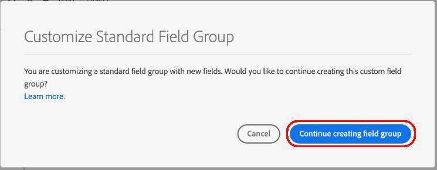

新しいフィールドの名称未設定のプレースホルダーがキャンバスに再表示されます。 標準フィールドグループの名前には、元のバージョンから変更されたことを示す「（[!UICONTROL Extended]）」が追加されています。 ここから、右側のパネルのコントロールを使用して、フィールドのプロパティを定義します。

標準オブジェクト 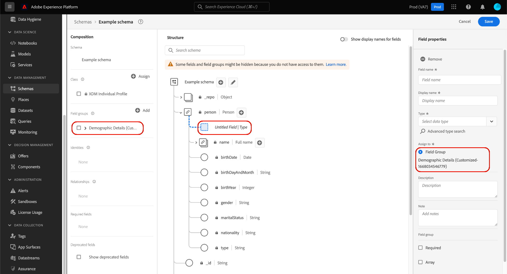 フィールドが追加されました

変更を適用すると、標準オブジェクト内のテナント ID名前空間の下に新しいフィールドが表示されます。 このネストされた名前空間は、同じフィールドグループを使用する他のスキーマの変更が壊れるのを防ぐために、フィールドグループ自体内でのフィールド名の競合を防ぎます。

標準オブジェクト 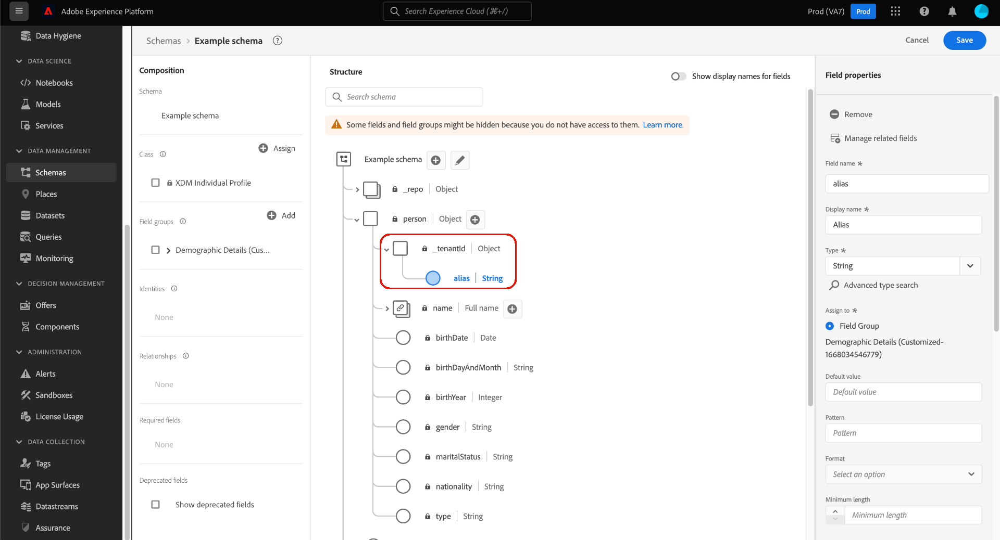 フィールドが追加されました

## リアルタイム顧客プロファイルのスキーマを有効にする {#profile}

>[!CONTEXTUALHELP]
>id="platform_schemas_enableforprofile"
>title="プロファイルのスキーマを有効にする"
>abstract="スキーマがプロファイルで有効になっている場合、このスキーマから作成されたデータセットは、異なるソースからのデータを結合して構築した各顧客の全体像である、リアルタイムの顧客プロファイルの構築に関与します。スキーマを使用してプロファイルにデータを取り込むと、そのスキーマを無効にすることはできなくなります。詳しくは、ドキュメントを参照してください。"

[ リアルタイム顧客プロファイル ](../../../profile/home.md)は、様々なソースからデータを統合して、個々の顧客の全体像を構築します。 スキーマによってキャプチャされたデータをこのプロセスに参加させるには、[!DNL Profile]で使用するスキーマを有効にする必要があります。

>[!IMPORTANT]
>
>[!DNL Profile]のスキーマを有効にするには、プライマリ ID フィールドが定義されている必要があります。 詳しくは、[ID フィールドの定義](../fields/identity.md)に関するガイドを参照してください。

スキーマを有効にするには、左側のパネルでスキーマの名前を選択してから、右側のパネルで&#x200B;**[!UICONTROL Profile]** トグルを選択します。

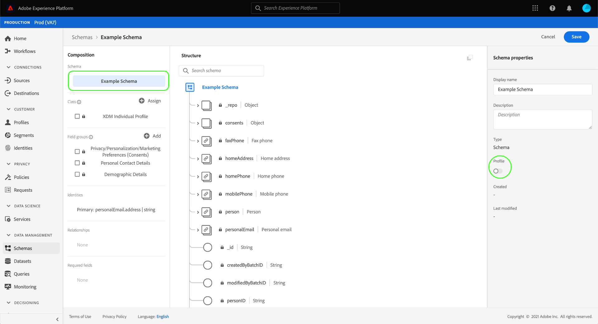

ポップオーバーが表示され、スキーマを有効にして保存すると、無効にできないことを警告します。 続行するには、**[!UICONTROL Enable]**&#x200B;を選択してください。

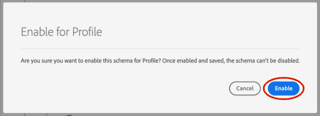

[!UICONTROL Profile] トグルが有効になっている状態で、キャンバスが再び表示されます。

>[!IMPORTANT]
>
>スキーマはまだ保存されていないため、スキーマをリアルタイム顧客プロファイルに参加させる方法を変更する場合は、この点が返されない場合です。有効なスキーマを保存すると、無効にできなくなります。 **[!UICONTROL Profile]** トグルをもう一度選択して、スキーマを無効にします。

プロセスを完了するには、**[!UICONTROL Save]**&#x200B;を選択してスキーマを保存します。

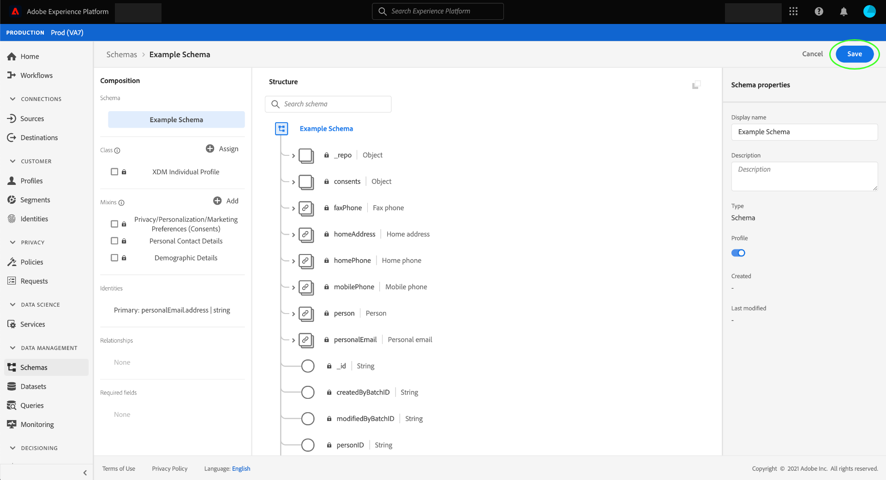

スキーマは、リアルタイム顧客プロファイルで使用できるようになりました。 Experience Platformがこのスキーマに基づいてデータセットにデータを取り込むと、そのデータは統合されたプロファイルデータに組み込まれます。

## スキーマフィールドの表示名の編集 {#display-names}

クラスを割り当ててスキーマにフィールドグループを追加したら、それらのフィールドが標準またはカスタム XDM リソースによって提供されているかどうかに関係なく、スキーマの任意のフィールドの表示名を編集できます。

>[!NOTE]
>
>標準クラスまたはフィールドグループに属するフィールドの表示名は、特定のスキーマのコンテキストでのみ編集できることに注意してください。 つまり、1つのスキーマ内の標準フィールドの表示名を変更しても、同じ関連クラスまたはフィールドグループを使用する他のスキーマには影響しません。
>
>スキーマのフィールドの表示名を変更すると、それらの変更は、そのスキーマに基づく既存のデータセットにすぐに反映されます。

**[!UICONTROL Show display names for fields]**&#x200B;を切り替えて、フィールド名を表示名に変更します。 スキーマフィールドの表示名を編集するには、キャンバスでフィールドを選択します。 右側のパネルで、**[!UICONTROL Display name]**&#x200B;の下に新しい名前を入力します。

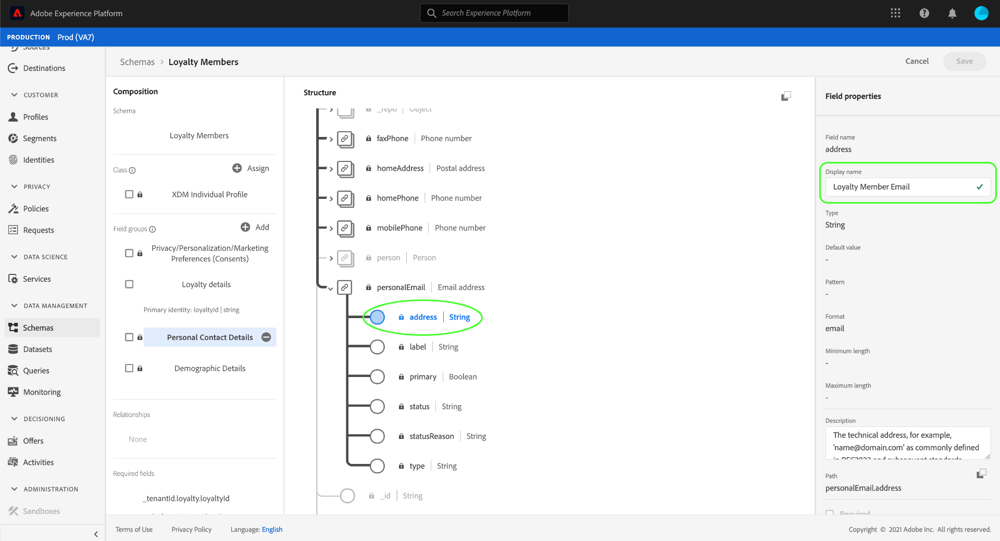

右側のパネルで「**[!UICONTROL Apply]**」を選択すると、キャンバスが更新され、フィールドの新しい表示名が表示されます。 **[!UICONTROL Save]**&#x200B;を選択して、変更をスキーマに適用します。

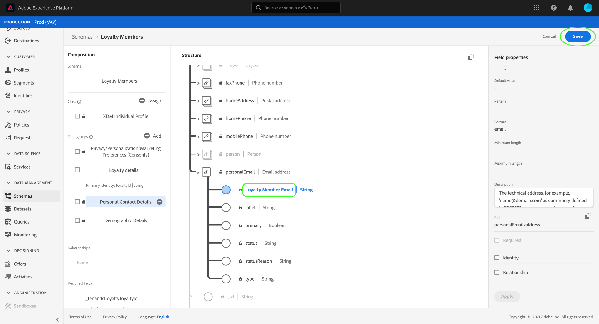

## スキーマのクラスを変更する {#change-class}

スキーマが保存される前の初期作成プロセス中の任意の時点で、スキーマのクラスを変更できます。

>[!WARNING]
>
>スキーマのクラスの再割り当ては、細心の注意を払って行う必要があります。 フィールドグループは特定のクラスにのみ適合するので、クラスを変更すると、キャンバスと追加したフィールドがリセットされます。

クラスを再割り当てするには、キャンバスの左側にある「**[!UICONTROL Assign]**」を選択します。

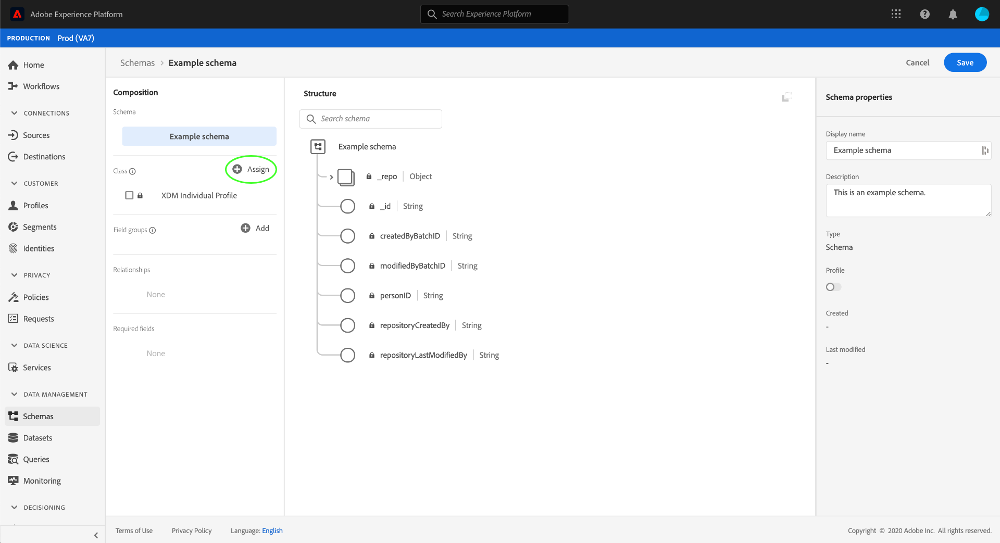

ダイアログが表示され、使用可能なすべてのクラスのリストが表示されます。これには、組織で定義されたクラス（「[!UICONTROL Customer]」の所有者）と、Adobeで定義された標準クラスが含まれます。

リストからクラスを選択して、ダイアログの右側にその説明を表示します。 **[!UICONTROL Preview class structure]**&#x200B;を選択して、クラスに関連付けられているフィールドとメタデータを表示することもできます。 続行するには、**[!UICONTROL Assign class]**&#x200B;を選択してください。

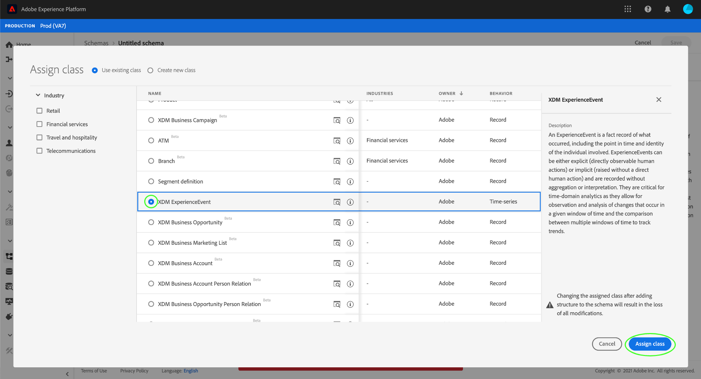

新しいクラスを割り当てることを確認するダイアログが開きます。 確認するには、**[!UICONTROL Assign]**&#x200B;を選択してください。

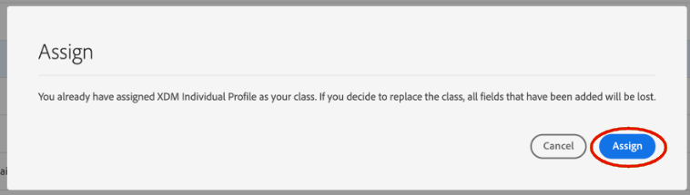

クラスの変更を確認した後、キャンバスがリセットされ、すべてのコンポジションの進行状況が失われます。

## 次の手順 {#next-steps}

このドキュメントでは、Experience Platform UIでのスキーマの作成と編集の基本について説明しました。 独自のユースケースに対するカスタムフィールドグループとデータタイプの作成を含む、UIで完全なスキーマを構築するための包括的なワークフローについては、[ スキーマ作成チュートリアル ](../../tutorials/create-schema-ui.md)を確認することを強くお勧めします。

[!UICONTROL Schemas] ワークスペースの機能について詳しくは、[[!UICONTROL Schemas] ワークスペースの概要](../overview.md)を参照してください。

[!DNL Schema Registry] APIでスキーマを管理する方法については、[ スキーマエンドポイントガイド ](../../api/schemas.md)を参照してください。
