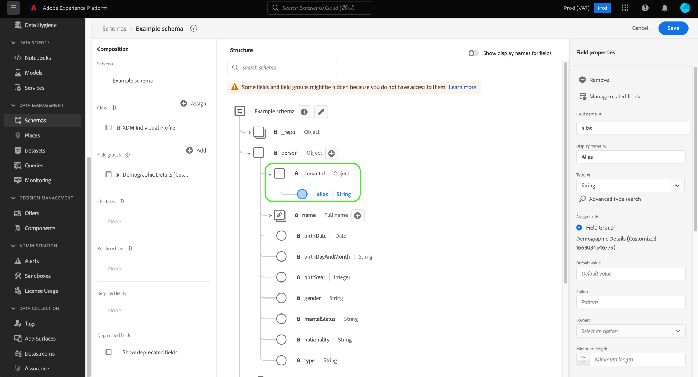

# UI でのスキーマの作成と編集

このガイドでは、Adobe Experience Platform UI で組織の Experience Data Model(XDM) スキーマを作成、編集、管理する方法の概要を説明します。

>[!IMPORTANT]
>
>XDM スキーマは非常にカスタマイズ可能なので、スキーマの作成に必要な手順は、スキーマが取得するデータの種類に応じて異なる場合があります。 その結果、このドキュメントでは、UI のスキーマで実行できる基本的なインタラクションのみを扱い、クラス、スキーマフィールドグループ、データタイプ、フィールドのカスタマイズなどの関連手順を除外します。
>
>スキーマ作成プロセスの完全なツアーについては、 [スキーマ作成チュートリアル](../../tutorials/create-schema-ui.md) 完全なサンプルスキーマを作成し、の多くの機能に慣れるには、以下を実行します。 [!DNL Schema Editor].

## 前提条件

このガイドでは、XDM システムに関する十分な知識が必要です。 詳しくは、 [XDM の概要](../../home.md) Experience Platformエコシステム内での XDM の役割、および [スキーマ構成の基本](../../schema/composition.md) スキーマの構築方法の概要を示します。

## 新しいスキーマの作成 {#create}

>[!NOTE]
>
>この節では、UI で新しいスキーマを手動で作成する方法について説明します。 CSV データを Platform に取り込む場合は、 [AI で生成されたレコメンデーションによって作成された XDM スキーマにそのデータをマッピングします。](../../../ingestion/tutorials/map-csv/recommendations.md) （現在はベータ版）。手動でスキーマを作成する必要はありません。

内 [!UICONTROL スキーマ] ワークスペース、選択 **[!UICONTROL スキーマを作成]** をクリックします。 表示されるドロップダウンで、次の中から選択できます **[!UICONTROL XDM 個人プロファイル]** および **[!UICONTROL XDM ExperienceEvent]** をスキーマの基本クラスとして使用します。 または、 **[!UICONTROL 参照]** 使用可能なクラスの完全なリストから選択する場合、または [新しいカスタムクラスの作成](./classes.md#create) 代わりに、

クラスを選択すると、 [!DNL Schema Editor] が表示され、スキーマの基本構造（クラスで指定）がキャンバスに表示されます。 ここから、右側のレールを使用して **[!UICONTROL 表示名]** および **[!UICONTROL 説明]** スキーマの

これで、次の方法でスキーマの構造の構築を開始できます。 [スキーマフィールドグループの追加](#add-field-groups).

## 既存のスキーマの編集 {#edit}

>[!NOTE]
>
>スキーマを保存し、データ取り込みで使用した後は、追加的な変更のみを加えることができます。 詳しくは、 [スキーマ進化のルール](../../schema/composition.md#evolution) を参照してください。

既存のスキーマを編集するには、 **[!UICONTROL 参照]** タブをクリックし、編集するスキーマの名前を選択します。

>[!TIP]
>
>ワークスペースの検索およびフィルタリング機能を使用すると、スキーマを見つけやすくなります。 詳しくは、 [XDM リソースの調査](../explore.md) を参照してください。

スキーマを選択すると、 [!DNL Schema Editor] が表示され、スキーマの構造がキャンバスに表示されます。 次の操作を実行できます。 [フィールドグループを追加](#add-field-groups) スキーマ ( または [個々のフィールドを追加](#add-individual-fields) これらのグループから ) [フィールドの表示名を編集](#display-names)または [既存のカスタムフィールドグループの編集](./field-groups.md#edit) スキーマが適用する場合。

## スキーマへのフィールドグループの追加 {#add-field-groups}

>[!NOTE]
>
>この節では、既存のフィールドグループをスキーマに追加する方法について説明します。 新しいカスタムフィールドグループを作成する場合は、 [フィールドグループの作成と編集](./field-groups.md#create) 代わりに、

以下の [!DNL Schema Editor]に値を入力する場合は、フィールドグループを使用してスキーマにフィールドを追加できます。 開始するには、 **[!UICONTROL 追加]** 次の **[!UICONTROL フィールドグループ]** をクリックします。

ダイアログが開き、スキーマ用に選択できるフィールドグループのリストが表示されます。 フィールドグループは 1 つのクラスとのみ互換性があるので、スキーマの選択されたクラスに関連付けられているフィールドグループのみが表示されます。 デフォルトでは、リストに表示されるフィールドグループは、組織内での使用頻度に基づいて並べ替えられます。

追加するフィールドの一般的なアクティビティまたはビジネス領域がわかっている場合は、左側のレールから業種別のカテゴリを 1 つ以上選択して、表示されるフィールドグループのリストをフィルタリングします。

>[!NOTE]
>
>XDM での業界固有のデータモデリングのベストプラクティスについて詳しくは、 [業界データモデル](../../schema/industries/overview.md).

また、検索バーを使用して、目的のフィールドグループを見つけることもできます。 クエリと名前が一致するフィールドグループがリストの上部に表示されます。 の下 **[!UICONTROL 標準フィールド]**、目的のデータ属性を記述するフィールドを含むフィールドグループが表示されます。

スキーマに追加するフィールドグループの名前の横にあるチェックボックスを選択します。 リストから複数のフィールドグループを選択できます。選択した各フィールドグループが右側のパネルに表示されます。

>[!TIP]
>
>リストに表示されたフィールドグループで、情報アイコン () をクリックすると、フィールドグループが取り込むデータの種類に関する簡単な説明が表示されます。 プレビューアイコン () を使用して、スキーマに追加する前にフィールドグループが提供するフィールドの構造を表示できます。

フィールドグループを選択したら、「 」を選択します。 **[!UICONTROL フィールドグループを追加]** スキーマに追加します。

この [!DNL Schema Editor] フィールドグループが指定したフィールドがキャンバスに表示された状態で再表示されます。

スキーマにフィールドグループを追加した後、オプションで [既存のフィールドを削除](#remove-fields) または [新しいカスタムフィールドを追加](#add-fields) 必要に応じて、これらのグループに追加します。

### フィールドグループから追加されたフィールドを削除 {#remove-fields}

スキーマにフィールドグループを追加した後、不要なフィールドを削除できます。

>[!NOTE]
>
>フィールドグループからフィールドを削除しても、作業中のスキーマにのみ影響し、フィールドグループ自体には影響しません。 1 つのスキーマ内のフィールドを削除した場合、同じフィールドグループを使用する他のすべてのスキーマでも、これらのフィールドを引き続き使用できます。

次の例では、標準フィールドグループが **[!UICONTROL 人口統計の詳細]** がスキーマに追加されました。 次のような単一のフィールドを削除するには `taxId`をクリックし、キャンバスのフィールドを選択して、「 」を選択します。 **[!UICONTROL 削除]** をクリックします。

削除するフィールドが複数ある場合は、フィールドグループ全体を管理できます。 キャンバスでグループに属するフィールドを選択し、「 」を選択します。 **[!UICONTROL 関連するフィールドの管理]** をクリックします。

該当するフィールドグループの構造を示すダイアログが表示されます。 ここから、提供されたチェックボックスを使用して、必要なフィールドを選択または選択解除できます。 満足したら、「 」を選択します。 **[!UICONTROL 確認]**.

キャンバスが再び表示され、選択したフィールドのみがスキーマ構造に存在します。

### フィールドグループにカスタムフィールドを追加する {#add-fields}

スキーマにフィールドグループを追加した後、そのグループの追加フィールドを定義できます。 ただし、あるスキーマ内のフィールドグループに追加されたフィールドは、同じフィールドグループを使用する他のすべてのスキーマにも表示されます。

また、標準フィールドグループにカスタムフィールドを追加すると、そのフィールドグループはカスタムフィールドグループに変換され、元の標準フィールドグループは使用できなくなります。

標準フィールドグループにカスタムフィールドを追加する場合は、 [以下の節](#custom-fields-for-standard-groups) を参照してください。 カスタムフィールドグループにフィールドを追加する場合は、 [カスタムフィールドグループの編集](./field-groups.md) 」を参照してください。

既存のフィールドグループを変更しない場合は、 [新しいカスタムフィールドグループを作成する](./field-groups.md#create) を使用して、追加のフィールドを定義します。

## スキーマへの個々のフィールドの追加 {#add-individual-fields}

スキーマエディターを使用すると、特定の使用例に対してフィールドグループ全体が追加されるのを避けたい場合に、個々のフィールドを直接スキーマに追加できます。 以下が可能です。 [標準フィールドグループから個々のフィールドを追加](#add-standard-fields) または [独自のカスタムフィールドの追加](#add-custom-fields) 代わりに、

>[!IMPORTANT]
>
>スキーマエディターでは機能的に個々のフィールドを直接スキーマに追加できますが、XDM スキーマ内のすべてのフィールドは、そのクラスまたはそのクラスと互換性のあるフィールドグループによって提供される必要があるという事実は変わりません。 以下の節で説明するように、個々のフィールドは、スキーマに追加される際に、キーステップとしてクラスまたはフィールドグループに関連付けられます。

### 標準フィールドを追加 {#add-standard-fields}

事前に対応するフィールドグループを把握しておく必要なく、標準フィールドグループのフィールドを直接スキーマに追加できます。 標準フィールドをスキーマに追加するには、プラス (**+**) アイコンをクリックします。 An **[!UICONTROL 名称未設定フィールド]** プレースホルダーがスキーマ構造に表示され、右側のレールが更新されて、フィールドを設定するコントロールが表示されます。

の下 **[!UICONTROL フィールド名]**&#x200B;追加するフィールドの名前を入力します。 クエリに一致する標準フィールドが自動的に検索され、以下にリストされます。 **[!UICONTROL 推奨される標準フィールド]**（所属するフィールドグループを含む）

一部の標準フィールドは同じ名前を共有しますが、構造は、その標準フィールドの元のフィールドグループによって異なる場合があります。 標準フィールドがフィールドグループ構造内の親オブジェクト内にネストされている場合、子フィールドが追加されると、親フィールドもスキーマに含まれます。

プレビューアイコン () をクリックし、標準フィールドの横に表示されます。 標準フィールドをスキーマに追加するには、プラスアイコン () をクリックします。

キャンバスが更新され、フィールドグループ構造内でネストされている親フィールドを含む、スキーマに追加された標準フィールドが表示されます。 フィールドグループの名前も、以下に表示されます。 **[!UICONTROL フィールドグループ]** をクリックします。 同じフィールドグループからさらにフィールドを追加する場合は、 **[!UICONTROL 関連するフィールドの管理]** をクリックします。

### カスタムフィールドの追加 {#add-custom-fields}

標準フィールドのワークフローと同様に、独自のカスタムフィールドを直接スキーマに追加することもできます。

スキーマのルートレベルにフィールドを追加するには、プラス (**+**) アイコンをクリックします。 An **[!UICONTROL 名称未設定フィールド]** プレースホルダーがスキーマ構造に表示され、右側のレールが更新されて、フィールドを設定するコントロールが表示されます。

追加するフィールドの名前を入力すると、一致する標準フィールドの検索が自動的に開始されます。 代わりに新しいカスタムフィールドを作成するには、 **([!UICONTROL 新規フィールド])**.

フィールドに表示名とデータ型を指定した後、次の手順では、フィールドを親 XDM リソースに割り当てます。 スキーマでカスタムクラスを使用する場合、 [割り当てられたクラスにフィールドを追加](#add-to-class) または [フィールドグループ](#add-to-field-group) 代わりに、 ただし、スキーマで標準クラスを使用する場合、カスタムフィールドをフィールドグループに割り当てることのみ可能です。

#### フィールドをカスタムフィールドグループに割り当てる {#add-to-field-group}

>[!NOTE]
>
>この節では、フィールドをカスタムフィールドグループに割り当てる方法についてのみ説明します。 標準フィールドグループを新しいカスタムフィールドで拡張する場合は、 [標準フィールドグループへのカスタムフィールドの追加](#custom-fields-for-standard-groups).

の下 **[!UICONTROL 割り当て先]**&#x200B;を選択します。 **[!UICONTROL フィールドグループ]**. スキーマで標準のクラスを使用する場合、これは唯一の使用可能なオプションで、デフォルトで選択されます。

次に、新しいフィールドを関連付けるフィールドグループを選択する必要があります。 指定したテキスト入力でフィールドグループの名前を入力します。 入力に一致する既存のカスタムフィールドグループがある場合は、それらはドロップダウンリストに表示されます。 または、一意の名前を入力して新しいフィールドグループを作成することもできます。

>[!WARNING]
>
>既存のカスタムフィールドグループを選択した場合、そのフィールドグループを使用する他のスキーマも、変更を保存した後で、新しく追加されたフィールドを継承します。 このため、このタイプの伝播を行う場合は、既存のフィールド・グループを選択する必要があります。 それ以外の場合は、代わりに新しいカスタムフィールドグループを作成する必要があります。

リストからフィールドグループを選択した後、「 」を選択します。 **[!UICONTROL 適用]**.

新しいフィールドがキャンバスに追加され、名前空間がユーザーの下に表示されます [テナント ID](../../api/getting-started.md#know-your-tenant_id) 標準 XDM フィールドとの競合を避けるために使用します。 新しいフィールドを関連付けたフィールドグループも、の下に表示されます。 **[!UICONTROL フィールドグループ]** をクリックします。

>[!NOTE]
>
>選択したカスタムフィールドグループで提供されている残りのフィールドは、デフォルトでスキーマから削除されます。 これらのフィールドの一部をスキーマに追加する場合は、グループに属するフィールドを選択し、「 」を選択します。 **[!UICONTROL 関連するフィールドの管理]** をクリックします。

#### フィールドをカスタムクラスに割り当てる {#add-to-class}

の下 **[!UICONTROL 割り当て先]**&#x200B;を選択します。 **[!UICONTROL クラス]**. 以下の入力フィールドは、現在のスキーマのカスタムクラスの名前に置き換えられ、新しいフィールドがこのクラスに割り当てられることを示します。

![この [!UICONTROL クラス] オプションが選択されています。](../../images/ui/resources/schemas/assign-field-to-class.png)

必要に応じてフィールドの設定を続行し、「 」を選択します。 **[!UICONTROL 適用]** 終了したとき。

![[!UICONTROL 適用] 新しいフィールド用に選択されています。](../../images/ui/resources/schemas/assign-field-to-class-apply.png)

新しいフィールドがキャンバスに追加され、名前空間がユーザーの下に表示されます [テナント ID](../../api/getting-started.md#know-your-tenant_id) 標準 XDM フィールドとの競合を避けるために使用します。 左側のレールでクラス名を選択すると、新しいフィールドがクラスの構造の一部として表示されます。

### 標準フィールドグループの構造にカスタムフィールドを追加する {#custom-fields-for-standard-groups}

作業中のスキーマに、標準フィールドグループによって提供されるオブジェクトタイプのフィールドがある場合、独自のカスタムフィールドをその標準オブジェクトに追加できます。

>[!WARNING]
>
>あるスキーマ内のフィールドグループに追加されたフィールドは、同じフィールドグループを使用する他のすべてのスキーマにも表示されます。 また、標準フィールドグループにカスタムフィールドを追加すると、そのフィールドグループはカスタムフィールドグループに変換され、元の標準フィールドグループは使用できなくなります。
>
>この機能をベータ版に参加した場合は、以前にカスタマイズした標準フィールドグループを示すダイアログが表示されます。 次を選択したら、 **[!UICONTROL 確認]**&#x200B;を指定した場合、一覧に表示されるリソースはカスタムフィールドグループに変換されます。
>
>

まず、プラス (**+**) アイコンをクリックし、標準フィールドグループで提供されるオブジェクトのルートの横に表示されます。

標準フィールドグループを変換するかどうかを確認する警告メッセージが表示されます。 選択 **[!UICONTROL 引き続きフィールドグループを作成します]** をクリックして続行します。

キャンバスが再び表示され、新しいフィールド用の名称未設定のプレースホルダーが表示されます。 標準フィールドグループの名前には、[!UICONTROL 拡張])」という名前に変更され、元のバージョンから変更されたことを示します。 ここから、右側のレールのコントロールを使用して、フィールドのプロパティを定義します。

変更を適用すると、新しいフィールドが標準オブジェクト内のテナント ID 名前空間の下に表示されます。 このネストされた名前空間は、同じフィールドグループを使用する他のスキーマでの変更が壊れるのを防ぐために、フィールドグループ内のフィールド名の競合を防ぎます。

## リアルタイム顧客プロファイルのスキーマの有効化 {#profile}

>[!CONTEXTUALHELP]
>id="platform_schemas_enableforprofile"
>title="プロファイルのスキーマの有効化"
>abstract="プロファイルに対してスキーマを有効にすると、このスキーマから作成されたデータセットはリアルタイム顧客プロファイルに参加し、異なるソースのデータを結合して、各顧客の完全なビューを構築します。 スキーマを使用してデータをプロファイルに取り込むと、無効にできません。 詳しくは、ドキュメントを参照してください。"

[リアルタイム顧客プロファイル](../../../profile/home.md) 異なるソースのデータを結合して、各顧客の完全なビューを構築します。 スキーマによって取得されたデータをこのプロセスに参加させる場合は、で使用するスキーマを有効にする必要があります。 [!DNL Profile].

>[!IMPORTANT]
>
>のスキーマを有効にするには [!DNL Profile]に値を入力する場合は、プライマリ ID フィールドを定義する必要があります。 詳しくは、 [ID フィールドの定義](../fields/identity.md) を参照してください。

スキーマを有効にするには、まず左側のパネルでスキーマの名前を選択してから、 **[!UICONTROL プロファイル]** 右側のパネルを切り替えます。

スキーマを有効にして保存すると、無効にできなくなることを警告するポップオーバーが表示されます。 選択 **[!UICONTROL 有効にする]** をクリックして続行します。

キャンバスが再び表示され、 [!UICONTROL プロファイル] オン/オフを切り替えます。

>[!IMPORTANT]
>
>スキーマはまだ保存されていないので、スキーマをリアルタイム顧客プロファイルに参加させることについて考えを変えた場合、戻り値のポイントになりません。有効なスキーマを保存すると、無効にできなくなります。 を選択します。 **[!UICONTROL プロファイル]** スキーマを無効にするには、再度切り替えます。

処理を終了するには、「 」を選択します。 **[!UICONTROL 保存]** スキーマを保存します。

これで、スキーマがリアルタイム顧客プロファイルで使用できるようになります。 Platform がこのスキーマに基づいてデータをデータセットに取り込むと、そのデータは統合プロファイルデータに取り込まれます。

## スキーマフィールドの表示名を編集 {#display-names}

クラスを割り当て、フィールドグループをスキーマに追加したら、標準の XDM リソースで提供されているかカスタム XDM リソースで提供されているかに関係なく、スキーマのフィールドの表示名を編集できます。

>[!NOTE]
>
>標準のクラスまたはフィールドグループに属するフィールドの表示名は、特定のスキーマのコンテキストでのみ編集できます。 つまり、あるスキーマで標準フィールドの表示名を変更しても、同じ関連付けられたクラスまたはフィールドグループを使用する他のスキーマには影響しません。
>
>スキーマのフィールドの表示名を変更すると、その変更は、そのスキーマに基づく既存のデータセットに直ちに反映されます。

スキーマフィールドの表示名を編集するには、キャンバスでフィールドを選択します。 右側のレールで、の下に新しい名前を入力します。 **[!UICONTROL 表示名]**.

選択 **[!UICONTROL 適用]** 右側のレールで、キャンバスが更新されて、フィールドの新しい表示名が表示されます。 選択 **[!UICONTROL 保存]** をクリックして、変更をスキーマに適用します。

## スキーマのクラスの変更 {#change-class}

スキーマが保存される前の初期構成プロセス中の任意の時点で、スキーマのクラスを変更できます。

>[!WARNING]
>
>スキーマのクラスの再割り当ては、非常に注意しておこなう必要があります。 フィールドグループは特定のクラスとのみ互換性があるので、クラスを変更するとキャンバスと追加したフィールドがリセットされます。

クラスを再割り当てするには、 **[!UICONTROL 割り当て]** をクリックします。

組織で定義されたクラス（所有者は「 」）を含む、使用可能なすべてのクラスのリストを表示するダイアログが表示されます[!UICONTROL 顧客]&quot;) およびAdobeで定義された標準クラス。

リストからクラスを選択し、ダイアログの右側に説明を表示します。 また、 **[!UICONTROL クラス構造をプレビュー]** をクリックして、クラスに関連付けられているフィールドとメタデータを確認します。 選択 **[!UICONTROL クラスを割り当て]** をクリックして続行します。

新しいクラスを割り当てるかどうかを確認する新しいダイアログが開きます。 選択 **[!UICONTROL 割り当て]** をクリックして確定します。

クラスの変更を確認した後、キャンバスがリセットされ、構成の進行状況がすべて失われます。

## 次の手順

このドキュメントでは、Platform UI でのスキーマの作成と編集の基本について説明します。 次の項目を確認することを強くお勧めします。 [スキーマ作成チュートリアル](../../tutorials/create-schema-ui.md) :UI で完全なスキーマを構築するための包括的なワークフロー。一意の使用例のカスタムフィールドグループとデータタイプの作成を含みます。

の機能の詳細については、 [!UICONTROL スキーマ] ワークスペース ( [[!UICONTROL スキーマ] workspace の概要](../overview.md).

でスキーマを管理する方法については、以下を参照してください。 [!DNL Schema Registry] API( [スキーマエンドポイントガイド](../../api/schemas.md).
