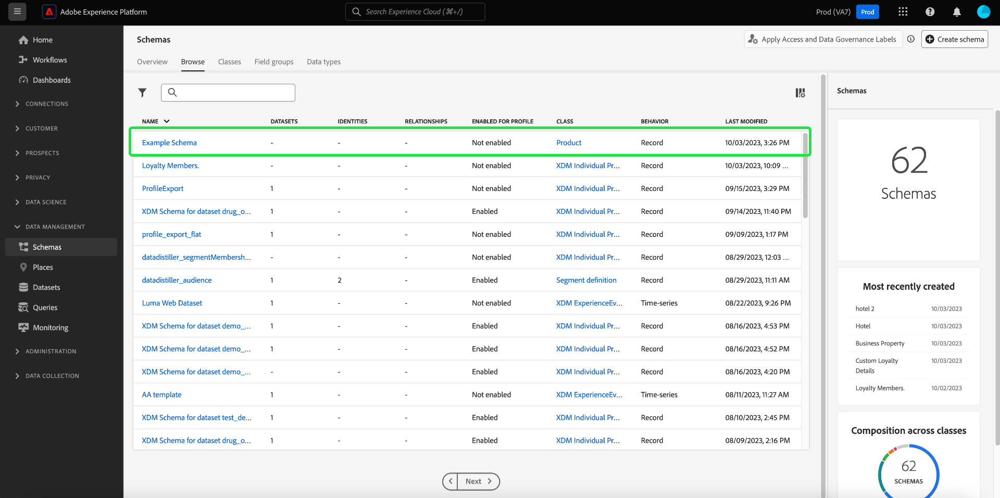

# UI でのスキーマの作成と編集 {#create-edit-schemas-in-ui}

このガイドでは、Adobe Experience Platform UI で組織の Experience Data Model （XDM）スキーマを作成、編集、管理する方法の概要について説明します。

>[!IMPORTANT]
>
>XDM スキーマは非常にカスタマイズ可能なので、スキーマの作成に必要な手順は、スキーマで取得するデータの種類によって異なる場合があります。 そのため、このドキュメントでは、UI でスキーマを使用して実行できる基本的なインタラクションのみを扱い、クラス、スキーマフィールドグループ、データタイプ、フィールドのカスタマイズなど、関連する手順は除外します。
>
>スキーマ作成プロセスの完全なツアーについては、[ スキーマ作成チュートリアル ](../../tutorials/create-schema-ui.md) に従って、完全なサンプルスキーマを作成し、[!DNL Schema Editor] の多くの機能を理解してください。

## 前提条件 {#prerequisites}

このガイドでは、XDM システムに関する十分な知識が必要です。 スキーマエコシステムにおける XDM の役割の概要については [XDM の概要 ](../../home.md) を、Experience Platformの構築方法の概要については [ スキーマ構成の基本 ](../../schema/composition.md) を参照してください。

## 新しいスキーマの作成 {#create}

>[!NOTE]
>
>この節では、UI で新しいスキーマを手動で作成する方法について説明します。 CSV データを Platform に取り込む場合は、機械学習（ML）アルゴリズムを使用して **サンプル CSV データからスキーマを生成** できます。 このワークフローはデータ形式に一致し、CSV ファイルの構造と内容に基づいて新しいスキーマを自動的に作成します。 このワークフローについて詳しくは、[ML-Assisted schema creation guide](../ml-assisted-schema-creation.md) を参照してください。

[!UICONTROL  スキーマ ] ワークスペースで、右上隅の **[!UICONTROL スキーマを作成]** を選択します。

![ 「スキーマを作成 [!UICONTROL  がハイライト表示されたスキーマワークスペース ]](../../images/ui/resources/schemas/create-schema.png)

[!UICONTROL  スキーマを作成 ] ダイアログが表示されます。 このダイアログでは、フィールドとフィールドグループを追加して手動でスキーマを作成するか、CSV ファイルをアップロードして ML アルゴリズムを使用してスキーマを生成するかを選択できます。 ダイアログからスキーマ作成ワークフローを選択します。

### 手動または ML 支援によるスキーマ作成 {#manual-or-assisted}

ML アルゴリズムを使用して、CSV ファイルに基づいてスキーマ構造をレコメンデーションする方法については、[ 機械学習を利用したスキーマ作成ガイド ](../ml-assisted-schema-creation.md) を参照してください。 この UI ガイドは、手動作成ワークフローを中心としています。

### 手動でのスキーマ作成 {#manual-creation}

[!UICONTROL  スキーマを作成 ] ワークフローが表示されます。 **[!UICONTROL 個人プロファイル]**、**[!UICONTROL エクスペリエンスイベント]**、または **[!UICONTROL その他]** を選択し、その後 **[!UICONTROL 次へ]** を選択することで、スキーマの基本クラスを選択できます。 これらのクラスについて詳しくは、[[!UICONTROL XDM 個人プロファイル ]](../../classes/individual-profile.md) および [[!UICONTROL XDM ExperienceEvent]](../../classes/experienceevent.md) のドキュメントを参照してください。

![3 つのクラスオプションと [!UICONTROL  次へ ] がハイライト表示された [!UICONTROL  スキーマを作成 ] ワークフロー ](../../images/ui/resources/schemas/schema-class-options.png)

クラスを選択すると、「名前とレビュー [!UICONTROL  セクションが表示され ] す。 このセクションでは、スキーマを識別するための名前と説明を指定します。&#x200B;キャンバスにスキーマの基本構造（クラスによって提供される）が表示され、選択したクラスとスキーマ構造を確認できます。

テキストフィールドに、人間にとってわかりやすい [!UICONTROL  スキーマ表示名 ] を入力します。 次に、スキーマの識別に役立つ適切な説明を入力します。 スキーマ構造をレビューし、設定に満足したら、「**[!UICONTROL 完了]**」を選択してスキーマを作成します。

![[!UICONTROL  スキーマ表示名 ]、[!UICONTROL  説明 ]、および [!UICONTROL  完了 ] がハイライト表示された [!UICONTROL  スキーマを作成 ] ワークフローの [!UICONTROL  名前とレビュー ] セクション ](../../images/ui/resources/schemas/name-and-review.png)

「[!UICONTROL  スキーマ ][!UICONTROL  参照 ]」タブが表示されます。 最近作成したスキーマがスキーマライブラリに一覧表示され、[!DNL Schema Editor] で編集できるようになりました。

## 既存のスキーマの編集 {#edit}

>[!NOTE]
>
>スキーマを保存してデータ取り込みに使用すると、スキーマに追加の変更を加えることのみ可能です。 詳しくは、[ スキーマ進化のルール ](../../schema/composition.md#evolution) を参照してください。

既存のスキーマを編集するには、「**[!UICONTROL 参照]**」タブを選択して、編集するスキーマの名前を選択します。 検索バーを使用して、使用可能なオプションのリストを絞り込むこともできます。

>[!TIP]
>
>ワークスペースの検索機能とフィルター機能を使用すると、スキーマを見つけやすくなります。 詳しくは、[XDM リソースの調査 ](../explore.md) に関するガイドを参照してください。

スキーマを選択すると、キャンバスにスキーマの構造が表示された [!DNL Schema Editor] が表示されます。 スキーマが使用している場合は、スキーマへの [ フィールドグループの追加 ](#add-field-groups) または [ 個々のフィールドの追加 ](#add-individual-fields) これらのグループから）、[ フィールド表示名の編集 ](#display-names) または [ 既存のカスタムフィールドグループの編集 ](./field-groups.md#edit) を実行できるようになりました。

## その他のアクション {#more}

また、スキーマエディター内でクイックアクションを実行して、スキーマの JSON 構造をコピーしたり、リアルタイム顧客プロファイルが有効になっていない場合や関連付けられたデータセットがある場合はスキーマを削除したりできます。 ビューの上部にある「[!UICONTROL  詳細 ]」を選択すると、クイックアクションを含むドロップダウンが表示されます。

JSON 構造をコピー機能を使用すると、スキーマとデータパイプラインを作成している間、サンプルペイロードがどのように見えるかを確認できます。 これは、ID マップなど、スキーマ内に複雑なオブジェクトマップ構造がある場合に特に便利です。

## 表示名の切替 {#display-name-toggle}

スキーマエディターでは、便宜上、元のフィールド名と、より人間が読み取り可能な表示名との間で変更する切替スイッチを提供しています。 この柔軟性により、フィールドの検出性が向上し、スキーマを編集できます。切替スイッチは、スキーマエディタービューの右上にあります。

>[!NOTE]
>
>フィールド名から表示名への変更は単なる表面的なもので、ダウンストリームリソースは変更されません。

![[!UICONTROL  フィールドの表示名を表示 ] がハイライト表示されたスキーマエディター ](../../images/ui/resources/schemas/display-name-toggle.png)

標準フィールドグループの表示名はシステムで生成されますが、[ 表示名 ](#display-names) の節で説明されているようにカスタマイズできます。 表示名は、マッピングやデータセットのプレビューを含む、複数の UI 表示に反映されます。 デフォルト設定はオフで、フィールド名は元の値で表示されます。

## スキーマへのフィールドグループの追加 {#add-field-groups}

>[!NOTE]
>
>この節では、既存のフィールドグループをスキーマに追加する方法を説明します。 新しいカスタムフィールドグループを作成する場合は、代わりに [ フィールドグループの作成と編集 ](./field-groups.md#create) に関するガイドを参照してください。

[!DNL Schema Editor] 内でスキーマを開くと、フィールドグループを使用してスキーマにフィールドを追加できます。 開始するには、左パネルの **[!UICONTROL フィールドグループ]** の横にある **[!UICONTROL 追加]** を選択します。

![[!UICONTROL  フィールドグループ ] セクションの [!UICONTROL  追加 ] がハイライト表示されたスキーマエディター ](../../images/ui/resources/schemas/add-field-group-button.png)

ダイアログが表示され、スキーマに対して選択できるフィールドグループのリストが表示されます。 フィールドグループは 1 つのクラスにのみ適合するので、スキーマの選択されたクラスに関連付けられているフィールドグループのみが表示されます。 デフォルトでは、リストに表示されるフィールドグループは、組織内での使用率に基づいて並べ替えられます。

![[!UICONTROL  人気度 ] 列がハイライト表示された [!UICONTROL  フィールドグループを追加 ] ダイアログ ](../../images/ui/resources/schemas/field-group-popularity.png)

追加するフィールドの一般的なアクティビティまたはビジネス領域がわかっている場合は、左側のパネルで 1 つ以上の業種カテゴリを選択して、表示されるフィールドグループのリストをフィルタリングします。

![[!UICONTROL  業界 [!UICONTROL  フィルターと ] 業界 ] 列がハイライト表示された [!UICONTROL  フィールドグループを追加 ] ダイアログ ](../../images/ui/resources/schemas/industry-filter.png)

>[!NOTE]
>
>XDM での業界固有のデータモデリングに関するベストプラクティスについて詳しくは、[ 業界データモデル ](../../schema/industries/overview.md) のドキュメントを参照してください。

また、検索バーを使用して、目的のフィールドグループを見つけることもできます。 クエリと名前が一致するフィールドグループがリストの上部に表示されます。 **[!UICONTROL 標準フィールド]** の下に、目的のデータ属性を説明するフィールドを含むフィールドグループが表示されます。

![[!UICONTROL  標準フィールド ] 検索機能がハイライト表示された [!UICONTROL  フィールドグループを追加 ] ダイアログ ](../../images/ui/resources/schemas/field-group-search.png)

スキーマに追加するフィールドグループ名の横にあるチェックボックスをオンにします。 リストから複数のフィールドグループを選択でき、選択した各フィールドグループが右側のパネルに表示されます。

![ チェックボックス選択機能がハイライト表示された [!UICONTROL  フィールドグループを追加 ] ダイアログ ](../../images/ui/resources/schemas/add-field-group.png)

>[!TIP]
>
>リストに表示されたフィールドグループの場合、情報アイコン（）にポインタを合わせるかフォーカスを合わせると、フィールドグループが取得するデータの種類の簡単な説明が表示されます。 また、プレビューアイコン（）を選択して、フィールドグループが提供するフィールドの構造を表示してから、スキーマに追加することもできます。

フィールドグループを選択したら、「**[!UICONTROL フィールドグループを追加]**」を選択して、スキーマに追加します。

![ フィールドグループが選択された [!UICONTROL  フィールドグループを追加 ] ダイアログと [!UICONTROL  フィールドグループを追加 ] がハイライト表示されます。](../../images/ui/resources/schemas/add-field-group-finish.png)

キャンバスに表された、フィールドグループが提供するフィールドと共に [!DNL Schema Editor] が再び表示されます。

![ スキーマの例が表示された [!DNL Schema Editor]。](../../images/ui/resources/schemas/field-groups-added.png)

>[!NOTE]
>
>スキーマエディター内では、標準（Adobe生成）のクラスおよびフィールドグループは、南京錠アイコン（。南京錠は、クラスまたはフィールドグループ名の横の左側のパネルに表示されるほか、システム生成リソースの一部であるスキーマ図のフィールドの横にも表示されます。
>
>

フィールドグループをスキーマに追加した後、必要に応じて、オプションで [ 既存のフィールドを削除 ](#remove-fields) または [ 新しいカスタムフィールドを追加 ](#add-fields) をこれらのグループに追加できます。

### フィールドグループから追加されたフィールドを削除 {#remove-fields}

フィールドグループをスキーマに追加した後、不要なフィールドを削除できます。

>[!NOTE]
>
>フィールドグループからフィールドを削除しても、作業中のスキーマにのみ影響し、フィールドグループ自体には影響しません。 1 つのスキーマのフィールドを削除しても、それらのフィールドは、同じフィールドグループを使用する他のすべてのスキーマで引き続き使用できます。

次の例では、標準フィールドグループ **[!UICONTROL 人口統計の詳細]** がスキーマに追加されています。 `taxId` などの 1 つのフィールドを削除するには、キャンバスでフィールドを選択し、右側のパネルで **[!UICONTROL 削除]** を選択します。

![ 「削除 [!UICONTROL  がハイライト表示された [!DNL Schema Editor]]。 この操作により、単一のフィールドが削除されます。](../../images/ui/resources/schemas/remove-single-field.png)

削除するフィールドが複数ある場合は、フィールドグループ全体を管理できます。 キャンバスでグループに属するフィールドを選択し、右側のパネルで **[!UICONTROL 関連フィールドを管理]** を選択します。

![ 「関連フィールドを管理 [!UICONTROL  がハイライト表示された [!DNL Schema Editor] ージ ]。](../../images/ui/resources/schemas/manage-related-fields.png)

問題のフィールドグループの構造を示すダイアログが表示されます。 ここから、用意されているチェックボックスを使用して、必要なフィールドを選択または選択解除できます。 内容を確認して、「**[!UICONTROL 確認]**」を選択します。

![ 選択したフィールドと [!UICONTROL  確認 ] がハイライト表示された [!UICONTROL  関連フィールドを管理 ] ダイアログ ](../../images/ui/resources/schemas/select-fields.png)

キャンバスが再び表示され、選択したフィールドのみがスキーマ構造に存在します。

### フィールドグループへのカスタムフィールドの追加 {#add-fields}

フィールドグループをスキーマに追加した後は、そのグループの追加フィールドを定義できます。 ただし、1 つのスキーマのフィールドグループに追加されたフィールドは、同じフィールドグループを使用する他のすべてのスキーマにも表示されます。

また、標準フィールドグループにカスタムフィールドが追加されると、そのフィールドグループはカスタムフィールドグループに変換され、元の標準フィールドグループは使用できなくなります。

標準フィールドグループにカスタムフィールドを追加する場合は、[ 以下の節 ](#custom-fields-for-standard-groups) を参照して、具体的な手順を確認してください。 カスタムフィールドグループにフィールドを追加する場合は、フィールドグループ UI ガイドの [ カスタムフィールドグループの編集 ](./field-groups.md) の節を参照してください。

既存のフィールドグループを変更しない場合は、[ 新しいカスタムフィールドグループを作成 ](./field-groups.md#create) して、代わりに追加のフィールドを定義できます。

## スキーマへの個々のフィールドの追加 {#add-individual-fields}

特定の使用例でフィールドグループ全体を追加したくない場合は、スキーマエディターを使用して、個々のフィールドをスキーマに直接追加できます。 代わりに [ 標準フィールドグループから個々のフィールドを追加する ](#add-standard-fields) または [ 独自のカスタムフィールドを追加する ](#add-custom-fields) ことができます。

>[!IMPORTANT]
>
>スキーマエディターの機能を使用すると、個々のフィールドをスキーマに直接追加できますが、XDM スキーマのすべてのフィールドがそのクラスまたはクラスと互換性のあるフィールドグループによって提供される必要があるという事実は変更されません。 以下の節で説明するように、個々のフィールドはすべて、スキーマに追加される際の重要な手順として、引き続きクラスまたはフィールドグループに関連付けられます。

### 標準フィールドを追加 {#add-standard-fields}

標準フィールドグループからスキーマに直接フィールドを追加でき、対応するフィールドグループを事前に知る必要はありません。 標準フィールドをスキーマに追加するには、キャンバスでスキーマ名の横にあるプラス（**+**）アイコンを選択します。 **[!UICONTROL 名称未設定フィールド]** プレースホルダーがスキーマ構造に表示されます。また、右側のパネルが更新されて、フィールドを設定するためのコントロールが表示されます。

**[!UICONTROL フィールド名]** の下に、追加するフィールドの名前の入力を開始します。 クエリに一致する標準フィールドが自動的に検索され、属するフィールドグループを含めて、**[!UICONTROL 推奨される標準フィールド]** に一覧表示されます。

一部の標準フィールドは同じ名前を共有しますが、構造は元のフィールドグループによって異なる場合があります。 標準フィールドがフィールドグループ構造内の親オブジェクト内にネストされている場合、子フィールドが追加されると、親フィールドもスキーマに含まれます。

標準フィールドの横にあるプレビューアイコン（）を選択すると、そのフィールドグループの構造が表示され、ネストの仕組みをより深く理解できます。 標準フィールドをスキーマに追加するには、プラスアイコン（）を選択します。

キャンバスが更新され、スキーマに追加された標準フィールドが表示されます。これには、フィールドグループ構造内にネストされた親フィールドも含まれます。 フィールドグループの名前は、左側のパネルの **[!UICONTROL フィールドグループ]** にも表示されます。 同じフィールドグループからさらにフィールドを追加する場合は、右側のパネルで **[!UICONTROL 関連フィールドを管理]** を選択します。

### カスタムフィールドを追加 {#add-custom-fields}

標準フィールドのワークフローと同様に、独自のカスタムフィールドをスキーマに直接追加することもできます。

スキーマのルートレベルにフィールドを追加するには、キャンバスでスキーマ名の横にあるプラス（**+**）アイコンを選択します。 **[!UICONTROL 名称未設定フィールド]** プレースホルダーがスキーマ構造に表示されます。また、右側のパネルが更新されて、フィールドを設定するためのコントロールが表示されます。

追加するフィールドの名前の入力を開始すると、一致する標準フィールドの検索が自動的に開始されます。 代わりに新しいカスタムフィールドを作成するには、**（[!UICONTROL  新しいフィールド ]）** が付いた上部のオプションを選択します。

フィールドに表示名とデータタイプを指定したら、次にフィールドを親 XDM リソースに割り当てます。 スキーマでカスタムクラスを使用する場合は、代わりに [ フィールドを割り当てられたクラスに追加 ](#add-to-class) または [ フィールドグループ ](#add-to-field-group) を選択できます。 ただし、スキーマで標準クラスを使用している場合は、カスタムフィールドをフィールドグループに割り当てるだけです。

#### カスタムフィールドグループへのフィールドの割り当て {#add-to-field-group}

>[!NOTE]
>
>この節では、フィールドをカスタムフィールドグループに割り当てる方法についてのみ説明します。 標準フィールドグループを新しいカスタムフィールドで拡張する場合は、[ 標準フィールドグループへのカスタムフィールドの追加 ](#custom-fields-for-standard-groups) の節を参照してください。

**[!UICONTROL 割り当て先]** で、「**[!UICONTROL フィールドグループ]**」を選択します。 スキーマで標準クラスを使用する場合、これが唯一の利用可能なオプションであり、デフォルトで選択されています。

次に、関連付ける新規フィールドのフィールドグループを選択する必要があります。 提供されたテキスト入力でフィールドグループの名前を入力し始めます。 入力と一致する既存のカスタムフィールドグループがある場合は、ドロップダウンリストに表示されます。 または、一意の名前を入力して、新しいフィールドグループを作成することもできます。

>[!WARNING]
>
>既存のカスタムフィールドグループを選択すると、そのフィールドグループを使用する他のスキーマも、変更を保存した後で、新しく追加されたフィールドを継承します。 このため、このタイプの伝播が必要な場合は、既存のフィールドグループのみを選択します。 そうでない場合は、代わりに新しいカスタムフィールドグループを作成することを選択する必要があります。

リストからフィールドグループを選択したら、「**[!UICONTROL 適用]**」を選択します。

新しいフィールドはキャンバスに追加され、標準の XDM フィールドとの競合を避けるために、[ テナント ID](../../api/getting-started.md#know-your-tenant_id) の下に名前空間が設定されます。 新しいフィールドを関連付けたフィールドグループは、左側のパネルの **[!UICONTROL フィールドグループ]** にも表示されます。

>[!NOTE]
>
>選択したカスタムフィールドグループによって提供される残りのフィールドは、デフォルトでスキーマから削除されます。 これらのフィールドの一部をスキーマに追加する場合は、グループに属するフィールドを選択し、右側のパネルで **[!UICONTROL 関連フィールドを管理]** を選択します。

#### フィールドをカスタムクラスに割り当てる {#add-to-class}

**[!UICONTROL 割り当て先]** で、「**[!UICONTROL クラス]**」を選択します。 の下の入力フィールドは、現在のスキーマのカスタムクラスの名前に置き換えられ、新しいフィールドがこのクラスに割り当てられることを示します。

![ 新しいフィールド割り当てに対して [!UICONTROL  クラス ] オプションが選択されています。](../../images/ui/resources/schemas/assign-field-to-class.png)

必要に応じてフィールドの設定を続行し、終了したら「**[!UICONTROL 適用]**」を選択します。

![[!UICONTROL  適用 ] が新しいフィールドに対して選択されています。](../../images/ui/resources/schemas/assign-field-to-class-apply.png)

新しいフィールドはキャンバスに追加され、標準の XDM フィールドとの競合を避けるために、[ テナント ID](../../api/getting-started.md#know-your-tenant_id) の下に名前空間が設定されます。 左側のパネルでクラス名を選択すると、クラスの構造の一部として新しいフィールドが表示されます。

### 標準フィールドグループの構造へのカスタムフィールドの追加 {#custom-fields-for-standard-groups}

作業中のスキーマに、標準フィールドグループが提供するオブジェクトタイプのフィールドがある場合、独自のカスタムフィールドを標準オブジェクトに追加できます。

>[!WARNING]
>
>1 つのスキーマのフィールドグループに追加されたフィールドは、同じフィールドグループを使用する他のすべてのスキーマにも表示されます。 また、標準フィールドグループにカスタムフィールドが追加されると、そのフィールドグループはカスタムフィールドグループに変換され、元の標準フィールドグループは使用できなくなります。
>
>この機能のベータ版に参加すると、以前にカスタマイズした標準フィールドグループを通知するダイアログが表示されます。 「**[!UICONTROL 確認]**」を選択すると、リストされたリソースがカスタムフィールドグループに変換されます。
>
>

開始するには、標準フィールドグループで提供されるオブジェクトのルートの横にあるプラス（**+**）アイコンを選択します。

標準フィールドグループを変換するかどうかを確認する警告メッセージが表示されます。 「**[!UICONTROL フィールドグループの作成を続行]**」を選択して続行します。

キャンバスが再び表示され、新しいフィールドには名称未設定のプレースホルダーが表示されます。 標準フィールドグループの名前に「（[!UICONTROL Extended]）」が追加され、元のバージョンから変更されたことを示しています。 ここから、右側のパネルのコントロールを使用してフィールドのプロパティを定義します。

変更を適用すると、標準オブジェクト内のテナント ID 名前空間の下に新しいフィールドが表示されます。 このネストされた名前空間は、同じフィールドグループを使用する他のスキーマでの変更が壊れるのを防ぐために、フィールドグループ自体の中でのフィールド名の競合を防ぎます。

## リアルタイム顧客プロファイルのスキーマを有効にする {#profile}

>[!CONTEXTUALHELP]
>id="platform_schemas_enableforprofile"
>title="プロファイルのスキーマを有効にする"
>abstract="スキーマがプロファイルで有効になっている場合、このスキーマから作成されたデータセットは、異なるソースからのデータを結合して構築した各顧客の全体像である、リアルタイムの顧客プロファイルの構築に関与します。スキーマを使用してプロファイルにデータを取り込むと、そのスキーマを無効にすることはできなくなります。詳しくは、ドキュメントを参照してください。"

[ リアルタイム顧客プロファイル ](../../../profile/home.md) は、異なるソースのデータを結合して、個々の顧客の完全なビューを構築します。 スキーマで取得されたデータをこのプロセスに参加させる場合は、スキーマを [!DNL Profile] で使用できるようにする必要があります。

>[!IMPORTANT]
>
>スキーマの [!DNL Profile] を有効にするには、プライマリ ID フィールドが定義されている必要があります。 詳しくは、[ID フィールドの定義 ](../fields/identity.md) に関するガイドを参照してください。

スキーマを有効にするには、まず、左側のパネルでスキーマの名前を選択し、次に、右側のパネルで **[!UICONTROL プロファイル]** 切り替えスイッチを選択します。

ポップオーバーが表示され、スキーマを有効にして保存すると、無効にできないことを警告します。 「**[!UICONTROL 有効]**」を選択して続行します。

[!UICONTROL  プロファイル ] 切り替えを有効にした状態でキャンバスが再び表示されます。

>[!IMPORTANT]
>
>スキーマはまだ保存されていないので、スキーマをリアルタイム顧客プロファイルに参加させることに関する考えを変えた場合、これは返されないポイントです。有効なスキーマを保存すると、無効にできなくなります。 **[!UICONTROL プロファイル]** 切り替えスイッチを再度選択して、スキーマを無効にします。

プロセスを終了するには、「**[!UICONTROL 保存]**」を選択してスキーマを保存します。

これで、スキーマをリアルタイム顧客プロファイルで使用できるようになります。 Platform がこのスキーマに基づいてデータセットにデータを取り込むと、そのデータは統合されたプロファイルデータに組み込まれます。

## スキーマフィールドの表示名の編集 {#display-names}

クラスを割り当て、スキーマにフィールドグループを追加すると、フィールドが標準またはカスタムの XDM リソースによって提供されているかどうかに関係なく、スキーマのフィールドの表示名を編集できます。

>[!NOTE]
>
>標準クラスまたはフィールドグループに属するフィールドの表示名は、特定のスキーマのコンテキストでのみ編集できます。 つまり、あるスキーマで標準フィールドの表示名を変更しても、同じ関連クラスまたはフィールドグループを使用する他のスキーマには影響しません。
>
>スキーマのフィールドの表示名を変更すると、その変更は、そのスキーマに基づく既存のデータセットにすぐに反映されます。

スキーマフィールドの表示名を編集するには、キャンバスでフィールドを選択します。 右側のパネルの **[!UICONTROL 表示名]** で、新しい名前を入力します。

右側のパネルで **[!UICONTROL 適用]** を選択すると、キャンバスが更新されて、フィールドの新しい表示名が表示されます。 「**[!UICONTROL 保存]**」を選択して、スキーマに変更を適用します。

## スキーマのクラスの変更 {#change-class}

スキーマが保存される前の初期作成プロセス中の任意の時点で、スキーマのクラスを変更できます。

>[!WARNING]
>
>スキーマのクラスの再割り当ては、細心の注意を払って行う必要があります。 フィールドグループは特定のクラスにのみ適合するので、クラスを変更すると、キャンバスと追加したフィールドがリセットされます。

クラスを再割り当てするには、キャンバスの左側にある「**[!UICONTROL 割り当て]** を選択します。

ダイアログが表示され、使用可能なすべてのクラスのリストが表示されます。このリストには、組織で定義されているクラス（「[!UICONTROL Customer]」を持つオーナー）と、Adobeで定義されている標準クラスが含まれます。

リストからクラスを選択して、ダイアログの右側に説明を表示します。 **[!UICONTROL クラス構造をプレビュー]** を選択して、クラスに関連付けられたフィールドとメタデータを表示することもできます。 **[!UICONTROL クラスを割り当て]** を選択して続行します。

新しいダイアログが開き、新しいクラスを割り当てることを確認するように求められます。 「**[!UICONTROL 割り当て]**」を選択して確定します。

クラスの変更を確認すると、キャンバスがリセットされ、すべてのコンポジションの進行状況が失われます。

## 次の手順 {#next-steps}

このドキュメントでは、Platform UI でのスキーマの作成と編集の基本について説明しました。 カスタムフィールドグループや一意のユースケースのデータタイプの作成など、UI で完全なスキーマを構築するための包括的なワークフローについては、[ スキーマ作成チュートリアル ](../../tutorials/create-schema-ui.md) を確認することを強くお勧めします。

[!UICONTROL  スキーマ ] ワークスペースの機能について詳しくは、[[!UICONTROL  スキーマ ] ワークスペースの概要 ](../overview.md) を参照してください。

[!DNL Schema Registry] API でスキーマを管理する方法については、[ スキーマエンドポイントガイド ](../../api/schemas.md) を参照してください。
