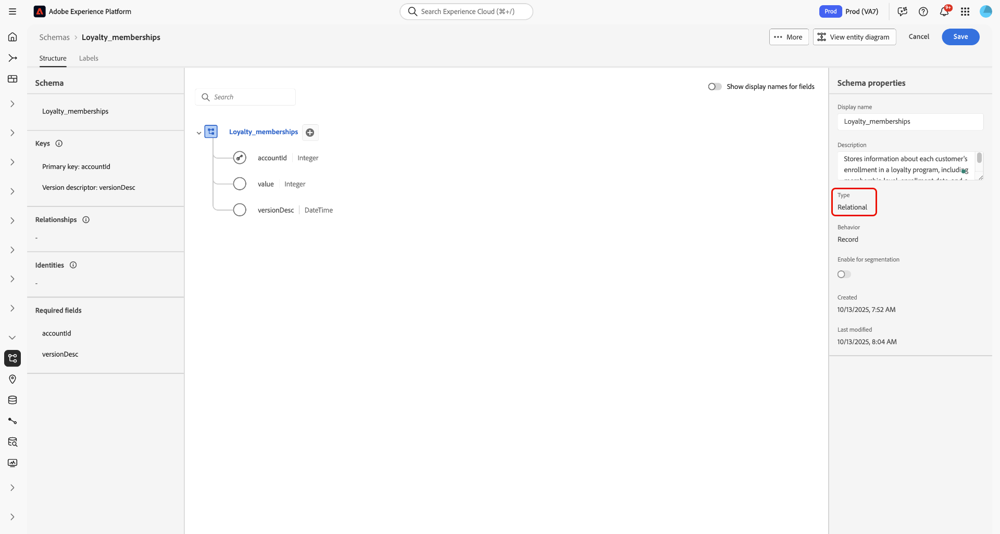
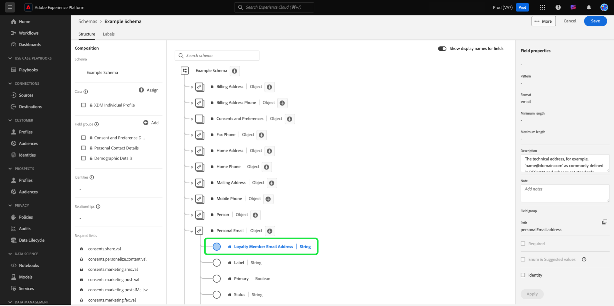

# UI でのスキーマの作成と編集 {#create-edit-schemas-in-ui}

このガイドでは、Adobe Experience Platform UI で組織の Experience Data Model （XDM）スキーマを作成、編集、管理する方法の概要について説明します。

>[!IMPORTANT]
>
>XDM スキーマは非常にカスタマイズ可能なので、スキーマの作成に必要な手順は、スキーマで取得するデータの種類によって異なる場合があります。 そのため、このドキュメントでは、UI でスキーマを使用して実行できる基本的なインタラクションのみを扱い、クラス、スキーマフィールドグループ、データタイプ、フィールドのカスタマイズなど、関連する手順は除外します。
>
>スキーマ作成プロセスの完全なツアーについては、[&#x200B; スキーマ作成チュートリアル &#x200B;](../../tutorials/create-schema-ui.md) に従って、完全なサンプルスキーマを作成し、[!DNL Schema Editor] の多くの機能を理解してください。

## 前提条件 {#prerequisites}

このガイドでは、XDM システムに関する十分な知識が必要です。 Experience Platform エコシステムにおける XDM の役割の概要については [XDM の概要 &#x200B;](../../home.md) を、スキーマの構築方法の概要については [&#x200B; スキーマ構成の基本 &#x200B;](../../schema/composition.md) を参照してください。

## 新しいスキーマの作成 {#create}

[!UICONTROL Schemas] ワークスペースで、右上隅の [**[!UICONTROL Create schema]**] を選択します。「スキーマタイプを選択」ドロップダウンメニューが開き、[!UICONTROL Standard] または [!UICONTROL Relational] スキーマのオプションが表示されます。

![スキーマワークスペース [!UICONTROL Create Schema] が強調表示され、[スキーマタイプの選択] ドロップダウンが表示されます](../../images/ui/resources/schemas/create-schema.png)。

## リレーショナルスキーマを作成 {#create-relational-schema}

>[!AVAILABILITY]
>
>データミラーおよびリレーショナルスキーマは、Adobe Systems Journey Optimizer **オーケストレーションされたキャンペーン** ライセンス版ホルダーが使用できます。 また、ライセンス版と機能の有効化に応じて、Customer Journey Analyticsユーザー向けの **限定リリース** としても利用できます。 アクセスについては、Adobe担当者にお問い合わせください。

>[!NOTE]
>
>リレーショナルスキーマは、以前はAdobe Experience Platform ドキュメントの以前のバージョンで、モデルベースのスキーマと呼ばれていました。

レコードをきめ細かく制御できる、構造化されたリレーショナルスタイルのスキーマを定義する場合は、「**[!UICONTROL Relational]**」を選択します。 リレーショナルスキーマは、プライマリキーの適用、レコードレベルのバージョン管理、プライマリキーと外部キーを介したスキーマレベルの関係をサポートしています。 また、CHANGE DATA CAPTURE を使用した増分取り込みに最適化されており、Campaign オーケストレーション、Data Distiller、B2B の実装で使用される複数のデータモデルもサポートされています。

詳しくは、[Data Mirror](../../data-mirror/overview.md) または [&#x200B; リレーショナルスキーマ &#x200B;](../../schema/relational.md) の概要を参照してください。

### 手動で作成 {#create-manually}

>[!AVAILABILITY]
>
>DDL ファイルのアップロードは、Adobe Journey Optimizer Orchestrated Campaign のライセンス所有者のみが使用できます。 UI の表示が異なる場合があります。

**[!UICONTROL Create a relational schema]** ダイアログが表示されます。 **[!UICONTROL Create manually]** または [**[!UICONTROL Upload DDL file]**](#upload-ddl-file) を選択して、スキーマ構造を定義できます。

**[!UICONTROL Create a relational schema]** ダイアログで、[**[!UICONTROL Create manually]**] を選択し、[**[!UICONTROL Next]**] を選択します。

**[!UICONTROL Relational schema details]** ページが表示されます。 スキーマの表示名と説明（オプション）を入力し、「**[!UICONTROL Finish]**」を選択してスキーマを作成します。

![[!UICONTROL Schema display name]、[!UICONTROL Description]、[!UICONTROL Finish] がハイライト表示されたリレーショナルスキーマの詳細ビュー &#x200B;](../../images/ui/resources/schemas/relational-details.png)

スキーマエディターが開き、スキーマ構造を定義するための空のキャンバスが表示されます。 通常どおりフィールドを追加できます。

#### バージョン識別子フィールドを追加 {#add-version-identifier}

バージョントラッキングを有効にし、チェンジデータキャプチャをサポートするには、スキーマでバージョン識別子フィールドを指定する必要があります。 スキーマエディターで、プラス（)スキーマアイコンをクリックして、新しいフィールドを追加します。

`updateSequence` などのフィールド名を入力し、**[!UICONTROL DateTime]** または **[!UICONTROL Number]** のデータタイプを選択します。

右側のパネルで「**[!UICONTROL Version Identifier]**」チェックボックスを有効にし、「**[!UICONTROL Apply]**」を選択してフィールドを確定します。

>[!IMPORTANT]
>
>リレーショナルスキーマには、レコードレベルのアップデートとチェンジ データキャプチャの取り込みをサポートするバージョン識別子フィールドを含める必要があります。

リレーションシップを定義するには、スキーマ エディターで [ **[!UICONTROL Add Relationship]** ] を選択して、スキーマ レベルの主キーと外部キーの関係を作成します。 詳しくは、 [スキーマレベル関係の追加](../../tutorials/relationship-ui.md#relationship-field) チュートリアルを参照してください。

次へ、 [主キーの定義](../fields/identity.md#define-a-identity-field)に進み、必要に応じて [フィールドを追加する](#add-field-groups) 。 Experience Platform ソースで変更データ キャプチャを有効にする方法については、「 [変更データ キャプチャ取得 ガイド](../../../sources/tutorials/api/change-data-capture.md)」を参照してください。

>[!NOTE]
>
>保存すると、[!UICONTROL Type]サイドバーの[!UICONTROL &#x200B; Schema properties]フィールドに、これが[!UICONTROL Relational]スキーマであることが示されます。これは、スキーマ在庫表示の詳細サイドバーにも示されます。
>

### DDL ファイルのアップロード {#upload-ddl-file}

>[!AVAILABILITY]
>
>DDL ファイルアップロードは、Adobe Systems Journey Optimizer Orchestrated キャンペーン ライセンス版ホルダーのみ使用できます。

このワークフローを使用して、DDL ファイルをアップロードしてスキーマを定義します。 [ **[!UICONTROL Create a relational schema]** ] ダイアログで [ **[!UICONTROL Upload DDL file]**] を選択し、システムからローカル DDL ファイルをドラッグするか、[ **[!UICONTROL Choose files]**] を選択します。 Experience Platform はスキーマを検証し、ファイルのアップロードが成功した場合は緑色のチェックマークを表示します。 [ **[!UICONTROL Next]** ] を選択して、アップロードを確認します。

![リレーショナルスキーマダイアログ作成、 [!UICONTROL Upload DDL file] が選択され、 [!UICONTROL Next] 強調表示されます。](../../images/ui/resources/schemas/upload-ddl-file.png)

[!UICONTROL Select entities and fields to import]ダイアログが表示され、スキーマをプレビューできます。スキーマ構造を確認し、ラジオ ボタンとチェック ボックスを使用して、各エンティティに主キーとバージョン識別子が指定されていることを確認します。

>[!IMPORTANT]
>
>テーブル構造には、 **主キー** と **バージョン識別子** (datetime 型または数値型の `updateSequence` フィールドなど) が含まれている必要があります。
>
>変更データ キャプチャ 取得では、増分処理を有効にするために、文字列型の `_change_request_type` という名前の特別な列も必要です。 このフィールドは、データ変更の種類を示します (たとえば、  `u` (アップサート) または `d` (削除))。

取得中に必要ですが、 `_change_request_type` などのコントロール列はスキーマに格納されず、最終的なスキーマ構造には表示されません。 すべて問題がなければ、[ **[!UICONTROL Done]** ] を選択してスキーマを作成します。

>[!NOTE]
>
>DDL アップロードでサポートされる最大ファイル サイズは 10 MB です。

![リレーショナルスキーマレビュー表示、インポートされたフィールドが表示され、 [!UICONTROL Finish] 強調表示されます。](../../images/ui/resources/schemas/entities-and-files-to-inport.png)

スキーマエディターでスキーマが開き、保存する前に構造を調整できます。

次へ、必要に応じて [フィールドの追加](#add-field-groups)、および [スキーマレベルのリレーションの追加](../../tutorials/relationship-ui.md#relationship-field) に進みます。

Experience Platform ソースで変更データ キャプチャを有効にする方法については、「 [変更データ キャプチャ取得 ガイド](../../../sources/tutorials/api/change-data-capture.md)」を参照してください。

## スキーマ作成標準 {#standard-based-creation}

「スキーマタイプを選択」ドロップダウンメニューから「標準スキーマタイプ」を選択すると、[!UICONTROL Create a schema] のダイアログが表示されます。 このダイアログでは、フィールドとフィールドグループを追加して手動でスキーマを作成するか、CSV ファイルをアップロードして ML アルゴリズムを使用してスキーマを生成するかを選択できます。 ダイアログからスキーマ作成ワークフローを選択します。

### [!BADGE Beta]{type=Informative} 手動または ML で支援されたスキーマの作成 {#manual-or-assisted}

ML アルゴリズムを使用して、CSV ファイルに基づいてスキーマ構造をレコメンデーションする方法については、[&#x200B; 機械学習を利用したスキーマ作成ガイド &#x200B;](../ml-assisted-schema-creation.md) を参照してください。 この UI ガイドは、手動作成ワークフローを中心としています。

### 手動でのスキーマ作成 {#manual-creation}

[!UICONTROL Create schema] ワークフローが表示されます。 スキーマの基本クラスを選択するには、「**[!UICONTROL Individual Profile]**」、「**[!UICONTROL Experience Event]**」または「**[!UICONTROL Other]**」を選択し、続いて「**[!UICONTROL Next]**」を選択して選択内容を確認します。 これらのクラスについて詳しくは、[[!UICONTROL XDM individual profile]](../../classes/individual-profile.md) および [[!UICONTROL XDM ExperienceEvent]](../../classes/experienceevent.md) のドキュメントを参照してください。

![3 つのクラスオプションと [!UICONTROL Create schema] がハイライト表示された [!UICONTROL Next] ワークフロー &#x200B;](../../images/ui/resources/schemas/schema-class-options.png)

**[!UICONTROL Other]** を選択すると、使用可能なクラスのリストが表示されます。 ここから、既存のクラスを参照およびフィルタリングできます。

![[!UICONTROL Create schema] のセクションで [!UICONTROL Other] がハイライト表示されている [!UICONTROL Schema details] ワークフロー &#x200B;](../../images/ui/resources/schemas/other-schema-details.png)

カスタムクラスと標準クラスのどちらかに基づいてクラスをフィルタリングするラジオボタンを選択します。 また、業界に基づいて利用可能な結果をフィルタリングしたり、[検索] フィールドを使用して特定のクラスの検索したりすることもできます。

![[!UICONTROL Create schema]ワークフロー、検索バー、[!UICONTROL Custom]および[!UICONTROL Industries]が強調表示されます。](../../images/ui/resources/schemas/filter-and-search.png)

適切なクラスを決定するのに役立つように、各クラスの情報アイコンとプレビューアイコンがあります。 情報アイコン() をクリックすると、関連付けられているクラスと業種の説明を提供するダイアログが開きます。

プレビューアイコン（）を選択すると、スキーマ図とそのプロパティを含むクラスのプレビューダイアログが開きます。

任意の行を選択してクラスを選択し、「**[!UICONTROL Next]**」を選択して選択内容を確定します。

![&#x200B; 使用可能なクラスのテーブルから選択されたクラスがハイライト表示され [!UICONTROL Create schema] いる [!UICONTROL Next] ワークフロー &#x200B;](../../images/ui/resources/schemas/select-class.png)

クラスを選択すると、「[!UICONTROL Name and review]」セクションが表示されます。 このセクションでは、スキーマを識別するための名前と説明を指定します。&#x200B;キャンバスにスキーマの基本構造（クラスによって提供される）が表示され、選択したクラスとスキーマ構造を確認できます。

テキストフィールドにわかりやすい [!UICONTROL Schema display name] を入力します。 次へ、スキーマの特定に役立つ適切な説明を入力します。 スキーマ構造を確認し、設定に満足したら、[ **[!UICONTROL Finish]** ] を選択してスキーマを作成します。

![[!UICONTROL Name and review]の[!UICONTROL Create schema]セクションワークフロー、[!UICONTROL Schema display name]、[!UICONTROL Description]および[!UICONTROL Finish]が強調表示されます。](../../images/ui/resources/schemas/name-and-review.png)

スキーマエディターが表示され、キャンバスにスキーマの構造が表示されます。 必要に応じて、[&#x200B; クラスへのフィールドの追加 &#x200B;](../../ui/resources/classes.md#add-fields) を開始できます。

## 既存のスキーマの編集 {#edit}

>[!NOTE]
>
>スキーマを保存してデータ取り込みに使用すると、スキーマに追加の変更を加えることのみ可能です。 詳しくは、[&#x200B; スキーマ進化のルール &#x200B;](../../schema/composition.md#evolution) を参照してください。

既存のスキーマを編集するには、「**[!UICONTROL Browse]**」タブを選択してから、編集するスキーマの名前を選択します。 検索バーを使用して、使用可能なオプションのリストを絞り込むこともできます。

>[!TIP]
>
>ワークスペースの検索機能とフィルター機能を使用すると、スキーマを見つけやすくなります。 詳しくは、[XDM リソースの調査 &#x200B;](../explore.md) に関するガイドを参照してください。

スキーマを選択すると、キャンバスにスキーマの構造が表示された [!DNL Schema Editor] が表示されます。 スキーマが使用している場合は、スキーマへの [&#x200B; フィールドグループの追加 &#x200B;](#add-field-groups) または [&#x200B; 個々のフィールドの追加 &#x200B;](#add-individual-fields) これらのグループから）、[&#x200B; フィールド表示名の編集 &#x200B;](#display-names) または [&#x200B; 既存のカスタムフィールドグループの編集 &#x200B;](./field-groups.md#edit) を実行できるようになりました。

## その他のアクション {#more}

スキーマ エディター内では、クイック アクションを実行して、スキーマの JSON 構造をコピーしたり、Real-時間 Customer プロフィール に対して有効になっていない場合やデータセットが関連付けられている場合はスキーマを削除したりすることもできます。 ビューの上部にある「[!UICONTROL More]」を選択すると、クイックアクションを含むドロップダウンが表示されます。

JSON 構造をコピー機能を使用すると、スキーマとデータパイプラインを作成している間、サンプルペイロードがどのように見えるかを確認できます。 これは、ID マップなど、スキーマ内に複雑なオブジェクトマップ構造がある場合に特に便利です。

## 表示名の切替 {#display-name-toggle}

便宜上、スキーマ エディターには、元のフィールド名と人間が読みやすい表示名を切り替えるための切り替えが用意されています。 この柔軟性により、フィールドの検出性が向上し、スキーマを編集できます。切り替えトグルは、スキーマエディター表示の右上にあります。

>[!NOTE]
>
>フィールド名から表示名への変更は純粋に表面的なものであり、ダウンストリーム リソースは変更されません。

![[!UICONTROL Show display names for fields] がハイライト表示されたスキーマエディター &#x200B;](../../images/ui/resources/schemas/display-name-toggle.png)

標準フィールドグループの表示名はシステムで生成されますが、[&#x200B; 表示名 &#x200B;](#display-names) の節で説明されているようにカスタマイズできます。 表示名は、マッピングやデータセットのプレビューを含む、複数の UI 表示に反映されます。 デフォルト設定はオフで、フィールド名は元の値で表示されます。

## フィールドグループをスキーマに追加 {#add-field-groups}

>[!NOTE]
>
>ここでは、既存のフィールドグループをスキーマに追加する方法について説明します。 新しいカスタムフィールドグループを作成する場合は、 [フィールドグループの作成と編集](./field-groups.md#create) のガイドを参照してください。

[!DNL Schema Editor]内でスキーマを開いたら、フィールド グループを使用してスキーマにフィールドを追加できます。開始するには、左側のパネルにある&#x200B;**[!UICONTROL Add]**&#x200B;の横にある&#x200B;**[!UICONTROL Field groups]**&#x200B;を選択します。

![スキーマエディターに[!UICONTROL Add]セクションの[!UICONTROL Field groups]がハイライト表示されます。](../../images/ui/resources/schemas/add-field-group-button.png)

ダイアログが表示され、スキーマに対して選択できる項目グループのリストが表示されます。 フィールド グループは 1 つのクラスとのみ互換性があるため、スキーマ選択したクラスに関連付けられているフィールド グループのみが一覧表示されます。 既定では、一覧表示されたフィールド グループは、組織内での使用頻度に基づいて並べ替えられます。

![[!UICONTROL Add field groups]ダイアログがハイライト表示され、[!UICONTROL Popularity]列がハイライト表示されます。](../../images/ui/resources/schemas/field-group-popularity.png)

追加する項目の一般アクティビティまたは事業領域がわかっている場合は、左側のパネルで 1 つ以上の業種カテゴリを選択して、表示される項目グループのリストをフィルタします。

![[!UICONTROL Add field groups]ダイアログがハイライト表示され、[!UICONTROL Industry]フィルターと[!UICONTROL Industry]列がハイライト表示されます。](../../images/ui/resources/schemas/industry-filter.png)

>[!NOTE]
>
>XDMの業界固有のデータモデリングのベストプラクティスの詳細については、 [業界データモデル](../../schema/industries/overview.md)に関するドキュメントを参照してください。

また、検索バーを使用して、目的のフィールドグループを見つけることもできます。 クエリと名前が一致するフィールドグループがリストの上部に表示されます。 **[!UICONTROL Standard Fields]** の下に、目的のデータ属性を説明するフィールドを含むフィールドグループが表示されます。

![[!UICONTROL Add field groups] 検索機能がハイライト表示された [!UICONTROL Standard fields] ダイアログ &#x200B;](../../images/ui/resources/schemas/field-group-search.png)

スキーマに追加するフィールドグループ名の横にあるチェックボックスをオンにします。 リストから複数のフィールドグループを選択でき、選択した各フィールドグループが右側のパネルに表示されます。

![&#x200B; チェックボックス選択機能がハイライト表示された [!UICONTROL Add field groups] ダイアログ &#x200B;](../../images/ui/resources/schemas/add-field-group.png)

>[!TIP]
>
>リストに表示されたフィールドグループの場合、情報アイコン（）にポインタを合わせるかフォーカスを合わせると、フィールドグループが取得するデータの種類の簡単な説明が表示されます。 また、プレビューアイコン（）を選択して、フィールドグループが提供するフィールドの構造を表示してから、スキーマに追加することもできます。

フィールドグループを選択したら、「**[!UICONTROL Add field groups]**」を選択して、スキーマに追加します。

![&#x200B; フィールドグループが選択されハイライト表示された [!UICONTROL Add field groups] ダイアログ [!UICONTROL Add field groups] 表示されます。](../../images/ui/resources/schemas/add-field-group-finish.png)

キャンバスに表された、フィールドグループが提供するフィールドと共に [!DNL Schema Editor] が再び表示されます。

![&#x200B; スキーマの例が表示された [!DNL Schema Editor]。](../../images/ui/resources/schemas/field-groups-added.png)

>[!NOTE]
>
>スキーマエディター内では、標準（Adobeが生成した）クラスおよびフィールドグループは、南京錠アイコン 。南京錠は、クラスまたはフィールドグループ名の横の左側のパネルに表示されるほか、システム生成リソースの一部であるスキーマ図のフィールドの横にも表示されます。
>
>

フィールド グループをスキーマに追加した後、必要に応じて、必要に応じて [既存のフィールドを削除](#remove-fields) したり、新しいカスタム フィールドを [追加](#add-fields) したりできます。

### フィールドグループから追加されたフィールド削除 {#remove-fields}

フィールドグループをスキーマに追加したら、フィールドグループからグローバルにフィールドを削除したり、現在のスキーマからローカルにフィールドを非表示にしたりできます。 意図しないスキーマの変更を回避するには、これらのアクションの違いを理解することが重要です。

>[!IMPORTANT]
>
>「**[!UICONTROL Remove]**」を選択すると、フィールドグループ自体からフィールドが削除され、そのフィールドグループを使用する *すべて* スキーマに影響を与えます。
>**フィールドグループを含むすべてのスキーマからフィールドを削除する** 場合を除き、このオプションを使用しないでください。

フィールドグループからフィールドを削除するには、キャンバスでフィールドを選択し、右側のパネルで「**[!UICONTROL Remove]**」を選択します。 この例では、`taxId` グループの **[!UICONTROL Demographic Details]** フィールドを示しています。

![[!DNL Schema Editor] がハイライト表示された [!UICONTROL Remove]。 この操作により、単一のフィールドが削除されます。](../../images/ui/resources/schemas/remove-single-field.png)

フィールドグループ自体から削除せずにスキーマから複数のフィールドを非表示にするには、**[!UICONTROL Manage related fields]** オプションを使用します。 キャンバスでグループから任意のフィールドを選択し、右側のパネルで「**[!UICONTROL Manage related fields]**」を選択します。

![[!DNL Schema Editor]が強調表示された[!UICONTROL Manage related fields]。](../../images/ui/resources/schemas/manage-related-fields.png)

フィールドグループの構造を示すダイアログが表示されます。 チェックボックスを使用して、含めるフィールドを選択または選択解除します。

![[!UICONTROL Manage related fields]ダイアログで選択したフィールドと[!UICONTROL Confirm]がハイライト表示されます。](../../images/ui/resources/schemas/select-fields.png)

「**[!UICONTROL Confirm]**」を選択してキャンバスを更新し、選択したフィールドを反映します。

### フィールドを削除または非推奨（廃止予定）にする際のフィールドの動作 {#field-removal-deprecation-behavior}

次の表を使用して、各アクションの範囲を理解します。

| アクション | 現在のスキーマにのみ適用されます | フィールドグループを変更 | 他のスキーマに影響します | 説明 |
|--------------------------|--------------------------------|----------------------|-----------------------|-------------|
| **削除フィールド** | × | ○ | ○ | フィールドグループからフィールドを削除します。 これにより、そのグループを使用するすべてのスキーマから削除されます。 |
| **関連フィールドの管理** | ○ | × | × | 現在のスキーマからのみフィールドを非表示にします。 フィールドグループは変更されません。 |
| **フィールドを廃止** | × | ○ | ○ | フィールドグループで、フィールドを非推奨としてマークします。 どのスキーマでも使用できなくなります。 |

>[!NOTE]
>
>この動作は、レコードベースのスキーマとイベントベースのスキーマの両方で一貫しています。

### カスタムフィールドをフィールドグループ追加 {#add-fields}

スキーマにフィールド グループを追加した後、そのグループの追加フィールドを定義できます。 ただし、1 つのスキーマでグループフィールドに追加されたフィールドは、同じフィールドグループを使用する他のすべてのスキーマにも表示されます。

さらに、ユーザー設定フィールドが標準フィールド グループに追加された場合、そのフィールド グループはユーザー設定フィールド グループに変換され、元の標準フィールド グループは使用できなくなります。

カスタムフィールドを標準フィールドグループに追加する場合は、以下の [セクション](#custom-fields-for-standard-groups) で具体的な手順を参照してください。 カスタムフィールドグループにフィールドを追加する場合は、フィールドグループUIガイドの [カスタムフィールドグループの編集](./field-groups.md) のセクションを参照してください。

既存のフィールド グループを変更しない場合は、 [新しいカスタム フィールド グループを作成](./field-groups.md#create) して、代わりに追加のフィールドを定義できます。

## スキーマへの個々のフィールドの追加 {#add-individual-fields}

特定の使用例でフィールドグループ全体を追加したくない場合は、スキーマエディターを使用して、個々のフィールドをスキーマに直接追加できます。 代わりに [&#x200B; 標準フィールドグループから個々のフィールドを追加する &#x200B;](#add-standard-fields) または [&#x200B; 独自のカスタムフィールドを追加する &#x200B;](#add-custom-fields) ことができます。

>[!IMPORTANT]
>
>スキーマエディターの機能を使用すると、個々のフィールドをスキーマに直接追加できますが、XDM スキーマのすべてのフィールドがそのクラスまたはクラスと互換性のあるフィールドグループによって提供される必要があるという事実は変更されません。 以下の節で説明するように、個々のフィールドはすべて、スキーマに追加される際の重要な手順として、引き続きクラスまたはフィールドグループに関連付けられます。

### 標準フィールドを追加 {#add-standard-fields}

標準フィールドグループからスキーマに直接フィールドを追加でき、対応するフィールドグループを事前に知る必要はありません。 標準フィールドをスキーマに追加するには、キャンバスでスキーマ名の横にあるプラス（**+**）アイコンを選択します。 スキーマ構造に **[!UICONTROL Untitled Field]** プレースホルダーが表示されます。また、右側のパネルが更新されて、フィールドを設定するためのコントロールが表示されます。

「**[!UICONTROL Field name]**」の下で、追加するフィールドの名前の入力を開始します。 クエリに一致する標準フィールドが自動的に検索され、属するフィールドグループを含め、**[!UICONTROL Recommended Standard Fields]** の下にリストされます。

一部の標準フィールドは同じ名前を共有しますが、構造は元のフィールドグループによって異なる場合があります。 標準フィールドがフィールドグループ構造内の親オブジェクト内にネストされている場合、子フィールドが追加されると、親フィールドもスキーマに含まれます。

標準フィールドの横にあるプレビューアイコン () を選択して、フィールド グループの構造を表示し、入れ子の方法をよりよく理解します。 標準フィールドをスキーマに追加するには、プラス アイコン () を選択します。

キャンバスが更新され、スキーマに追加された標準フィールド (フィールドグループ構造内でネストされている親フィールドを含む) が表示されます。 フィールドグループの名前も、左パネルの **[!UICONTROL Field groups]** の下に表示されます。 同じフィールドグループからさらにフィールドを追加する場合は、右側のパネルで [ **[!UICONTROL Manage related fields]** ] を選択します。

### カスタムフィールドを追加 {#add-custom-fields}

標準項目のワークフローと同様に、独自のカスタム項目をスキーマに直接追加することもできます。

スキーマのルートレベルにフィールドを追加するには、キャンバスでスキーマの名前の横にあるプラス (**+**) アイコンを選択します。 スキーマ構造に **[!UICONTROL Untitled Field]** プレースホルダーが表示され、右側のパネルが更新されて、フィールドを構成するためのコントロールが表示されます。

開始追加するフィールドの名前を入力すると、システムは自動的に一致する標準フィールドの検索を開始します。 代わりに新しいカスタム フィールドを作成するには、最上位のオプションに **([!UICONTROL New Field])** が追加されます。

フィールドの表示名とデータ型を指定したら、次の手順では、フィールドを親XDMリソースに割り当てます。 スキーマでカスタム クラスを使用している場合は、代わりに [割り当てられたクラスにフィールドを追加する](#add-to-class) か、 [フィールド グループ](#add-to-field-group) を選択できます。 ただし、スキーマで標準クラスを使用している場合は、ユーザー設定フィールドをフィールド グループにのみ割り当てることができます。

#### フィールドをカスタムフィールドグループに割り当てる {#add-to-field-group}

>[!NOTE]
>
>このセクションでは、フィールドをユーザー設定フィールドグループに割り当てる方法についてのみ説明します。 代わりに新しいカスタムフィールドで標準フィールドグループを拡張する場合は、 [標準フィールドグループへのカスタムフィールドの追加](#custom-fields-for-standard-groups)のセクションを参照してください。

[ **[!UICONTROL Assign to]**] で [ **[!UICONTROL Field Group]**] を選択します。 スキーマで標準クラスを使用する場合、これが唯一の利用可能なオプションであり、デフォルトで選択されています。

次に、関連付ける新規フィールドのフィールドグループを選択する必要があります。 提供されたテキスト入力でフィールドグループの名前を入力し始めます。 入力と一致する既存のカスタムフィールドグループがある場合は、ドロップダウンリストに表示されます。 または、一意の名前を入力して、新しいフィールドグループを作成することもできます。

>[!WARNING]
>
>既存のカスタム フィールド グループを選択した場合、そのフィールド グループを使用する他のスキーマも、変更を保存した後に新しく追加されたフィールドを継承します。 このため、既存のフィールドグループを選択するのは、このタイプの伝搬が必要な場合だけです。 それ以外の場合は、代わりに新しいカスタムフィールドグループを作成する必要があります。

リストからフィールド グループを選択したら、[ **[!UICONTROL Apply]**] を選択します。

新しいフィールドがキャンバスに追加され、標準の XDM フィールドとの競合を避けるために、 [テナント ID](../../api/getting-started.md#know-your-tenant_id) の下に名前空間が付けられます。 新しいフィールドを関連付けたフィールドグループは、左側のパネルの「**[!UICONTROL Field groups]**」にも表示されます。

>[!NOTE]
>
>選択したカスタムフィールドグループによって提供される残りのフィールドは、デフォルトでスキーマから削除されます。 これらのフィールドの一部をスキーマに追加する場合は、グループに属するフィールドを選択し、右側のパネルで「**[!UICONTROL Manage related fields]**」を選択します。

#### フィールドをカスタムクラスに割り当てる {#add-to-class}

「**[!UICONTROL Assign to]**」で、「**[!UICONTROL Class]**」を選択します。 以下の入力フィールドは、現在のスキーマのカスタム クラスの名前に置き換えられ、新しいフィールドがこのクラスに割り当てられることを示します。

![新しいフィールド割り当てに対して選択する [!UICONTROL Class] オプション。](../../images/ui/resources/schemas/assign-field-to-class.png)

必要に応じてフィールドの設定続行し、終了したら「 **[!UICONTROL Apply]** 」を選択します。

![[!UICONTROL Apply] が新しいフィールド用に選択される。](../../images/ui/resources/schemas/assign-field-to-class-apply.png)

新しいフィールドがキャンバスに追加され、標準の XDM フィールドとの競合を避けるために、 [テナント ID](../../api/getting-started.md#know-your-tenant_id) の下に名前空間が付けられます。 左側のパネルでクラス名を選択すると、クラスの構造の一部として新しいフィールドが表示されます。

### カスタム項目を標準項目グループの構造に追加する {#custom-fields-for-standard-groups}

作業中のスキーマに標準項目グループによって提供されるオブジェクト種別項目がある場合は、その標準オブジェクトに独自のカスタム項目を追加できます。

>[!WARNING]
>
>1 つのスキーマでグループフィールドに追加されたフィールドは、同じフィールド グループを使用する他のすべてのスキーマにも表示されます。 さらに、ユーザー設定フィールドが標準フィールド グループに追加された場合、そのフィールド グループはユーザー設定フィールド グループに変換され、元の標準フィールド グループは使用できなくなります。
>
>この機能のベータ版に参加した場合は、以前にカスタマイズした標準項目グループを通知するダイアログが表示されます。 **[!UICONTROL Acknowledge]**&#x200B;を選択すると、一覧表示されたリソースがユーザー設定フィールド グループに変換されます。
>
>

開始するには、標準フィールドグループによって提供されるオブジェクトのルートの横にあるプラス (**+**) アイコンを選択します。

標準フィールドグループ変換するかどうかを確認する警告メッセージが表示されます。 **[!UICONTROL Continue creating field group]**&#x200B;を選択して続行します。

キャンバスが再び表示され、新しいフィールドには名称未設定のプレースホルダーが表示されます。 標準フィールドグループの名前に「（[!UICONTROL Extended]）」が追加され、元のバージョンから変更されたことを示しています。 ここから、右側のパネルのコントロールを使用してフィールドのプロパティを定義します。

変更を適用すると、標準オブジェクト内のテナント ID 名前空間の下に新しいフィールドが表示されます。 このネストされた名前空間は、同じフィールドグループを使用する他のスキーマでの変更が壊れるのを防ぐために、フィールドグループ自体の中でのフィールド名の競合を防ぎます。

## リアルタイム顧客プロファイルのスキーマを有効にする {#profile}

>[!CONTEXTUALHELP]
>id="platform_schemas_enableforprofile"
>title="プロファイルのスキーマを有効にする"
>abstract="スキーマがプロファイルで有効になっている場合、このスキーマから作成されたデータセットは、異なるソースからのデータを結合して構築した各顧客の全体像である、リアルタイムの顧客プロファイルの構築に関与します。スキーマを使用してプロファイルにデータを取り込むと、そのスキーマを無効にすることはできなくなります。詳しくは、ドキュメントを参照してください。"

[&#x200B; リアルタイム顧客プロファイル &#x200B;](../../../profile/home.md) は、異なるソースのデータを結合して、個々の顧客の完全なビューを構築します。 スキーマで取得されたデータをこのプロセスに参加させる場合は、スキーマを [!DNL Profile] で使用できるようにする必要があります。

>[!IMPORTANT]
>
>スキーマの [!DNL Profile] を有効にするには、プライマリ ID フィールドが定義されている必要があります。 詳しくは、[ID フィールドの定義 &#x200B;](../fields/identity.md) に関するガイドを参照してください。

スキーマを有効にするには、まず、左側のパネルでスキーマの名前を選択し、次に、右側のパネルで「**[!UICONTROL Profile]**」切り替えスイッチを選択します。

ポップオーバーが表示され、スキーマを有効にして保存すると無効にできないことを警告します。 **[!UICONTROL Enable]**&#x200B;を選択して続行します。

[!UICONTROL Profile]切り替えが有効の状態でキャンバスが再表示されます。

>[!IMPORTANT]
>
>スキーマはまだ保存されていないため、スキーマを Real-時間 Customer プロフィールに参加させることに気が変わった場合、これは元に戻らないポイントです:有効なスキーマを保存すると、無効にすることはできません。 もう一度 [ **[!UICONTROL Profile]** ] トグルを選択すると、スキーマが無効になります。

プロセス終了には、「 **[!UICONTROL Save]** 」を選択してスキーマを保存します。

これで、スキーマ を Real-時間 Customer プロフィールで使用できるようになりました。 Experience Platformがこのスキーマに基づいてデータセットにデータを取り込むと、そのデータは統合されたプロフィールデータに組み込まれます。

## スキーマフィールドの表示名編集 {#display-names}

クラスを割り当て、フィールド グループをスキーマに追加すると、スキーマのフィールドが標準リソースまたはカスタム XDM リソースによって提供されているかどうかに関係なく、それらのフィールドの表示名を編集できます。

>[!NOTE]
>
>標準クラスまたは項目グループに属する項目の表示名は、特定のスキーマのコンテキストでのみ編集できることに注意してください。 つまり、あるスキーマで標準フィールドの表示名を変更しても、同じ関連クラスまたはフィールドグループを使用する他のスキーマには影響しません。
>
>スキーマのフィールドの表示名を変更すると、その変更は、そのスキーマに基づく既存のデータセットにすぐに反映されます。

フィールド名を表示名に変更するには、[ **[!UICONTROL Show display names for fields]**] を切り替えます。 スキーマフィールドの表示名を編集するには、キャンバスでフィールドを選択します。 右側のパネルで、「 **[!UICONTROL Display name]**」の下に新しい名前を入力します。

右側のパネルで **[!UICONTROL Apply]** を選択すると、キャンバスが更新され、フィールドの新しい表示名が表示されます。 **[!UICONTROL Save]**&#x200B;を選択して、変更内容をスキーマに適用します。

## スキーマのクラス変更 {#change-class}

スキーマが保存される前の初期作成プロセス中の任意の時点で、スキーマのクラスを変更できます。

>[!WARNING]
>
>スキーマのクラスの再割り当ては、細心の注意を払って行う必要があります。 フィールドグループは特定のクラスにのみ適合するので、クラスを変更すると、キャンバスと追加したフィールドがリセットされます。

クラスを再割り当てするには、キャンバスの左側にある **[!UICONTROL Assign]** を選択します。

使用可能なすべてのクラスのリストを表示するダイアログが表示されます。このリストには、組織で定義されているクラス（「[!UICONTROL Customer]」を持つ）と、Adobeで定義されている標準クラスが含まれます。

リストからクラスを選択して、その説明をダイアログの右側に表示します。 **[!UICONTROL Preview class structure]**&#x200B;を選択して、クラスに関連付けられているフィールドとメタデータを表示することもできます。**[!UICONTROL Assign class]**&#x200B;を選択して続行します。

新しいダイアログが開き、新しいクラスを割り当てるかどうかを確認するメッセージが表示されます。 [ **[!UICONTROL Assign]** ] を選択して確定します。

クラスの変更を確認すると、キャンバスがリセットされ、すべての構図の進行状況が失われます。

## 次の手順 {#next-steps}

このドキュメントでは、Experience Platform UI でスキーマを作成および編集する際の基本について説明しました。 カスタムフィールドグループや一意のユースケースのデータタイプの作成など、UI で完全なスキーマを構築するための包括的なワークフローについては、[&#x200B; スキーマ作成チュートリアル &#x200B;](../../tutorials/create-schema-ui.md) を確認することを強くお勧めします。

[!UICONTROL Schemas] workspace の機能について詳しくは、[[!UICONTROL Schemas] workspace の概要を参照してください &#x200B;](../overview.md)

[!DNL Schema Registry] API でスキーマを管理する方法については、[&#x200B; スキーマエンドポイントガイド &#x200B;](../../api/schemas.md) を参照してください。
