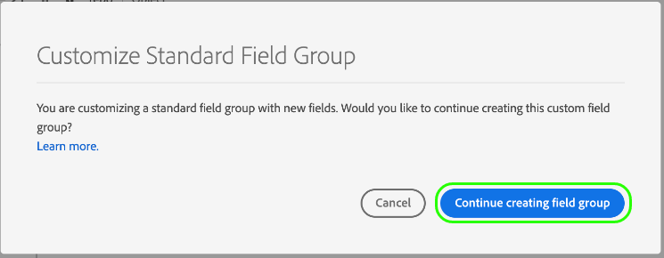

# UI でのスキーマの作成と編集 {#create-edit-schemas-in-ui}

このガイドでは、Adobe Experience Platform UI で組織の Experience Data Model （XDM）スキーマを作成、編集、管理する方法の概要について説明します。

>[!IMPORTANT]
>
>XDM スキーマは非常にカスタマイズ可能なので、スキーマの作成に必要な手順は、スキーマで取得するデータの種類によって異なる場合があります。 そのため、このドキュメントでは、UI でスキーマを使用して実行できる基本的なインタラクションのみを扱い、クラス、スキーマフィールドグループ、データタイプ、フィールドのカスタマイズなど、関連する手順は除外します。
>
>スキーマ作成プロセスの完全なツアーについては、を参照してください [スキーマ作成のチュートリアル](../../tutorials/create-schema-ui.md) 完全なサンプルスキーマを作成し、の多くの機能を理解するには [!DNL Schema Editor].

## 前提条件 {#prerequisites}

このガイドでは、XDM システムに関する十分な知識が必要です。 を参照してください。 [XDM の概要](../../home.md) を参照してください。Experience Platformエコシステム内での XDM の役割の概要および [スキーマ構成の基本](../../schema/composition.md) を参照してください。

## 新しいスキーマの作成 {#create}

>[!NOTE]
>
>この節では、UI で新しいスキーマを手動で作成する方法について説明します。 CSV データを Platform に取り込む場合は、以下を選択できます。 [ai で生成されたレコメンデーションで作成された XDM スキーマへのデータのマッピング](../../../ingestion/tutorials/map-csv/recommendations.md) （現在はベータ版）スキーマを手動で作成する必要はありません。

が含まれる [!UICONTROL スキーマ] ワークスペース、選択 **[!UICONTROL スキーマを作成]** 右上隅

![を使用したスキーマ ワークスペース [!UICONTROL スキーマを作成] ハイライト表示](../../images/ui/resources/schemas/create-schema.png)

この [!UICONTROL スキーマを作成] ワークフローが表示されます。 次のいずれかを選択することで、スキーマの基本クラスを選択できます **[!UICONTROL 個人プロファイル]**, **[!UICONTROL エクスペリエンスイベント]**、または **[!UICONTROL その他]**、続いて **[!UICONTROL 次]** をクリックして選択内容を確定します。 を参照してください。 [XDM 個人プロファイル](../../classes/individual-profile.md) および [XDM ExperienceEvent](../../classes/experienceevent.md) これらのクラスの詳細については、を参照してください。

![この [!UICONTROL スキーマを作成] 3 つのクラスオプションとを使用したワークフロー [!UICONTROL 次] ハイライト表示](../../images/ui/resources/schemas/schema-class-options.png)

クラスを選択すると、 [!UICONTROL 名前とレビュー] セクションが表示されます。 このセクションでは、スキーマを識別するための名前と説明を指定します。&#x200B;キャンバスにスキーマの基本構造（クラスによって提供される）が表示され、選択したクラスとスキーマ構造を確認できます。

人間に優しい [!UICONTROL スキーマの表示名] 「」テキストフィールドに入力します。 次に、スキーマの識別に役立つ適切な説明を入力します。 スキーマ構造をレビューし、設定に満足したら、次を選択します **[!UICONTROL 終了]** スキーマを作成します。

![この [!UICONTROL 名前とレビュー] の節 [!UICONTROL スキーマを作成] を使用したワークフロー [!UICONTROL スキーマの表示名], [!UICONTROL 説明]、および [!UICONTROL 終了] ハイライト表示](../../images/ui/resources/schemas/name-and-review.png)

この [!UICONTROL スキーマ] [!UICONTROL 参照] タブが表示されます。 最近作成したスキーマがスキーマライブラリに一覧表示され、で編集できるようになりました [!DNL Schema Editor].

## 既存のスキーマの編集 {#edit}

>[!NOTE]
>
>スキーマを保存してデータ取り込みに使用すると、スキーマに追加の変更を加えることのみ可能です。 を参照してください。 [スキーマ進化のルール](../../schema/composition.md#evolution) を参照してください。

既存のスキーマを編集するには、 **[!UICONTROL 参照]** タブをクリックし、編集するスキーマの名前を選択します。 検索バーを使用して、使用可能なオプションのリストを絞り込むこともできます。

>[!TIP]
>
>ワークスペースの検索機能とフィルター機能を使用すると、スキーマを見つけやすくなります。 のガイドを参照してください [xdm リソースの調査](../explore.md) を参照してください。

スキーマを選択すると、 [!DNL Schema Editor] は、キャンバスに表示されるスキーマの構造と共に表示されます。 これで、 [フィールドグループの追加](#add-field-groups) スキーマに追加（または [個々のフィールドの追加](#add-individual-fields) （これらのグループから）、 [フィールドの表示名の編集](#display-names)、または [既存のカスタムフィールドグループの編集](./field-groups.md#edit) スキーマで使用されている場合。

## その他のアクション {#more}

また、スキーマエディター内でクイックアクションを実行して、スキーマの JSON 構造をコピーしたり、リアルタイム顧客プロファイルが有効になっていない場合や関連付けられたデータセットがある場合はスキーマを削除したりできます。 を選択 [!UICONTROL 詳細] ビューの上部に、クイックアクションを含むドロップダウンを表示します。

JSON 構造をコピー機能を使用すると、スキーマとデータパイプラインを作成している間、サンプルペイロードがどのように見えるかを確認できます。 これは、ID マップなど、スキーマ内に複雑なオブジェクトマップ構造がある場合に特に便利です。

## 表示名の切替 {#display-name-toggle}

スキーマエディターでは、便宜上、元のフィールド名と、より人間が読み取り可能な表示名との間で変更する切替スイッチを提供しています。 この柔軟性により、フィールドの検出性が向上し、スキーマを編集できます。切替スイッチは、スキーマエディタービューの右上にあります。

>[!NOTE]
>
>フィールド名から表示名への変更は単なる表面的なもので、ダウンストリームリソースは変更されません。

![を使用したスキーマエディター [!UICONTROL フィールドの表示名を表示] ハイライト表示](../../images/ui/resources/schemas/display-name-toggle.png)

標準フィールドグループの表示名はシステムで生成されますが、の説明に従ってカスタマイズできます。 [表示名](#display-names) セクション。 表示名は、マッピングやデータセットのプレビューを含む、複数の UI 表示に反映されます。 デフォルト設定はオフで、フィールド名は元の値で表示されます。

## スキーマへのフィールドグループの追加 {#add-field-groups}

>[!NOTE]
>
>この節では、既存のフィールドグループをスキーマに追加する方法を説明します。 新しいカスタムフィールドグループを作成する場合は、のガイドを参照してください [フィールドグループの作成と編集](./field-groups.md#create) その代わり。

内でスキーマを開いたら [!DNL Schema Editor]の場合、フィールドグループを使用してスキーマにフィールドを追加できます。 開始するには、を選択します **[!UICONTROL 追加]** 次の **[!UICONTROL フィールドグループ]** 左パネルで。

![を使用したスキーマエディター [!UICONTROL 追加] から [!UICONTROL フィールドグループ] ハイライト表示されたセクション。](../../images/ui/resources/schemas/add-field-group-button.png)

ダイアログが表示され、スキーマに対して選択できるフィールドグループのリストが表示されます。 フィールドグループは 1 つのクラスにのみ適合するので、スキーマの選択されたクラスに関連付けられているフィールドグループのみが表示されます。 デフォルトでは、リストに表示されるフィールドグループは、組織内での使用率に基づいて並べ替えられます。

![この [!UICONTROL フィールドグループの追加] がハイライト表示されたダイアログ [!UICONTROL 人気度] 列がハイライト表示されました。](../../images/ui/resources/schemas/field-group-popularity.png)

追加するフィールドの一般的なアクティビティまたはビジネス領域がわかっている場合は、左側のパネルで 1 つ以上の業種カテゴリを選択して、表示されるフィールドグループのリストをフィルタリングします。

![この [!UICONTROL フィールドグループの追加] がハイライト表示されたダイアログ [!UICONTROL 業種] フィルターと [!UICONTROL 業種] 列がハイライト表示されました。](../../images/ui/resources/schemas/industry-filter.png)

>[!NOTE]
>
>XDM での業界固有のデータモデリングに関するベストプラクティスについて詳しくは、次のドキュメントを参照してください [業界のデータモデル](../../schema/industries/overview.md).

また、検索バーを使用して、目的のフィールドグループを見つけることもできます。 クエリと名前が一致するフィールドグループがリストの上部に表示されます。 次の下 **[!UICONTROL 標準フィールド]**、目的のデータ属性を説明するフィールドを含むフィールドグループが表示されます。

![この [!UICONTROL フィールドグループの追加] とのダイアログ [!UICONTROL 標準フィールド] ハイライト表示された検索機能。](../../images/ui/resources/schemas/field-group-search.png)

スキーマに追加するフィールドグループ名の横にあるチェックボックスをオンにします。 リストから複数のフィールドグループを選択でき、選択した各フィールドグループが右側のパネルに表示されます。

![この [!UICONTROL フィールドグループの追加] チェックボックス選択機能がハイライト表示されたダイアログ](../../images/ui/resources/schemas/add-field-group.png)

>[!TIP]
>
>リストされたフィールドグループの場合は、情報アイコン（）を選択して、フィールドグループが取得するデータの種類の簡単な説明を表示します。 プレビューアイコン（）を選択して、フィールドグループが提供するフィールドの構造を表示してから、スキーマに追加します。

フィールドグループを選択したら、 **[!UICONTROL フィールドグループの追加]** をクリックしてスキーマに追加します。

![この [!UICONTROL フィールドグループの追加] フィールドグループが選択され、 [!UICONTROL フィールドグループの追加] ハイライト表示](../../images/ui/resources/schemas/add-field-group-finish.png)

この [!DNL Schema Editor] キャンバスに表示される、フィールドグループで提供されたフィールドと共に再び表示されます。

![この [!DNL Schema Editor] スキーマの例が表示されています。](../../images/ui/resources/schemas/field-groups-added.png)

>[!NOTE]
>
>スキーマエディター内では、標準（Adobe生成）のクラスおよびフィールドグループは、南京錠アイコン（。南京錠は、クラスまたはフィールドグループ名の横の左側のパネルに表示されるほか、システム生成リソースの一部であるスキーマ図のフィールドの横にも表示されます。
>
>

フィールドグループをスキーマに追加した後、オプションで次の操作を実行できます [既存のフィールドを削除](#remove-fields) または [新しいカスタムフィールドを追加](#add-fields) 必要に応じて、これらのグループに追加します。

### フィールドグループから追加されたフィールドを削除 {#remove-fields}

フィールドグループをスキーマに追加した後、不要なフィールドを削除できます。

>[!NOTE]
>
>フィールドグループからフィールドを削除しても、作業中のスキーマにのみ影響し、フィールドグループ自体には影響しません。 1 つのスキーマのフィールドを削除しても、それらのフィールドは、同じフィールドグループを使用する他のすべてのスキーマで引き続き使用できます。

次の例では、標準フィールドグループです **[!UICONTROL 人口統計の詳細]** スキーマに追加されました。 単一のフィールド（例：）を削除するには `taxId`をクリックし、キャンバスでフィールドを選択して、を選択します **[!UICONTROL 削除]** 右側のパネルの

![この [!DNL Schema Editor] （を使用） [!UICONTROL 削除] ハイライト表示 この操作により、単一のフィールドが削除されます。](../../images/ui/resources/schemas/remove-single-field.png)

削除するフィールドが複数ある場合は、フィールドグループ全体を管理できます。 キャンバスでグループに属するフィールドを選択してから、を選択します **[!UICONTROL 関連フィールドを管理]** 右側のパネルの

![この [!DNL Schema Editor] （を使用） [!UICONTROL 関連フィールドを管理] ハイライト表示](../../images/ui/resources/schemas/manage-related-fields.png)

問題のフィールドグループの構造を示すダイアログが表示されます。 ここから、用意されているチェックボックスを使用して、必要なフィールドを選択または選択解除できます。 内容を確認して、 **[!UICONTROL 確認]**.

![この [!UICONTROL 関連フィールドを管理] 選択したフィールドとを含むダイアログ [!UICONTROL 確認] ハイライト表示](../../images/ui/resources/schemas/select-fields.png)

キャンバスが再び表示され、選択したフィールドのみがスキーマ構造に存在します。

### フィールドグループへのカスタムフィールドの追加 {#add-fields}

フィールドグループをスキーマに追加した後は、そのグループの追加フィールドを定義できます。 ただし、1 つのスキーマのフィールドグループに追加されたフィールドは、同じフィールドグループを使用する他のすべてのスキーマにも表示されます。

また、標準フィールドグループにカスタムフィールドが追加されると、そのフィールドグループはカスタムフィールドグループに変換され、元の標準フィールドグループは使用できなくなります。

標準フィールドグループにカスタムフィールドを追加する場合は、 [下のセクション](#custom-fields-for-standard-groups) （具体的な説明について）。 カスタムフィールドグループにフィールドを追加する場合は、の節を参照してください。 [カスタムフィールドグループの編集](./field-groups.md) フィールドグループ UI ガイドの「」。

既存のフィールドグループを変更しない場合は、次のことができます [新しいカスタムフィールドグループの作成](./field-groups.md#create) をクリックして、追加のフィールドを代わりに定義します。

## スキーマへの個々のフィールドの追加 {#add-individual-fields}

特定の使用例でフィールドグループ全体を追加したくない場合は、スキーマエディターを使用して、個々のフィールドをスキーマに直接追加できます。 次のことができます [標準フィールドグループからの個々のフィールドの追加](#add-standard-fields) または [独自のカスタムフィールドを追加](#add-custom-fields) その代わり。

>[!IMPORTANT]
>
>スキーマエディターの機能を使用すると、個々のフィールドをスキーマに直接追加できますが、XDM スキーマのすべてのフィールドがそのクラスまたはクラスと互換性のあるフィールドグループによって提供される必要があるという事実は変更されません。 以下の節で説明するように、個々のフィールドはすべて、スキーマに追加される際の重要な手順として、引き続きクラスまたはフィールドグループに関連付けられます。

### 標準フィールドを追加 {#add-standard-fields}

標準フィールドグループからスキーマに直接フィールドを追加でき、対応するフィールドグループを事前に知る必要はありません。 標準フィールドをスキーマに追加するには、プラス（**+**） アイコンが、キャンバスでスキーマ名の隣に表示されます。 An **[!UICONTROL 名称未設定フィールド]** プレースホルダーがスキーマ構造に表示されます。また、右側のパネルが更新されて、フィールドを設定するためのコントロールが表示されます。

次の下 **[!UICONTROL フィールド名]**&#x200B;追加するフィールドの名前の入力を開始します。 クエリに一致する標準フィールドが自動的に検索され、の下に一覧表示されます **[!UICONTROL 推奨標準フィールド]**（所属するフィールドグループを含む）。

一部の標準フィールドは同じ名前を共有しますが、構造は元のフィールドグループによって異なる場合があります。 標準フィールドがフィールドグループ構造内の親オブジェクト内にネストされている場合、子フィールドが追加されると、親フィールドもスキーマに含まれます。

プレビューアイコン（）を選択し、標準フィールドの横に表示して、フィールドグループの構造を確認し、ネストの方法をより深く理解します。 標準フィールドをスキーマに追加するには、プラスアイコン（）に設定します。

キャンバスが更新され、スキーマに追加された標準フィールドが表示されます。これには、フィールドグループ構造内にネストされた親フィールドも含まれます。 フィールドグループの名前は、の下にもリストされます。 **[!UICONTROL フィールドグループ]** 左パネルで。 同じフィールドグループからさらにフィールドを追加する場合は、 **[!UICONTROL 関連フィールドを管理]** 右側のパネルの

### カスタムフィールドを追加 {#add-custom-fields}

標準フィールドのワークフローと同様に、独自のカスタムフィールドをスキーマに直接追加することもできます。

スキーマのルートレベルにフィールドを追加するには、プラス（**+**） アイコンが、キャンバスでスキーマ名の隣に表示されます。 An **[!UICONTROL 名称未設定フィールド]** プレースホルダーがスキーマ構造に表示されます。また、右側のパネルが更新されて、フィールドを設定するためのコントロールが表示されます。

追加するフィールドの名前の入力を開始すると、一致する標準フィールドの検索が自動的に開始されます。 代わりに新しいカスタムフィールドを作成するには、が付加された上部のオプションを選択します **（[!UICONTROL 新しいフィールド]）**.

フィールドに表示名とデータタイプを指定したら、次にフィールドを親 XDM リソースに割り当てます。 スキーマでカスタムクラスを使用する場合は、次を選択できます [割り当てられたクラスにフィールドを追加](#add-to-class) または [フィールドグループ](#add-to-field-group) その代わり。 ただし、スキーマで標準クラスを使用している場合は、カスタムフィールドをフィールドグループに割り当てるだけです。

#### カスタムフィールドグループへのフィールドの割り当て {#add-to-field-group}

>[!NOTE]
>
>この節では、フィールドをカスタムフィールドグループに割り当てる方法についてのみ説明します。 標準フィールドグループを新しいカスタムフィールドで拡張する場合は、の節を参照してください [標準フィールドグループへのカスタムフィールドの追加](#custom-fields-for-standard-groups).

次の下 **[!UICONTROL 割り当て先]**&#x200B;を選択 **[!UICONTROL フィールドグループ]**. スキーマで標準クラスを使用する場合、これが唯一の利用可能なオプションであり、デフォルトで選択されています。

次に、関連付ける新規フィールドのフィールドグループを選択する必要があります。 提供されたテキスト入力でフィールドグループの名前を入力し始めます。 入力と一致する既存のカスタムフィールドグループがある場合は、ドロップダウンリストに表示されます。 または、一意の名前を入力して、新しいフィールドグループを作成することもできます。

>[!WARNING]
>
>既存のカスタムフィールドグループを選択すると、そのフィールドグループを使用する他のスキーマも、変更を保存した後で、新しく追加されたフィールドを継承します。 このため、このタイプの伝播が必要な場合は、既存のフィールドグループのみを選択します。 そうでない場合は、代わりに新しいカスタムフィールドグループを作成することを選択する必要があります。

リストからフィールドグループを選択したら、次を選択します。 **[!UICONTROL 適用]**.

新しいフィールドがキャンバスに追加され、の下に名前空間が設定されます。 [テナント ID](../../api/getting-started.md#know-your-tenant_id) 標準 XDM フィールドとの競合を避けるために使用します。 新しいフィールドを関連付けたフィールドグループも、の下に表示されます **[!UICONTROL フィールドグループ]** 左パネルで。

>[!NOTE]
>
>選択したカスタムフィールドグループによって提供される残りのフィールドは、デフォルトでスキーマから削除されます。 これらのフィールドの一部をスキーマに追加する場合は、グループに属するフィールドを選択してから、を選択します。 **[!UICONTROL 関連フィールドを管理]** 右側のパネルの

#### フィールドをカスタムクラスに割り当てる {#add-to-class}

次の下 **[!UICONTROL 割り当て先]**&#x200B;を選択 **[!UICONTROL クラス]**. の下の入力フィールドは、現在のスキーマのカスタムクラスの名前に置き換えられ、新しいフィールドがこのクラスに割り当てられることを示します。

![この [!UICONTROL クラス] 新しいフィールド割り当てにオプションを選択しています。](../../images/ui/resources/schemas/assign-field-to-class.png)

必要に応じてフィールドの設定を続け、を選択します。 **[!UICONTROL 適用]** 終了したとき。

![[!UICONTROL 適用] が新しいフィールド用に選択されています。](../../images/ui/resources/schemas/assign-field-to-class-apply.png)

新しいフィールドがキャンバスに追加され、の下に名前空間が設定されます。 [テナント ID](../../api/getting-started.md#know-your-tenant_id) 標準 XDM フィールドとの競合を避けるために使用します。 左側のパネルでクラス名を選択すると、クラスの構造の一部として新しいフィールドが表示されます。

### 標準フィールドグループの構造へのカスタムフィールドの追加 {#custom-fields-for-standard-groups}

作業中のスキーマに、標準フィールドグループが提供するオブジェクトタイプのフィールドがある場合、独自のカスタムフィールドを標準オブジェクトに追加できます。

>[!WARNING]
>
>1 つのスキーマのフィールドグループに追加されたフィールドは、同じフィールドグループを使用する他のすべてのスキーマにも表示されます。 また、標準フィールドグループにカスタムフィールドが追加されると、そのフィールドグループはカスタムフィールドグループに変換され、元の標準フィールドグループは使用できなくなります。
>
>この機能のベータ版に参加すると、以前にカスタマイズした標準フィールドグループを通知するダイアログが表示されます。 選択したら、 **[!UICONTROL 確認]**&#x200B;リストに表示されたリソースは、カスタムフィールドグループに変換されます。
>
>

開始するには、プラス（**+**） アイコン（標準フィールドグループで提供されるオブジェクトのルートの隣）。

標準フィールドグループを変換するかどうかを確認する警告メッセージが表示されます。 を選択 **[!UICONTROL フィールドグループの作成を続行]** をクリックして続行します。

キャンバスが再び表示され、新しいフィールドには名称未設定のプレースホルダーが表示されます。 標準フィールドグループの名前には、「（[!UICONTROL 拡張]）」で始まり、元のバージョンから変更されたことを示します。 ここから、右側のパネルのコントロールを使用してフィールドのプロパティを定義します。

変更を適用すると、標準オブジェクト内のテナント ID 名前空間の下に新しいフィールドが表示されます。 このネストされた名前空間は、同じフィールドグループを使用する他のスキーマでの変更が壊れるのを防ぐために、フィールドグループ自体の中でのフィールド名の競合を防ぎます。

## リアルタイム顧客プロファイルのスキーマの有効化 {#profile}

>[!CONTEXTUALHELP]
>id="platform_schemas_enableforprofile"
>title="プロファイルでスキーマを有効にする"
>abstract="スキーマがプロファイルで有効になっている場合、このスキーマから作成されたデータセットは、異なるソースからのデータを結合して各顧客の全体像を構築する、リアルタイム顧客プロファイルの構築に関与します。 スキーマを使用してプロファイルにデータを取り込むと、そのスキーマを無効にすることはできなくなります。 詳しくは、ドキュメントを参照してください。"

[リアルタイム顧客プロファイル](../../../profile/home.md) 異なるソースのデータを結合して、個々の顧客の完全なビューを構築します。 スキーマで取得されたデータをこのプロセスに関与させる場合は、で使用できるようにスキーマを有効にする必要があります [!DNL Profile].

>[!IMPORTANT]
>
>スキーマを有効にするには [!DNL Profile]。プライマリ ID フィールドが定義されている必要があります。 のガイドを参照してください [id フィールドの定義](../fields/identity.md) を参照してください。

スキーマを有効にするには、まず、左側のパネルでスキーマの名前を選択し、 **[!UICONTROL Profile]** 右側のパネルで切り替えます。

ポップオーバーが表示され、スキーマを有効にして保存すると、無効にできないことを警告します。 を選択 **[!UICONTROL Enable （有効）]** 続行します。

キャンバスが再表示され、 [!UICONTROL Profile] 有効に切り替えます。

>[!IMPORTANT]
>
>スキーマはまだ保存されていないので、スキーマをリアルタイム顧客プロファイルに参加させることに関する考えを変えた場合、これは返されないポイントです。有効なスキーマを保存すると、無効にできなくなります。 「」を選択します **[!UICONTROL Profile]** もう一度切り替えて、スキーマを無効にします。

プロセスを完了するには、次を選択します **[!UICONTROL 保存]** スキーマを保存します。

これで、スキーマをリアルタイム顧客プロファイルで使用できるようになります。 Platform がこのスキーマに基づいてデータセットにデータを取り込むと、そのデータは統合されたプロファイルデータに組み込まれます。

## スキーマフィールドの表示名の編集 {#display-names}

クラスを割り当て、スキーマにフィールドグループを追加すると、フィールドが標準またはカスタムの XDM リソースによって提供されているかどうかに関係なく、スキーマのフィールドの表示名を編集できます。

>[!NOTE]
>
>標準クラスまたはフィールドグループに属するフィールドの表示名は、特定のスキーマのコンテキストでのみ編集できます。 つまり、あるスキーマで標準フィールドの表示名を変更しても、同じ関連クラスまたはフィールドグループを使用する他のスキーマには影響しません。
>
>スキーマのフィールドの表示名を変更すると、その変更は、そのスキーマに基づく既存のデータセットにすぐに反映されます。

スキーマフィールドの表示名を編集するには、キャンバスでフィールドを選択します。 右側のパネルで、の下に新しい名前を入力します **[!UICONTROL 表示名]**.

を選択 **[!UICONTROL 適用]** 右側のパネルでキャンバスが更新され、フィールドの新しい表示名が表示されます。 を選択 **[!UICONTROL 保存]** 変更をスキーマに適用します。

## スキーマのクラスの変更 {#change-class}

スキーマが保存される前の初期作成プロセス中の任意の時点で、スキーマのクラスを変更できます。

>[!WARNING]
>
>スキーマのクラスの再割り当ては、細心の注意を払って行う必要があります。 フィールドグループは特定のクラスにのみ適合するので、クラスを変更すると、キャンバスと追加したフィールドがリセットされます。

クラスを再割り当てするには、を選択します。 **[!UICONTROL 割り当て]** キャンバスの左側にあります。

組織で定義されたものを含め、使用可能なすべてのクラスのリストを表示するダイアログが表示されます（所有者は「[!UICONTROL 顧客]``）と、Adobeで定義された標準クラス。

リストからクラスを選択して、ダイアログの右側に説明を表示します。 以下を選択することもできます。 **[!UICONTROL クラス構造をプレビュー]** クラスに関連付けられているフィールドとメタデータを表示します。 を選択 **[!UICONTROL クラスを割り当て]** 続行します。

新しいダイアログが開き、新しいクラスを割り当てることを確認するように求められます。 を選択 **[!UICONTROL 割り当て]** を確認します。

クラスの変更を確認すると、キャンバスがリセットされ、すべてのコンポジションの進行状況が失われます。

## 次の手順 {#next-steps}

このドキュメントでは、Platform UI でのスキーマの作成と編集の基本について説明しました。 を確認することを強くお勧めします。 [スキーマ作成のチュートリアル](../../tutorials/create-schema-ui.md) 一意のユースケースのカスタムフィールドグループとデータタイプの作成を含む、UI で完全なスキーマを作成するための包括的なワークフロー。

の機能について詳しくは、を参照してください [!UICONTROL スキーマ] ワークスペース、を参照 [[!UICONTROL スキーマ] workspace の概要](../overview.md).

でスキーマを管理する方法を説明します [!DNL Schema Registry] API、 [スキーマエンドポイントガイド](../../api/schemas.md).
